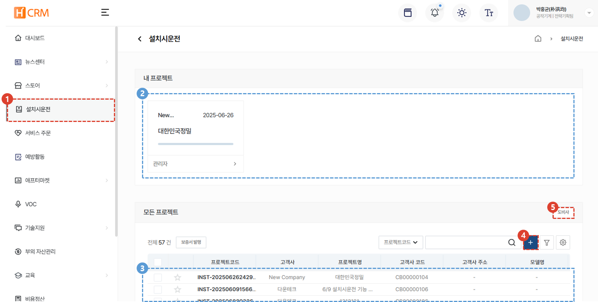
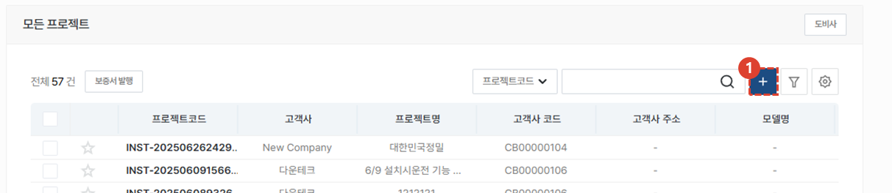
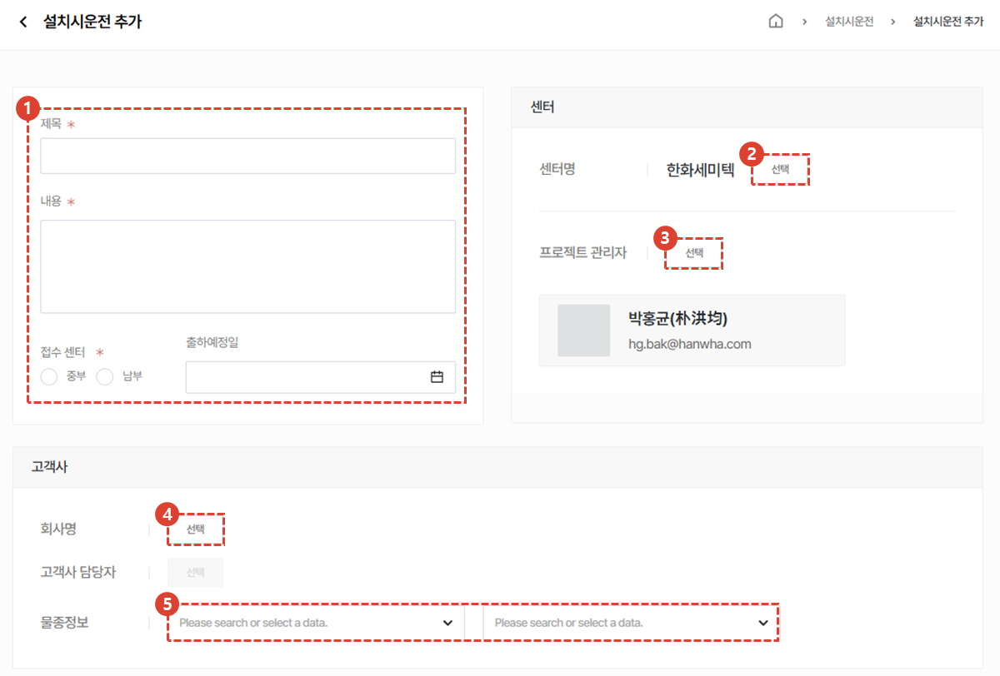
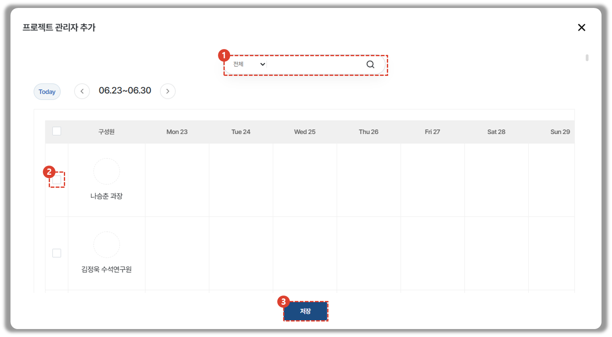
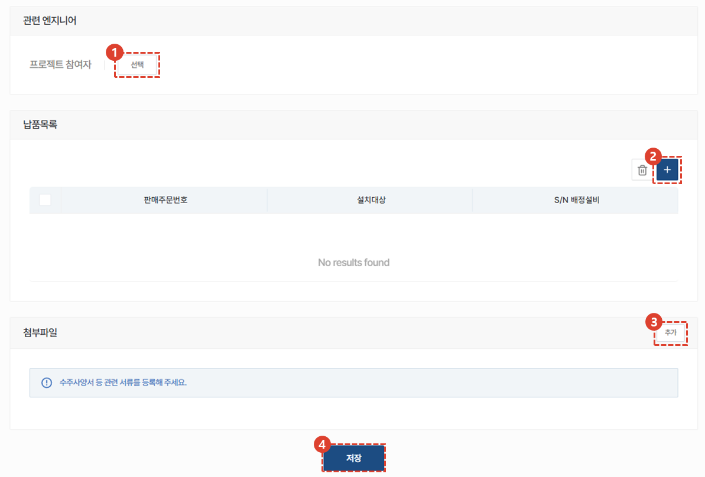

import ValidateTextByToken from "/src/utils/getQueryString.js";
import StrongTextParser from "/src/utils/textParser.js";
import text from "/src/locale/ko/SMT/tutorial-02-installation/02-details-project.json";
import PopUp1 from "./img/002.png";
import PopUp2 from "./img/005.png";
import PopUp3 from "./img/008.png";

# 프로젝트 생성하기

설치시운전 프로젝트 목록을 안내합니다.

<ValidateTextByToken dispTargetViewer={true} dispCaution={false} validTokenList={['head', 'branch', 'agent']}>

## 프로젝트 목록

1. **설치시운전** 메뉴를 클릭합니다.
1. 현재 자신에게 할당된 설치시운전 프로젝트 목록을 확인 할 수 있습니다. 
1. 모든 프로젝트 목록을 확인 할 수 있습니다. 
    :::info
    이 리스트는 사용자의 소속에 따라 프로젝트 목록에 대한 접근 권한을 다르게 제공합니다. 
    - 본사 사용자 : 본사에 소속된 모든 사용자는 **모든 사용자가 작성한 프로젝트 목록 조회 가능**
    - 법인 사용자 : 특정 법인에 소속된 사용자는 **해당 법인 직원이 작성한 프로젝트 목록 조회 가능**
    - 대리점 사용자 : 특정 대리점에 소속된 사용자는 **해당 대리점 직원이 작성한 프로젝트 목록 조회 가능**
    :::
1. **+** 버튼을 클릭하여 프로젝트를 생성합니다. 
1. 도비사 정보 추가가 필요한 경우 **도비사**버튼을 클릭합니다. 
    :::warning
    프로젝트의 **프리미팅 및 설치 작업**을 담당할 도비사를 등록하면, 시스템에서 자동으로 해당 도비사에 **자료 제출 링크를 문자로 전송**합니다. 
     이 링크를 통해 도비사는 프로젝트 관련 필수 자료를 손쉽게 제출할 수 있습니다.
    :::
 
 

기존 등록한 도비사 리스트를 확인할 수 있습니다. 
1. **추가** 버튼을 클릭하여 도비사 정보를 신규 등록 할 수 있습니다. 
 
 

## 프로젝트 생성 - 1/3

1. 프로젝트 생성을 위해 **+** 버튼을 클릭합니다. 
 
 

## 프로젝트 생성 - 2/3

1. 설치시운전 프로젝트의 제목/내용/접수 센터 및 출하 예정일을 입력합니다. 
1. 설치시운전을 진행하는 센터를 선택합니다. 
    :::info
    

    1. 센터명을 검색합니다. 
    1. 선택을 클릭하여 센터 선택을 완료합니다.
    :::
1. 프로젝트 관리자를 선택합니다. 
    :::info
    
    사용자의 소속에 따라 관련자들의 주별 스케줄을 간략히 확인 할 수 있습니다.
    1. 관리자를 검색합니다. 
    1. 체크박스를 클릭합니다. 
    1. **저장** 버튼을 클릭합니다. 
    :::
1. 고객사명을 선택합니다. 고객사명을 선택하면 고객사 담당자 선택 버튼이 활성화 됩니다.
1. 고객사의 물종정보를 입력합니다. 
 
 

## 프로젝트 생성 - 3/3

1. **선택**을 클릭하여 프로젝트 관련 엔지니어를 등록합니다. 
1. **+** 버튼을 클릭합니다. 
    :::info
    

    1. 판매주문번호를 검색합니다.
    1. 추가할 판매주문번호를 선택합니다.
    1. 추가 버튼을 클릭하여 납품 목록 추가를 완료합니다.
    :::
1. 설치시운전과 관련한 자료가 있을 경우 **추가**버튼을 클릭하여 첨부파일을 등록합니다. 
1. **저장** 버튼을 클릭하여 설치시운전 프로젝트 생성을 완료합니다.
</ValidateTextByToken>

