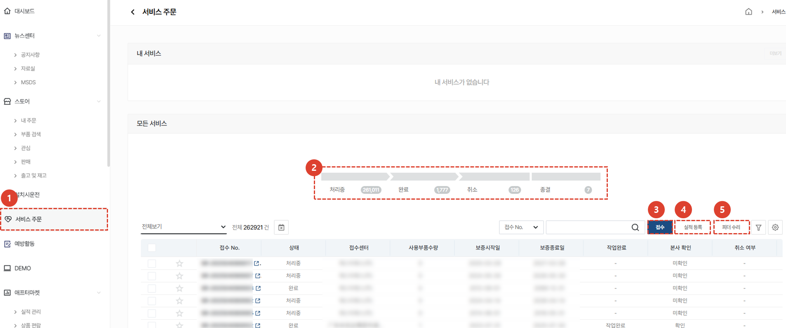

import ValidateTextByToken from "/src/utils/getQueryString.js";
import StrongTextParser from "/src/utils/textParser.js";
import text from "/src/locale/ko/SMT/tutorial-01-auth/create-a-acount-circle-user.json";

# 서비스 주문

서비스 주문 메뉴에서 제공하는 고장 수리 접수 및 부품 판매 접수 기능을 안내합니다. 

<ValidateTextByToken dispTargetViewer={true} dispCaution={true} validTokenList={['head']}>

:::info
    서비스 담당자는 고장 수리 및 부품 판매 주문을 입력하고 관리 할 수 있습니다. 
:::
## 서비스 주문 목록

1. **서비스 주문** 메뉴를 클릭합니다. 
1. **고장 수리** 요청을 접수하고 조치 및 확인 이력 등록 및 견적서 관리를 할 수 있습니다. 
1. **부품 판매** 이력을 등록하고 서비스 유무상 처리 및 매출 관리를 할 수 있습니다.
</ValidateTextByToken>