import ValidateTextByToken from "/src/utils/getQueryString.js";
import StrongTextParser from "/src/utils/textParser.js";
import text from "/src/locale/ko/SMT/tutorial-01-auth/create-a-acount-circle-user.json";

# 부품 판매

부품 판매에 대한 서비스의 접수 및 관리 방법을 안내합니다.  

<ValidateTextByToken dispTargetViewer={true} dispCaution={true} validTokenList={['head']}>

## 부품 판매 목록
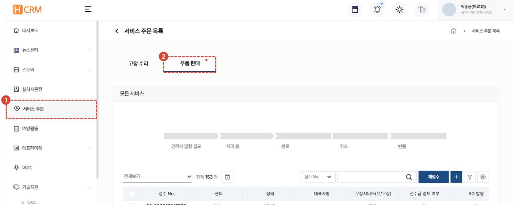

1. **서비스 주문**을 클릭합니다. 
1. **부품 판매**를 클릭합니다. 
 
 

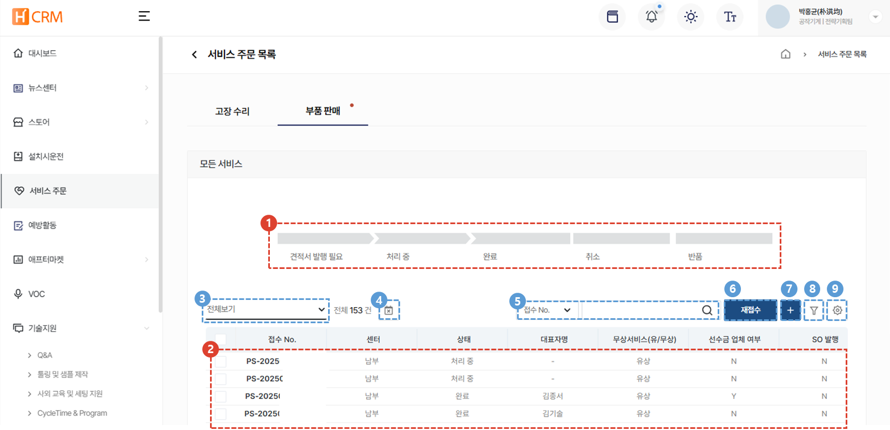
1. 진행 프로세스이며, 클릭하여 해당 단계 리스트를 확인 할 수 있습니다. 
1. 서비스 리스트이며 관련 정보를 확인 할 수 있습니다.
     리스트에 표시할 항목은 **테이블 관리**에서 수정 가능합니다.
1. 리스트에 표시할 목록을 부서 및 센터 기준으로 필터링 할 수 있습니다.
1. **접수 취소** 버튼입니다.  취소가 필요한 항목을 체크하고 버튼을 클릭하여 취소합니다. 
1. 검색 필터입니다. 접수 번호, 딜러, 고객 코드 등의 조건으로 검색이 가능합니다.
1. 기존의 접수 내역에 대해 **재접수**가 필요한 경우 사용하는 버튼입니다. 
    :::info
    재접수할 내역을 **체크**한 뒤 **재접수** 버튼을 클릭하여야 합니다. 
    :::
1. **+** 버튼을 클릭하여 신규 고장 접수를 할 수 있습니다. 
1. 여러개의 검색 필터를 조합하여 상세 검색을 할 수 있습니다. 
     버튼을 클릭하여 상세 검색을 진행하세요.
1. **톱니바퀴**를 클릭하여 엑셀 출력 및 테이블 관리가 가능합니다. 
 
 

## 부품 판매 접수
### 신규 접수
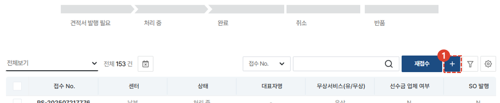
1. **+** 버튼을 클릭합니다.
 
 

### 센터 및 일자 등록
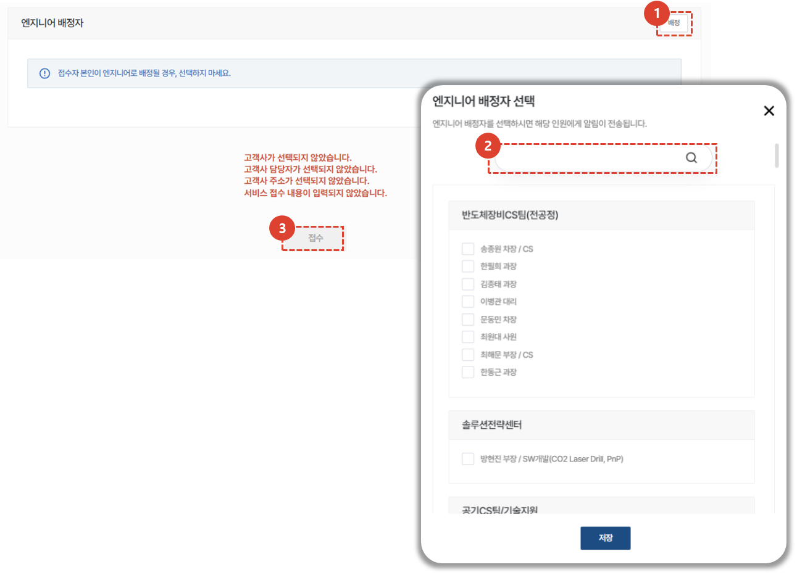
1. 접수 센터를 선택합니다. 
1. 접수 일자를 선택합니다. 
    :::info
    기본값은 현재(등록일시)이며, 지정 가능합니다. 
    :::
 
 

### 대상 설비 정보
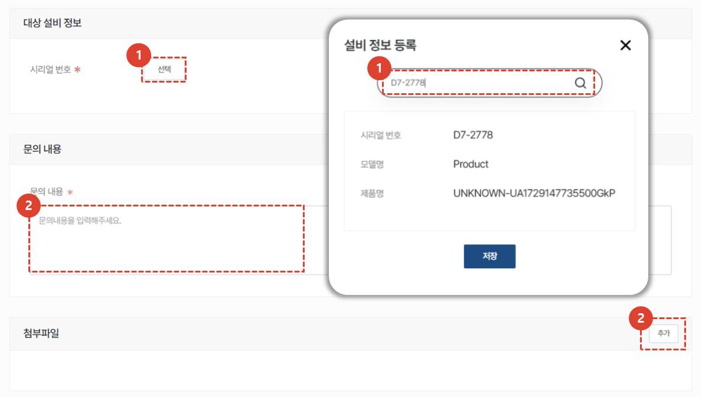
:::info
대상 설비를 선택하면 해당 설비를 보유하고있는 고객사 정보 및 대상설비의 상세 정보, 고객사의 서비스 이력이 자동으로 추가됩니다.
:::
1. 고장 설비 정보를 입력합니다. 
     대표자명, 고객코드, 모델명, 고객사명, S/N 및 모델 선택으로 대상 설비를 찾을 수 있습니다. 
 
 

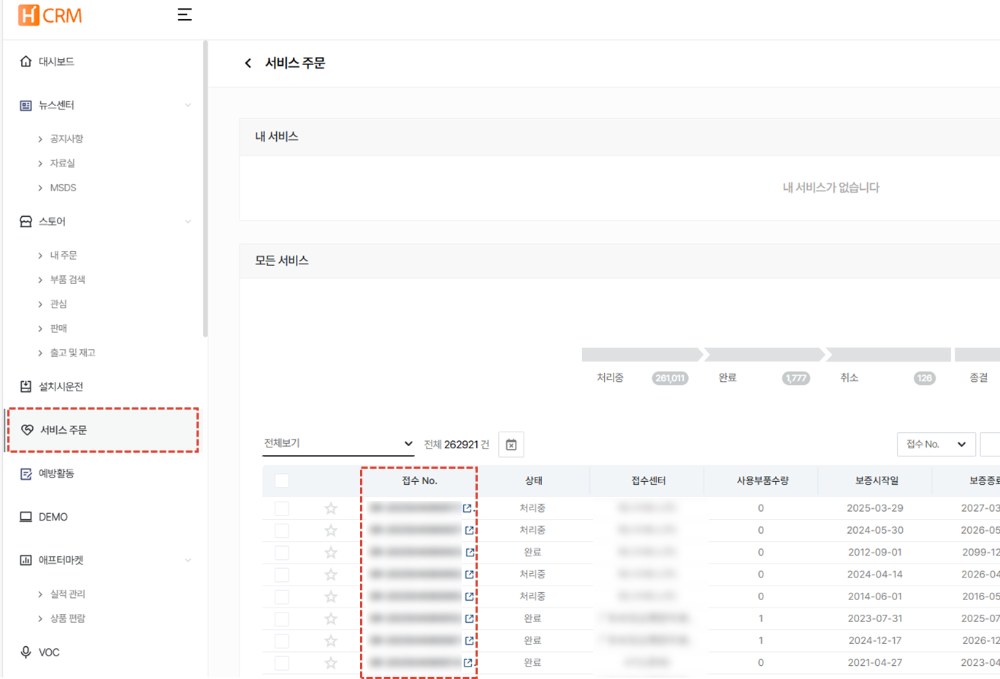
1. 고객가 잘못 입력되어있는 경우 **선택**을 클릭하여 변경이 가능합니다. 
1. 고객사 담당자를 선택합니다.  고객사 담당자는 기본에 등록되어있는 리스트에서 선택이 가능하며, 필요 시 신규 등록이 가능합니다. 
 
 

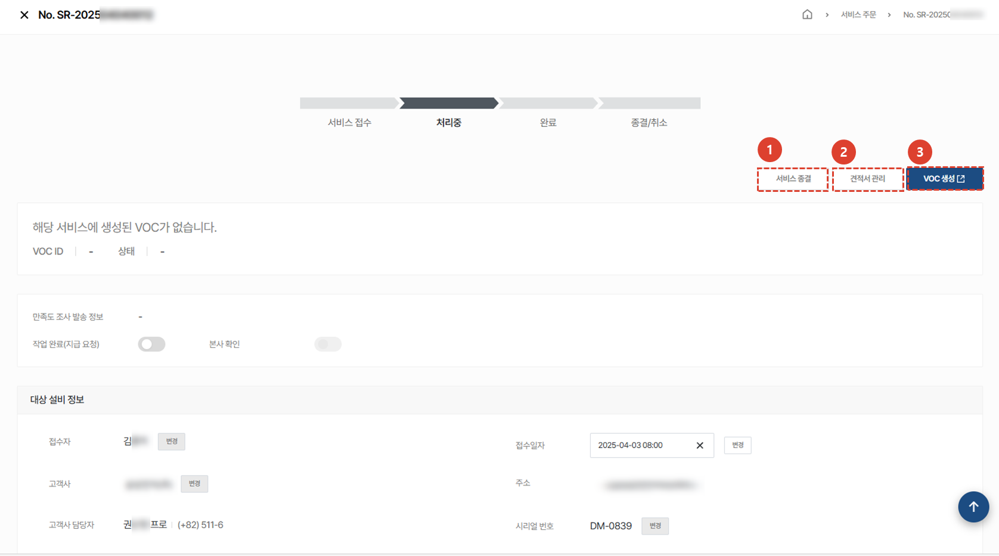
1. 고객사 주소를 선택합니다. 
1. 해당되는 주소가 없을 경우 **추가** 합니다.
    :::info
    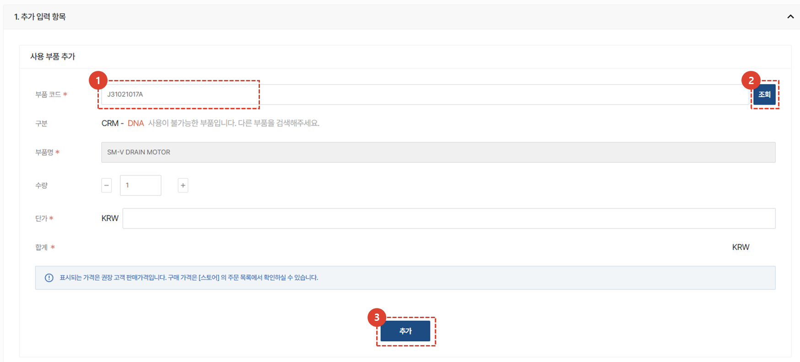
    1. 설비의 위치에 해당하는 국가를 선택합니다. 
    1. 주소의 명칭을 입력합니다. 
    1. 주소를 찾을 수 있습니다. 만약, 주소 조회가 안될 경우 **수동입력** 버튼을 클릭하여 진행합니다.
    1. **조회** 버튼을 클릭하여야 정확한 주소 확인이 가능합니다. 
    1. **저장** 버튼을 클릭하여 주소 등록을 완료합니다. 
    :::
 
 

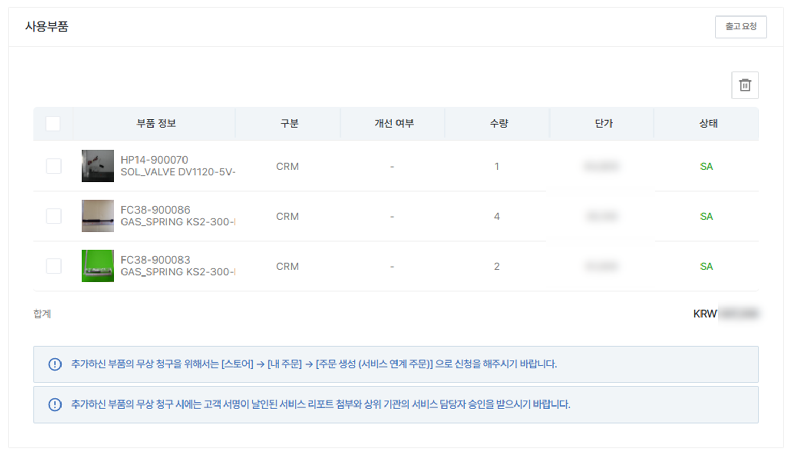
:::info
상단에서 검색으로 선택한 설비의 상세 정보가 나타나며 관련한 추가 사항을 입력해야 합니다.  
:::
1. 서비스 유무상 구분을 선택합니다. 
    :::info
    보증기간에 따라 유무상 여부가 자동으로 입력되며, 보증기간 이내더라도 경우에 따라 유상 서비스로 진행이 가능합니다.
    :::
1. 설비의 중고여부를 선택합니다. 
1. 설비의 옵션 내용을 입력할 수 있습니다. 
1. 추가 사항을 입력합니다. 
 
 

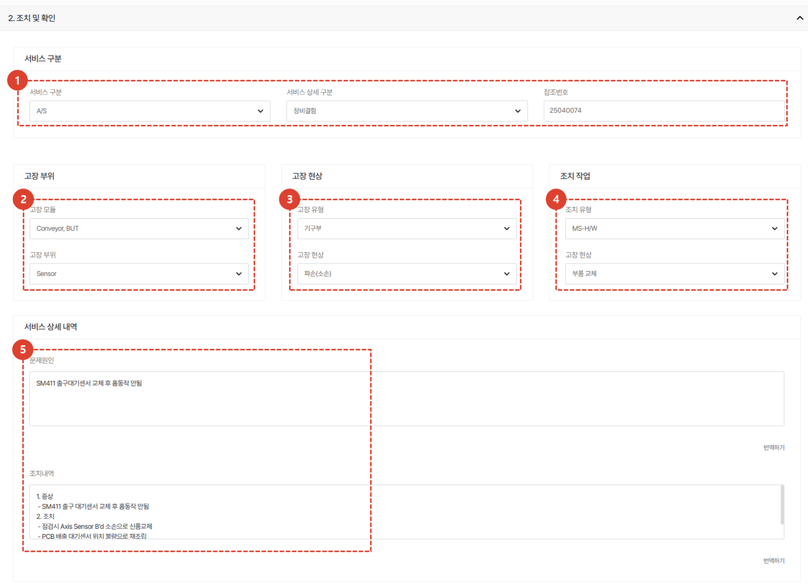
 서비스 담당자의 업무 효율성을 위해 해당 고객사에서 진행한 서비스 이력을 확인할 수 있습니다. 
 **서비스 이력** / **예방활동 이력** / **보유자산 목록** / **이력 관리** 리스트가 표시됩니다. 
 
 

### 문의내용
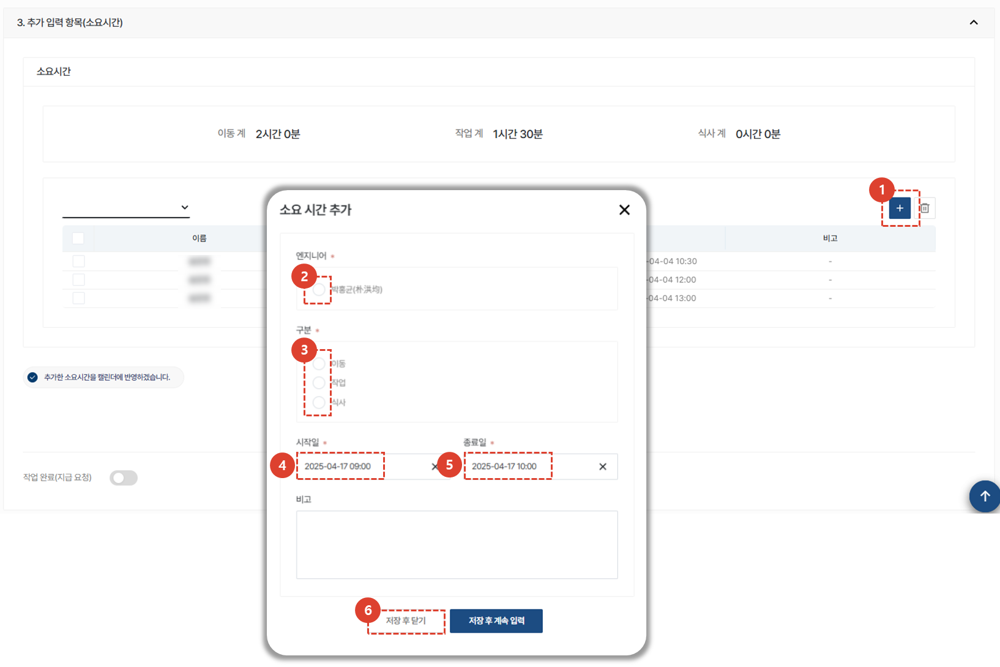
1. 고객사에서 전달받은 **문의 내용**을 입력합니다. 
 
 

### 첨부파일
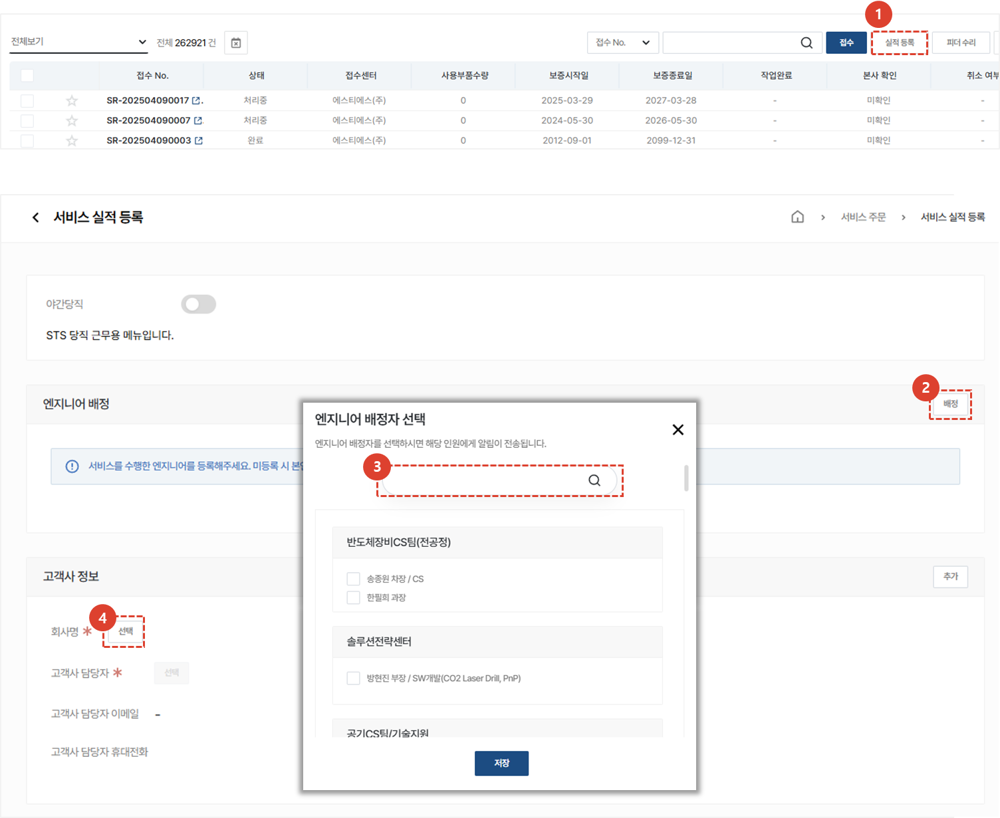
1. 관련 **첨부파일**을 등록합니다. 
 
 

### 부품 검색
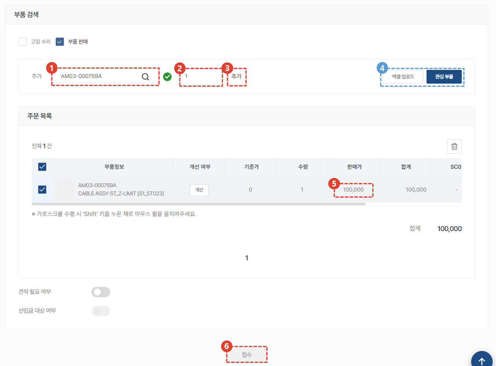
:::info
**부품판매**가 기본으로 체크되어있습니다. 판매할 부품을 검색하여 추가하십시오. 
:::
1. 부품의 **S/N**를 입력합니다. 
1. 판매할 **수량**을 입력합니다. 
1. **추가** 버튼을 클릭하여 **주문 목록**을 확인합니다.
1. 다량의 부품을 등록해야 할 경우에는 **엑셀 업로드**를 클릭합니다. 
     이전에 관심 부품으로 등록한 항목을 추가하는 경우에는 **관심 부품**을 클릭합니다. 
1. 판매가를 확인하고, 수정이 필요한 경우 **더블클릭**하여 값을 수정합니다. 
1. 접수 버튼을 클릭하여 부품 판매 접수를 완료합니다.

### 접수 완료
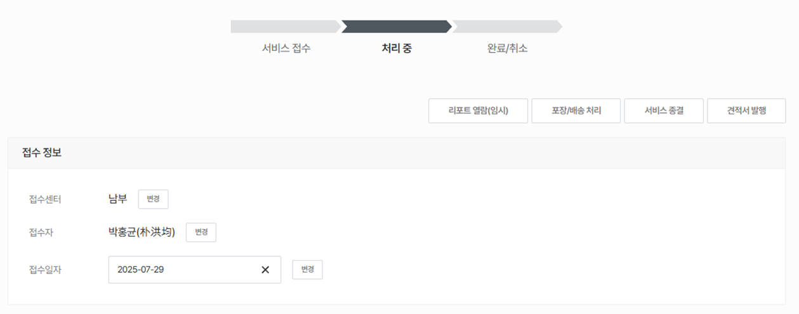
:::info 접수 완료
접수가 완료된 서비스 건은 **처리중**으로 나타납니다.
:::
 
 

## 부품 판매 처리
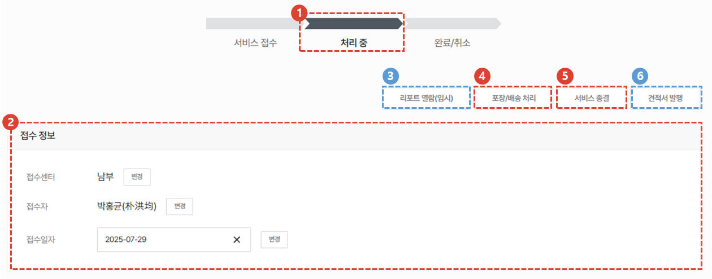

1. 부품 판매 프로세스에 **처리중** 상태를 확인 할 수 있습니다. 
1. 부품 판매 접수시 등록한 기본 정보가 나타나며 **수정**이 가능합니다. 
    :::info
    접수 정보, 고객 정보, 설비 정보, 문의 내용, 서비스 이력을 확인 할 수 있습니다.
    :::
1. 리포트 열람 : 부품 판매 처리에 대한 리포트를 열람 할 수 있습니다. 
1. 포장/배송 처리: 부품의 판매 진행에 따라 포장 및 배송이 된 경우 클릭합니다. 
1. 서비스 종결 : 해당 서비스를 완료하지 않고 종결해야 할 경우 클릭합니다. 
1. 견적서 발행 : 서비스를 위해 필요한 부품 및 경비에 대한 견적서 발행이 가능합니다. 
 
 

### 매출 관리
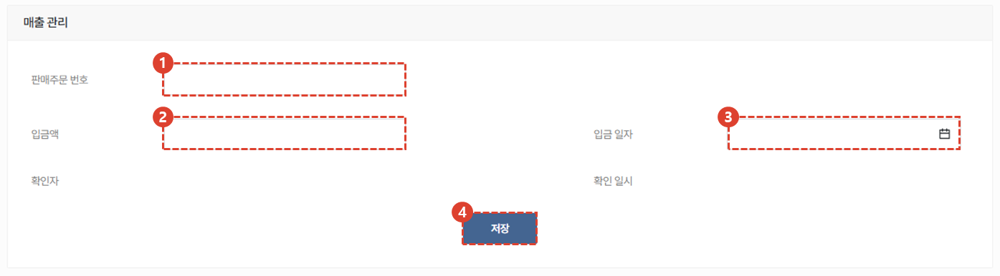
1. **판매주문번호**를 입력합니다. 
1. **입금액**을 입력합니다. 
1. **입금 일자**를 입력합니다. 
1. **저장**을 입력해야 매출 관리의 입력 내용이 저장됩니다. 

### 리포트 열람
    :::warning
    부품 판매가 완료되기 전에는 임시 리포트만 확인이 가능합니다.
     부품 판매 상태가 완료 혹은 종결로 변경되면 **리포트열람(확정)**으로 변경됩니다.
    :::

### 포장/배송 처리
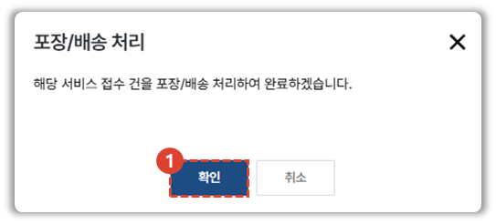
1. 확인이 완료된 건은 상태값이 완료로 변경됩니다. 

### 서비스 종결
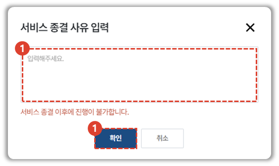
    1. 서비스를 종결하는 사유를 입력합니다. 
    1. 확인이 완료된 건은 상태값이 종결로 변경됩니다.

### 견적서 발행
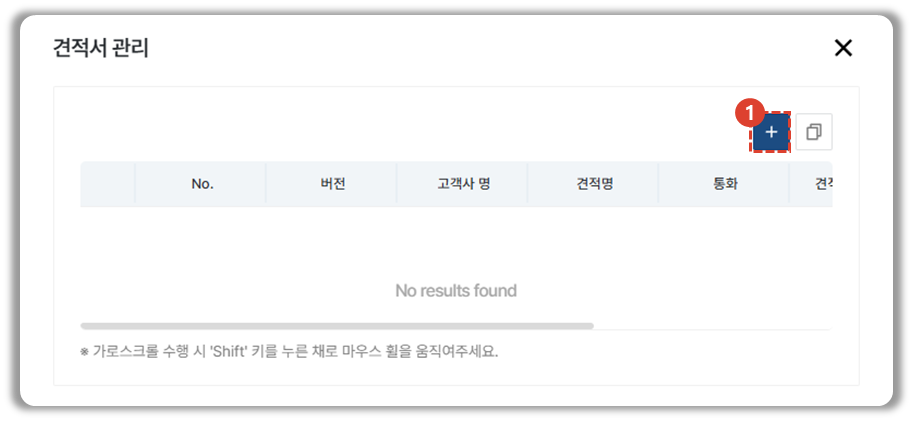
견적서를 생성하고 확인 및 복사하여 활용 할 수 있습니다. 

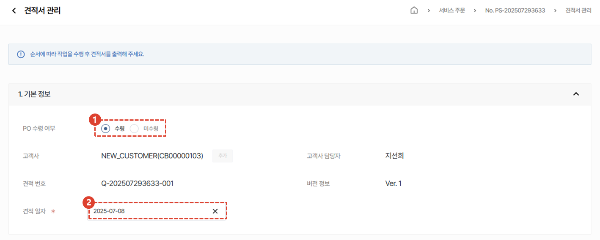
1. 견적서에 대한 PO 수령 여부를 선택합니다. 
1. 견적서를 발행할 일자를 선택합니다. 

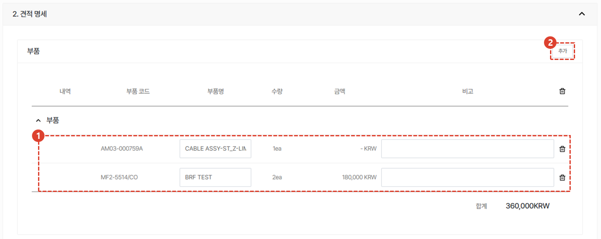
1. 견적서에 포함할 부품 리스트를 확인합니다. 
    :::info
    부품 판매에 추가된 리스트가 기본적으로 적용됩니다. 
    :::
1. 견적서에 추가할 항목이 있는 경우 **추가** 버튼을 클릭합니다. 

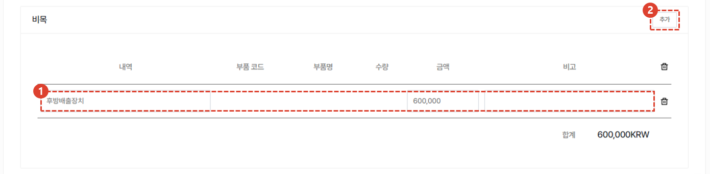
1. 판매할 부품 외 견적서에 포함해야하는 비목 리스트를 작성합니다. 
1. **추가** 버튼을 클릭하여 내용을 추가합니다. 

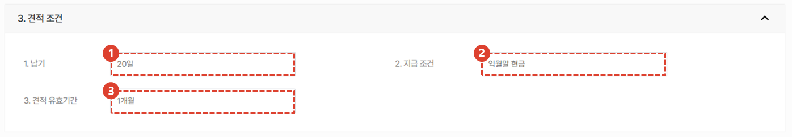
:::info
비용과 관련된 견적 조건을 정확히 입력해야 합니다. 
:::
1. 부품판매에 대한 **납기**를 입력합니다. 
1. **지급 조건**을 입력합니다.
1. **견적 유효기간**을 입력합니다.  

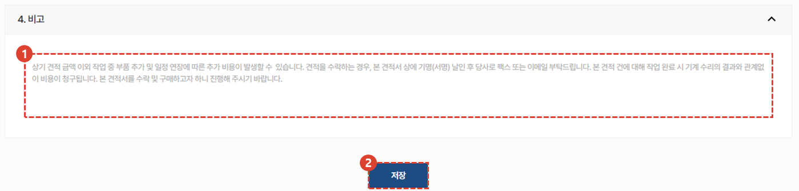
1. 견적 내용과 관련하여 필요한 설명을 작성합니다. 
1. 저장 버튼을 클리하여 견적서 발행을 완료합니다. 
    :::info
    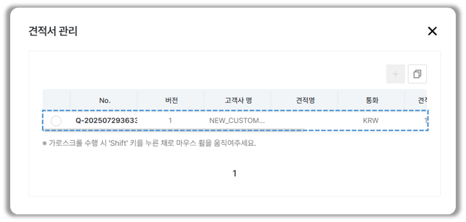
    저장된 견적서는 견적서 관리 팝업창에서 확인하고 No.를 클릭하여 수정 및 출력이 가능합니다. 
    :::

## 부품 판매 완료
### 판매 완료
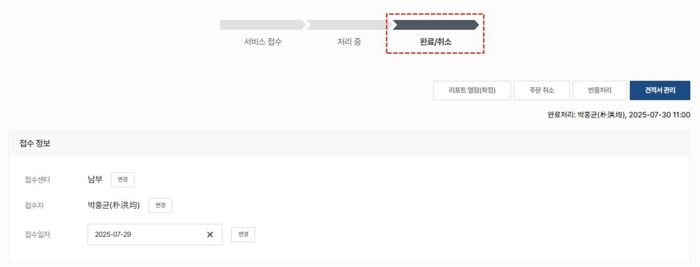
 부품 판매가 완료된 건은 상태값이 **완료**로 나타납니다. 

### 리포트 열람(확정)
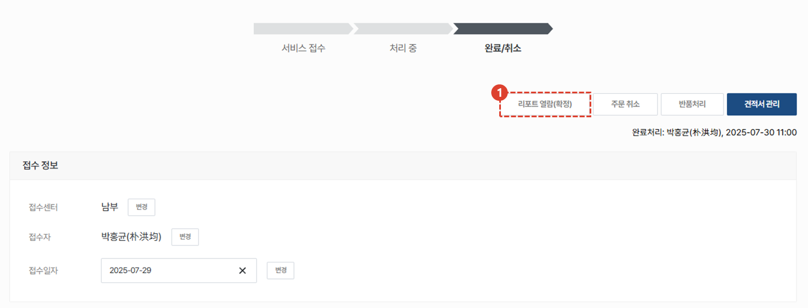
1. 확정된 리포트 확인이 가능합니다. 

### 주문 취소
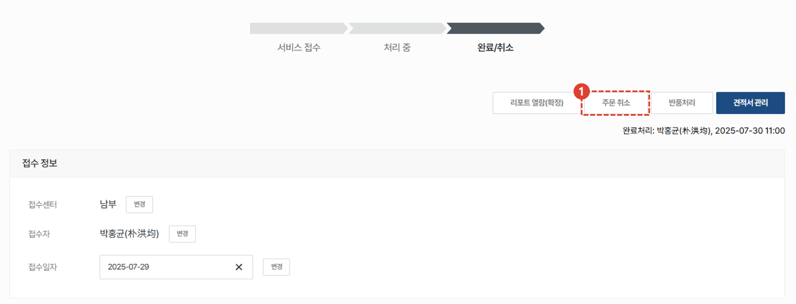
1. 서비스 담당자 및 관리자는 주문 취소가 가능합니다. 
 서비스의 상태값이 처리중으로 변경됩니다.

### 반품 처리
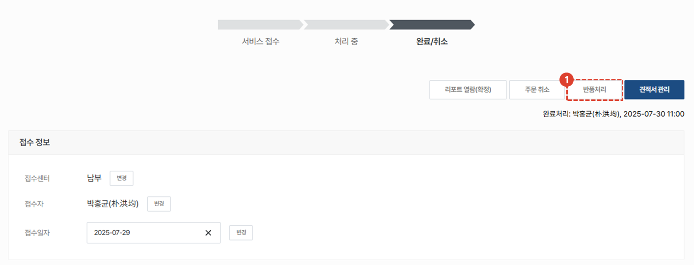
1. 서비스 담당자 및 관리자는 반품처리가 가능합니다. 

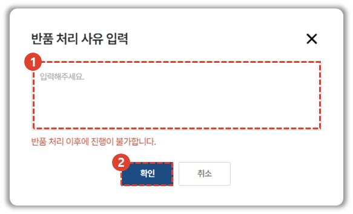
1. 반품 처리 사유를 입력합니다. 
1. 확인 버튼을 눌러 반품처리를 완료합니다. 
 서비스의 상태값이 처리중으로 변경됩니다.

### 견적서 관리

</ValidateTextByToken>