import ValidateTextByToken from "/src/utils/getQueryString.js";
import StrongTextParser from "/src/utils/textParser.js";
import text from "/src/locale/ko/SMT/tutorial-01-auth/create-a-acount-circle-user.json";
import Popup1 from "./img/045.png";
import Popup2 from "./img/046.png";

# 고장 수리

서비스 고장에 대한 조치 과정을 등록하는 방법을 안내합니다. 

<ValidateTextByToken dispTargetViewer={true} dispCaution={true} validTokenList={['head']}>

## 고장 수리 목록

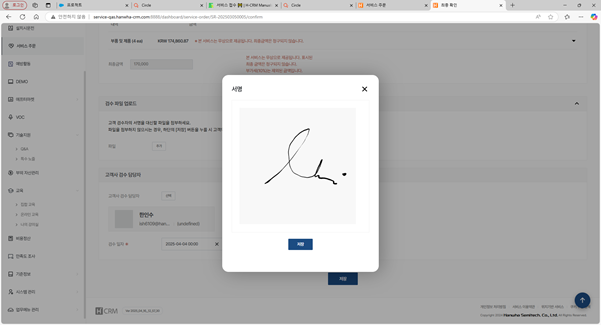
1. **서비스 주문**을 클릭합니다. 
1. **고장 수리**를 클릭합니다. 
 
 

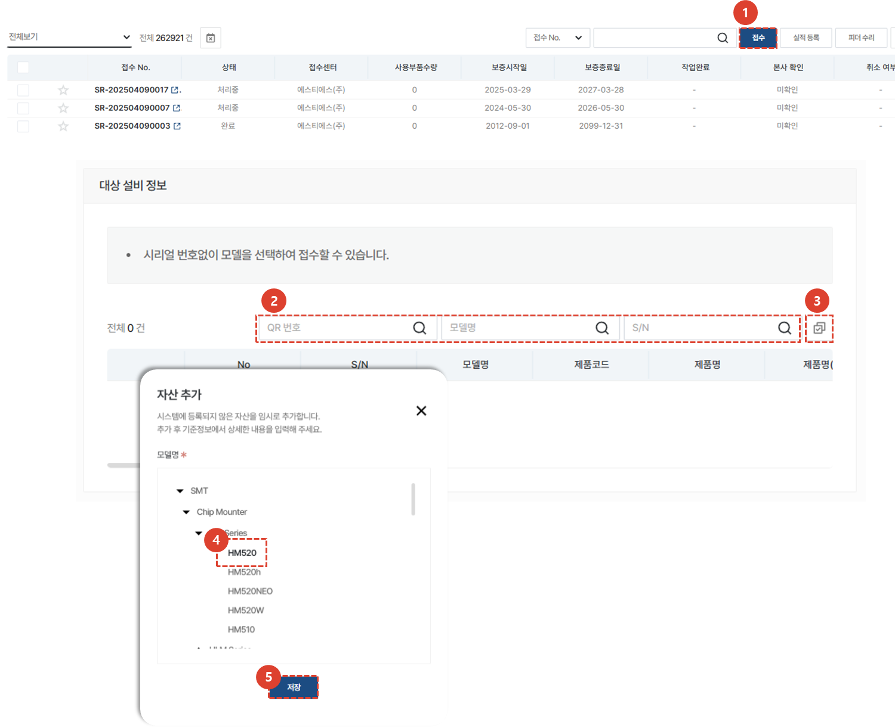
1. 현재 진행중인 서비스 내역을 확인 할 수 있으며, 클릭하면 상세 페이지로 이동합니다. 
1. **더보기**를 클릭하면 내 서비스의 모든 내역을 확인 할 수 있습니다. 
 
 

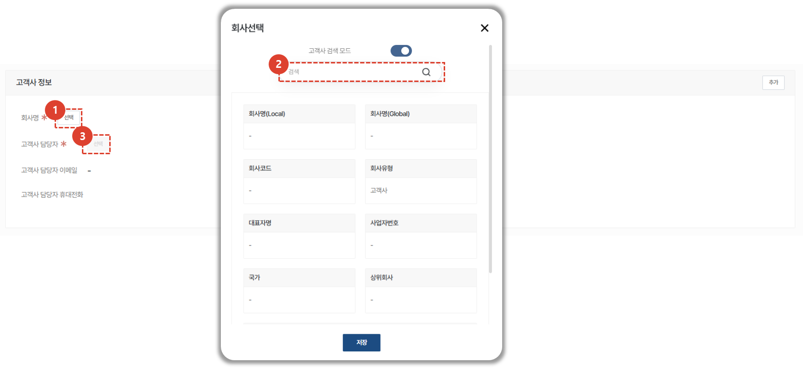
1. 진행 프로세스이며, 클릭하여 해당 단계 리스트를 확인 할 수 있습니다. 
1. 서비스 리스트이며 관련 정보를 확인 할 수 있습니다.
     리스트에 표시할 항목은 **테이블 관리**에서 수정 가능합니다.
1. 리스트에 표시할 목록을 부서 및 센터 기준으로 필터링 할 수 있습니다.
1. **접수 취소** 버튼입니다.  취소가 필요한 항목을 체크하고 버튼을 클릭하여 취소합니다. 
1. 검색 필터입니다. 접수 번호, 딜러, 고객 코드 등의 조건으로 검색이 가능합니다.
1. 기존의 접수 내역에 대해 **재접수**가 필요한 경우 사용하는 버튼입니다. 
    :::info
    재접수할 내역을 **체크**한 뒤 **재접수** 버튼을 클릭하여야 합니다. 
    :::
1. **+** 버튼을 클릭하여 신규 고장 접수를 할 수 있습니다. 
1. 여러개의 검색 필터를 조합하여 상세 검색을 할 수 있습니다. 
     버튼을 클릭하여 상세 검색을 진행하세요.
1. **톱니바퀴**를 클릭하여 엑셀 출력 및 테이블 관리가 가능합니다. 
 
 

## 고장 수리 접수
### 신규 접수
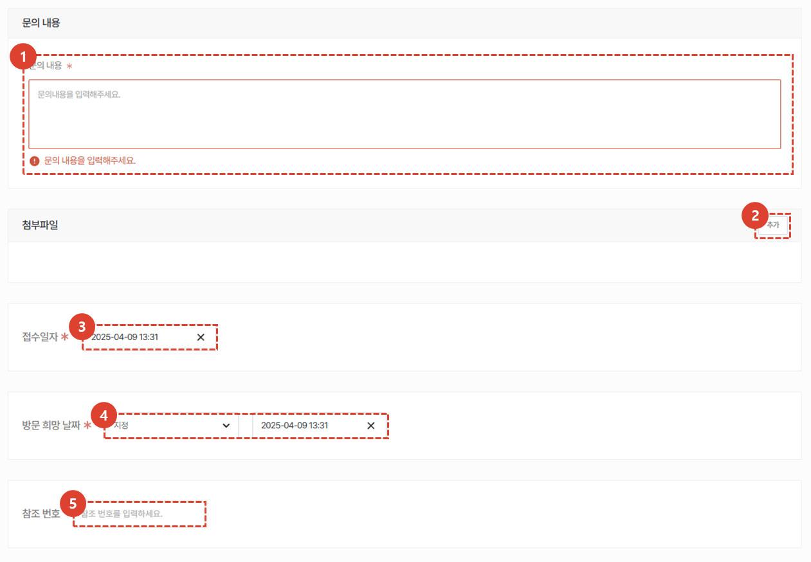
1. **+** 버튼을 클릭합니다.
 
 

### 센터 및 일자 등록

1. 접수 센터를 선택합니다. 
1. 접수 일자를 선택합니다. 
    :::info
    기본값은 현재(등록일시)이며, 지정 가능합니다. 
    :::
 
 

### 대상 설비 정보

:::info
대상 설비를 선택하면 해당 설비를 보유하고있는 고객사 정보 및 대상설비의 상세 정보, 고객사의 서비스 이력이 자동으로 추가됩니다.
:::
1. 고장 설비 정보를 입력합니다. 
     대표자명, 고객코드, 모델명, 고객사명, S/N 및 모델 선택으로 대상 설비를 찾을 수 있습니다. 
 
 

1. 고객가 잘못 입력되어있는 경우 **선택**을 클릭하여 변경이 가능합니다. 
1. 고객사 담당자를 선택합니다.  고객사 담당자는 기본에 등록되어있는 리스트에서 선택이 가능하며, 필요 시 신규 등록이 가능합니다. 
 
 

1. 고객사 주소를 선택합니다. 
1. 해당되는 주소가 없을 경우 **추가** 합니다.
    :::info
    
    1. 설비의 위치에 해당하는 국가를 선택합니다. 
    1. 주소의 명칭을 입력합니다. 
    1. 주소를 찾을 수 있습니다. 만약, 주소 조회가 안될 경우 **수동입력** 버튼을 클릭하여 진행합니다.
    1. **조회** 버튼을 클릭하여야 정확한 주소 확인이 가능합니다. 
    1. **저장** 버튼을 클릭하여 주소 등록을 완료합니다. 
    :::
 
 

:::info
상단에서 검색으로 선택한 설비의 상세 정보가 나타나며 관련한 추가 사항을 입력해야 합니다.  
:::
1. 서비스 유무상 구분을 선택합니다. 
    :::info
    보증기간에 따라 유무상 여부가 자동으로 입력되며, 보증기간 이내더라도 경우에 따라 유상 서비스로 진행이 가능합니다.
    :::
1. 설비의 중고여부를 선택합니다. 
1. 설비의 옵션 내용을 입력할 수 있습니다. 
1. 추가 사항을 입력합니다. 
 
 

 서비스 담당자의 업무 효율성을 위해 해당 고객사에서 진행한 서비스 이력을 확인할 수 있습니다. 
 **서비스 이력** / **예방활동 이력** / **보유자산 목록** / **이력 관리** 리스트가 표시됩니다. 
 
 

### 문의내용

1. 고객사에서 전달받은 **문의 내용**을 입력합니다. 
 
 

### 첨부파일

1. 관련 **첨부파일**을 등록합니다. 
 
 

### 접수 서비스 유형

1. 접수 서비스 유형을 선택합니다. 기본적으로 **고장 수리**가 체크되어있으며, 관련하여 **부품 판매**가 진행될 경우 부품 판매를 추가로 체크합니다. 
1. 유상 서비스일 경우 **견적 필요 여부**를 선택합니다. 
1. 고객사가 선입금 대상일 경우에만 **선입금 대상 여부**를 체크합니다. 
1. **접수**를 클릭하여 고장 접수를 완료합니다. 
 
 

### 부품 판매 입력
:::warning
접수 서비스 유형에 **부품판매**를 체크한 경우 나타나는 화면입니다.
 즉, 고장 수리 서비스와 관련한 부품 판매가 진행되는 경우에만 입력하는 화면입니다. 
:::

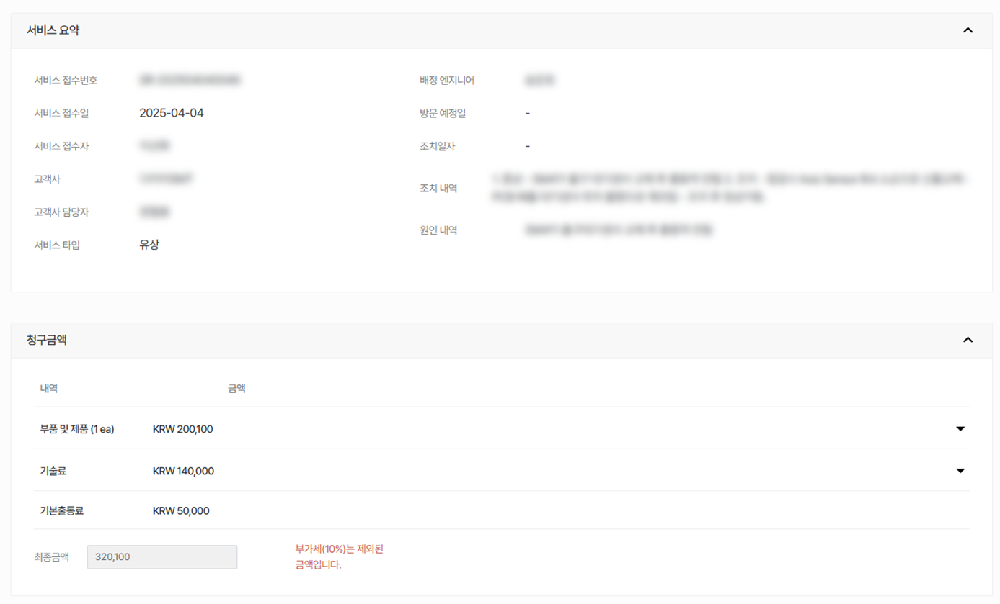
1. **접수 서비스 유형**의 **부품 판매**를 체크합니다. 
1. 부품의 Serial No.를 입력합니다. 
1. 부품의 필요 수량을 입력합니다. 
1. **추가** 버튼을 클릭합니다. 
1. 추가할 부품이 많은 경우 **엑셀 업로드**로 한번에 입력 할 수 있습니다. ㄴ
     기 등록된 **관심 부품**이 있는 경우 클릭하여 등록 할 수 있습니다.
 
 

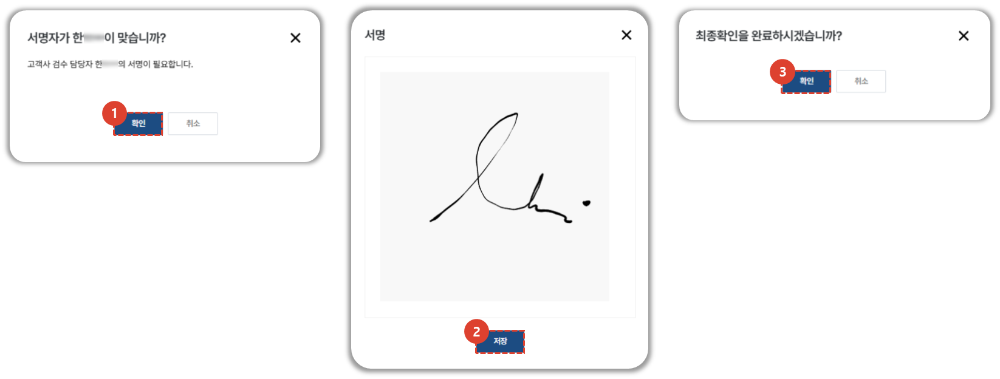
1. 부품의 판매가를 확인하고 필요 시 수정합니다. 
1. 접수 버튼을 클릭하여 해당 내역을 저장할 수 있습니다.
 
 

### 접수 완료
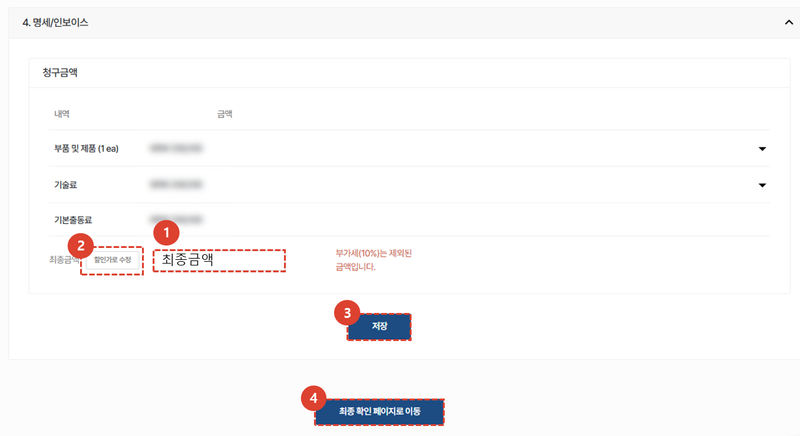
:::info 접수 완료
접수가 완료된 서비스 건은 **처리중**으로 나타납니다.
:::
 
 

## 고장수리 처리
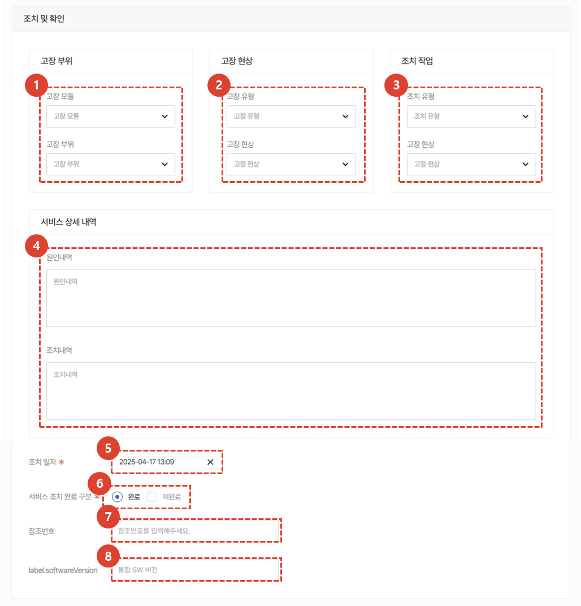
1. 고장수리 프로세스에 **처리중** 상태를 확인 할 수 있습니다. 
1. 고장 수리 접수시 등록한 기본 정보가 나타나며 **수정**이 가능합니다. 
    :::info
    접수 정보, 고객 정보, 설비 정보, 문의 내용, 서비스 이력을 확인 할 수 있습니다.
    :::
1. 리포트 열람 : 고장수리 처리에 대한 리포트를 열람 할 수 있습니다. 
    :::warning
    고장수리가 완료되기 전에는 임시 리포트만 확인이 가능합니다.
    :::
1. 서비스 종결 : 해당 서비스를 완료하지 않고 종결해야 할 경우 클릭합니다. 
1. 견적서 발행 : 서비스를 위해 필요한 부품 및 경비에 대한 견적서 발행이 가능합니다. 
1. VOC 생성 : 서비스와 관련하여 VOC 생성이 필요한 경우 클릭합니다. 
     해당 서비스에 생성된 VOC의 진행 상황은 버튼 아래 표시되어 확인 할 수 있습니다. 
 
 

### 출동 관리
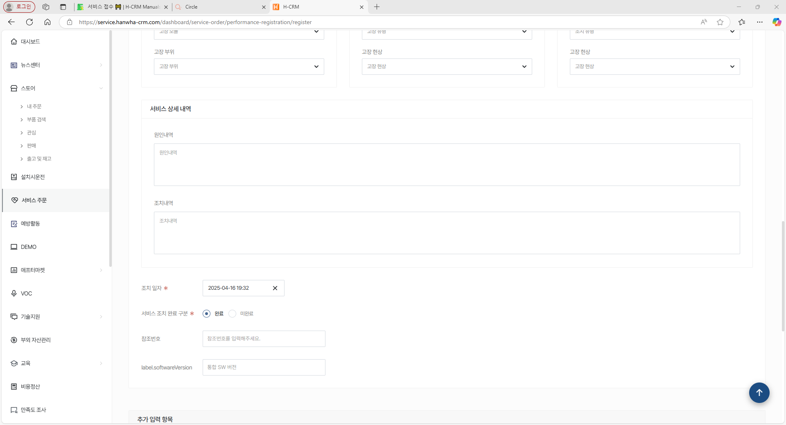
1. 출동을 진행할 **방문 예정일**을 이볅합니다. 
1. 서비스 처리 센터는 자동으로 입력되며, 필요 시 **선택**을 클릭해 변경합니다. 
1. 배정 엔지니어 목록을 **선택**합니다. 
 
 

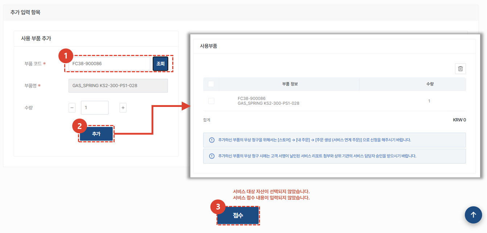
:::info
출동을 위한 입력이 완료되면 하단 버튼이 활성화 됩니다. 
:::
1. **저장**을 클릭합니다. 
1. **방문 알리미 문자 발송**을 클릭하여 엔지니어 및 고객사 담당자에게 방문 알림 문자를 발송합니다. 
    :::warning
    **저장**을 먼저 하지 않으면 문자 발송이 불가합니다.
    :::
 
 

### 추가 입력 항목
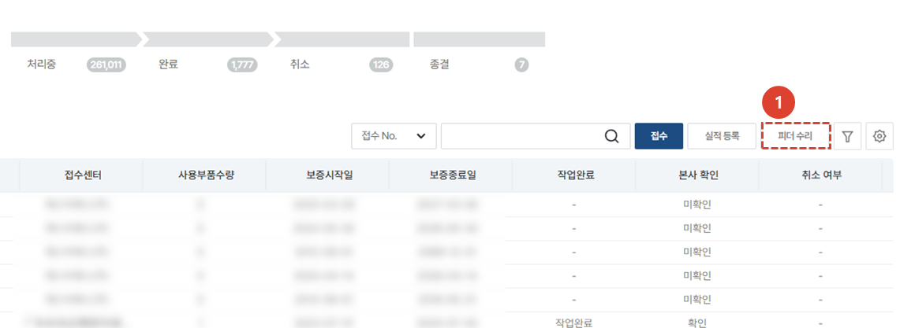
1. 고장 수리를 위해 사용한 부품의 코드를 입력하고 **조회**를 클릭합니다.
 
 

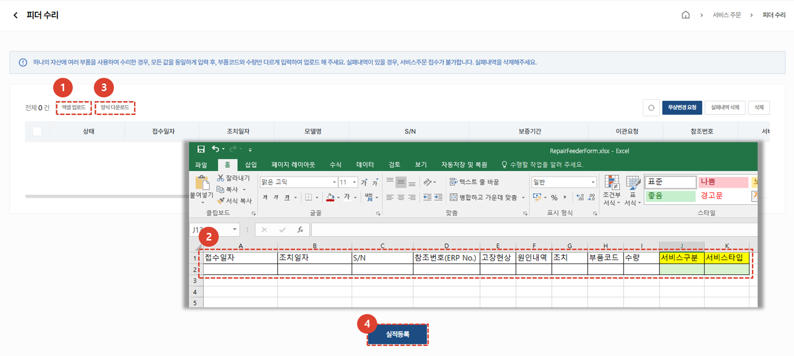
1. 조회된 코드에 저장된 상세 정보가 자동 입력됩니다. 필요 수량을 확인합니다. 

1. 단가를 확인하고 수정이 필요한 경우 수정을 진행합니다. 
    :::warning
    입력된 단가를 기준으로 명세/인보이스 발행이 가능하니 유의하여 입력 바랍니다. 
    :::
1. **추가** 를 클릭합니다.
 
 

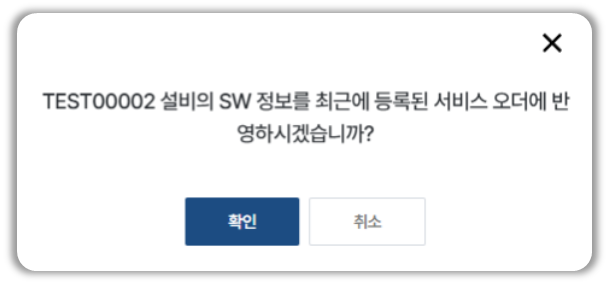
1. 추가된 부품을 확인합니다. 
     수정이 필요한 경우 수량 및 단가 부분을 더블클릭하여 수정합니다. 
1. 부품 검색이 필요한 경우 **부품 검색 페이지로 이동**을 클릭합니다. 
1. 부품의 출고 요청이 필요한 경우 필요 부품을 **체크** 하고 **출고 요청** 버튼을 클릭합니다. 
1. **A/S 부품 지급 요청서 조회** 버튼을 클릭하여 출고 요청 부품을 확인 할 수 있습니다. 
 
 

#### 부품 검색 페이지
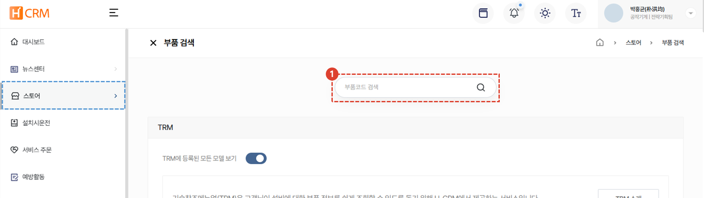
1. 스토어의 부품 검색 페이지로 이동됩니다. 찾고자하는 **부품코드를 검색**하여 정보 확인이 가능합니다. 
 
 

#### A/S부품 지급 요청서 조회
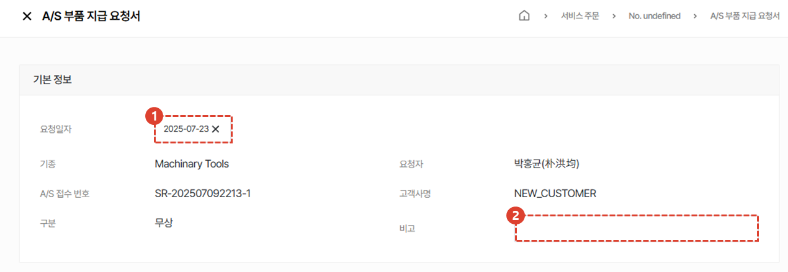
1. 부품 지급 요청서를 확인하고 출력할 수 있습니다. 요청 일자를 확인하고 필요 시 수정합니다. 
1. 추가 사항을 입력합니다. 
 
 

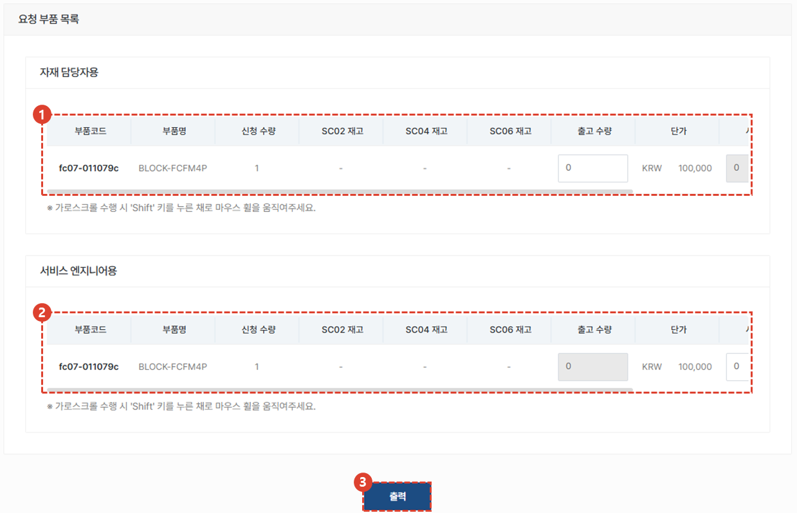
1. 자재 담당자용 내용을 확인하고 필요 시 수정을 진행합니다. 
    :::info
    수정 가능 항목은 출고 수량, 비고 입니다. 
    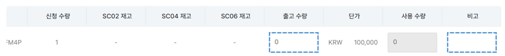
    :::
1. 서비스 엔지니어어용 내용을 확인하고 필요 시 수정을 진행합니다. 
    :::info
    수정 가능 항목은 출고 수량, 비고 입니다. 
    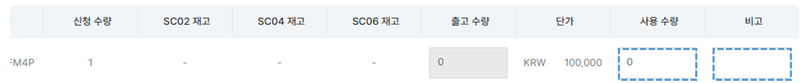
    :::
 
 

### 조치 및 확인
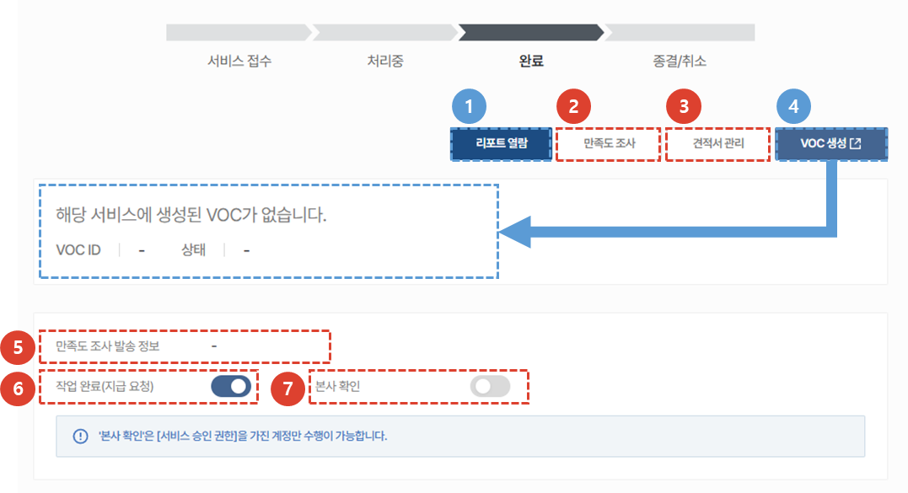
1. 고장 부위, 원인, 현상 및 조치 작업 항목을 선택합니다. 
    :::warning
    고장과 관련한 상세 항목은 정확히 입력 바랍니다. 
    :::
 
 

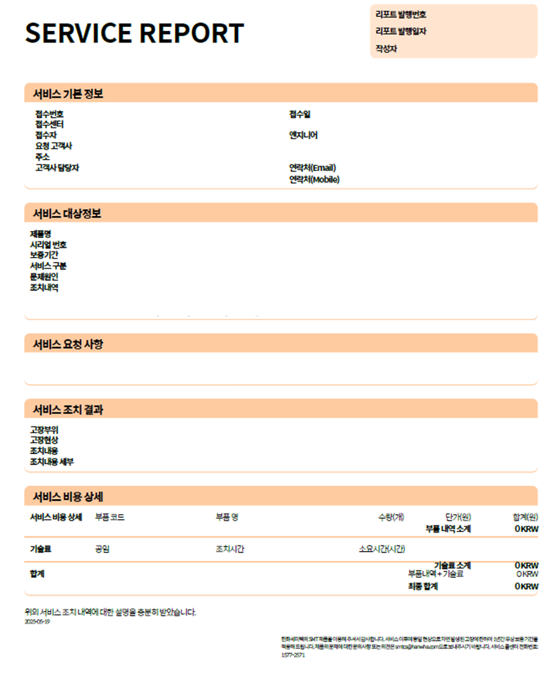
1. 원인 내역을 상세히 입력합니다. 
1. 고장 수리를 위해 진행한 조치내역을 상세히 입력합니다.
 
 

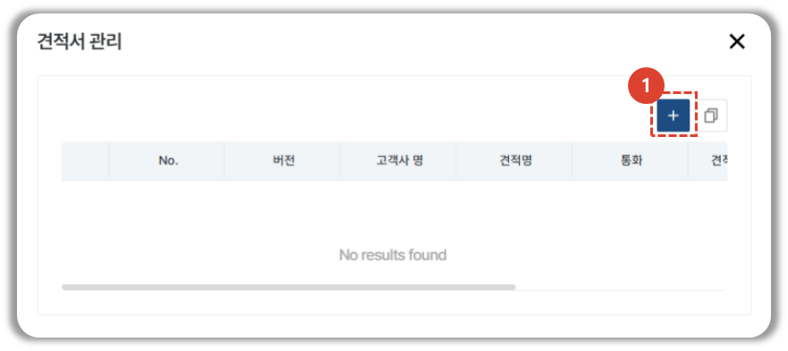
1. 관련한 첨부파일을 추가합니다. 
 
 

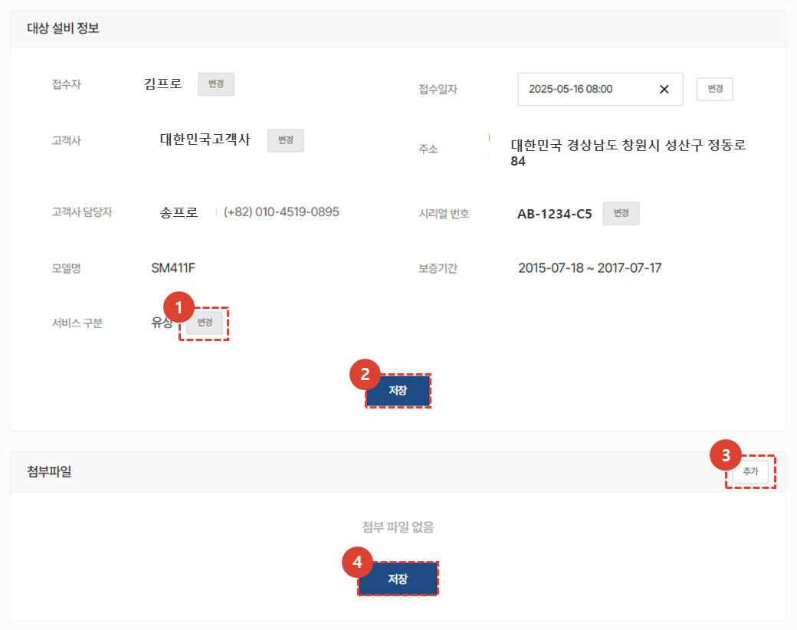
1. 조치 일자를 선택합니다. 
1. 조치에 소요된 시간을 입력합니다. 
1. 서비스에 대한 조치 완료 여부를 선택합니다.
1. **저장**을 클릭하여 서비스 주문을 저장합니다. 
    :::info
    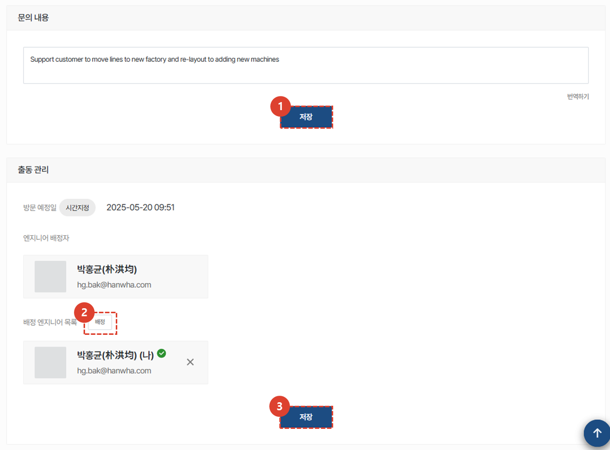
     정상적으로 저장된 경우 위와같은 알림을 확인 할 수 있습니다.
    :::
 
 

### 소화기 점검
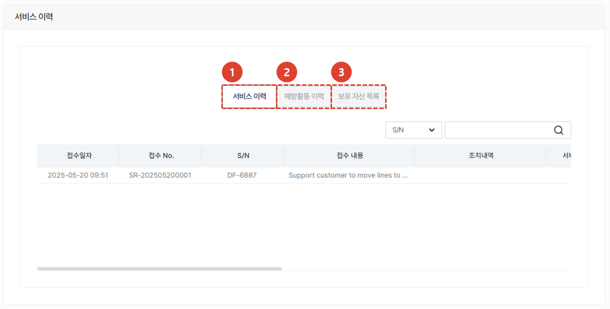
 장비 내 비치된 소화기 점검을 수행합니다. 

1. 소화기 설치 여부를 확인하고 등록합니다. 
1. 소화기가 불량인 경우, 불량 사유를 입력합니다. 
1. **저장** 버튼을 클릭합니다. 
 
 

### 명세/인보이스
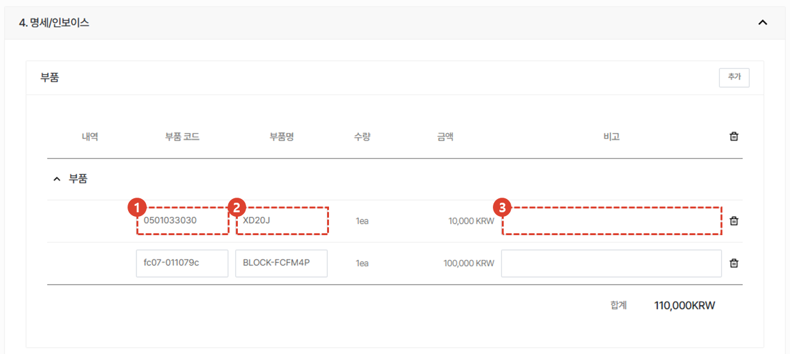
 사용 부품에 등록된 항목이 표시됩니다.

1. 자동 입력된 부품코드의 수정이 필요한 경우 수정을 수행합니다. 
1. 자동 입려된 부품명의 수정이 필요한 경우 수정합니다. 
1. 참고할 사항을 비고에 입력합니다. 
 
 

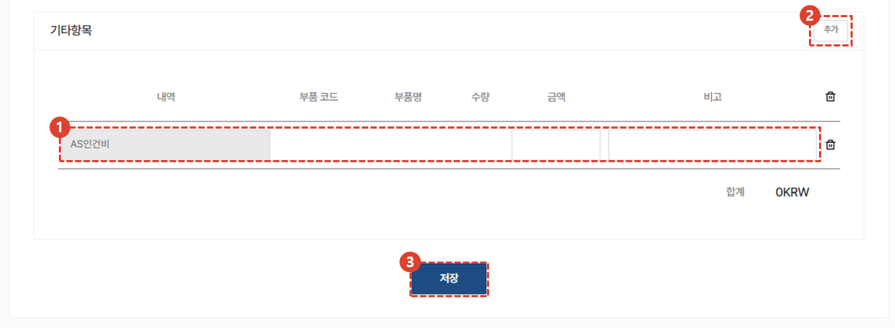
1. 인건비는 기본으로 추가되어있으며, 책정된 금액을 입력합니다. 
1. 인건비 이외 추가되어야 하는 기타 항목은 **추가**를 클릭하여 입력합니다. 
1. 명세/인보이스 항목 입력이 완료되면 **저장**을 합니다. 
 
 

### 최종 확인 페이지로 이동

1. 고장 수리 처리를 위한 모든 내역이 입력되면 **최종 확인 페이지로 이동**을 클릭합니다. 
    :::warning
    입력되지 않거나, 저장되지 않은 항목이 있는 경우 아래와같은 알림이 표시됩니다. 
    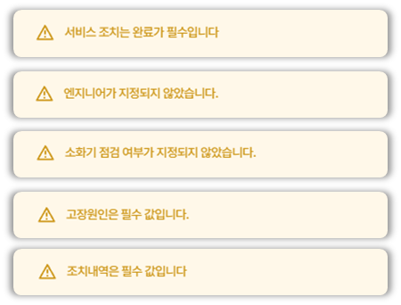
    :::
 
 

## 최종 확인 
### 서비스 요약
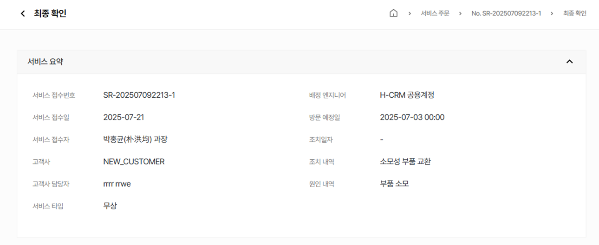
 고장 수리 서비스에 대한 요약 내용을 확인 할 수 있습니다. 
 
 

### 청구 금액
:::warning
    수정 사항이 있다면 반드시 **저장**을 클릭합니다.
:::
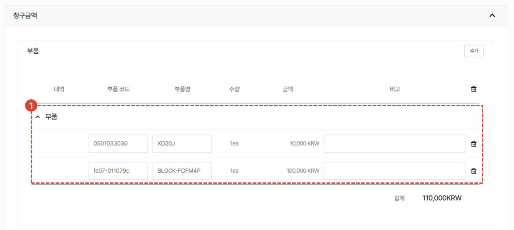
1. 사용 부품에 대한 청구 금액을 확인합니다. 
 
 

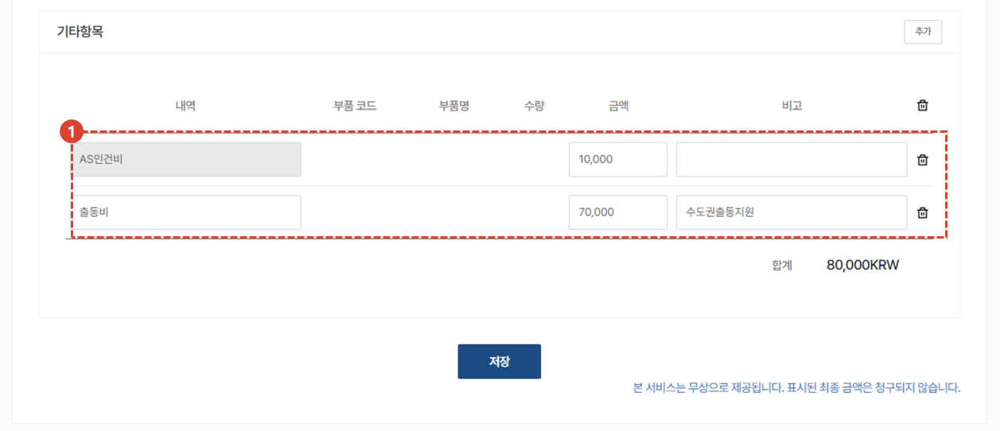
1. 기타 항목에 대한 청구 금액을 확인합니다. 
 
 

### 검수 파일 업로드 / 고객사 검수 담당자
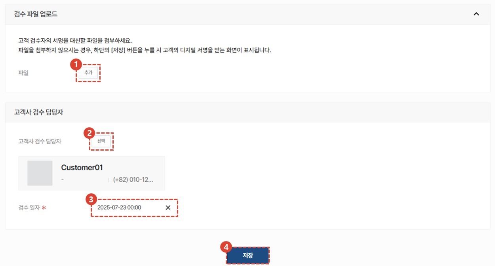
1. **검수 파일**을 업로드합니다. 
    :::warning
    중국과 같이 전자서명의 법적 효력이 없는 경우, 서명을 대체할 공신력이 있는 검수 파일을 첨부해야 합니다.
    :::
1. **고객사 검수 담당자**를 선택합니다. 
1. **검수 일자**를 선택합니다. 
1. **저장** 버튼을 클릭합니다. 
 
 

1. 고객사 검수 담당자를 확인합니다. 
 
 

1. 고객 검수 담당자에게 **서명**을 받고 **저장**버튼을 클릭하여 최종 확인을 완료합니다. 
 
 

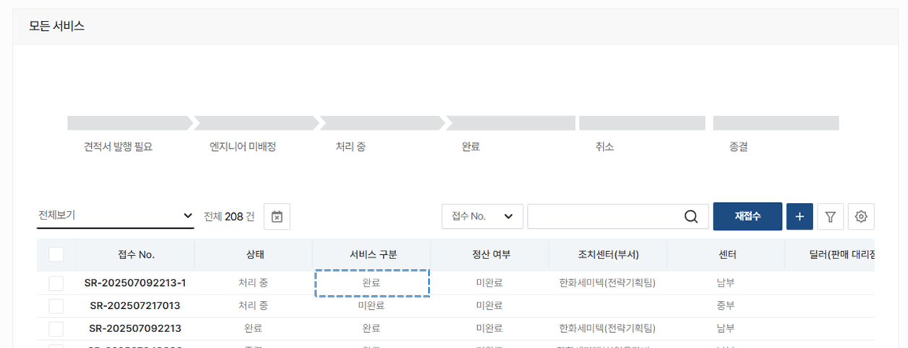
 최종 확인된 서비스는 고장 수리 서비스 목록에서 **완료**로 나타납니다. 
</ValidateTextByToken>