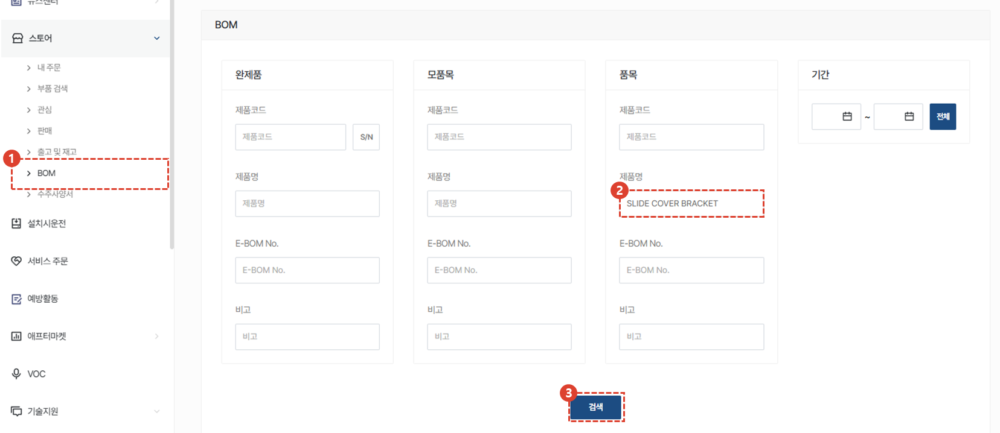
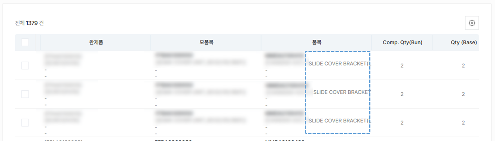
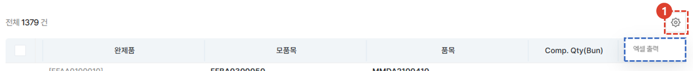

import ValidateTextByToken from "/src/utils/getQueryString.js";

# BOM
제품의 코드나 제품명, 기간 등의 조건을 이용한 BOM 검색 방법을 안내합니다. 

<ValidateTextByToken dispTargetViewer={true} dispCaution={true} validTokenList={['head']}>

1. 스토어의 BOM을 클릭합니다. 
1. 검색하고자 하는 제품의 코드나 제품명, E-BOM NO 및 비고 등 확인 가능한 정보를 입력합니다.
1. 검색 버튼을 클릭합니다. 
 
 

 검색란 하단에 그림과같은 검색 결과를 확인 할 수 있습니다. 

:::info

1. 리스트의 출력이 필요한 경우 **톱니바퀴 버튼**을 클릭하여 엑셀 출력을 수행합니다.
:::

</ValidateTextByToken>