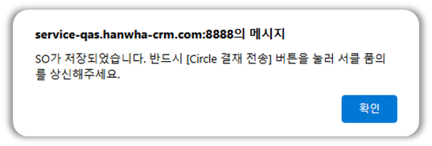

import ValidateTextByToken from "/src/utils/getQueryString.js";

# 수주사양서
과거 수주 사양서 자료를 찾아볼 수 있는 방법을 안내합니다. 

<ValidateTextByToken dispTargetViewer={true} dispCaution={true} validTokenList={['head']}>
    :::info
    수기로 작성된 '24년도까지의 수주사양서를 확인 할 수 있습니다.  
    :::
 
 

1. 수주사양서 메뉴를 클릭하여 확인하고자 하는 업체명이나 제품시리얼 번호 등을 검색하여 조회할 수 있습니다. 
</ValidateTextByToken>