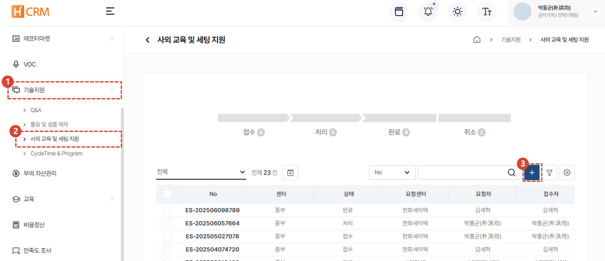

import ValidateTextByToken from "/src/utils/getQueryString.js";
import Receipt1 from "./img/039.png";
import Receipt2 from "./img/040.png";
import Receipt3 from "./img/041.png";

# 사외교육 및 세팅지원

고객사의 사외교육 및 세팅지원 요청을 관리할 수 있습니다. 
<ValidateTextByToken dispTargetViewer={true} dispCaution={false} validTokenList={['head', 'branch']}>

## 신규 등록

1. **기술지원** 메뉴를 클릭합니다. 
1. **사외 교육 및 세팅 지원** 메뉴를 클릭합니다. 
1. **+** 버튼을 클릭하여 사외 교육 및 세팅 지원의 시규 등록을 시작합니다. 

### 요청센터

1. 접수 센터를 선택합니다. 
    :::info
    회사명 및 요청자는 작성자 본인의 정보가 자동입력됩니다. 변경이 필요한 경우에만 선택하여 수정합니다.
    :::

### 고객사 정보 

1. **고객사 명**을 선택합니다. 
    :::warning 
    고객사 명을 선택하면 저장되어있는 고객사 정보(대표자명, 국가, 주소 등)이 불러와집니다. 이때, **사외교육 및 세팅지원이 진행되는 고객사의 주소를 선택**해야하며, 필요시 **추가**를 진행합니다. 
    ::: 
1. **고객사 담당자**를 선택합니다. 

### 대상 설비 정보

1. **선택**을 클릭하여 대상이 되는 설비의 시리얼 번호를 선택합니다. 
    :::info
    설비를 선택하면 해당 설비의 기본 정보가 자동으로 불러와집니다. 
    :::

### 접수 내용

## 접수 처리
### 접수 내용
### 1. 엔지니어 배정
### 2. 교육 실적
### 정산
### 세금계산서 발행

</ValidateTextByToken>