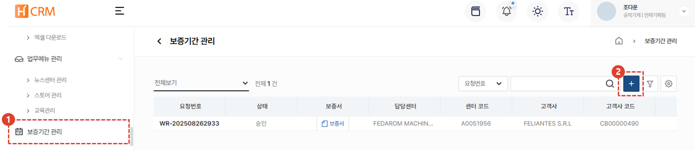
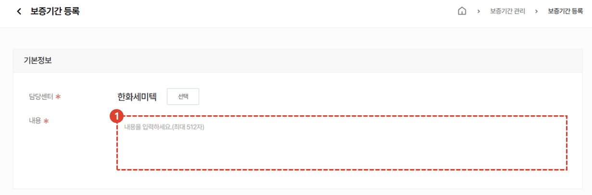
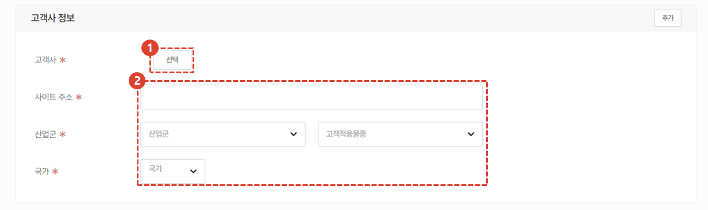
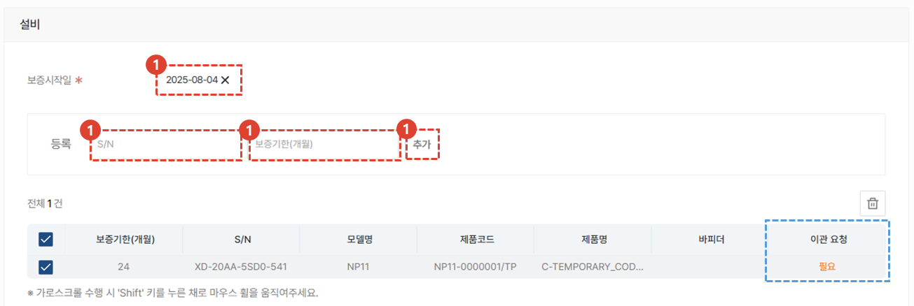
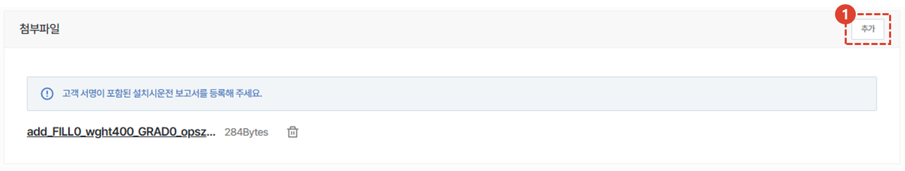
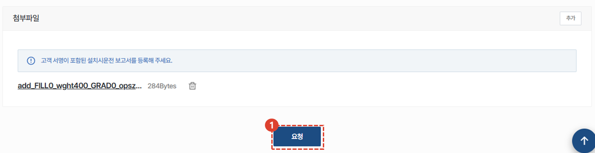
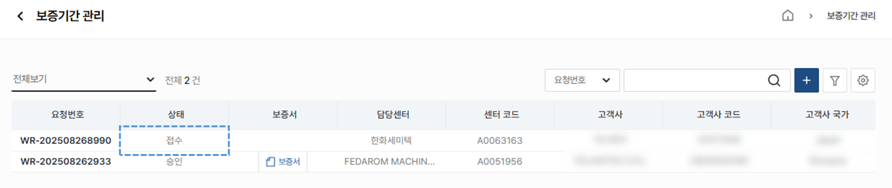
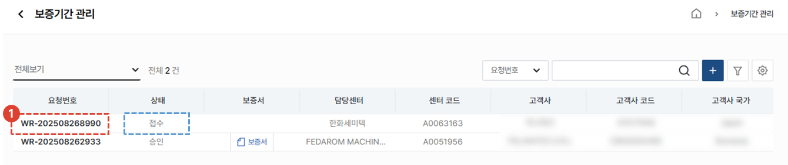
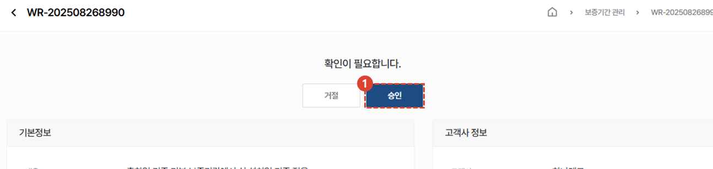
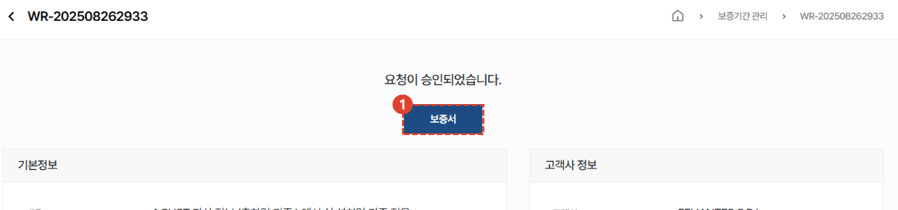

import ValidateTextByToken from "/src/utils/getQueryString.js";
import popup1 from "./img/010.png";
import popup2 from "./img/011.png";
import popup3 from "./img/013.png";

# 보증기간관리

공작기계 해외 법인 및 대리점에서 판매된 설비의 보증기간 등록 및 보증서 발급 방법을 안내합니다. 

<ValidateTextByToken dispTargetViewer={true} dispCaution={true} validTokenList={['head', 'branch', 'seller', 'agent']}>

## 보증기간 등록 요청

1. **보증기간 관리** 메뉴를 클릭합니다. 
1. **+** 버튼을 클릭합니다. 
 
 

### 기본정보 등록

1. 보증기간을 등록할 설비의 기본정보 내용을 입력합니다. 
 
 

### 고객사 정보 등록

1. 설비를 소유한 **고객사**를 선택합니다. 
1. 고객사 정보를 확인할 수 있는 **고객사 홈페이지**등의 사이트 주소를 입력합니다. 
 고객사의 **산업군**을 선택합니다. 
 해당 **설비가 설치된 국가**를 선택합니다. 
    :::warning
    해외 각국에 공장을 보유하고 있는 고객사의 경우에도 본사가 위치한 국가가 아닌 **설비가 설치된 국가**를 선택합니다. 
    ::: 
 
 

### 설비 정보 등록

1. 설비의 **보증 시작일**을 선택합니다. 
1. 설비의 **S/N**를 추가합니다. 
1. **보증기한(개월)**을 입력합니다. 
1. **추가** 버튼을 클릭합니다. 
    :::info
    설비의 소유 고객사가 변경되거나 한 경우 이관 요청 필요가 표시됩니다. 이 경우 [기준정보-자산 메뉴](/docs/MT/tutorial-12-manage-master-data/05-assets.md)에서 이관 요청합니다.
    :::
 
 

### 첨부파일 등록

1. 고객 서명이 포함된 **설치시운전 보고서를 추가**합니다. 
 
 

### 등록 요청

1. **요청** 버튼을 클릭합니다. 
 
 

:::tip 등록 요청 중
보증기간 등록 요청이 완료되면 **접수**  상태로 표시됩니다. 
 담당자의 승인 처리 후에 보증기간이 정식 등록되며 **보증서 발급이 가능**합니다.
:::
 
 

## 보증기간 신청 승인관리

1. **접수**상태의 요청건을 클릭합니다. 
 
 

1. 접수 건의 기본정보/ 고객사 정보 및 설비 정보, 첨부파일을 확인합니다.  **확인 후 승인** 혹은 거절을 수행합니다.
:::warning

 승인 시 해당 설비의 보증기간이 등록되며 변경이 불가함을 유의해야 합니다. 
:::
 
 
:::info

승인을 거절 할 경우 **사유**를 입력해야 합니다.
:::

## 보증서 발급

**보증기간이 등록된 설비는 보증서 발급이 가능합니다. **
1. 보증서 버튼을 클릭하면 다운로드 받을 수 있습니다. 
:::info 서비스 보증서 예시

:::

</ValidateTextByToken>