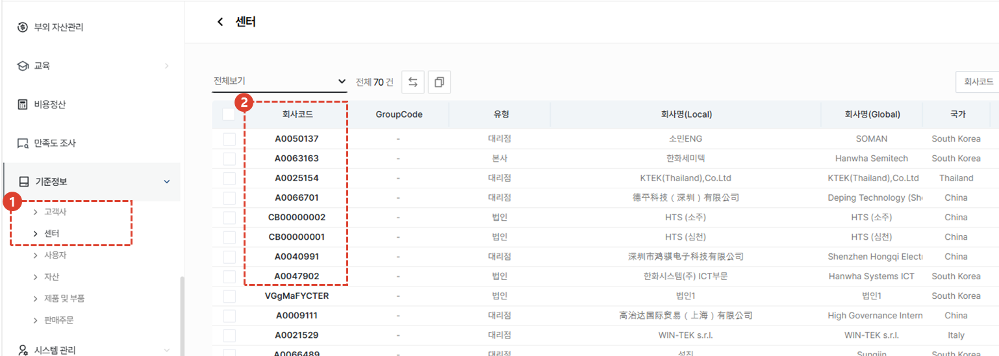
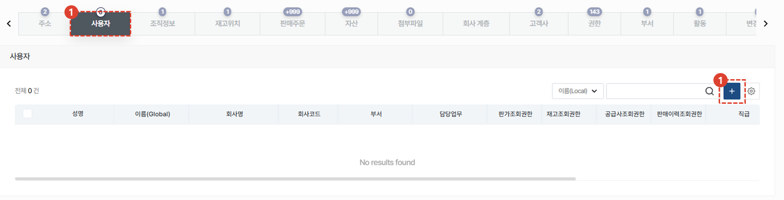
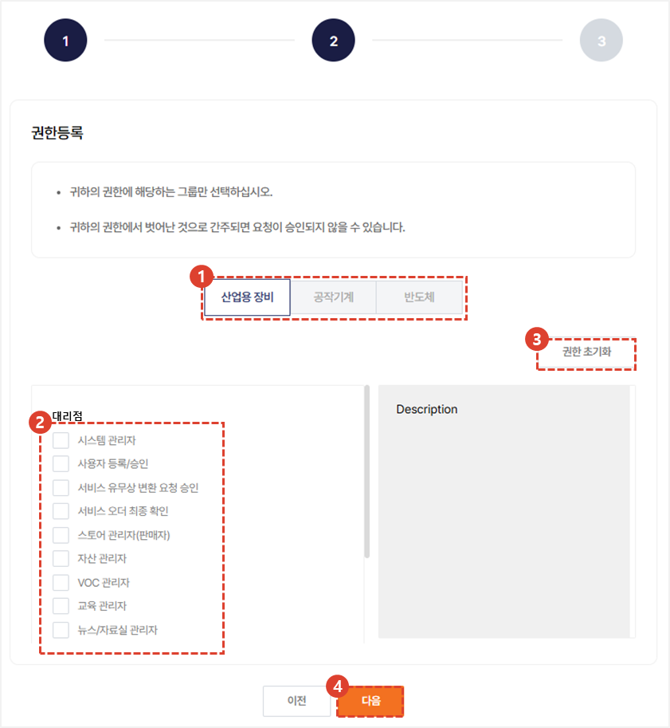
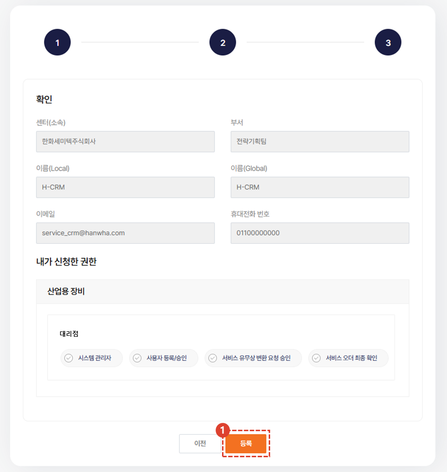
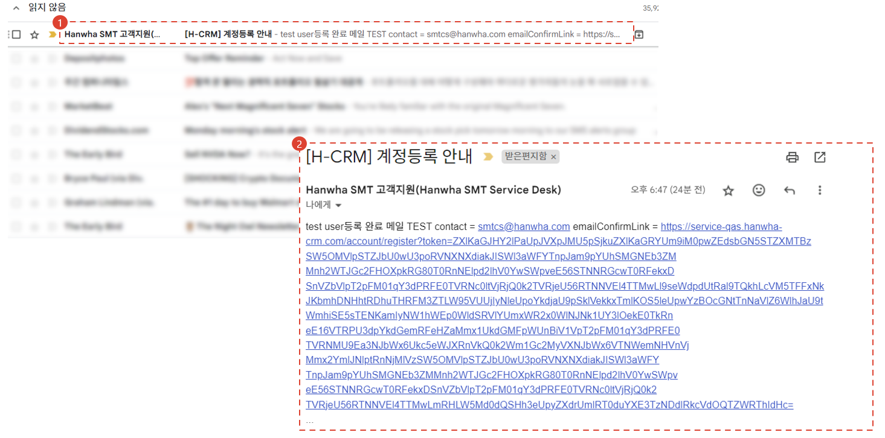
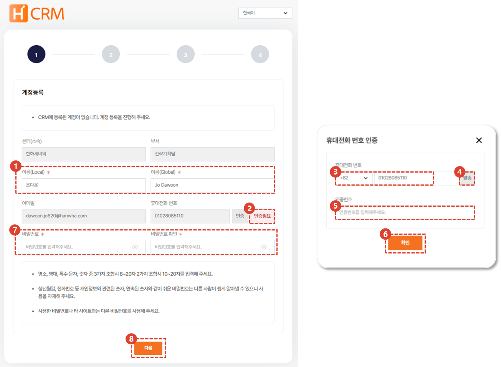
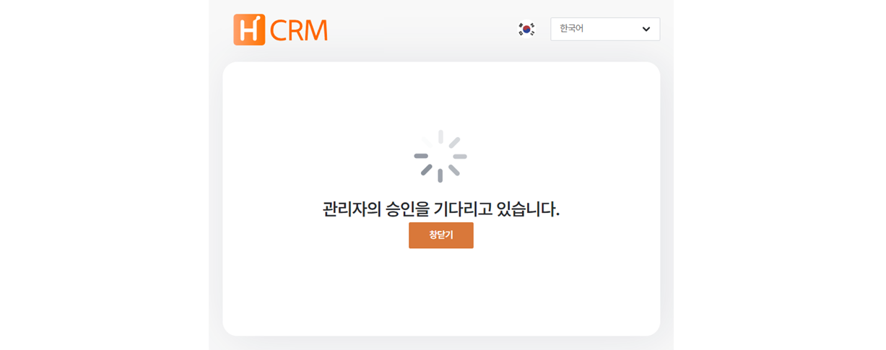
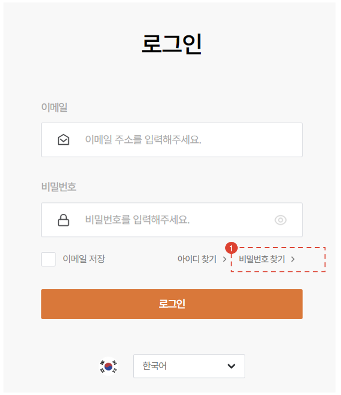

import ValidateTextByToken from "/src/utils/getQueryString.js";
import StrongTextParser from "/src/utils/textParser.js";
import text from "/src/locale/ko/SMT/tutorial-01-auth/create-a-acount-non-circle-user.json";

# CRM 계정 생성 (관리자의 계정 생성)
CRM에 이미 가입되어있는 본사나 법인, 대리점 관리자가 사용자의 계정을 대신 생성해주는 방법을 안내합니다. 
:::danger
서클 사용자는 임직원 대상의 계정 생성 절차를 따라주시기 바랍니다. 
:::
<ValidateTextByToken dispTargetViewer={true} dispCaution={true} validTokenList={['head', 'branch', 'agent']}>

## 개요
:::warning 
   - **관리자의 대리 가입** : CRM에 이미 가입되어있는 관리자가 관리자의 회사 또는 관리하고있는 대리점이나 고객사의 사용자 계정을 대신 생성하는 구조를 띄고 있습니다.  
   - **사용자의 직접 가입** : 관리자의 대리 생성이 불가한 경우 CRM 시스템의 회원가입 절차를 통해 직접 계정 생성을 할 수 있습니다. 
:::
 
 

## 관리자의 사용자 계정 대리 생성
### 페이지 이동

1. 기준정보 메뉴의 고객사 혹은 센터 메뉴를 클릭합니다. 
2. 신규 계정을 추가하고자 하는 회사(고객사 또는 센터)의 회사코드를 선택하여 상세 페이지로 진입합니다. 
 
 

1. 상세페이지 하단의 탭 중 **사용자** 탭을 클릭합니다.  선택된 회사(고객사 또는 센터)에 소속된 사용자 계정이 목록에 표시됩니다. 
1. **+** 버튼을 클릭하여 사용자 추가 화면으로 진입합니다. 
 
 

### 사용자 추가 - 정보 입력

1. 사용자 정보를 입력합니다. 
   - 이름(Local) : 현지 언어로 된 이름을 입력합니다. 
   - 이름(Global) : 영어로 표시될 이름을 입력합니다. 
   - 이메일 주소 : 계정으로 사용할 사용자의 이메일 주소를 입력합니다. 
   - 휴대전화 번호 : 계정을 사용할 사용자의 휴대폰 번호를 입력합니다.
1. 회사명을 확인합니다. 계정을 대리 등록하는 사용자의 소속 정보가 기본값으로 셋팅됩니다. 
   :::note
   계정관리 권한을 보유한 관리자의 경우, 소속 회사를 변경할 수 있습니다. 
   :::
1. 사용자의 부서를 추가하거나 저장되어잇는 부서 목록에서 선택합니다. 
   :::tip
   CRM 시스템 내에서 부서를 활용하는 경우가 많으므로, 부서 설정을 권장합니다. 
   :::
 
 

### 사용자 추가 - 부서 등록

1. **설정** 버튼을 클릭하여 저장된 부서 목록을 불러옵니다. 등록된 부서가 많은 경우 검색을 활용합니다. 
1. **부서추가** 버튼을 클릭하여 부서를 신규 생성하여 추가 할 수 있습니다. 
 
 

### 사용자 추가 - 권한 등록

1. <StrongTextParser text={text.step2AddUser01} />
1. 할당할 권한을 선택합니다. 
   :::warning
      - 꼭 필요한 권한만 할당될 수 있도록 주의하시기 바랍니다. 
      - 계정의 최종 승인 단계에서 보안 관리자의 검토 결과에 따라 승인이 거절될 수 있습니다. 
   :::
1. 선택된 권한을 초기화 할 수 있습니다.
1. 다음단계로 진행합니다. 
 
 

### 사용자 추가 - 승인 요청

- 해당되는 사업부를 선택합니다. 
- 할당할 권한을 선택합니다. 
   :::danger
   사용자의 계정이 부당하게 발급되지 않도록 주의하시기 바랍니다. 
   :::
1. **확인** 버튼을 클릭합니다.
   - 시스템 관리자에게 최종 승인 요청 알림이 발송됩니다. 
   - 또한, 계정 사용자에게 [**추가 인증 메일**](#사용자-추가인증-12)이 발송됩니다. 인증이 완료되어야 CRM 사용이 가능합니다. 
 
 

### 사용자 추가인증 (1/2)

1. <StrongTextParser text={text.step1AdditionalAuth01} />
   :::tip
   <StrongTextParser text={text.step1AdditionalAuth02} />
   :::
1. <StrongTextParser text={text.step1AdditionalAuth03} />
   :::note
   <StrongTextParser text={text.step1AdditionalAuth04} />
   :::
 
 

### 사용자 추가인증 (2/2)

1. <StrongTextParser text={text.step2AdditionalAuth01} />
1. <StrongTextParser text={text.step2AdditionalAuth02} />
1. <StrongTextParser text={text.step2AdditionalAuth03} />
1. <StrongTextParser text={text.step2AdditionalAuth04} />
1. <StrongTextParser text={text.step2AdditionalAuth05} />
   :::note
   <StrongTextParser text={text.step2AdditionalAuth06} />
   :::
1. <StrongTextParser text={text.step2AdditionalAuth07} />
1. <StrongTextParser text={text.step2AdditionalAuth08} />
   :::note
   - <StrongTextParser text={text.step2AdditionalAuth09} />
   - <StrongTextParser text={text.step2AdditionalAuth10} />
   - <StrongTextParser text={text.step2AdditionalAuth11} />
   :::
1. <StrongTextParser text={text.step2AdditionalAuth12} />
 
 

- <StrongTextParser text={text.finalConfirm01} />
   :::tip
   <StrongTextParser text={text.finalConfirm02} />
   :::

## 휴면 계정 해제 방법
:::warning
로그인 시도 중 비밀번호를 5회 잘못 입력할 경우, 사용자 계정은 자동으로 휴면 계정으로 전환됩니다. 
이는 계정 보안을 강화하고 무단 접근을 방지하기 위한 조치입니다. 
 계정이 휴면 상태로 전환된 경우, 정상적인 서비스 이용을 위해 반드시 **비밀번호 찾기 절차를 통해 휴면 계정 해제**를 진행해야 합니다.
:::

1. 로그인 화면에서 **비밀번호 찾기** 버튼을 눌러 비밀번호를 초기화합니다.
 
 

</ValidateTextByToken>
