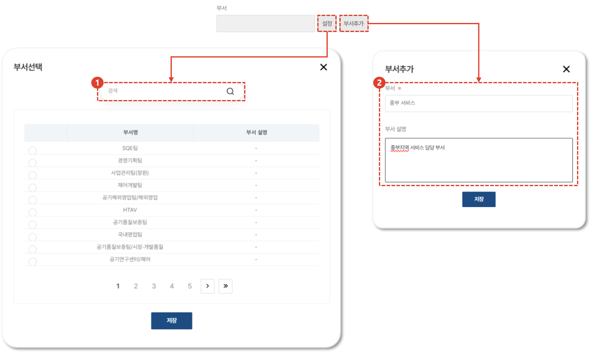
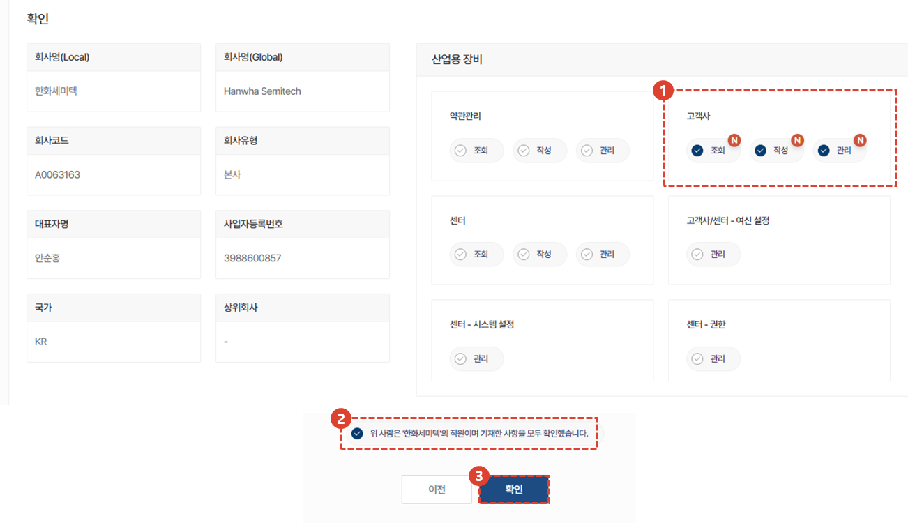
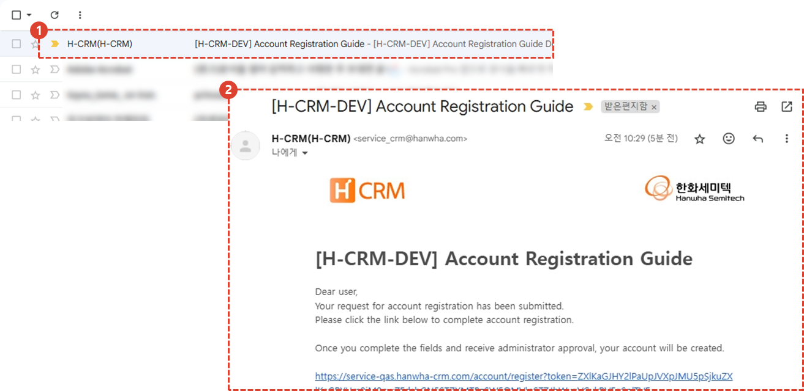

import ValidateTextByToken from "/src/utils/getQueryString.js";

# CRM 계정 생성 (그 외 사용자)

**사외망**에서 CRM 사용 계정을 생성하기 위한 절차를 안내합니다.

:::danger
서클 사용자는 서클 사용자 대상의 계정 생성 절차를 따라주시기 바랍니다.
:::

<ValidateTextByToken dispTargetViewer={true} validTokenList={['head', 'branch', 'agent', 'customer']}>

## 개요

비서클 사용자의 CRM 계정은 생성 시나리오가 아래와 같습니다.
:::warning 주의사항
   - **서비스 대리점 사용자**: 관리자가 사용자의 계정을 대신 생성하는 구조를 띄고 있습니다.
   - **일반 고객 사용자**: CRM 시스템에서 직접 계정을 생성할 수 있습니다.
:::

</ValidateTextByToken>

## 서비스 대리점 사용자 계정 생성

<ValidateTextByToken dispTargetViewer={false} validTokenList={['head', 'branch', 'agent']}>

:::info
계정 생성 권한을 별도로 부여할 예정이며, 권한을 가진 사용자만 계정 생성 작업을 수행할 수 있습니다.
:::

### 페이지 이동

1. 사이드바의 [기준정보] - [고객사] 또는 [센터] 메뉴를 선택합니다.
2. 계정을 추가하고자 하는 회사(고객사 또는 센터)의 회사코드를 선택하여 상세페이지로 진입합니다.

1. 하단의 탭에서 [사용자] 탭을 선택합니다.
2. 선택된 회사(고객사 또는 센터)에 소속된 사용자 계정의 목록이 표시됩니다.
3. [+] 버튼을 눌러 사용자 추가 화면으로 진입합니다.

### 사용자 추가 (1/3)

1. 사용자 정보를 입력합니다
   - 이름(Local): 현지 언어로 된 이름을 입력합니다.
   - 이름(Global): 영어로 표시될 이름을 입력합니다.
   - 이메일 주소: 계정을 사용할 사용자의 이메일 주소를 입력합니다.
   - 휴대전화 번호: 계정을 사용할 사용자의 휴대폰 번호를 입력합니다. **(옵션사항)**
2. 회사명을 확인합니다. 계정을 대리 등록하는 사용자의 소속 정보가 기본값으로 세팅되어 있습니다.
   :::note
   계정관리 권한을 보유한 관리자의 경우, 소속 회사를 변경할 수 있습니다.
   :::
3. 사용자의 부서를 추가하거나 저장되어 있는 부서 목록에서 선택합니다. [부서설정 절차](#사용자-추가-13---부서-등록)를 참고하세요.
   :::tip
   CRM 시스템 내에서 부서를 활용하는 경우가 많이 있습니다. 부서를 설정해두시면 이후의 작업들이 수월해집니다.
   :::

### 사용자 추가 (1/3) - 부서 등록

1. [부서 추가] 버튼을 눌러 부서를 추가합니다.
1. **부서명** 을 입력하고, 부서에 대한 설명을 **부서 설명** 란에 입력합니다.
1. [저장] 버튼을 눌러 부서 정보를 저장합니다.
1. [설정] 버튼을 눌러 저장된 부서 목록을 불러옵니다.
1. 등록된 부서가 많이 있을 경우 검색을 활용할 수 있습니다.
1. 저장된 부서 목록에서 사용할 부서명을 클릭합니다.
1. [저장] 버튼을 눌러 부서를 설정합니다.

### 사용자 추가 (2/3)

1. 사업부를 선택합니다.
1. 권한 목록에 권한이 많은 경우 검색을 통해서 필요 권한만 검색할 수 있습니다.
1. 검색된 결과를 초기화 할 수 있습니다.
1. 전체 화면에서 볼 수 있습니다.
1. 신청할 권한이 많은 경우, 다른 사람의 권한을 복사해 올 수 있습니다.
1. 선택된 권한들을 초기화합니다.
1. 선택한 권한에 대한 설명이 표시됩니다.
1. 할당할 권한을 선택합니다.
   :::warning
   꼭 필요한 권한만 할당될 수 있도록 주의하시기 바랍니다.  계정의 최종 승인 단계에서 관리자의 검토 결과에 따라 승인이 거절될 수 있습니다.
   :::
1. 다음단계로 진행합니다.

### 사용자 추가 (3/3)

1. 신청 권한 목록이 사업부별로 표시됩니다.
1. 계정의 사용자는 **한화정밀기계** 협력사의 임직원이며, 이에 따라 입력한 내용에 이상이 없음을 확인합니다.
   :::danger
   사용자의 계정이 부당하게 발급되지 않도록 주의하시기 바랍니다.
   :::
1. [확인] 버튼을 누릅니다.
   - 생성한 계정을 사용할 수 있도록 관리자에게 최종 승인 요청 알림이 발송됩니다.
   - 계정 사용자에게 추가 인증 메일이 발송됩니다. [추가인증](#사용자-추가인증)을 참조하세요.

### 사용자 추가인증 (1/2)

1. 계정의 사용자는 메일함을 확인하여 수신된 **계정등록 안내** 메일을 클릭합니다.
   :::tip
   메일이 수신되지 않은 경우, 계정을 대리 생성한 담당자에게 다시 문의해주시기 바랍니다.
   :::
1. 인증 링크를 클릭합니다.
   :::note
   링크의 만료시간은 발송시점으로부터 00분입니다.
   :::

### 사용자 추가인증 (2/2)

1. 입력된 이름 정보를 확인합니다. 수정이 필요한 경우 편집이 가능합니다.
1. 휴대폰 번호를 인증합니다. [인증] 버튼을 누릅니다.
1. 휴대폰 번호를 입력합니다.
1. 인증번호를 수신하기 위해 [발송] 버튼을 누릅니다.
1. 휴대폰에 수신된 인증번호를 입력합니다.
   :::note
   인증번호의 유효기간은 00분입니다.
   :::
1. [확인] 버튼을 누릅니다.
1. 사용할 비밀번호를 입력합니다.
   :::note
   - 영소, 영대, 특수문자, 숫자 중 3가지 조합 시 8 ~ 20자, 2가지 조합 시 10 ~ 20자를 입력해주세요.
   - 생년월일, 전화번호 등 개인정보와 관련된 숫자, 연속된 숫자와 같이 쉬운 비밀번호는 다른사람이 쉽게 알아낼 수 있으니 사용은 자제해 주세요.
   - 사용했던 비밀번호나 타 사이트에 사용중인 비밀번호와는 다른 비밀번호를 사용해주세요.
   :::
1. [다음] 버튼을 눌러 인증 작업을 완료합니다.

- 관리자의 최종 승인을 기다립니다.
   :::tip
   보통 1일내에 승인 작업이 이루어집니다. 빠른 승인이 필요한 경우 smtcs@hanwha.com 으로 연락해주시기 바랍니다.
   :::

</ValidateTextByToken>

### 사용자 계정 승인 🚧

<ValidateTextByToken dispTargetViewer={false} validTokenList={['head']}>

:::info
TBD (화면작업중)
:::

</ValidateTextByToken>

## 일반 사용자 계정 생성 🚧

<ValidateTextByToken dispTargetViewer={false} validTokenList={['customer']}>

### 페이지 이동 🚧

:::info
TBD (화면작업중)
:::

</ValidateTextByToken>