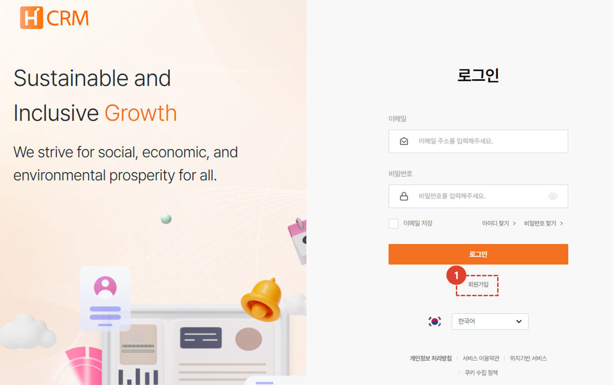
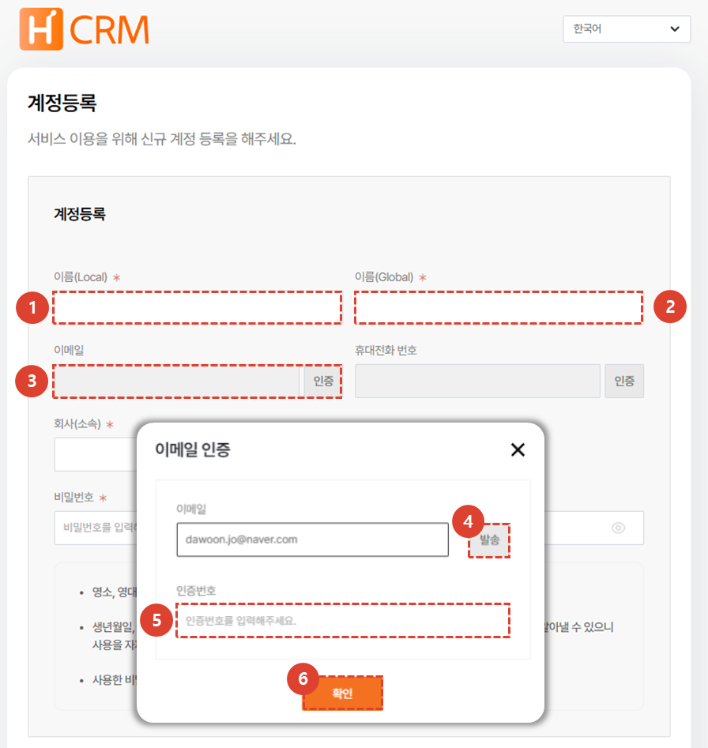
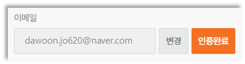
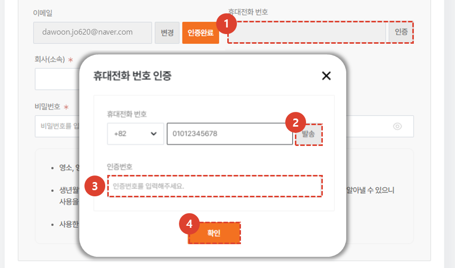
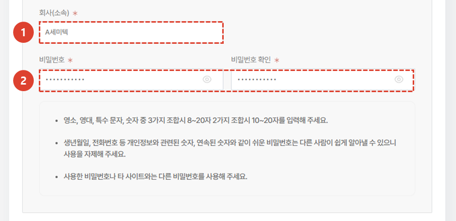
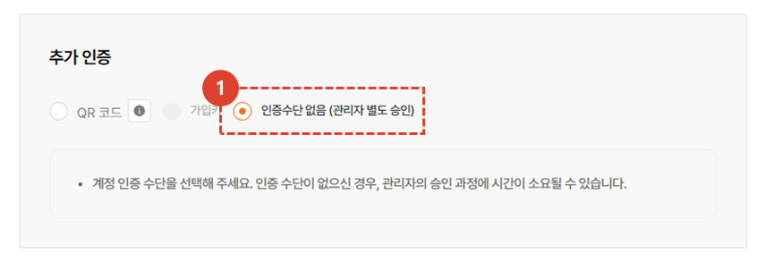
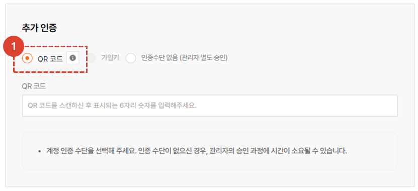
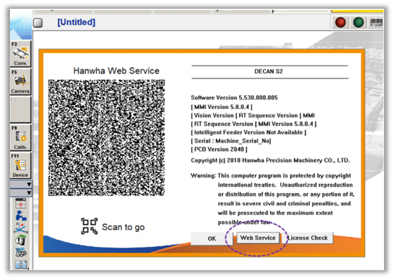
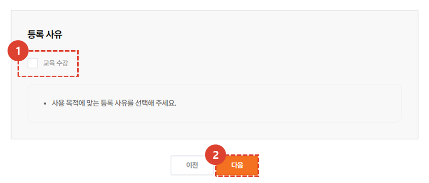
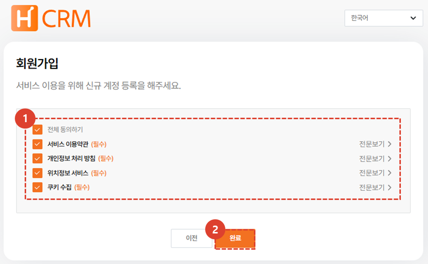

import ValidateTextByToken from "/src/utils/getQueryString.js";
import StrongTextParser from "/src/utils/textParser.js";
import text from "/src/locale/ko/SMT/tutorial-01-auth/create-a-acount-non-circle-user.json";
import MMIMobile from "./img/035.png";

# CRM 계정 생성 (고객사)

<!-- 메뉴단에서 번역이 안되므로 여기 하드코딩해야 함 #가 달린 헤더와 함께 -->
고객사의 CRM 사용 계정을 생성하기 위한 절차를 안내합니다.

:::danger
<StrongTextParser text={text.warning} />
:::

<ValidateTextByToken dispTargetViewer={true} dispCaution={false} validTokenList={['head', 'branch', 'agent', 'customer']}>

## 개요

<StrongTextParser text={text.overview01} />
:::warning 
   - <StrongTextParser text={text.overview02} />
   - **고객사** : CRM에서 직접 계정을 생성 할 수 있습니다. 
:::

</ValidateTextByToken>

## 고객사 계정 생성

<ValidateTextByToken dispTargetViewer={false} validTokenList={['head', 'branch', 'agent', 'customer']}>

:::info
<StrongTextParser text={text.createAgentAccount01} />
:::

### 회원가입 화면 이동

1. **회원가입**을 클릭합니다.

### 기본 정보 입력

1. **이름**을 입력합니다.
1. **영문이름**을 입력합니다.
1. **인증**을 클릭합니다. 
1. 아이디로 사용 할 이메일을 입력하고 **발송**을 클릭합니다.
1. 이메일에 전송된 인증번호를 입력합니다.  
1. **확인**을 클릭하여 이메일 등록을 완료합니다. 
:::info
  
인증이 완료되면 **인증** 버튼이 **인증완료**로 변경됩니다.
:::

1. **인증**을 클릭합니다. 
1. 휴대전화 번호를 입력하고 **발송**을 클릭합니다.
1. 휴대전화에 전송된 인증번호를 입력합니다.  
1. **확인**을 클릭하여 휴대전화 등록을 완료합니다. 

1. **회사(소속)** 정보를 입력합니다. 
1. 비밀번호를 입력합니다.

### 추가인증 - 인증수단 없음

반도체장비 및 공작기계 고객사의 경우 **인증수단 없음** 을 선택하시고,
산업용장비 고객사의 경우 **인증수단 없음** 또는 **QR코드**를 선택하세요.

### 추가인증 - QR코드 인증

1. QR코드 선택 시 사용중인 장비에서 QR코드 인식, 식별번호 발급이 필요합니다. 
:::info
     
   장비의 MMI화면에서 다음과 같은 QR코드를 확인 할 수 있습니다. 
   휴대폰으로 QR코드를 인식합니다. 

    

   1. 위치정보수집 동의를 선택합니다.
   1. **확인**을 선택합니다.
   1. 화면에 나타난 식별번호를 확인하고 추가인증 QR코드란에 입력합니다.

:::

### 등록 사유 선택

1. 등록 사유를 선택합니다. 
1. **다음**을 선택합니다.

### 서비스CRM 약관 동의

1. 약관을 확인 후 동의를 체크합니다.
:::warning 
   - 필수 약관에 동의 없이는 회원가입이 불가합니다. 
:::
1. **완료**를 선택하여 회원가입 절차를 완료합니다. 
:::info
   CRM 관리자의 승인 후 이메일이 발송되며, CRM 사용이 가능합니다.
:::

</ValidateTextByToken>
