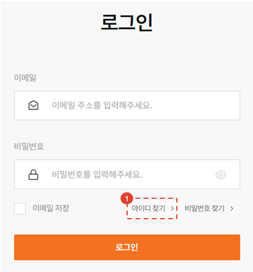

import ValidateTextByToken from "/src/utils/getQueryString.js";

# 이메일 찾기

계정의 이메일을 분실하였을 경우 사용하는 메뉴에 대한 안내입니다.

<ValidateTextByToken dispTargetViewer={true} validTokenList={['head', 'branch', 'agent', 'customer']}>

## 페이지 이동

1. 로그인 화면에서 [아이디 찾기] 버튼을 누릅니다.

## 휴대폰 번호로 아이디(이메일) 찾기

1. 계정에 등록된 휴대폰 번호를 입력합니다.
1. 번호를 입력하고 [확인] 버튼을 누릅니다.

1. 휴대폰으로 수신된 인증번호를 입력합니다.

## 아이디(이메일) 확인

1. 확인 버튼을 눌러 로그인 또는 비밀번호 초기화 작업을 수행합니다.

</ValidateTextByToken>