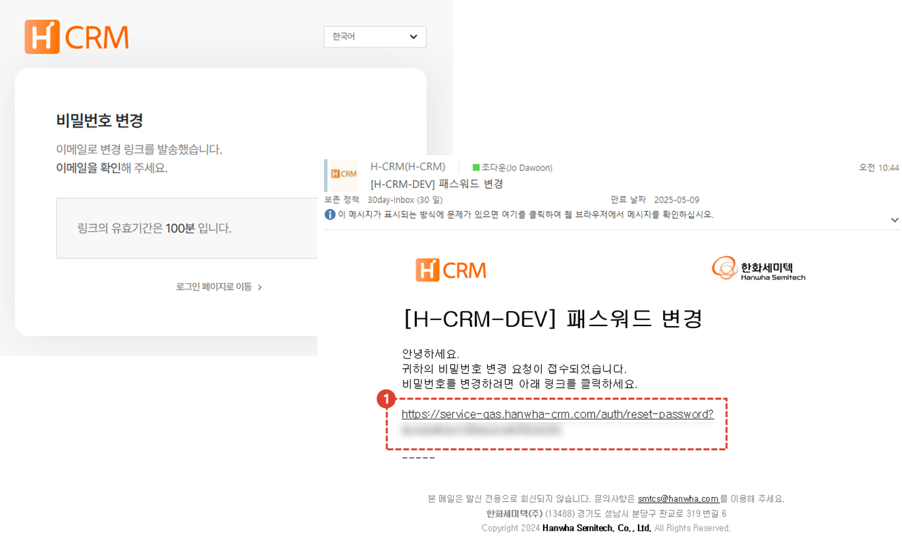

import loginWindow from "./img/019.png";
import ValidateTextByToken from "/src/utils/getQueryString.js";

# 비밀번호 초기화

**사외망**에서 로그인 시, 비밀번호를 분실하였을 때 비밀번호 초기화 작업 절차를 안내합니다.

<ValidateTextByToken dispTargetViewer={true} validTokenList={['head', 'branch', 'agent', 'customer']}>

## 페이지 이동

1. 로그인 화면에서 [비밀번호 찾기] 버튼을 누릅니다.

## 사용자 이메일 입력

1. 초기화할 계정의 이메일 주소를 입력합니다.
    :::tip
    아이디(이메일)을 분실한 경우 [아이디(이메일) 찾기](./find-email.md) 페이지를 참조해주세요.
    :::
1. 이메일 주소를 입력하고 [확인] 버튼을 누릅니다.

1. 수신된 이메일의 링크를 클릭합니다.

## 비밀번호 초기화

1. 신규 비밀번호를 입력합니다.
2. [확인] 버튼을 누릅니다.

</ValidateTextByToken>