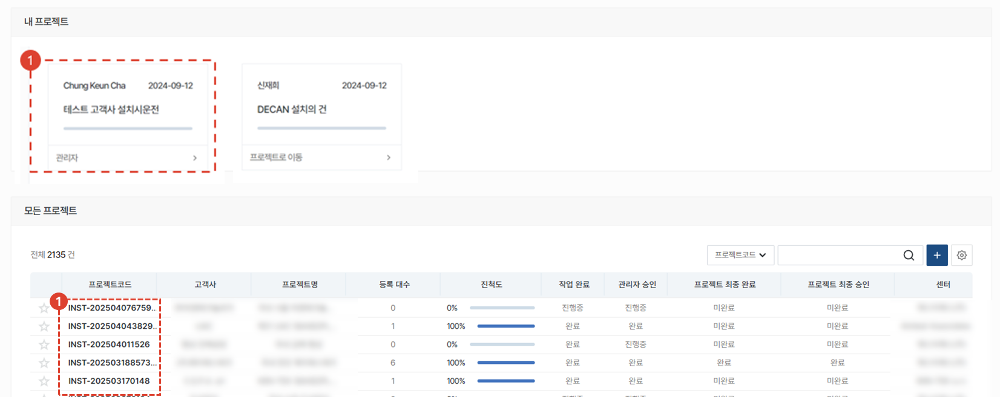
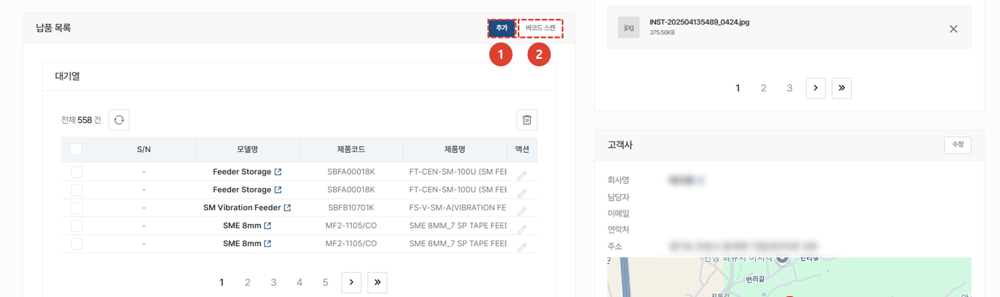
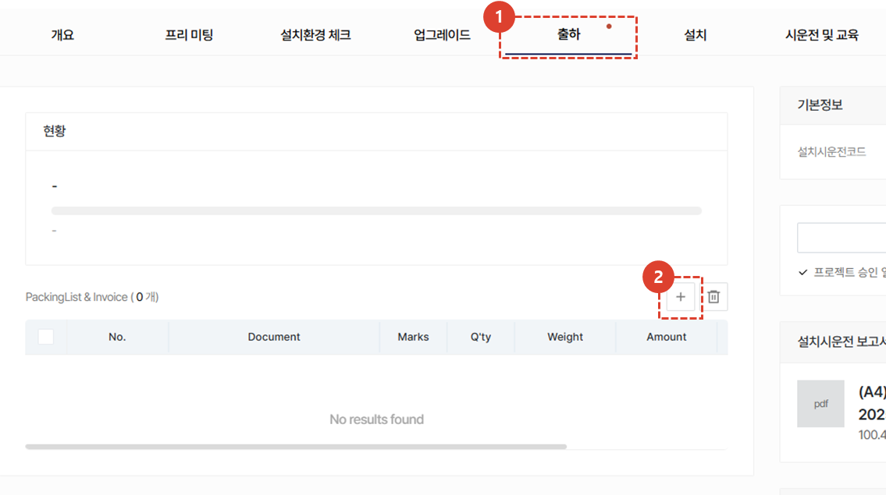
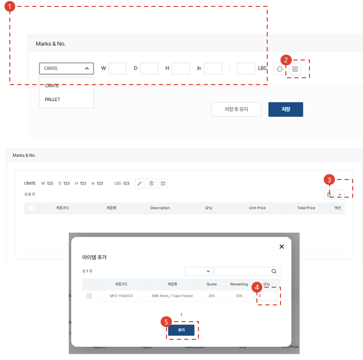
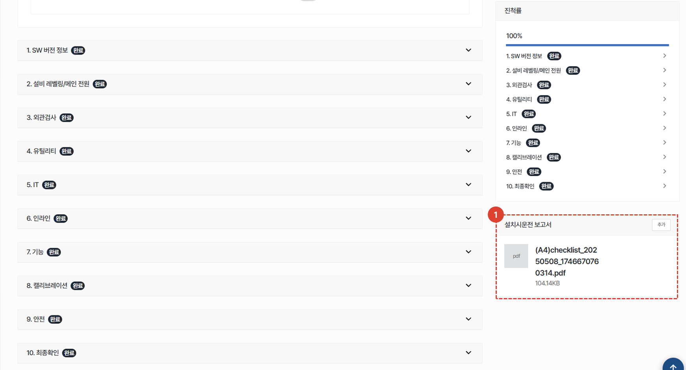
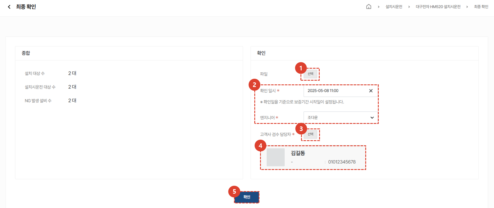

import ValidateTextByToken from "/src/utils/getQueryString.js";
import StrongTextParser from "/src/utils/textParser.js";
import text from "/src/locale/ko/SMT/tutorial-02-installation/02-details-project.json";
import DataAdd from "./img/012_2.png";
import Signature from "./img/039.png";

# 프로젝트 상세

고객사에 인도된 자산의 설치시운전 작업을 수행하기 위한 절차를 안내합니다.

## 프로젝트 목록

<ValidateTextByToken dispTargetViewer={false} dispCaution={true} validTokenList={['head', 'branch', 'agent']}>

1. <StrongTextParser text={text.list01} />
1. <StrongTextParser text={text.list02} />

</ValidateTextByToken>

## 프로젝트 상세

<ValidateTextByToken dispTargetViewer={false} dispCaution={true} validTokenList={['head', 'branch', 'agent']}>

1. <StrongTextParser text={text.details01} />
 
 

1. **개요** : 설치시운전에 대한 기본적인 내용 및 요약, 납품 목록을 입력합니다.
1. **프리미팅** : 설치시운전을 위해 고객과 진행한 프리 미팅 내용을 입력 할 수 있습니다. 프리미팅에 대한 상세 내용 및 소요 시간을 관리할 수 있습니다. 
1. **설치환경 체크** : (미주법인 전용)프리미팅이 어려운 경우, 고객에게 유선으로 전달받은 설치 환경 정보를 저장할 수 있습니다. 
1. **업그레이드** : (미주법인 전용) 고객의 주문에 따른 옵션 설치를 진행할 수행 장소를 입력할 수 있습니다. 
1. **출하** : (미주법인 전용) 출하 정보를 입력할 수 있습니다. 
1. **설치** : 설치시운전에 대한 상세한 내용을 입력하고, 설치시운전의 최종확인 여부를 선택 할 수 있습니다.
1. **시운전 및 교육** : 설치시운전 전후로 진행되는 시운전 및 교육 내역을 입력할 수 있습니다.
1. **품질 안정화** : 설치시운전 이후 품질 안정화를 위한 작업 내역을 입력할 수 있습니다. 
1. 각 탭의 내용을 확인 할 수 있습니다. 
1. 설치시운전에 대한 공통내용을 확인 할 수 있습니다. 설치시운전에 대한 기본 정보, 프로젝트 완료 및 승인 버튼, 보고서 등을 확인 할 수 있습니다. 
    :::info
    **프로젝트 완료** : 각 탭에 위치한 **작업완료** 버튼, 설치 탭의 **최종확인** 버튼과 달리 프로젝트 전체에 대한 완료를 의미합니다. 
     버튼 클릭 시, 각 탭의 진행 사항이 작업 완료로 일괄 변경되며, 상위 관리자의 승인을 받게됩니다. 
    :::

</ValidateTextByToken>
 
 
## 공통내용
<ValidateTextByToken dispTargetViewer={false} dispCaution={true} validTokenList={['head', 'branch', 'agent']}>

1. 설치시운전 프로젝트의 코드를 확인 할 수 있습니다.
1. 설치시운전을 완료한 후에, **작업자**가 **프로젝트 완료** 버튼을 클릭해야 합니다. 해당 버튼 클릭 시 모든 탭의 작업이 **작업완료**처리 됩니다. 
    :::warning
     완료버튼 클릭 시 나타나는 팝업창에서 보증기간 시작일 변경이 가능합니다. 
     보증기간 시작일이 맞는지 다시한번 검토 후 완료 처리를 진행해야 합니다.
    :::
1. **프로젝트 완료**가 선택 된 경우, 버튼이 활성화 됩니다. **관리자**는 프로젝트 결과 확인 후 **프로젝트 승인** 버튼을 클릭합니다. 
    :::warning
     완료버튼 클릭 시 나타나는 팝업창에서 보증기간 시작일 변경이 가능합니다. 
     보증기간 시작일이 맞는지 다시한번 검토 후 완료 처리를 진행해야 합니다.
    :::
1. 클릭하여 **설치시운전 보고서**를 확인 할 수 있습니다. **설치**탭에서 체크리스트를 모두 완료하면 보고서가 자동 생성 됩니다. 
1. 프로젝트에 참고할만한 첨부파일을 추가할 수 있습니다.
 
 

1. 고객사 정보를 확인하고, 수정이 필요한 경우 **수정** 버튼을 클릭합니다. 
1. 고객사 검수 담당자의 변경이 필요한 경우 **변경** 버튼을 클릭합니다. 
1. 담당 센터의 경우, 프로젝트 생성 이후 변경이 불가합니다. 
1. **추가** 버튼을 클릭하여 프로젝트 관리자를 추가할 수 있습니다.
 
 

1. 프로젝트의 활동 내역을 타임라인으로 확인 할 수 있습니다. 
1. 코멘트 작성으로 엔지니어 및 관리자간 소통을 할 수 있습니다. 
    :::tip
    - <StrongTextParser text={text.common03} />
    :::
1. 프로젝트를 취소해야 할 경우 사용합니다. 설치시운전 작업이 완료되면 버튼이 비활성화 됩니다. 
1. **즐겨찾기**를 선택 할 수 있습니다.
</ValidateTextByToken>
 
 

## 개요

<ValidateTextByToken dispTargetViewer={false} dispCaution={true} validTokenList={['head', 'branch', 'agent']}>

1. 프로젝트 생성 시 입력된 기본 내용을 수정할 수 있습니다. 
1. 설치시운전 프로젝트에 추가된 설치대상 자산의 보증기간 관리가 가능합니다. 
    :::warning 
    보증기간 관리는 **자산추가** 후 활용이 가능합니다.
     [**보증기간 관리**](#보증기간-관리)를 클릭하여 관리방법을 확인 할 수 있습니다.
    :::
 
 

1. 설치 대상 자산을 추가하기 위해 **추가** 버튼을 클릭합니다.
1. 자산에 부착되어있는 바코드를 이용해 추가를 원할 경우 **바코드 스캔** 버튼을 클릭합니다.
    :::info
    보증 기간 관리가 필요한 자산은 모두 등록해야 합니다. 추가 방법은 다음과 같습니다. 
    :::

</ValidateTextByToken>
### 납품목록 추가
#### 판매주문으로 추가하기

<ValidateTextByToken dispTargetViewer={false} dispCaution={true} validTokenList={['head', 'branch']}>

1. <StrongTextParser text={text.overviewAddAssetBySalesOrder01} />
1. <StrongTextParser text={text.overviewAddAssetBySalesOrder02} />
1. <StrongTextParser text={text.overviewAddAssetBySalesOrder03} />
1. <StrongTextParser text={text.overviewAddAssetBySalesOrder04} />
    - 여기에 추가된 자산은 [**판매주문으로 자산이 추가된 경우 납품목록 조회**](#판매주문으로-자산이-추가된-경우)와 같이 표시됩니다.
</ValidateTextByToken>
 
 
#### 자산목록에서 추가하기

<ValidateTextByToken dispTargetViewer={false} dispCaution={true} validTokenList={['head', 'branch', 'agent']}>

1.  <StrongTextParser text={text.overviewAddAssetByAssetList01} />
    :::note
    <StrongTextParser text={text.overviewAddAssetByAssetList02} />
    :::
1. <StrongTextParser text={text.overviewAddAssetByAssetList03} />
1. <StrongTextParser text={text.overviewAddAssetByAssetList04} />
    :::info
    
    :::
    
1. <StrongTextParser text={text.overviewAddAssetByAssetList05} />
1. <StrongTextParser text={text.overviewAddAssetByAssetList06} />
 
 
#### 직접 S/N입력

1. 보유자산 목록에서 자산 조회가 되지 않는 경우, **직접 S/N 입력** 버튼을 클릭합니다.
    :::danger
    자산을 허위로 등록할 경우, 향후 불이익이 발생할 수 있습니다.
    :::
1. 추가할 자산의 시리얼 번호를 입력합니다.   그림과 같이 입력하면, 다량의 자산을 일괄 추가 할 수 있습니다.
1. 추가된 시리얼번호의 상태를 확인하고, 필요에 따라 **자산추가** 버튼을 클릭하여 자산을 추가할 수 있습니다. 
     
    

1. <StrongTextParser text={text.overviewAddAssetByDirect05} />
1. <StrongTextParser text={text.overviewAddAssetByDirect06} />

 
 

### 납품목록

<StrongTextParser text={text.serveList01} />

#### 판매주문으로 자산이 추가된 경우

1. 시리얼 번호가 매핑되지 않거나, 기타 사유로 설치 대상/비대상으로 분류가 되지 않은 경우 대기열에 잔류하게됩니다.    
    :::warning
    대기열에 자산이 존재할 경우, 다음 단계로 넘어갈 수 없습니다. 
     **(2) S/N**를 더블클릭하거나 **(3) 액션버튼**을 클릭하여 Serial Number을 입력하면, 설치대상 또는 비대상으로 이동합니다.
    :::

4. 설치시운전의 대상이 되는 모델 목록입니다. 
     모델 데이터에서 **설치시운전 설치대상**이 체크되어있는 경우, 해당 목록에 추가됩니다.
    :::info
    <StrongTextParser text={text.serveListBySalesOrder03} />
    :::
5. 설치대상이 아닌 경우, **모델명**을 클릭하여 **설치시운전 설치대상**을 선택 해제합니다.
   설치대상에서 선택 해제 된 경우, **설치 비대상** 목록으로 이동 됩니다. 
6. 설치대상이 아닌 납품 목록입니다. 
    :::info
    <StrongTextParser text={text.serveListBySalesOrder05} />
    :::

</ValidateTextByToken>

#### 보유자산목록에서 추가 또는 직접 자산을 등록한 경우

<ValidateTextByToken dispTargetViewer={false} dispCaution={true} validTokenList={['head', 'branch', 'agent']}>

1. 직접 자산을 추가하는 경우에는 대기열이 존재하지 않습니다. 나머지는 [**판매주문으로 자산이 추가된 경우**](#판매주문으로-자산이-추가된-경우)와 동일한 프로세스를 따릅니다.

</ValidateTextByToken>
 
 
### 보증기간 관리

<ValidateTextByToken dispTargetViewer={false} dispCaution={true} validTokenList={['head', 'branch', 'agent']}>

1. 보증기간과 관련된 자료를 첨부할 수 있습니다. 
1. 업로드된 파일을 삭제 할 수 있습니다. 
1. 설치대상에 있는 제품의 보증기간을 일괄변경 할 수 있습니다. 
1. 변경하고자 하는 제품의 보증기간 탭을 **더블클릭**하여 보증기간 수정이 가능합니다.
</ValidateTextByToken>

## 프리미팅

<ValidateTextByToken dispTargetViewer={false} dispCaution={true} validTokenList={['head', 'branch', 'agent']}>

설치시운전 작업 수행 전, 고객사와 사전 미팅을 수행하는 경우 사용합니다.

1. **프리미팅** 탭을 클릭하여 고객과 진행한 프리미팅 내역을 확인 또는 추가할 수 있습니다. 
    :::info
    **파란점** : 진행중인 작업 내역이 있음을 나타냅니다. 엔지니어는 작업 완료 후에 **작업 완료** 체크를 진행해야 합니다.
     **주황점** : 작업완료 처리된 항목이 있음을 나타냅니다. 관리자는 작업 내역을 확인하고 **관리자 승인** 체크를 진행해야 합니다.
    :::
1. 프리미팅을 수행하는 경우 **+** 버튼을 클릭합니다.
    :::info
    
    1. <StrongTextParser text={text.premeetingAdd02} />
    1. <StrongTextParser text={text.premeetingAdd03} />
    1. <StrongTextParser text={text.premeetingAdd04} />
    1. **추가** 버튼을 클릭하여 프리미팅 진행 엔지니어를 선택합니다. 
     엔지니어 선택 시, 해당 프로젝트에서 선택할 수 있는 엔지니어의 일정을 확인 할 수 있습니다. 
     
    

    1. 미팅에 소요된 시간 입력을 위해(비용 정산용) **+** 버튼을 누릅니다.
    1. 엔지니어, 작업 구분, 작업 시간을 입력한 뒤 **저장 후 닫기**를 누릅니다.
     **저장 후 계속 입력** 버튼은 임시저장 버튼으로 저장후에도 팝업창이 유지됩니다. 
     
    
    1. 추가된 일정을 스케줄에 등록하려면 **추가한 소요시간을 캘린더에 반영하겠습니다.** 를 체크합니다. 센터 내 동료들에게 해당 스케줄이 보이게됩니다.
    1. 프리미팅 결과 보고서를 첨부합니다.
    1. **저장**을 눌러 미팅 내용을 저장합니다.
        :::
    1. (엔지니어)프리미팅이 완료된 경우, **작업완료** 토글을 클릭합니다. 
    1. (관리자)엔지니어가 완료 처리한 프리미팅 내역을 확인하고, **관리자 승인** 토글을 클릭합니다.

</ValidateTextByToken>

## 설치환경 체크 (for HSA)

<ValidateTextByToken dispTargetViewer={false} dispCaution={true} validTokenList={['branch']}>

1. 프리미팅이 불가하여 유선상으로 **설치환경 체크**에 대한 관리가 필요한 경우 사용하는 탭 입니다. (예 : HSA)
1. 고객과 주고받은 자료를 첨부합니다. (예 : 점검시트지 등)
1. 고객이 필요한 유틸리티 사양을 제공하고 점검이 끝난 경우 체크합니다.

</ValidateTextByToken>

## 업그레이드 (for HSA)

<ValidateTextByToken dispTargetViewer={false} dispCaution={true} validTokenList={['branch']}>

1. 설치장소 인도 전에 개조(업그레이드)에 대한 관리가 필요한 경우(예: HSA) 사용하는 탭입니다.
1. <StrongTextParser text={text.upgrade02} />
    - <StrongTextParser text={text.upgrade03} />
    - <StrongTextParser text={text.upgrade04} />
1. <StrongTextParser text={text.upgrade05} />
1. <StrongTextParser text={text.upgrade06} />

</ValidateTextByToken>

## 출하 (for HSA)

<ValidateTextByToken dispTargetViewer={false} dispCaution={true} validTokenList={['branch']}>

1. <StrongTextParser text={text.packing01} />
1. <StrongTextParser text={text.packing02} />

### 패킹리스트 & 인보이스 생성 (1/3) (for HSA)

1. 선적정보를 입력합니다.

### 패킹리스트 & 인보이스 생성 (2/3) (for HSA)

1. <StrongTextParser text={text.step2Packing01} />
1. <StrongTextParser text={text.step2Packing02} />
1. <StrongTextParser text={text.step2Packing03} />
1. <StrongTextParser text={text.step2Packing04} />
1. <StrongTextParser text={text.step2Packing05} />

### 패킹리스트 & 인보이스 생성 (3/3) (for HSA)

1. <StrongTextParser text={text.step3Packing01} />
1. <StrongTextParser text={text.step3Packing02} />

</ValidateTextByToken>

## 설치시운전

<ValidateTextByToken dispTargetViewer={false} dispCaution={true} validTokenList={['head', 'branch', 'agent']}>

1. 설치 탭을 클릭합니다. 
    :::info
    
     파란점 : 작업완료건이 있는 경우 나타납니다.
     주황점 : 작업이완료되어 관리자 승인이 필요한 경우 나타납니다.
    :::
1. 설치시운전 시작을 클릭합니다. 

1. 설치시운전이 시작되면, 진행현황을 확인 할 수 있습니다. 
    :::info
    해당 진행률은 설치시운전이 필요한 전체 장비에 대한 진행률입니다. 
     **예** : 설치 대상 장비 5대 중 설치시운전이 완료된 장비가 1건인 경우, 진행률은 20%가 됩니다.
    :::
1. 설치시운전 활동에 참여한 엔지니어를 추가합니다. 
1. 작업에 할애된 소요시간을 입력합니다.(비용정산목적)

1. 소요 시간을 입력합니다. 
1. 시운전 및 교육을 진행하며 참고할 문서를 첨부합니다(예 : 교육 리포트)
1. 추가한 소요시간을 캘린더에 반영하고자하면 체크 버튼을 클릭합니다.

1. 시운전 및 교육시 사용한 부품으 추가합니다. 
1. 부품 정보를 입력합니다. 
1. **추가**버튼을 클릭하여 목록에 부품이 정상적으로 추가되었는지 확인합니다. 
:::warning
작업에 필요한 부품이 있는 경우, 사용부품을 입력해야만 스토어에서 무상자재 신청이 가능합니다.
:::
1. **출고 요청** 버튼으로 자재 출고 요청이 가능합니다.
1. **저장**을 클릭하여 설치시운전을 위해 필요한 작업시간 등록(비용처리와 관련된 항목으로 작성을 권장합니다.)을 완료합니다.

### 설치대상 선택

1. 설치 대상을 클릭합니다.
     대상을 클릭하면, 설치시운전 [**체크리스트**](#체크리스트-작성) 작성이 시작됩니다. 
1. 자산이 많은 경우 S/N 검색을 수행할 수 있습니다. 

### 체크리스트 작성

1. 각 스텝을 오픈하여 점검 결과를 입력합니다. 
1. 진척률 목록을 클릭하여 해당 스텝으로 이동할 수 있습니다.
 
 

1. 각 항목의 검사를 진행하고 결과를 입력합니다.
1. 입력이 완료되면 **완료**버튼을 클릭합니다.
     완료가 된 항목은 진척률에 표시됩니다.
    :::info
    설치시운전 체크리스트는 **최종확인** 전까지 수정이 가능합니다.
     수정이 필요한 경우, 수정 후 **완료**버튼을 다시 누르면 저장됩니다.
    ::: 
 
 

1. 스텝 **8.캘리브레이션**에서 칩 장착정도 테스트를 한 경우, **수행** 버튼을 클릭합니다.
1. **선택**을 클릭하여, 장비에서 추출한 마운트옵셋 데이터 엑셀 파일을 업로드합니다. 
    :::info
    마운트옵셋 데이터를 업로드하면, 설치시운전 리포트에 장착정도 그래프가 작성됩니다.
    :::
 
 

1. 체크리스트가 완료되면, 해당 장비에 대한 설치시운전 리포트가 자동 생성됩니다. 

### 고객 검수

1. 설치시운전이 100% 완료되면 **최종확인**을 수행할 수 있습니다.
     최종확인 페이지로 이동됩니다.
 
 

1. 첨부파일이 있는 경우, 첨부를 진행합니다. 
1. 확인 일시, 엔지니어를 선택합니다.
    :::warning
    입력된 **확인 일시**를 기준으로 보증기간이 시작됩니다. 
    :::
1. 고객사 검수 담당자를 선택합니다. 
1. 고객사 검수 담당자가 제대로 입력되어있는지 확인합니다. 
1. **확인** 버튼을 눌러 설치시운전을 종료합니다. 
    :::info
    

     고객사 검수 담당자의 서명 후 저장을 눌러야 프로젝트가 완료됩니다. 
    1. 자필서명이 가능한 경우 선택하여 자필서명을 진행합니다.
    1. **중국**과 같이 전자서명의 법적 효력이 없는 경우, 서명을 대체할 공신력이 있는 파일을 첨부합니다.
    :::
    :::warning
    해당 페이지의 첨부파일은 서명을 대체할 파일을 의미하며, 작업 관련 첨부파일은 설치시운전 공통항목에 업로드 바랍니다. 
    :::

</ValidateTextByToken>

## 시운전 및 교육

<ValidateTextByToken dispTargetViewer={false} dispCaution={true} validTokenList={['head', 'branch', 'agent']}>

1. 설치시운전과 관련하여 **시운전 및 교육**을 진행한 경우, 공수를 입력할 수 있습니다. 
    :::info
    
     파란점 : 작업완료건이 있는 경우 나타납니다.
     주황점 : 작업이완료되어 관리자 승인이 필요한 경우 나타납니다.
    :::
1. **+**버튼을 클릭합니다.

1. 일자 및 참조번호, 기타 내용을 입력합니다. 
1. 시생산 및 교육 작업을 진행할 엔지니어를 추가합니다. 

1. 소요 시간을 입력합니다. 
1. 시운전 및 교육을 진행하며 참고할 문서를 첨부합니다(예 : 교육 리포트)
1. 추가한 소요시간을 캘린더에 반영하고자하면 체크 버튼을 클릭합니다.

1. 시운전 및 교육시 사용한 부품으 추가합니다. 
1. 부품 정보를 입력합니다. 
1. **추가**버튼을 클릭하여 목록에 부품이 정상적으로 추가되었는지 확인합니다. 
1. **저장**버튼을 클릭하여 시운전 및 교육 탭 작성을 완료합니다.

</ValidateTextByToken>

## 품질 안정화

<ValidateTextByToken dispTargetViewer={false} dispCaution={true} validTokenList={['head', 'branch', 'agent']}>

1. 설치시운전과 관련하여 **품질 안정화**를 진행한 경우, 공수를 입력할 수 있습니다. 
    :::info
    
     파란점 : 작업완료건이 있는 경우 나타납니다.
     주황점 : 작업이완료되어 관리자 승인이 필요한 경우 나타납니다.
    :::
1. **+**버튼을 클릭하여 품질 안정화 작업 내역을 등록합니다.
    :::info
    품질 안정화에 대한 입력 사항은 [**시운전 및 교육**](#시운전-및-교육)과 동일합니다.
    :::

</ValidateTextByToken>

