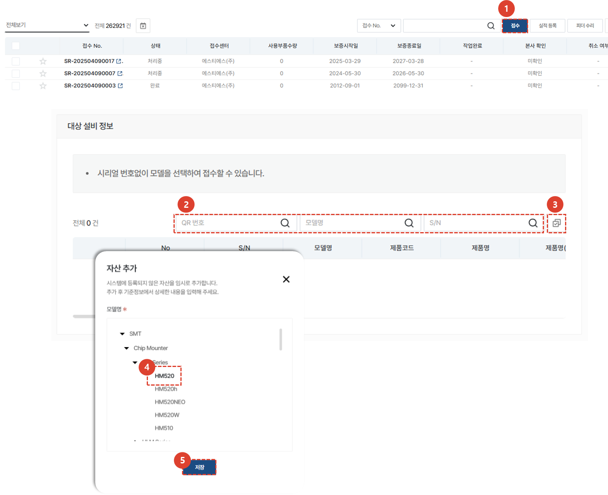

# 서비스 접수

고객사의 요청에 따라 서비스를 접수하고 처리하기 위한 절차를 안내합니다.

## 서비스 목록

1. **서비스 주문** 을 선택합니다.
1. 모든 서비스 목록이 표시됩니다.
      - 처리중 : 처리중인 서비스 개수를 나타냅니다. 클릭 시 처리중인 리스트만 목록에 보여집니다. 
      - 완료 : 완료처리된 서비스 개수를 나타냅니다. 클릭시 완료된 리스트만 목록에 보여집니다.
      - 취소 : 취소된 서비스 개수를 나타냅니다. 클릭시 취소된 리스트만 목록에 보여집니다.
      - 종결 : 서비스 접수 후 정상적인 프로세스로 처리되지 않고 종결 처리된 서비스 개수를 나타냅니다. 클릭시 종결된 리스트만 목록에 보여집니다. '
1. 접수 : 일반적인 서비스 접수를 등록 할 수 있습니다. 
      - 접수만 먼저 등록하거나, 접수를 받아 등록하는 관리자가 별도로 있는 경우 사용하기 적합합니다. 
1. 실적등록 : 서비스 접수부터 처리 내용까지 한번에 입력이 가능합니다.   
      - 서비스 작업까지 완료된 후 접수 및 작업내용을 한번에 입력해야 할 경우 사용하기 적합합니다. 
1. 피더수리 : 피더와 같이 여러 부품에 대한 서비스 이력을 입력해야 할 경우 진행합니다. **접수** 및 **실적등록** 과 달리 이동/작업/식사로 인한 소요시간추가를 하지 않고 **접수일자**와 **조치일자**만 입력하여 서비스를 등록합니다. 

## 서비스 접수 - 1/4

1. **접수**를 선택합니다.
1. 대상 설비 정보 탭의 **자산추가** 를 선택하여 해당하는 자산을 클릭합니다. 
1. 저장을 눌러 해당 자산을 반영합니다. 

## 서비스 접수 - 2/4

1. **선택**을 눌러 고객사 정보를 등록합니다. 
    :::note
    서비스 대상 설비 또는 자산 검색을 선행하지 않으면, 고객사 등록이 불가합니다.
    :::
1. 고객사 명을 검색하여 저장합니다.
1. **선택**을 눌러 고객사의 담당자를 설정합니다. 

## 서비스 접수 - 3/4

1. 문의내용을 입력합니다. 
1. **추가**를 클릭하여 첨부파일을 추가 할 수 있습니다. 
1. 접수일자는 접수 시점으로 자동 입력됩니다. 변경이 필요할 경우 클릭하여 변경 할 수 있습니다. 
1. 방문 희망 날짜를 선택합니다. 
1. 해당 서비스와 관련된 서비스 번호를 입력 할 수 있습니다. 
    :::note
    참조 번호는 대리점에서 관리하는 번호를 입력하는 탭 입니다.
    :::

## 서비스 접수 - 4/4

1. 담당 엔지니어를 배정하기 위해 **배정**을 선택합니다.
    :::note
    담당 엔지니어의 기본값은 접수자 입니다.
    접수자 본인이 엔지니어로 배정될 경우, 별도의 선택이 필요하지 않습니다. 
    :::
1. **저장**을 클릭하여 엔지니어를 배정합니다. 
1. **접수**를 클릭하여 서비스 접수를 완료합니다. 
    :::note
    
    접수 화면 하단에 서비스 접수를 위한 필수값이 안내되며, 필수값이 입력되지 않을 경우 **접수** 버튼이 비활성화됩니다. 
    :::

## 서비스 처리

1. 서비스 처리 내용을 입력할 서비스의 **접수 No.**를 선택합니다. 

### 서비스 처리 - 1/5

:::note
서비스 접수 시 등록한 데이터를 확인 및 수정할 수 있습니다. 
- 해당 서비스의 진행 현황이 프로세스 바에 나타납니다. 
- **1**  서비스 종결 : 해당 서비스를 정상적인 프로세스로 완료시키지 않고 중단해야하는 특수한 경우 선택하여 종결처리 합니다. 
- **2**  견적서 관리 : 서비스 진행을 위해 입력된 비용에 대한 견적서를 생성하거나 작성된 견적서를 확인 할 수 있습니다.
- **3**  VOC 생성 : 해당 서비스와 관련하여 VOC가 발생 할 경우 **VOC생성** 버튼을 클릭하여 등록 할 수 있습니다. 
:::

1. 사용한 부품 코드를 **입력**합니다.
1. **조회** 버튼을 클릭합니다. 
    :::note
    부품 코드가 시스템상 등록되어 있는 경우, 부품명, 단가가 자동 입력됩니다. 
    그렇지 않은 경우 **구분** 탭에 원인이 표시되며, 필요한 경우 데이터를 직접 입력 할 수 있습니다. 
    :::
1. **추가**를 클릭하여 부품을 등록합니다. 

1. 부품이 정상적으로 등록되었는지 확인합니다. 

### 서비스 처리 - 2/5

1. 해당하는 서비스 구분을 선택합니다. 
1. 고장모듈 및 상세한 고장부위를 선택합니다. 
1. 고장 유형 및 현상을 선택합니다. 
1. 조치 유형 및 작업 내용을 선택합니다. 
1. 서비스 상세 내역을 자세히 작성합니다. 

### 서비스 처리 - 3/5

1. 서비스를 진행하며 HW 변경이나 SW 업그레이드가 이루어진 경우, 버전 관리를 위해 버전 정보를 입력 할 수 있습니다. 
**조회**를 눌러 해당되는 버전을 선택합니다. 
    :::note
    설비의 QR코드를 인식하여 설비의 데이터를 서비스CRM과 연동시킬 경우, 해당 데이터가 보여집니다.
    :::
1. 추가 버튼을 눌러 첨부파일입력이 필요할 경우 입력합니다. 
1. 저장 버튼을 눌러 조치 내용을 저장합니다. 

### 서비스 처리 -3/5

서비스 작업에 대한 소요 시간을 입력합니다. 
1. **+** 를 클릭합니다. 
1. 엔지니어를 선택합니다. 
1. 소요된 시간의 구분을 선택합니다. 
1. 시작일 및 종료일을 입력합니다. 
1. **저장**을 클릭하여 소요시간이 정상적으로 등록되었는지 확인합니다. 
    :::note
    

    **버튼**을 클릭하여 소요시간 입력 시 팝업창을 닫지 않고 임시저장 할 수 있습니다. 
    :::
1. 추가 버튼을 눌러 첨부파일입력이 필요할 경우 입력합니다. 
1. 저장 버튼을 눌러 조치 내용을 저장합니다. 

### 서비스 처리 -4/5

서비스 작업시 발생한 청구금액을 작성합니다. 
1. 입력된 금액을 확인합니다. 
1. 최종금액의 수정이 필요한 경우 **할인가로 수정**을 선택하여 청구 금액을 수정합니다. 
1. **저장**을 선택하여 서비스 금액 작성을 완료합니다. 
    :::note
    청구금액에 저장된 금액을 기준으로 견적서 발행이 가능합니다.
    :::
1. **최종 확인 페이지로 이동**을 선택하여 서비스처리에 대한 내용 입력을 완료합니다. 

### 서비스 처리 -5/5

작성된 서비스 내용을 최종 확인하고 고객 검수자의 확인을 받아 완료를 진행하는 페이지 입니다. 
1. 작성된 내용을 확인합니다. 

1. 고객사 검수자를 선택합니다.
1. 검수 일자를 선택합니다. 
    :::note
    **디지털 서명의 효럭이 없거나** 디지털 서명이 여의치 않은 경우, 서명을 대체할 첨부파일을 입력해야 합니다. 
    **검수 파일 업로드** 탭에서 파일을 추가해주세요.
     :::
1. **저장**을 누릅니다. 

1. 고객사 검수자의 이름을 확인하고 수정이 필요할 경우 **취소**를 클릭하여 수정합니다. 
    고객사 검수자의 이름이 맞다면 **확인**을 클릭합니다. 
1. 고객사 검수자의 서명을 받습니다. 
1. **확인**을 눌러 최종확인을 완료합니다. 
    :::note
    
    최종확인이 완료된 서비스 건의 상태는 **완료**로 변경됩니다. 
     :::