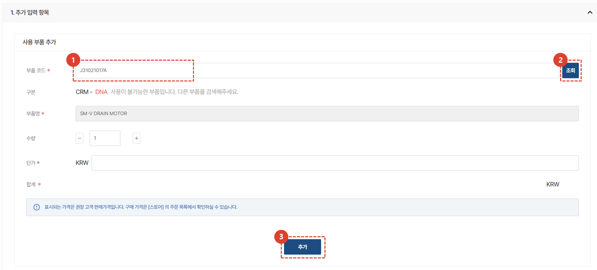
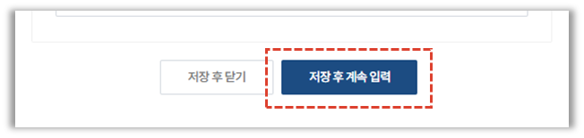
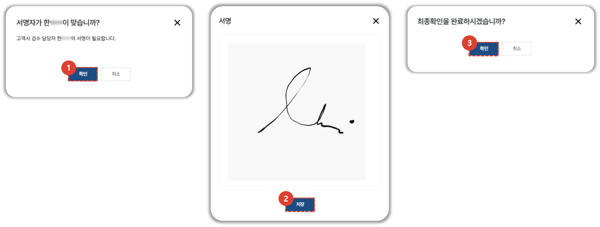

import ValidateTextByToken from "/src/utils/getQueryString.js";
import StrongTextParser from "/src/utils/textParser.js";
import text from "/src/locale/ko/SMT/tutorial-01-auth/create-a-acount-circle-user.json";
import SWUpdate from "./img/024.png";
import Report from "./img/026.png";
import Estimate from "./img/027.png";

# 서비스 처리

서비스 주문에대한 처리 방법을 안내합니다.

<ValidateTextByToken dispTargetViewer={true} dispCaution={false} validTokenList={['head', 'branch', 'agent']}>

1. 서비스 처리 내용을 입력할 서비스의 **접수 No.**를 선택합니다. 

## 서비스 처리 - 기본정보

1. **리포트 열람** : 서비스 처리가 **완료** 상태로 변경될 경우, **리포트 열람** 버튼이 생성되어 서비스 리포트를 다운로드받을 수 있습니다.
    :::info
        아래 그림과 같은 양식의 서비스 리포트가 생성됩니다.  
        

    :::
1. **만족도 조사** : 서비스를 받은 담당자에게 SMS 혹은 Email로 서비스 만족도 조사 링크를 보낼 수 있습니다. 
1. **견적서 관리** : 서비스 견적서를 생성하거나, 기존 견적서를 복사하여 활용 할 수 있습니다.
    :::info
        **+** 버튼을 클릭하여 견적서를 추가 할 수 있습니다.
        

    :::
1. **VOC 생성** : 서비스 처리 중 발생하는 VOC를 바로 등록 할 수 있습니다. 등록된 VOC의 진행 현황은 **VOC 생성** 버튼 하단에 표시되어 확인 할 수 있습니다. 
1. **만족도 조사 발송 정보** : 만족도 조사 버튼을 선택한 경우, 발송 정보가 나타납니다. 
1. **작업 완료(지급 요청)** : 서비스 작업이 완료된 경우, 클릭하여 완료 처리를 진행하고 대금 지급 요청을 진행합니다. 작업 완료가 체크되면 정보 수정이 불가합니다.
1. **본사 확인** : 작업 완료 처리된 항목의 경우, 본사 확인을 할 수 있습니다. 
    :::warning
        일부 지역의 경우(예 : 중국), 본사확인까지 완료되어야 **무상자재 출고가 가능**합니다.  
    :::

## 서비스 처리 - 설비정보 변경

1. 서비스 대상 설비 정보의 수정이 필요한 경우, **변경** 버튼을 눌러 수정합니다.
1. **저장** 버튼을 클릭하여 설비 정보 수정을 완료합니다. 
1. 서비스 처리를 위한 참고 자료를 **추가** 버튼을 클릭하여 추가합니다. 
1. **저장** 버튼을 클릭하여 첨부파일 추가를 완료합니다. 

## 서비스 처리 - 문의내용 수정 및 출동 관리

1. 서비스 문의 내용 수정이 필요한 경우, 수정 후 **저장**버튼을 클릭합니다. 
1. 출동을 진행 할 엔지니어 목록을 수정할 수 있습니다. 
1. 엔지니어 추가 혹은 삭제 후 **저장** 버튼을 클릭합니다.

## 서비스 처리 - 서비스 이력

1. **서비스 이력**이 표시됩니다. 접수일자, 접수번호, S/N, 접수내용, 조치내역, 서비스 구분(상세), 무상서비스 구분, 배정 엔지니어, 방문 예정일, 조치일자 고객담당자 및 고객사 명을 확인 할 수 있습니다. 
1. **예방활동 이력**이 표시됩니다.  S/N, 고객사, 유형, 담당센터, 조치여부, 조치자 및 조치일자를 확인 할 수 있습니다.
1. **보유 자산 목록**이 표시됩니다.  S/N, 담당 센터명, 모델명, 제품코드, 제품명, 보증시작일 및 종료일, 수주번호를 확인 할 수 있습니다.

## 서비스 처리 - 사용 부품 추가

1. 사용한 부품 코드를 **입력**합니다.
1. **조회** 버튼을 클릭합니다. 
    :::note
    부품 코드가 시스템상 등록되어 있는 경우, 부품명, 단가가 자동 입력됩니다. 
    그렇지 않은 경우 **구분** 탭에 원인이 표시되며, 필요한 경우 데이터를 직접 입력 할 수 있습니다. 
    :::
    :::info
    **SA** : 서비스가 가능한 상태
     **DNA** : 신규 출고가 불가한 단종 부품이지만, 보유한 재고가 있으면 재고 사용은 가능한 부품 
     **SNA** : 재고가 있어도 서비스 목적으로 판매가 중단된 부품
    :::
1. **추가**를 클릭하여 부품을 등록합니다. 

1. 부품이 정상적으로 등록되었는지 확인합니다. 

## 서비스 처리 - 조치 및 확인 1/2

1. 해당하는 서비스 구분을 선택합니다. 
1. 고장모듈 및 상세한 고장부위를 선택합니다. 
1. 고장 유형 및 현상을 선택합니다. 
1. 조치 유형 및 작업 내용을 선택합니다. 
1. 서비스 상세 내역을 자세히 작성합니다. 

## 서비스 처리 - 조치 및 확인 2/2

1. 서비스를 진행하며 HW 변경이나 SW 업그레이드가 이루어진 경우, 버전 관리를 위해 버전 정보를 입력 할 수 있습니다. 
**조회**를 눌러 해당되는 버전을 선택합니다. 
    :::info
    

     설비의 QR코드를 인식하면, 인식한 휴대폰에서 위 그림과 같이 SW 정보를 최근 등록한 서비스 오더에 반영하겠냐는 팝업창을 확인 할 수 있습니다.
    **확인** 버튼 클릭 시, 해당 데이터가 자동 등록됩니다.
    :::
1. 추가 버튼을 눌러 첨부파일입력이 필요할 경우 입력합니다. 
    :::warning
    서비스간에 발생한 결과물이나 고장부위 사진, 영상 등 작업과 관련된 파일을 첨부해주세요.
     [**고객 검수자의 서명 대체 파일을 넣는 부분은 서비스 처리 - 6/6을 참고해주세요.**](#서비스-처리---66)
    :::
1. 저장 버튼을 눌러 조치 내용을 저장합니다. 

## 서비스 처리 - 작업 시간 입력

서비스 작업에 대한 소요 시간을 입력합니다. 
1. **+** 를 클릭합니다. 
1. 엔지니어를 선택합니다. 
1. 소요된 시간의 구분을 선택합니다. 
1. 시작일 및 종료일을 입력합니다. 
1. **저장**을 클릭하여 소요시간이 정상적으로 등록되었는지 확인합니다. 
    :::note
    
    **버튼**을 클릭하여 소요시간 입력 시 팝업창을 닫지 않고 임시저장 할 수 있습니다. 
    :::
1. 추가 버튼을 눌러 첨부파일입력이 필요할 경우 입력합니다. 
1. 저장 버튼을 눌러 조치 내용을 저장합니다. 

## 서비스 처리 - 명세/인보이스

서비스 작업시 발생한 청구금액을 작성합니다. 
1. 입력된 금액을 확인합니다. 
1. 최종금액의 수정이 필요한 경우 **할인가로 수정**을 선택하여 청구 금액을 수정합니다. 
1. **저장**을 선택하여 서비스 금액 작성을 완료합니다. 
    :::note
    청구금액에 저장된 금액을 기준으로 견적서 발행이 가능합니다.
    :::
1. **최종 확인 페이지로 이동**을 선택하여 서비스처리에 대한 내용 입력을 완료합니다. 

## 서비스 처리 - 최종 확인

작성된 서비스 내용을 최종 확인하고 고객 검수자의 확인을 받아 완료를 진행하는 페이지 입니다. 
1. 작성된 내용을 확인합니다. 

1. 고객사 검수자를 선택합니다.
1. 검수 일자를 선택합니다. 
    :::warning
    **디지털 서명의 효럭이 없거나** 디지털 서명이 여의치 않은 경우, 서명을 대체할 첨부파일을 입력해야 합니다. 
    **검수 파일 업로드** 탭에서 파일을 추가해주세요.
     :::
1. **저장**을 누릅니다. 

1. 고객사 검수자의 이름을 확인하고 수정이 필요할 경우 **취소**를 클릭하여 수정합니다. 
    고객사 검수자의 이름이 맞다면 **확인**을 클릭합니다. 
1. 고객사 검수자의 서명을 받습니다. 
1. **확인**을 눌러 최종확인을 완료합니다. 
    :::info
    
    최종확인이 완료된 서비스 건의 상태는 **완료**로 변경됩니다. 
     :::

</ValidateTextByToken>