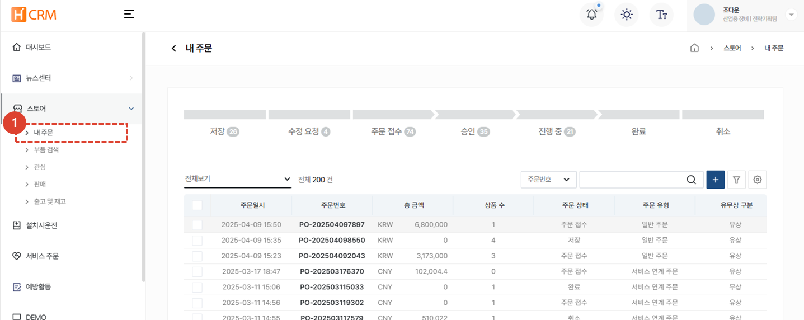
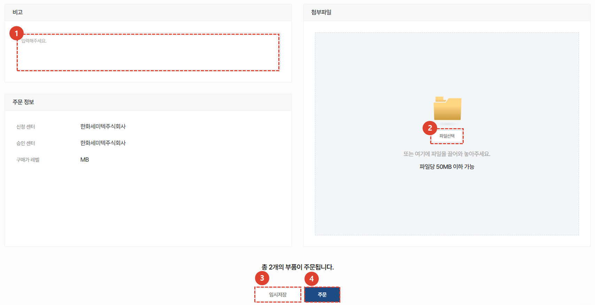
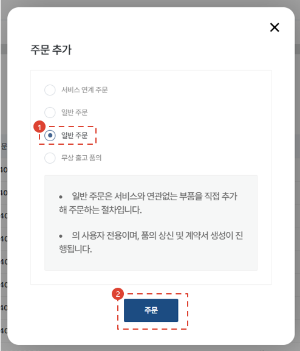
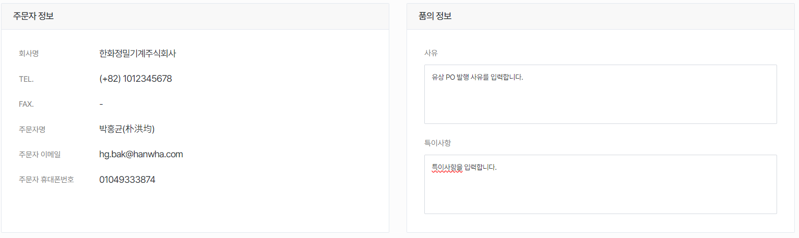
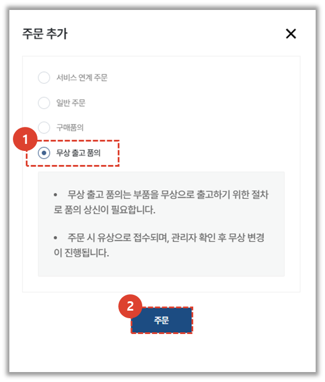
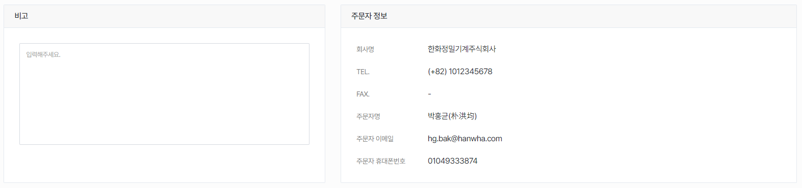
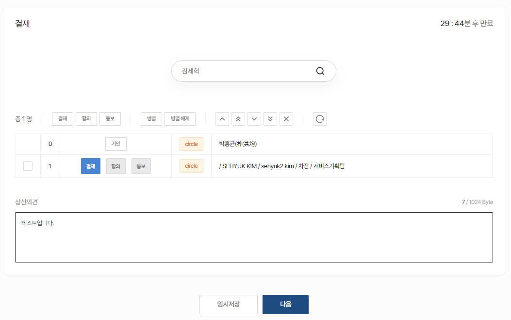

import ValidateTextByToken from "/src/utils/getQueryString.js";
import StrongTextParser from "/src/utils/textParser.js";
import text from "/src/locale/ko/SMT/tutorial-03-store/01-create-order-buyer.json";

# 주문서 작성

구매하고자 하는 서비스 부품의 주문서 작성 절차에 대해 안내합니다.

<ValidateTextByToken dispTargetViewer={true} dispCaution={false} validTokenList={['head', 'branch', 'agent']} ></ValidateTextByToken>

## 주문서 목록

<ValidateTextByToken dispTargetViewer={false} validTokenList={['head', 'branch', 'agent']}>

1. <StrongTextParser text={text.list01} />
1. <StrongTextParser text={text.list02} />

</ValidateTextByToken>

## 주문서 목록 - 주문서 상태

<ValidateTextByToken dispTargetViewer={false} validTokenList={['head', 'branch', 'agent']}>

- 저장: 주문서가 임시저장된 상태입니다.
- 수정 요청: 판매자가 주문자에게 수정할 것을 요청한 상태의 주문서입니다.
- 주문 접수: 주문자가 주문서를 생성하여 판매자에게 접수된 상태의 주문서입니다.
- 승인: 판매자에 의해 승인된 상태의 주문서입니다.
- 진행중: 승인된 주문서가 주문자에게 납품되는 중에 있는 상태의 주문서입니다.
- 완료: 주문자에게 납품이 완료된 상태의 주문서입니다.
- 취소: 주문자에 의해 취소된 상태의 주문서입니다.

</ValidateTextByToken>

## 주문서 생성

<ValidateTextByToken dispTargetViewer={false} validTokenList={['head', 'branch', 'agent']}>

1. **+** 버튼을 눌러 주문서를 생성합니다.
1. 4가지 유형의 주문서 생성 방식 중에서 1가지를 선택합니다.
    - 서비스 연계주문 : 서비스 주문서에 사용된 부품을 주문시 (특히 무상자재 요청시) 활용합니다.
    - 일반주문(1번째): 일반 유상 PO 생성 시 사용합니다.
    - 일반주문(2번쨰): 법인사용자를 위한 메뉴입니다. 법인의 유상 PO 생성시 사용하는 메뉴입니다.
    - 무상출고: (본사전용) 서클에서 작성하는 일반적인 무상출고 품의를 CRM에서 생성하는 것으로 생각해주시면 됩니다.
1. 유형을 선택 후 **주문** 버튼을 클릭합니다.

</ValidateTextByToken>

## 주문서 생성 - 서비스 연계 주문 🚧

<ValidateTextByToken dispTargetViewer={false} validTokenList={['head', 'branch', 'agent']}>

**서비스주문/설치시운전 프로젝트**에서 사용된 부품에 대한 유/무상 주문서를 생성합니다

:::note
TBD
:::

### 서비스 주문 불러오기 🚧
:::note
TBD
:::

</ValidateTextByToken>

## 주문서 생성 - 일반 주문(유상PO)

<ValidateTextByToken dispTargetViewer={false} validTokenList={['head', 'branch', 'agent']}>

일반적인 유상 서비스 부품 주문서를 생성하는 메뉴입니다.

### 주문할 부품 추가

1. 부품코드를 검색해서 PO 신청 부품을 추가할 수 있습니다.
    -  → 정상적으로 검색됨
    -  → 정상적으로 검색지 않음 **(진행 불가)**
1. 수량을 입력합니다
1. 신청할 부품과 관련된 특이사항을 입력합니다. 
1. **추가** 버튼을 누르면 추가됩니다.
1. 엑셀로 일괄 업로드가 가능합니다.
1. 엑셀 양식을 받을 수 있습니다.
1. 업로드 결과를 확인 후 **적용** 버튼을 누릅니다.

### 주문 목록 확인

1. 상태 열의 값이 SNA/DNA 인 경우 주문서 진행이 불가합니다. 
    - 상태가 **정보없음** 인 경우 자재 담당자의 업데이트가 아직 안된 것으로 판단하여 진행이 가능하도록 하였습니다.
1. SNA/DNA의 경우 개선품을 확인할 수 있습니다. **(TBD)**
1. 주문수량을 확인하고 **더블 클릭** 하여 수정할 수 있습니다.
1. 비고란을 더블클릭하여 수정할 수 있습니다.
1. **판매자 센터**의 재고 수량을 확인할 수 있습니다.

### 추가 정보 입력 및 주문서 생성

1. 주문서의 전체적인 비고사항을 입력합니다.
1. 첨부파일이 있는 경우 파일을 추가합니다.
1. 주문서가 확정적이지 않은경우 임시 저장을 누릅니다. 

:::note
임시저장상태에서 판매자와 소통이 가능합니다. 
예시: 부품확정을 하기 어려운 경우 구매할 부품을 확정하기 위해, 개설된 구매자-판매자 간의 소통창구를 활용할 수 있음 
[대화하기](#주문서-생성---일반-주문---임시저장-시)의 4번 절차를 참고해주세요.
:::

4. 주문서를 생성하려면 **주문** 버튼을 누릅니다.

### 임시 저장

1. 임시저장된 주문서의 경우, 목록에서 **저장** 단계에 머무르게 됩니다.
1. 저장된 주문서를 확인할 수 있습니다.
1. 주문 목록과 비고란은 수정할 수 없습니다. 수정하기 위해서는 하단의 **수정** 버튼을 누릅니다.
1. 판매자와 소통을 위한 메시지를 입력합니다.
1. 주문정보가 표시됩니다.
1. 임시저장된 주문서를 주문처리하기 위해서는 **수정**버튼을 누른 뒤 보이는 수정페이지에서 **주문**버튼을 누릅니다.

### 주문 완료

1. 주문을 완료한 주문서의 경우, 목록에서 **주문접수** 단계에 머무르게 됩니다.
1. 주문서를 확인할 수 있습니다.
1. 판매자와 소통을 위한 메시지를 입력합니다.
1. 판매자의 주문서 승인처리 전까지는 주문서를 수정할 수 있습니다.
1. 판매자의 주문서 승인처리 전까지는 주문서를 취소할 수 있습니다.

:::note
- 판매자의 주문서 승인처리 전까지는 주문서를 수정할 수 있습니다.
- 판매자의 주문서 승인처리 전까지는 주문서를 취소할 수 있습니다.
:::

</ValidateTextByToken>

## 주문서 생성 - 일반주문(유상 PO / 법인용)

<ValidateTextByToken dispTargetViewer={false} validTokenList={['head', 'branch']}>

:::info
기존의 서클에서 발행하던 유상 PO 품의를 CRM에서 생성하는 것을 추천합니다.  
간소해진 CRM에서의 유상 PO 품의 절차에 대해 안내합니다.
:::

[주문서 생성](#주문서-생성) 페이지에서 시작합니다.

1. 세번째 [일반주문] 버튼을 클릭합니다.
1. [주문] 버튼을 클릭합니다.
 
### 주문 부품 등록하기

1. 부품코드를 검색해서 PO 신청 부품을 추가할 수 있습니다.
    -  → 정상적으로 검색됨
    -  → 정상적으로 검색지 않음 **(진행 불가)**
1. 수량을 입력합니다
1. 신청할 부품과 관련된 특이사항을 입력합니다. 
    - 비고1: 주로 관련 문서, 부품 특이사항 등을 입력합니다.
    - 비고2: 주로 배송지와 관련된 내용을 입력합니다.
1. **추가** 버튼을 누르면 추가됩니다.
1. 엑셀로 일괄 업로드가 가능합니다.
1. 엑셀 양식을 받을 수 있습니다.
1. 엑셀 파일을 첨부합니다.
1. 업로드 결과를 확인 후 **적용** 버튼을 누릅니다.

### 주문 목록 확인

1. 상태 열의 값이 SNA/DNA 인 경우 주문서 진행이 불가합니다. 
    - 상태가 **정보없음** 인 경우 자재 담당자의 업데이트가 아직 안된 것으로 판단하여 진행이 가능하도록 하였습니다.
1. SNA/DNA의 경우 개선품을 확인할 수 있습니다. **(TBD)**
1. 주문수량을 확인하고 **더블 클릭** 하여 수정할 수 있습니다.
1. 비고란을 더블클릭하여 수정할 수 있습니다.
1. **판매자 센터**의 재고 수량을 확인할 수 있습니다.

### 유상PO 품의 기본정보 확인

- 주문자(기안자) 정보를 확인합니다.
- PO 발행사유 및 특이사항을 입력합니다.

1. 첨부파일을 첨부합니다.
1. 계약서 정보에 입력될 텍스트를 입력합니다.
    - 입력된 정보는 아래와 같이 문서 생성에 사용됩니다.  
        :::note
        문서는 PDF 형식으로 출력됩니다.
        :::
1. [임시 저장] 또는 [다음] 버튼을 누릅니다.

### 품의 상신 (서클 결재)

1. 결재선을 검색합니다.(서클사용자들이 검색됩니다.)
1. 품의 상신 의견을 입력합니다.
1. [다음] 버튼을 눌러 결재문서를 서클로 전송합니다.
    :::warning
    [임시저장] 버튼은 동작하지 않습니다. [이전] 버튼으로 대체될 예정입니다.
    :::

</ValidateTextByToken>

## 주문서 생성 - 무상출고품의(본사용)

<ValidateTextByToken dispTargetViewer={false} validTokenList={['head', 'branch']}>

:::info
기존의 서클에서 발행하던 무상출고품의를 CRM에서 생성하는 것을 추천합니다.  
간소해진 CRM에서의 무상출고품의 절차에 대해 안내합니다.
:::

[주문서 생성](#주문서-생성) 페이지에서 시작합니다.

1. 네번째 [무상출고품의]를 선택합니다.
1. [주문] 버튼을 누릅니다. 

### 주문할 부품 추가

1. 부품코드를 검색해서 PO 신청 부품을 추가할 수 있습니다.
    -  → 정상적으로 검색됨
    -  → 정상적으로 검색지 않음 **(진행 불가)**
1. 수량을 입력합니다
1. 신청할 부품과 관련된 특이사항을 입력합니다. 
1. **추가** 버튼을 누르면 추가됩니다.
1. 엑셀로 일괄 업로드가 가능합니다.
1. 엑셀 양식을 받을 수 있습니다.
1. 업로드 결과를 확인 후 **적용** 버튼을 누릅니다.

### 주문 부품 목록 확인

1. 원가는 더블클릭하여 수정이 가능합니다.
    :::note
        🚧 원가는 향후에 원가/판가 관리 CRM 모듈로부터 가져올 예정입니다.
    :::
1. 주문 수량과 비고란도 더블클릭하여 수정이 가능합니다.
1. 사내 시스템과 연동되어 주문자(기안자)의 **자재승인센터**의 재고, MOQ, L/T(Lead Time) 조회를 하실 수 있습니다.

### 기본사항 입력

- 비고란에 비고사항을 입력하고 주문자(기안자) 정보를 확인합니다.

### 추가정보 입력

1. 고객사 정보가 없으면 토글 버튼을 활성화합니다.
2. 고객사 정보를 [선택] 버튼을 눌러 불러옵니다. (필수값) - [고객사 선택 화면 보기](#추가정보-입력---고객사-선택-✨)
3. 고객사의 담당자 정보를 [선택] 버튼을 눌러 불러옵니다. (옵션값) - [고객담당자 선택 화면 보기](#추가정보-입력---고객담당자-선택-✨)

### 추가정보 입력 - 고객사 선택

1. 고객명을 입력하여 검색합니다.
1. [저장] 버튼을 누릅니다.

### 추가정보 입력 - 고객담당자 선택

1. 목록에 담당자 정보가 없는 경우 고객담당자 정보를 입력하여 등록합니다.
1. 목록에서 추가된 담당자를 선택합니다.

### 품의 작성

1. 품의 정보를 입력합니다.
2. 첨부파일이 있는 경우 파일을 첨부합니다.

### 품의 상신

1. 결재문서를 작성 후 [다음] 버튼을 눌러 품의를 상신합니다.

</ValidateTextByToken>