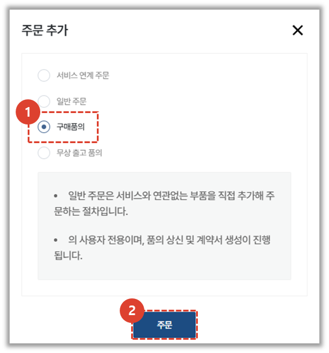
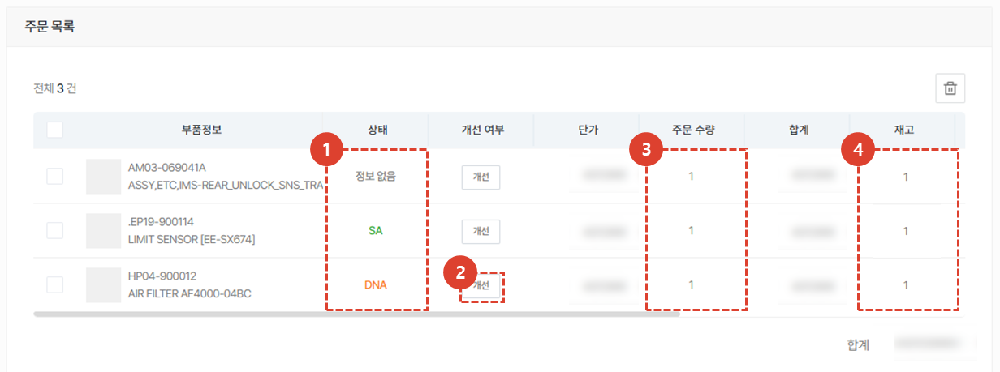
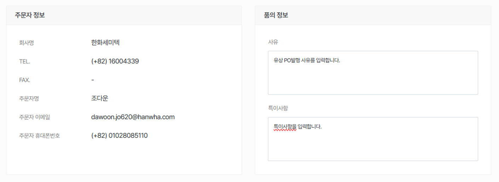
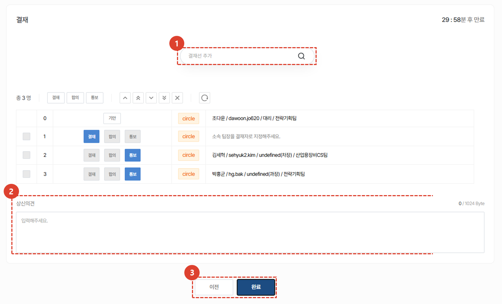

import ValidateTextByToken from "/src/utils/getQueryString.js";
import StrongTextParser from "/src/utils/textParser.js";
import text from "/src/locale/ko/SMT/tutorial-03-store/01-create-order-buyer.json";

# 주문서 작성 - 구매 품의

<ValidateTextByToken dispTargetViewer={false} validTokenList={['head', 'branch']}>
법인에서 본사로 부품 주문을 해야하는 경우 주로 사용합니다.  
기존의 서클에서 발행하던 유상 PO 품의를 CRM에서 생성 할 수 있습니다.
간소해진 CRM에서의 유상 PO 품의 절차를 확인하세요.
<ValidateTextByToken dispTargetViewer={true} dispCaution={false} validTokenList={['head', 'branch', 'agent']} ></ValidateTextByToken>
 
 

## 주문 추가

1. [구매품의] 버튼을 클릭합니다.
1. [주문] 버튼을 클릭합니다.
 
 

## 부품 추가

1. 부품코드를 검색해서 PO 신청 부품을 추가할 수 있습니다.
    :::info
     → 정상적으로 검색됨 
     → 정상적으로 검색지 않음 **(진행 불가)**
    :::
1. 수량을 입력합니다
1. 신청할 부품과 관련된 특이사항을 입력합니다. 
     예) 관련 문서, 부품 특이사항, 배송지 등
1. 고객명을 입력합니다.
1. **추가** 버튼을 누르면 추가됩니다.
1. 엑셀로 일괄 업로드가 가능합니다.
:::note

1. 엑셀 양식을 받을 수 있습니다. 
1. 엑셀에 데이터를 입력하여 파일을 추가합니다.  
    - (필수입력)**Parts Code** : 부품 코드를 입력합니다.
    - (필수입력)**Quantity** : 부품 갯수를 입력합니다. 
    - **Price** : 정가 외 판가로 판매를 진행 할 경우에만 Special Price를 입력합니다. **미 입력시 일반 판가가 자동 적용됩니다.**
    - **Remarks** : 비고 내용을 입력합니다. 
:::
 
 

## 주문 목록 확인 및 추가 정보 입력

1. 상태 열의 값이 SNA/DNA 인 경우 주문서 진행이 불가합니다. 
    - 상태가 **정보없음** 인 경우 자재 담당자의 업데이트가 아직 안된 것으로 판단하여 진행이 가능하도록 하였습니다.
1. SNA/DNA의 경우 개선품을 확인할 수 있습니다. **(TBD)**
1. 주문수량을 확인하고 **더블 클릭** 하여 수정할 수 있습니다.
1. **판매자 센터**의 재고 수량을 확인할 수 있습니다.
:::info
    목록 리스트에는 **부품정보**/**상태**/**개선 여부**/**단가**/**주문 수량**/**합계**/**재고** 뿐만 아니라
     **담당 센터**/**비고**/**MOQ** 그리고 **L/T**가 표시됩니다.
:::
 
 

## 유상PO 품의 기본정보 확인

- 주문자(기안자) 정보를 확인합니다.
- PO 발행사유 및 특이사항을 입력합니다.

1. 첨부파일을 첨부합니다.
1. 계약서 정보에 입력될 텍스트를 입력합니다.
    - 입력된 정보는 아래와 같이 문서 생성에 사용됩니다.  
        :::note
        문서는 PDF 형식으로 출력됩니다.
        :::
1. [임시 저장] 또는 [다음] 버튼을 누릅니다.
 
 

## 품의 상신 (서클 결재)

1. 결재선을 검색합니다.(서클사용자들이 검색됩니다.)
1. 품의 상신 의견을 입력합니다.
1. [완료] 버튼을 눌러 결재문서를 서클로 전송합니다.
</ValidateTextByToken>
