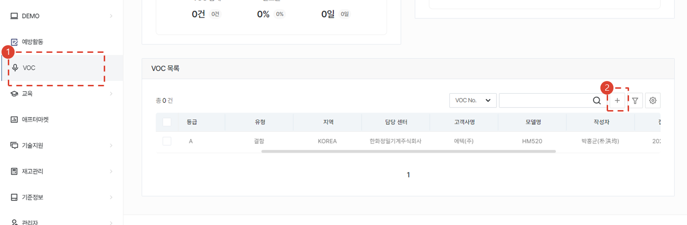
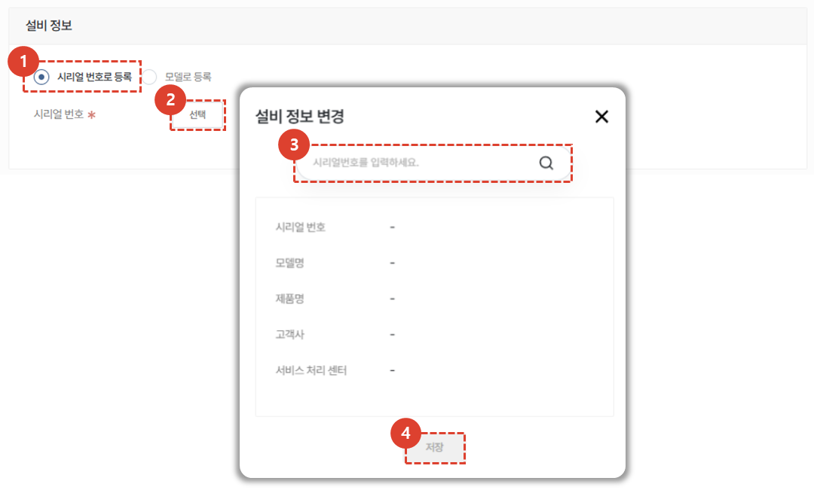
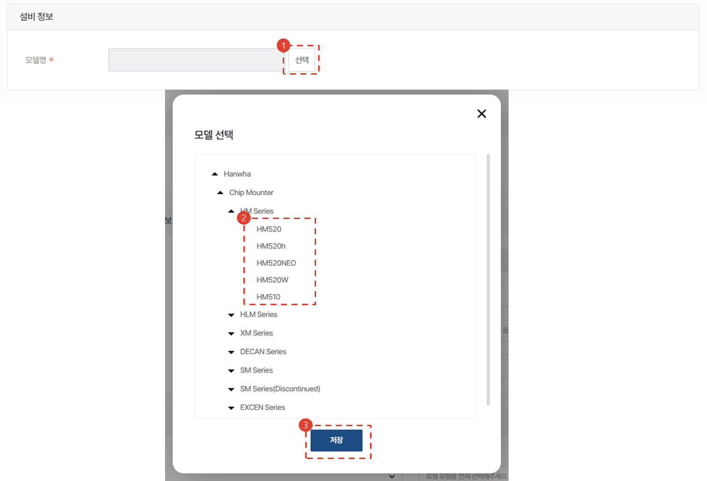
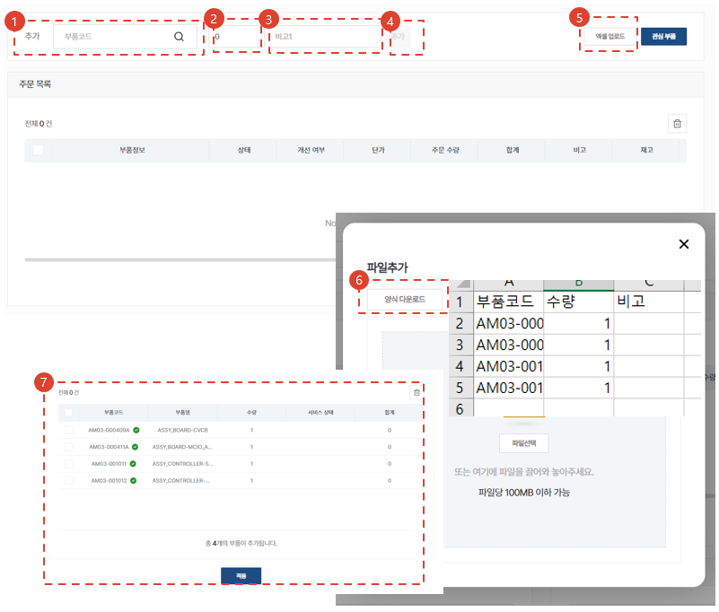
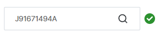
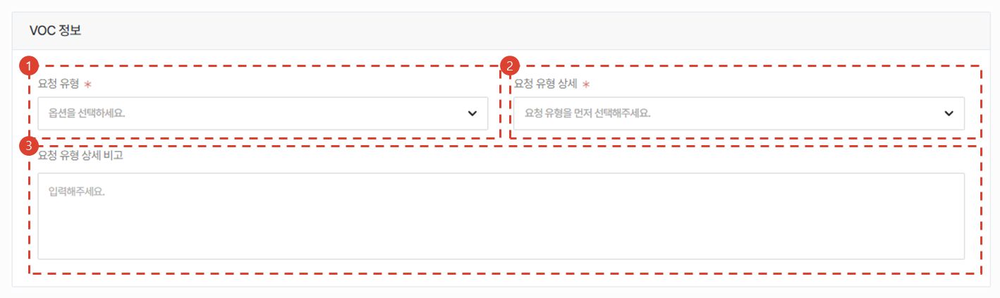
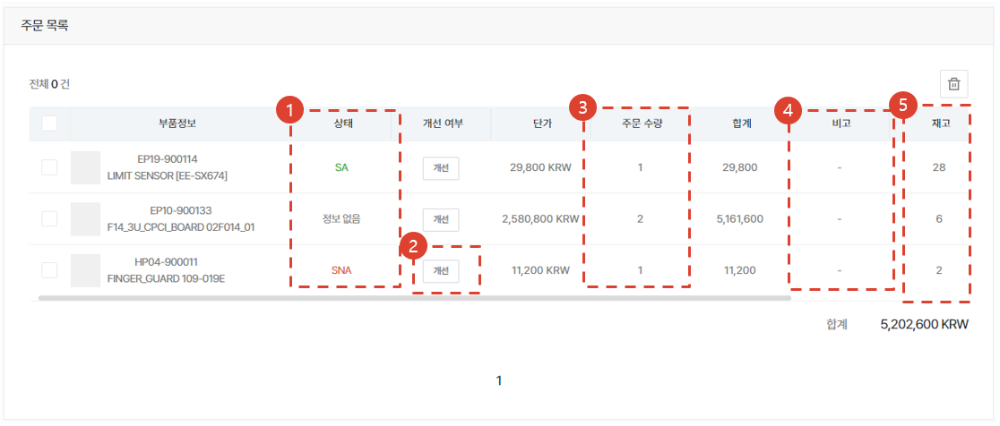
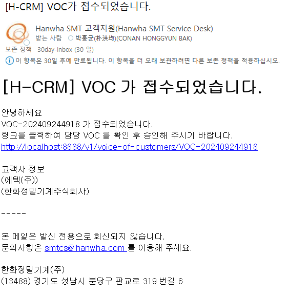
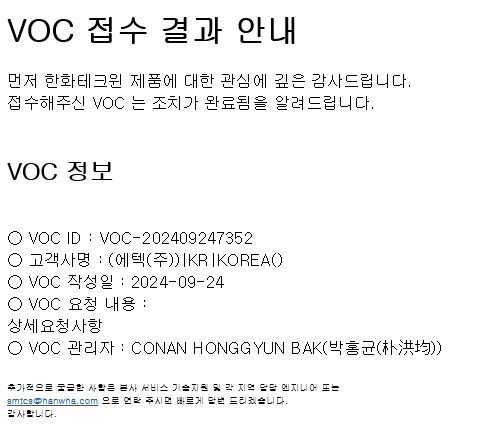

import ValidateTextByToken from "/src/utils/getQueryString.js";

# VOC 등록 및 결과 확인
고객의 요청에 의한 서비스 중 단순 서비스로 끝나지 않고 **본사의 협업이 필요한 중요 이슈**를 등록하는 절차에 대해 안내합니다. 
<ValidateTextByToken dispTargetViewer={true} dispCaution={true} validTokenList={['head', 'branch', 'seller', 'agent']}>

## VOC 목록

1. **VOC** 메뉴를 클릭합니다.
2. 하단의 VOC 목록에서 **+** 버튼을 클릭합니다.
 
 

## VOC 등록 - 설비 정보 입력
:::info
VOC 접수의 대상이 되는 설비 정보를 등록합니다. 설비 정보는 시리얼번호 또는 모델 선택으로 등록 할 수 있습니다. 
:::

### 시리얼 번호로 등록하기

1. 시리얼 번호로 등록을 클릭합니다. 
1. 선택 버튼을 눌러 시리얼 번호 입력 창을 띄웁니다. 
1. **시리얼 번호**를 입력합니다. 
1. **저장** 버튼을 클릭합니다. 
 
 

### 모델로 등록하기

1. 모델로 등록을 클릭합니다. 
1. 선택 버튼을 눌러 모델 선택 창을 오픈합니다.
1. 모델 트리의 가장 끝단의 **리프 모델** 중 해당하는 모델을 선택합니다.
    :::warning
      
    하위 모델을 가지고 있는 모델명 클릭하게 되면 에러가 발생합니다.
    :::
1. **저장** 버튼을 클릭합니다.
 
 

### 등록자 및 고객사 정보 입력
 
1. [선택] 버튼을 눌러 고객사를 등록합니다.
1. VOC 등록 고객사의 [국가] 를 선택합니다.
1. [지역] 을 선택합니다. **지표관리용**
 
 

### VOC 정보 입력
 
1. 유형을 선택합니다. 유형에는 아래 3가지의 유형이 있습니다.
    - 결함
    - 개선
    - 기타
1. 선택한 유형에 따라 상세 유형 항목을 선택합니다.
    - 결함
        - 고장성(H/W)
        - 고장성(S/W)
        - 제조불량
        - 인쇄/표기불량
        - ISV 결함
        - 운영S/W 결함
        - 제어S/W 결함
        - T/P 결함
        - 기구 결함
        - 제어기 결함
    - 개선
        - ISV 개선
        - 기타 개선
        - 서비스성 확보
        - SW 개선
        - 기구 개선
    - 기타
        - 기타
        - 영업 VOC
        - 품질 VOC
        - 개발 VOC
        - 서비스 VOC
 
 

### VOC 상세정보 입력 및 접수
 

1. 검토에 필요한 내용을 입력합니다.
    - 제목 및 구체적인 VOC 관련 내용을 입력합니다.
    - 요청하는 VOC 건의 완료 희망일자를 입력합니다.
    - 필요시 첨부파일을 추가합니다. 
1. **접수** 버튼을 클릭하여 VOC를 등록합니다.
 
 

### VOC 접수건 이메일 자동 발송
 
VOC 접수 완료와 동시에 관리자에게 이메일로 이미지와 같이 알림 메일이 발송됩니다.

## VOC 결과 확인
:::info
본사의 VOC 대응이 완료되면 아래와 같은 이메일이 수신되며, 이메일의 링크를 클릭하여 VOC 처리 내역을 조회 할 수 있습니다. 
:::

 

</ValidateTextByToken>