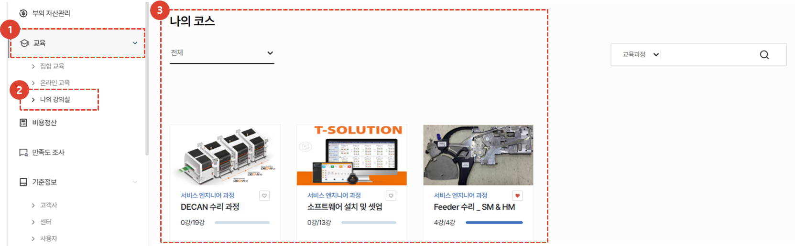
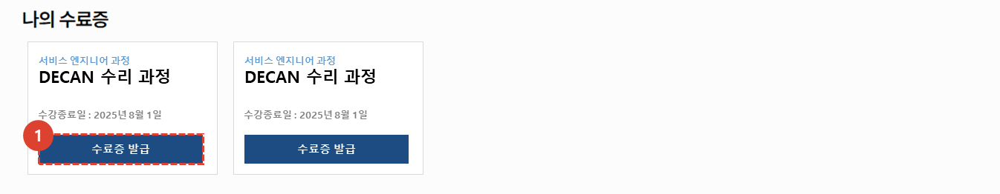
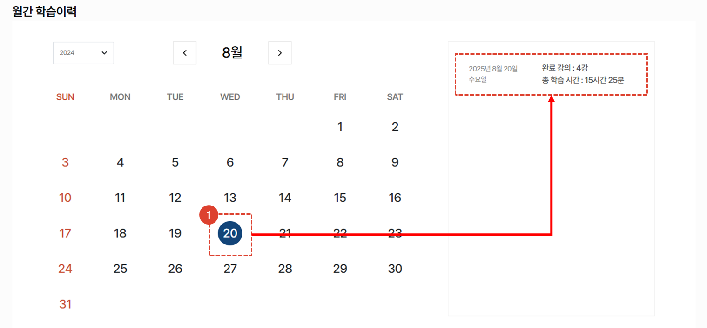
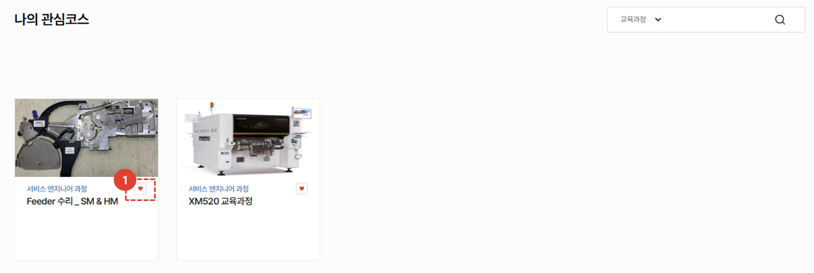
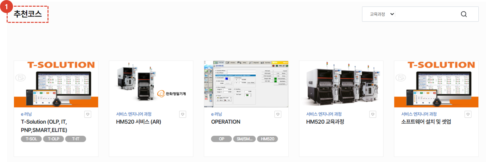

import ValidateTextByToken from "/src/utils/getQueryString.js";

# 나의 강의실
현재 수강중이거나 수강을 완료한 강의 내역을 확인하는 페이지에 대해 안내합니다. 

<ValidateTextByToken dispTargetViewer={true} dispCaution={false} validTokenList={['head', 'branch', 'seller', 'agent', 'customer']}>

## 나의 코스

1. **교육** 메뉴를 클릭합니다. 
1. **나의 강의실**을 클릭합니다. 
1. 현재 수강중인 **온라인 강의** 목록을 확인 할 수 있습니다.  강의를 클릭하여 영상을 수강할 수 있습니다. 
 
 

## 나의 수료증

1. 발급된 수료증 리스트를 확인 할 수 있습니다. **수료증 발급** 버튼을 클릭하여 다운로드 받을 수 있습니다. 
 
 

## 월간 학습이력

1. 월간 진행한 학습에 대해 완료 강의 갯수 및 총 학습 시간을 확인 할 수 있습니다.
 
 

## 나의 관심코스

1. **♡** 버튼이 클릭된 리스트입니다. 재 클릭시 나의 관심코스에서 해제됩니다. 
 
 

## 추천코스

1. 수강자와 관련된 **추천 코스**가 제공됩니다. 클릭하여 상세 페이지로 이동하고 수강신청 할 수 있습니다. 

</ValidateTextByToken>