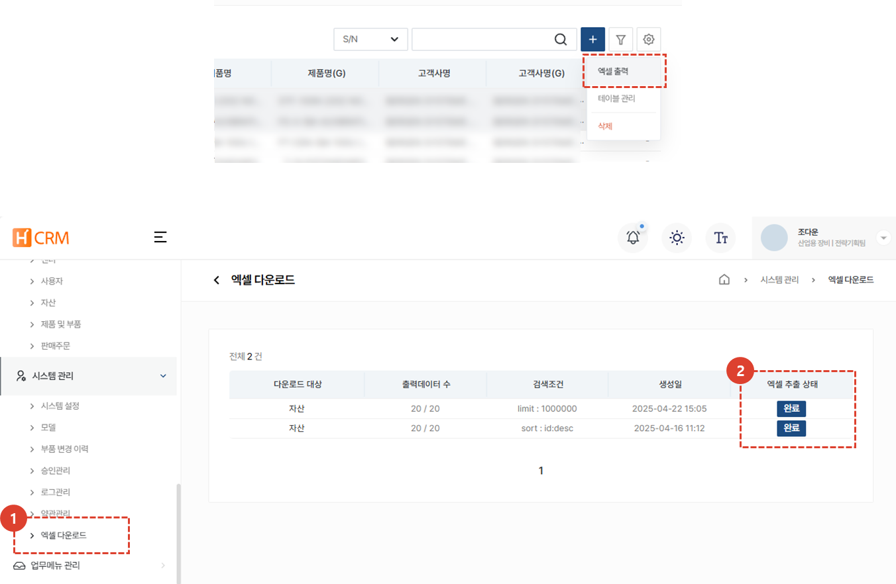

import ValidateTextByToken from "/src/utils/getQueryString.js";

# 엑셀 다운로드

H-CRM에서 엑셀로 추출한 리스트를 확인하고 다운로드 할 수 있습니다. 

<ValidateTextByToken dispTargetViewer={true} dispCaution={true} validTokenList={['head']}>

1. **시스템 관리** 탭의 **엑셀 다운로드**를 선택합니다. 서비스CRM 내에서 **엑셀 출력**을 클릭하여 추출한 내역을 확인할 수 있습니다.
1. 엑셀 추출 상태가 **완료** 로 되어있는 경우, 클릭하여하여 다운로드 할 수 있습니다.

</ValidateTextByToken>
