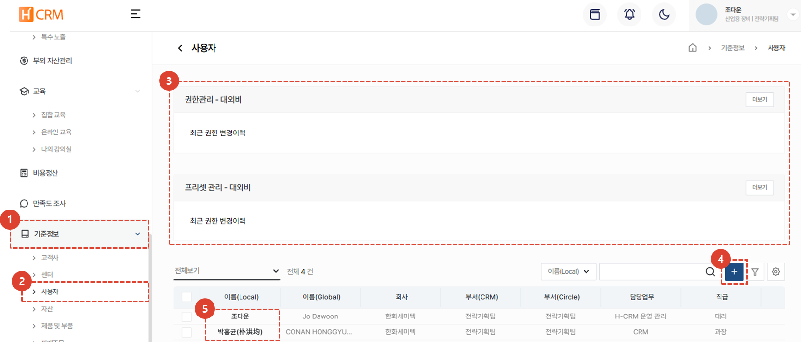
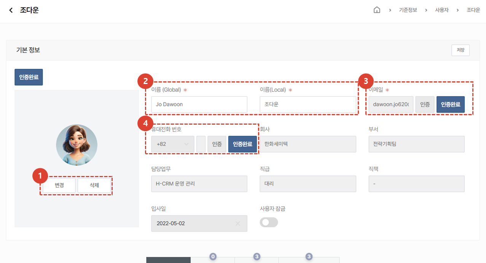
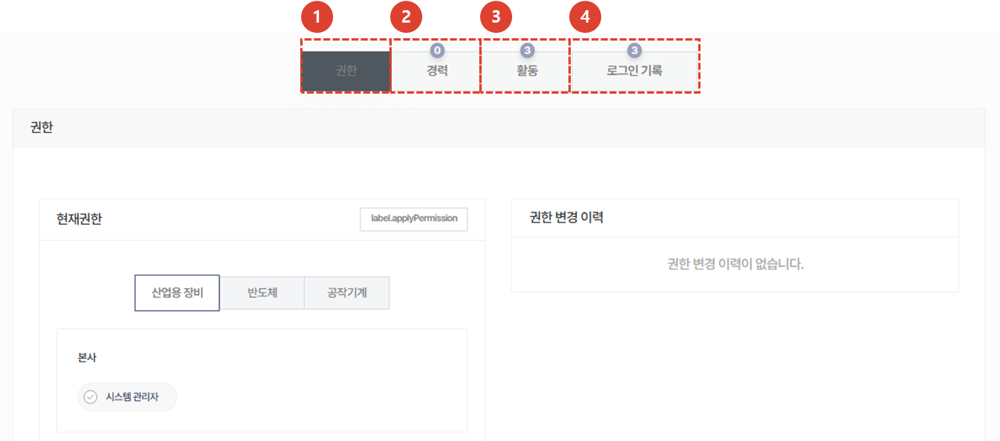

import ValidateTextByToken from "/src/utils/getQueryString.js";
import filterList from "./img/002.png";
import searchList from "./img/053.png";
import tableFilter from "./img/006.png";
import createLabor from "./img/013.png";
import filter2 from "./img/057.png";

# 사용자

H-CRM 사용자 계정 데이터 관리에 대한 안내입니다.

<ValidateTextByToken dispTargetViewer={true} dispCaution={true} validTokenList={['head']}>

## 목록

1. **기준정보** 메뉴를 클릭합니다. 
1. **사용자** 메뉴를 클릭하면 사용자 리스트를 확인 할 수 있습니다. 
1. 목록 필터링을 기준으로 데이터를 필터링 할 수 있습니다.
1. 전체 **제품 및 부품 데이터**의 개수를 표시합니다.
1. 검색어를 입력해서 원하는 데이터를 검색할 수 있습니다.
1. 상세 필터링 기능을 수행합니다.
    :::info
    

    1. 필터를 선택합니다. 
    1. 검색어를 입력합니다. 
    1. **+** 버튼을 클릭하여 검색 항목을 추가합니다. 
    1. **검색** 버튼을 클릭하여 결과를 확인합니다. 
    :::
1. 미리 설정된 데이터 목록의 커스텀 기능을 수행합니다.
    - **엑셀 출력**: 현재 필터링된 결과의 데이터 목록을 엑셀파일로 출력합니다.
    - **테이블 관리**: 테이블 보기 옵션을 설정합니다.
1. [사용자 상세 페이지](#상세-페이지)로 이동합니다.

 
 

## 상세 페이지
### 기본 정보

:::info
1~4번을 제외한 정보는 사용자의 직접 수정이 불가능합니다. 
:::
1. 사용자 프로필 사진을 변경/삭제할 수 있습니다.
1. 글로벌 지역 사용자들에게 표시될 사용자의 이름 및 현지 사용자들에게 표시될 사용자의 이름을 입력합니다.
    :::warning
        서클 사용자의 경우, 서클 메인페이지의 링크로 접속을 시도하는 경우 서클의 사용자 정보로 초기화됩니다.
    :::
1. 이메일 주소와 인증 상태를 표시합니다. **인증** 버튼을 클릭하여 이메일 주소의 재인증이 가능합니다. 
1. 휴대전화 번호와 인증 상태를 표시합니다. **인증** 버튼을 클릭하여 휴대전화 번호의 재인증이 가능합니다. 
 
 

### 추가 정보

:::info
사용자의 권한이나 입력된 경력, 활동 내역 및 로그인 기록 등 추가 정보 확인이 가능한 영역입니다. 
:::
1. **권한** 탭에서는 사용자에게 부여된 권한을 확인 할 수 있습니다. 권한 변경은 관리자에게 문의하여야 합니다. 
1. **경력** 탭에서 사용자의 근무 경력을 입력하여 관리할 수 있습니다. 경력 탭을 클릭한 뒤 **+** 버튼을 클릭하면 근무회사/담당업무/직책/근무 시작 및 종료일 등을 입력할 수 있습니다. 
1. (TBD) **활동** 탭은 사용자의 CRM 활동 내역이 나타날 예정입니다. 
1. 사용자의 CRM **로그인 기록**을 볼 수 있는 탭 입니다. 로그인 일시와 IP 및 로그인을 한 국가 정보를 확인 할 수 있습니다. 
</ValidateTextByToken>