import ValidateTextByToken from "/src/utils/getQueryString.js";
import filterList from "./img/002.png";
import searchList from "./img/053.png";
import tableFilter from "./img/006.png";
import createLabor from "./img/013.png";
import filter1 from "./img/097.png";
import filter2 from "./img/057.png";
import filter3 from "./img/099.png";
import filter4 from "./img/059.png";
import table1 from "./img/101.png";
import table2 from "./img/061.png";
import popup1 from "./img/097.png";

# 자산

자산 데이터 관리에 대한 안내입니다.

<ValidateTextByToken dispTargetViewer={true} dispCaution={true} validTokenList={['head', 'branch', 'seller', 'agent']}>

## 목록 페이지
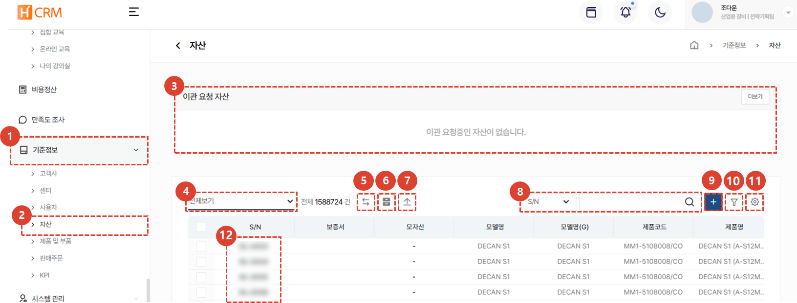
1. **기준정보** 메뉴를 클릭합니다. 
1. **자산** 메뉴 클릭 시 자산 데이터 목록이 나타납니다. 
    :::tip 
    대리점 사용자의 경우 주요 정보가 마스킹 처리 되어있는 **타 대리점의 자산도 목록에서 확인 가능**합니다.
    :::
1. 자산을 소유하던 고객사나 센터의 변경 요청이 있는 경우 [**이관 요청 자산**](#자산-이관)에 표시되며 관리자의 승인이 필요합니다. 
1. **목록 필터링**을 이용하여 특정 조건의 고객사만 표시할 수 있습니다. 
1. 자산을 소유하던 고객사나 센터의 변경이 필요한 경우 사용하는 **자산 이관** 버튼입니다. 
1. (대리점에만 해당)**타 대리점의 마스킹된 자산**을 보이거나 숨길 수 있습니다. 
1. **자산의 대량 업로드** 버튼입니다. 엑셀을 이용하여 다량의 자산을 한번에 업로드 할 수 있습니다. 
1. **검색어**를 입력해서 원하는 데이터를 검색할 수 있습니다.
1. **신규 자산 등록**을 할 수 있습니다. 
1. **복수개의 필터**를 등록하여 데이터를 검색 할 수 있습니다. 
1. **엑셀 출력**, **테이블 관리** 또는 자산을 **삭제** 할 수 있습니다. 
1. S/N를 클릭하여 자산의 상세 정보를 확인 할 수 있습니다. 
    :::warning 대리점 사용자 주의사항
    주요 정보가 마스킹 처리 되어있는 **타 대리점의 자산은 상세정보를 볼 수 없습니다.** 
    :::

### 목록 필터링
:::tip
사용자/부서별 또는 최근 작성 건을 필터링하는 방법을 안내합니다. 
:::
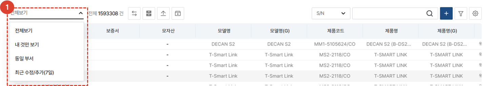
1. 원하는 필터링 방법을 선택합니다. 선택 즉시 해당하는 목록이 리스트에 표시됩니다. 
 
 

### 검색
:::tip
테이블 검색 방법을 안내합니다.
:::

1. 검색 필터를 **선택**한 뒤 검색합니다. 
 
 

### 상세검색
:::tip
**복수**개의 검색 필터 적용 방법을 안내합니다. 
:::
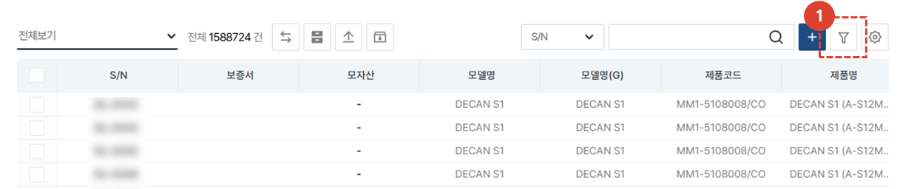
1. **필터 버튼**을 클릭합니다. 
 
 

1. 필터를 선택합니다. 
1. 검색어를 입력합니다. 
1. **+** 버튼을 클릭하여 검색 항목을 추가합니다. 
1. **검색** 버튼을 클릭하여 결과를 확인합니다. 
 
 

### 엑셀출력
:::tip
목록의 엑셀 출력 방법을 안내합니다.
:::

1. 엑셀 출력 버튼을 클릭합니다. 
 
 

1. **출력 옵션**을 선택합니다. 
1. **확인** 버튼을 누른 뒤 [**시스템관리 > 엑셀다운로드**](/docs/SMT/tutorial-12-system-management/03-export-data.md) 메뉴에 접속하여 엑셀을 다운로드할 수 있습니다. 
 
 
 
### 테이블관리
:::tip
열의 표시 여부와  표시할 열과 순서 변경 방법을 안내합니다. 
:::

1. **테이블관리**를 클릭하여 테이블에 보여질 항목 및 순서를 변경할 수 있습니다. 
 
 

1. 테이블에 보일 항목의 토클 버튼을 클릭하여 파란색이 되도록 합니다. 
1. 리스트 아이콘을 드래그하여 열 위치를 변경 할 수 있습니다. 
1. **닫기**를 클릭하면 선택된 내용으로 테이블이 변경됩니다. 
 
 

### 삭제
:::warning
고객사 삭제 방법을 안내합니다.
 삭제 시 **복구가 어려우니** 주의하여 진행하시기 바랍니다.
:::

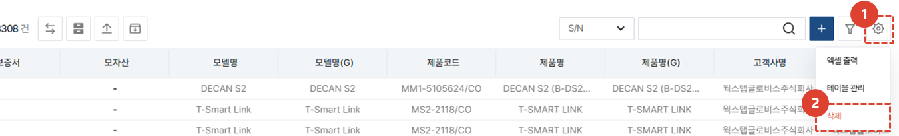
1. **톱니바퀴** 버튼을 클릭합니다. 
1. **삭제** 버튼을 클릭합니다. 
 
 

1. 팝업창의 **삭제** 버튼을 클릭하여 고객사를 삭제합니다.
 
 

## 자산 이관
:::info
자산을 보유하고있는 고객사나 센터의 이관이 필요한 경우 **자산 이관**을 할 수 있습니다. 
현재 자산 이관을 수행하면 30분 이내 시스템에 반영되며, 향후 사업부별 담당자의 승인에 따라 자산 이관 작업을 완료시킬 예정입니다. 
:::
### 자산 이관 방법
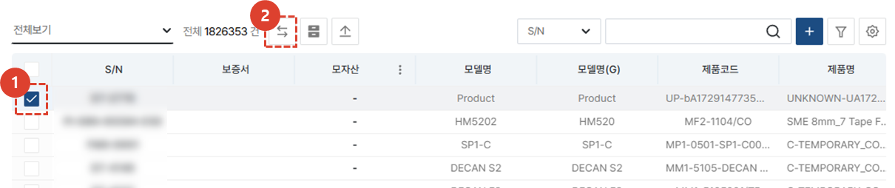
1. 이관할 자산을 **체크**합니다. 
1. **자산 이관** 버튼을 클릭합니다. 
 
 

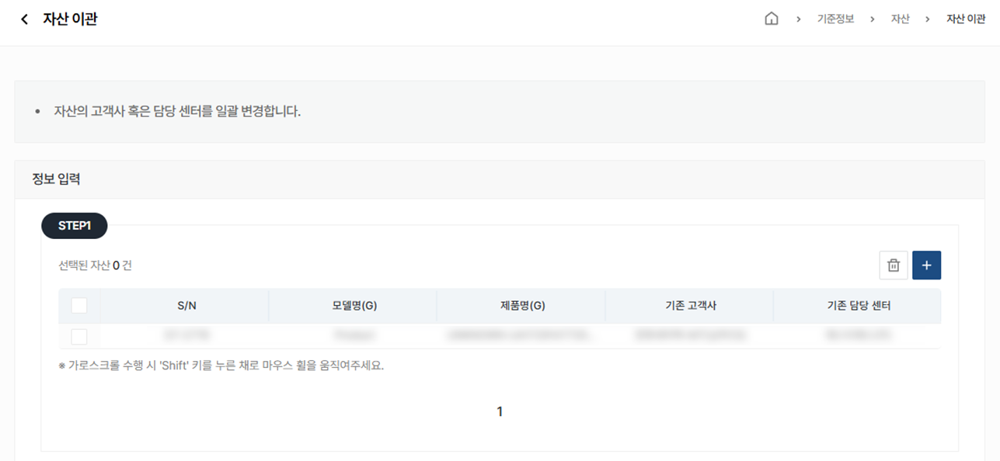
자산 이관 정보를 확인합니다. 이관할 자산이 추가로 있는 경우 **+** 버튼을 클릭하여 자산 추가를 합니다. 
 
 

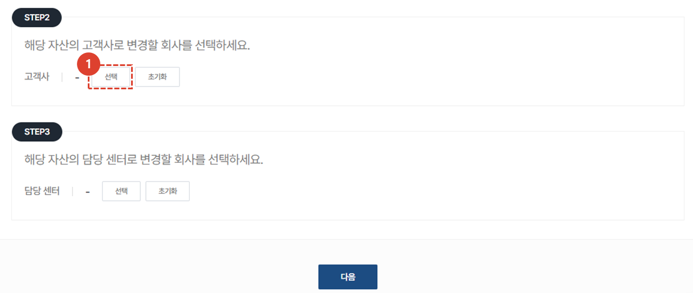
1. **이관 받을 고객사 혹은 센터**를 선택합니다. 
 
 

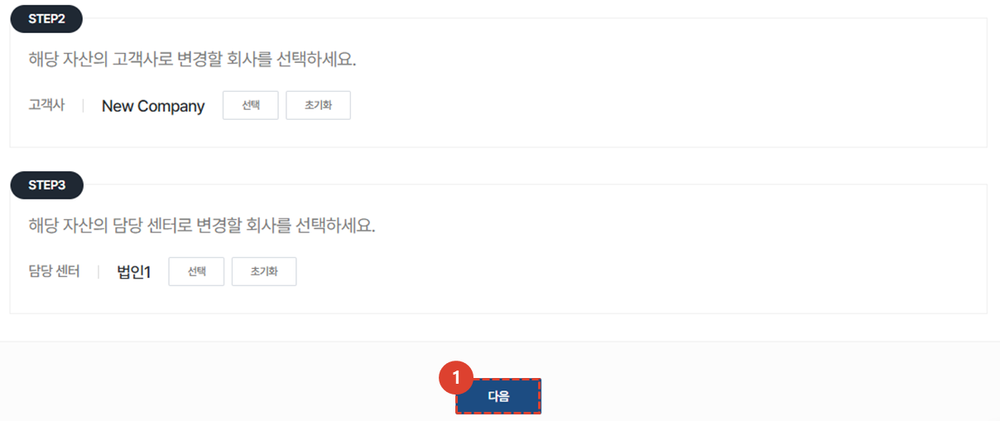
1. 선택한 내용을 확인한 뒤, **다음** 버튼을 클릭합니다. 
 
 

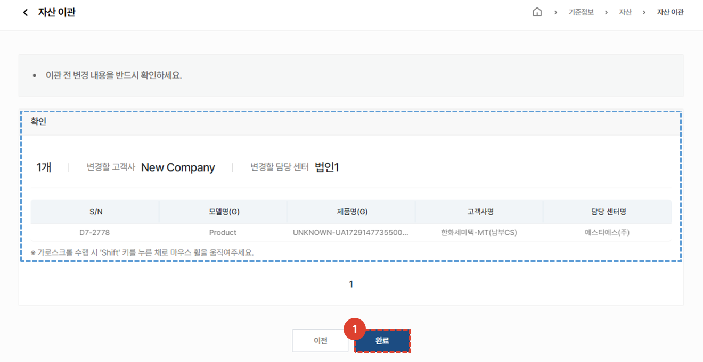
1. 내용의 최종 확인 후 **완료** 버튼을 클릭합니다.  자산 이관 작업 완료 후 30분 이내에 해당 자산 정보가 업데이트됩니다. 
 
 

## 자산 등록
:::tip
기본적으로 자산은 자동 등록됩니다. 다만, 대리점에서 고객사로 판매하는 경우는 자산에 고객사 정보를 별도로 추가해야 합니다. 
:::
### 단건 등록
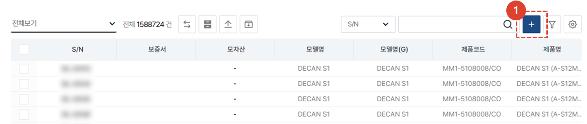
1. **+** 버튼을 클릭합니다. 
 
 

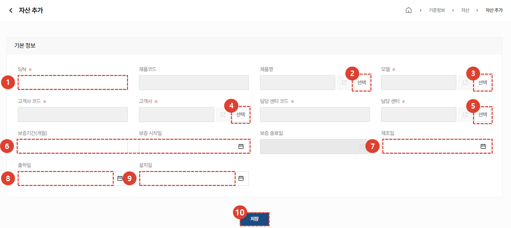
1. S/N를 입력합니다. 
1. 선택을 클릭하여 **제품명**을 선택합니다. 
1. 선택을 클릭하여 **모델**을 선택합니다. 
1. **고객사**를 선택합니다. 선택 시, 고객사 코드가 자동 입력됩니다. 
1. **담당 센터**를 선택합니다. 선택 시, 담당 센터의 코드가 자동 입력됩니다. 
1. **보증기간**(예시 : 12개월, 24개월) 및 **보증 시작일**을 입력합니다. 보증 종료일은 자동 입력됩니다. 
1. 자산의 **제조일**을 입력합니다. 
1. **출하일**을 입력합니다. 
1. **설치일**을 입력합니다. 
1. 자산 정보 입력이 완료된 후 **저장** 버튼을 클릭합니다. 
 
 

### 자산 일괄 등록
:::tip
다량의 자산을 일괄 등록 하는 방법을 안내합니다. 
:::
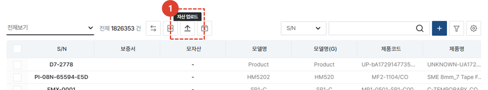
1. **자산 업로드** 버튼을 클릭합니다. 
 
 

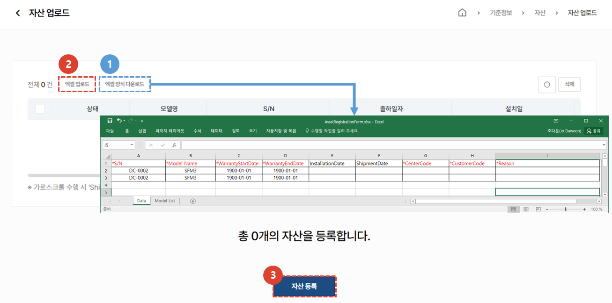
1. **엑셀 양식 다운로드**를 하여 양식에 맞게 자산 정보를 입력합니다. 
1. **엑셀 업로드** 버튼을 클릭하여 자산 정보가 입력된 엑셀을 업로드 합니다. 
1. **자산 등록** 버튼을 클릭하여 자산 등록을 완료합니다. 
 
 

## 상세 페이지
### 기본정보 
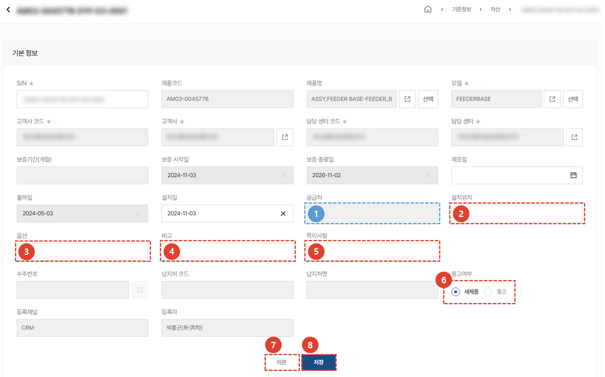
:::info
자산 등록 시 입력된 기본 값이 보여지며 추가적으로 2~6번 항목의 내용을 입력 할 수 있습니다. 
:::
1. SO에서 입력된 **공급처** 정보가 보여집니다. 
1. 자산의 **설치위치**를 입력 할 수 있습니다. 
1. 자산의 상세 **옵션** 내역을 입력합니다. 
1. 추가적으로 입력할 내용을 **비고**에 입력합니다. 
1. 자산의 **특이사항**을 입력합니다. 
1. 자산이 이관되어 중고제품이 되는 것 과 같이 **중고여부**를 체크하여 관리 할 수 있습니다. 
1. 자산 [**이관**](#자산-이관-방법) 버튼을 클릭하여 이관시킬 수 있습니다. 
1. 수정사항이 있다면 **저장** 버튼을 클릭하여 내용을 저장합니다. 
 
 

### 추가정보
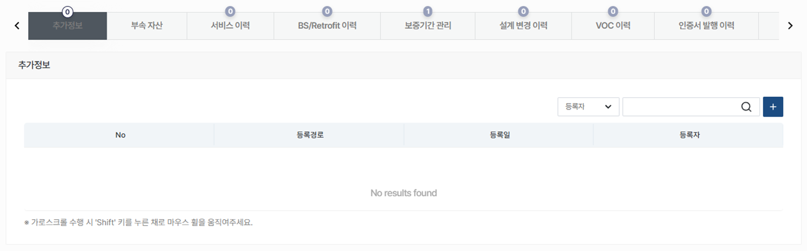
자산에 대한 추가 정보 내역이 나타납니다. 
- 추가정보 : SW, MMI, RD, Vision, Opti, IT, Basic IT 등의 저번을 수기로 입력하여 관리 할 수 있습니다. 
- 부속자산 : 해당 자산의 부속 자산에 대한 S/N, 모델명, 제품코드 등의 정보를 조회 할 수 있습니다. 
- 서비스 이력 : 해당 자산에 대하여 시행된 서비스 이력을 조회하고 상세 내용을 확인 할 수 있습니다. 
- BS/Retrofit 이력 : BS/Retrofit 활동 이력을 조회하고 상세 내용을 확인 할 수 있습니다. 
- 보증기간 관리 : 보증기간의 수정이 필요한 경우, 보증기간 관리 탭에서 **+** 버튼을 클릭하여 수정이 가능합니다. 보증기간 수정 시 **보증기간의 변경 사유를 자세하게** 작성해야 합니다. 
- 설계 변경 이력 : 자산과 관련한 설계변경이력을 조회할 수 있습니다. 
- VOC 이력 : 자산과 관련해 발생한 VOC 이력의 조회 및 상세 내용을 확인 할 수 있습니다. 
- 인증서 발행 이력 : 보증서(공작기계사업부 한정) 등의 인증서 발행 이력을 조회 할 수 있습니다. 
- 서비스 기술 자료 : 해당 자산과 관련한 서비스 기술 자료가 있는 경우 조회 할 수 있습니다. 
- 이관 이력 : 자산의 이관 이력이 있는 경우 조회 할 수 있습니다. 
</ValidateTextByToken>