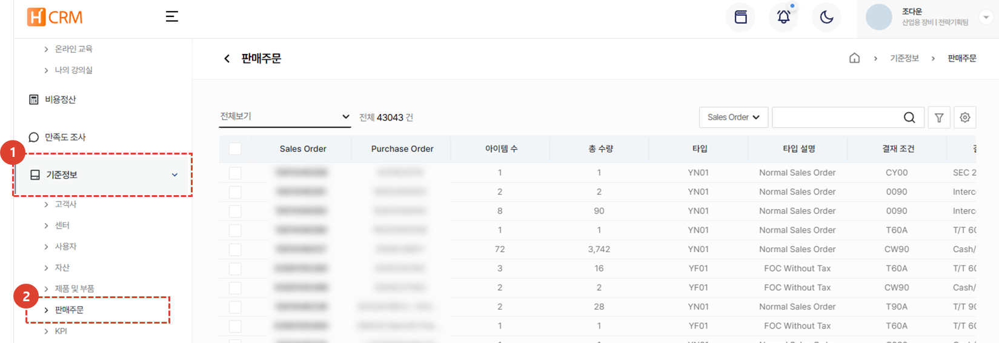

import ValidateTextByToken from "/src/utils/getQueryString.js";

# 판매주문

판매주문 데이터 관리에 대한 안내입니다.

<ValidateTextByToken dispTargetViewer={true} dispCaution={true} validTokenList={['head']}>

1. **기준정보** 메뉴를 클릭합니다. 
1. **판매주문** 메뉴를 클릭합니다. 
    - 사용자의 조직에 따라 관련된 SO 리스트가 나타나며, SO 번호를 클릭하여 상세 내용 확인이 가능합니다. 
</ValidateTextByToken>
