import ValidateTextByToken from "/src/utils/getQueryString.js";
import Popup1 from "./img/005.png";
import Popup2 from "./img/009.png";

# 교육 만족도

서비스, 품질, 교육에 대한 만족도 조사 설문지를 생성하고 결과를 관리할 수 있습니다. 

<ValidateTextByToken dispTargetViewer={true} dispCaution={true} validTokenList={['head']}>

## 목록

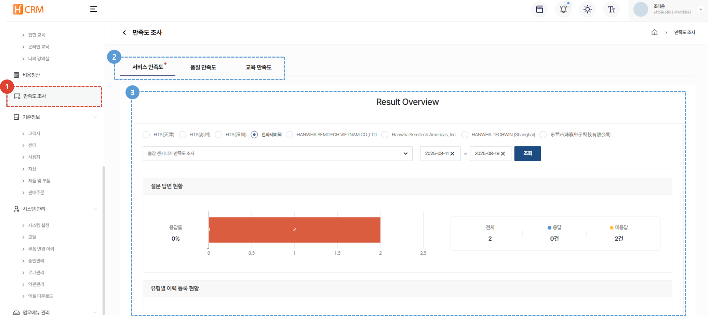
1. **만족도 조사** 메뉴를 클릭합니다. 
1. **서비스 만족도, 품질 만족도, 교육 만족도** 탭을 클릭하여 설문조사 생성 및 관리를 할 수 있습니다. 
1. 해당 탭의 상세 내용을 제공합니다.
 
 

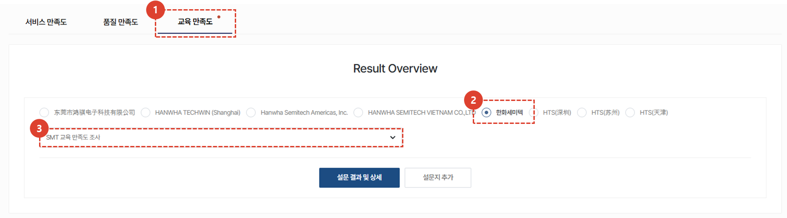
1. **교육 만족도** 탭을 클릭합니다. 
1. 해당하는 교육 주체를 선택합니다. 
     본사, 법인 등 교육을 진행하는 주체를 선택합니다.
1. 설문조사 목록입니다. 관리하고자 하는 설문조사를 선택합니다. 
 
 

## 설문지 추가
### 추가 방법
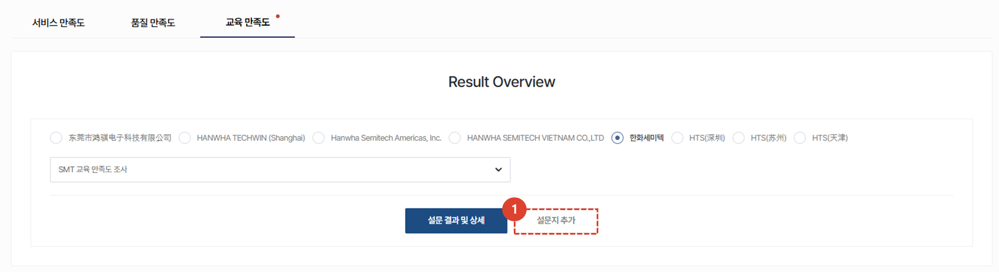
1. **설문지 추가** 탭을 클릭합니다. 
 
 

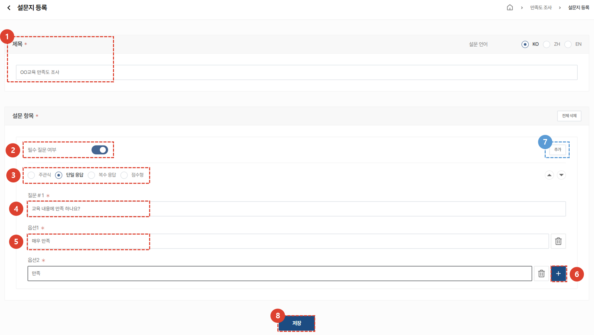
1. 설문지 **제목**을 입력합니다. 
1. 설문 항목의 **필수 여부**를 선택합니다. 
1. 설문 항목의 **유형**을 선택합니다. 
1. 질문 **내용**을 입력합니다. 
1. 선택항목이 있는 경우 **선택항목 값**을 입력합니다.
1. 선택항목을 추가해야하는 경우 **+** 버튼을 클릭합니다. 
1. **추가**버튼을 클릭하면 질문을 추가 할 수 있습니다. 
1. 모든 설문 항목 제작이 완료되면 **저장**버튼을 클릭하여 설문지 등록을 완료합니다.  
 
 

### 설문 항목 유형
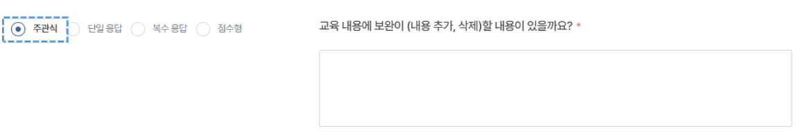
 **주관식** : 답변을 직접 입력 할 수 있습니다. 
 
 

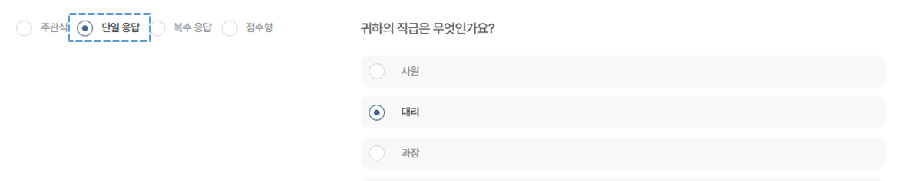
 **단일 응답** : 한 개의 답변을 선택 할 수 있습니다.
 
 

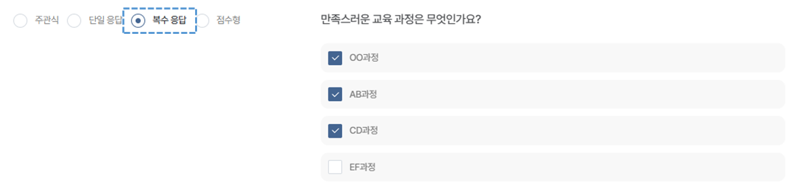
 **복수 응답** : 여러개의 답변을 선택 할 수 있습니다.
 
 

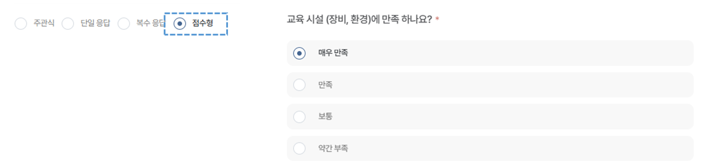
 **점수형** : 응답 내용의 중요도 차이가 있는 경우 선택합니다. 단일 응답과 동일하게 한 개의 답변을 선택 할 수 있습니다. 
 
 

## 설문 결과 및 상세
### 결과
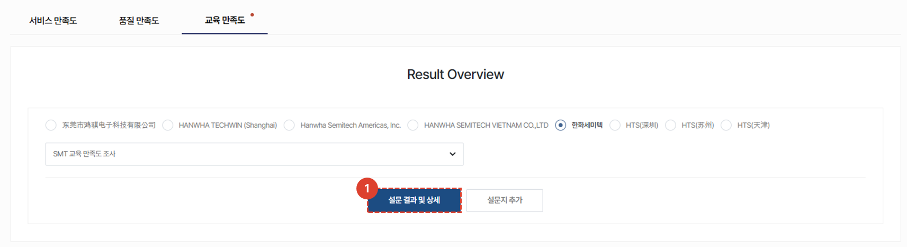
1. **설문 결과 및 상세** 버튼을 클릭합니다. 
 
 

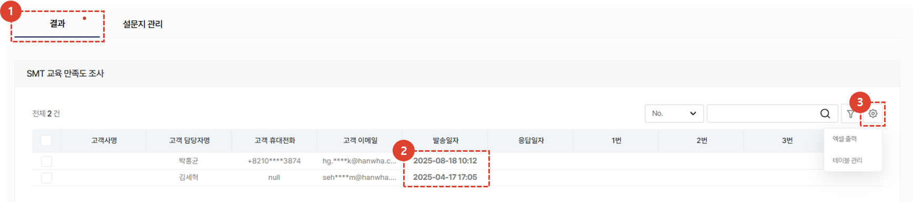
1. **결과** 탭을 클릭합니다. 
    :::info
    해당 설문조사의 대상이 되는 수강자의 정보 및 설문 결과를 목록에서 확인 할 수 있습니다. 
     고객사명, 고객 담당자명, 고객 휴대전화, 이메일, 설문 발송일자, 설문 응답일자 및 응답결과를 제공합니다.
     * 고객 정보는 개인정보처리방침에 의거하여 일부 숨김처리 됩니다.
    :::
1. **발송일자**를 클릭하면 설문 발송 화면을 볼 수 있습니다. 
    :::info
    

    :::
 
 

### 설문지 관리 - 설문지 수정
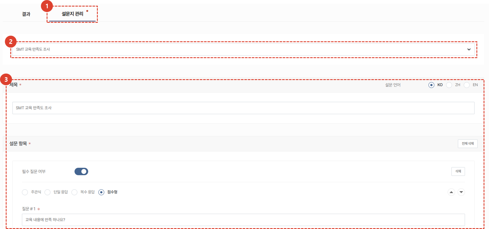
1. **설문지 관리** 탭을 클릭합니다.
    :::info
    기존에 생성된 설문을 **수정** 할 수 있는 기능을 제공합니다. 
    :::
1. 수정이 필요한 설문조사를 선택합니다. 
1. 제목 및 설문 항목을 확인하고 수정한 뒤 **저장**합니다.   
    :::warning 설문지 수정 방법
    수정 방법은 설문지 추가 방법과 동일합니다.
    :::
 
 

### 설문지 관리 - 대상 관리
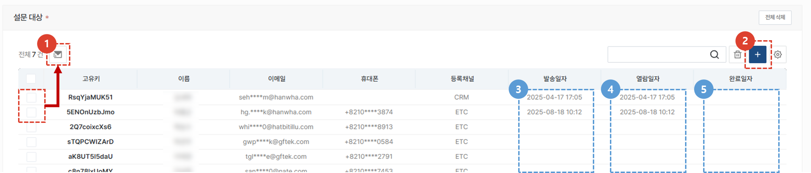
1. 수강자를 선택 후, **이메일** 버튼을 클릭합니다. 수강자에게 설문조사를 전송 할 수 있습니다. 
    :::info
    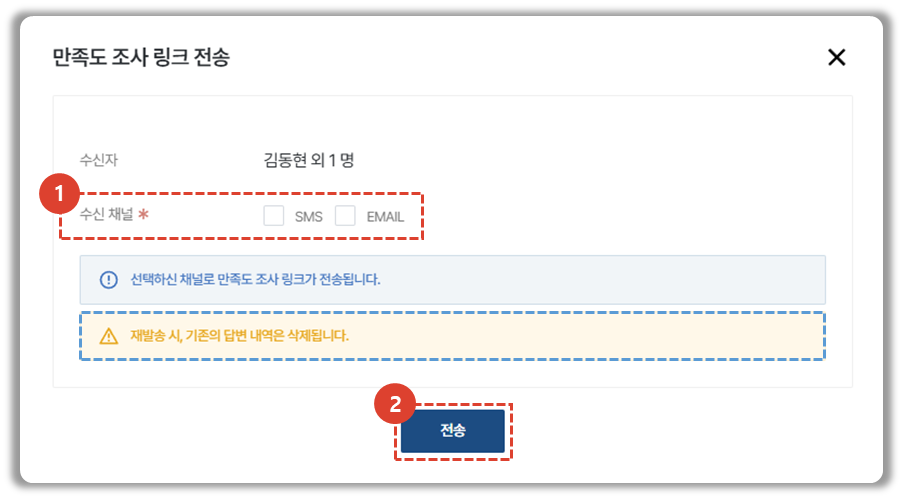
     설문조사 **재발송 시, 기존의 답변 내역은 삭제**되므로 설문에 응답한 수강자에게 재발송할 경우 이를 유의하시기 바랍니다. 
    1. 수강자에게 발송할 설문조사 채널을 선택합니다. 
    1. 전송 버튼을 클릭하면 설문조사가 발송됩니다.
    :::
1. **설문대상**을 추가 할 수 있습니다. 
    :::info
    

    1. 수신 대상을 **검색**합니다.  H-CRM 가입자, Circle 사용자를 선택하거나 대상자 정보를 직접 입력 할 수 있습니다.
    1. 대상자를 **선택**합니다. 
    1. **저장** 버튼을 클릭하여 설문대상을 저장합니다.
    :::
1. 수강자에게 설문조사가 발송된 **발송일자**를 확인 할 수 있습니다. 
1. 수강자가 설문조사를 열람한 **열람일자**를 확인 할 수 있습니다. 
1. 수강자가 설문조사를 완료하면 **완료일자**를 확인 할 수 있습니다.

</ValidateTextByToken>