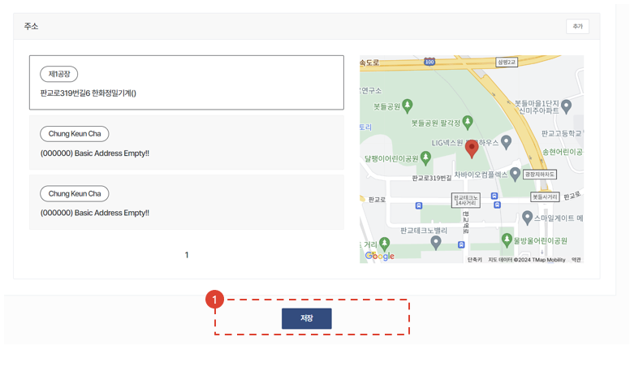
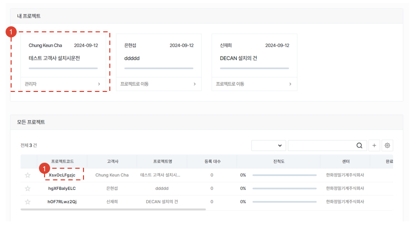
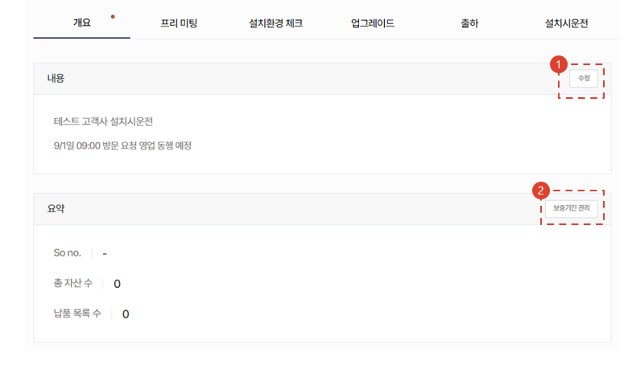
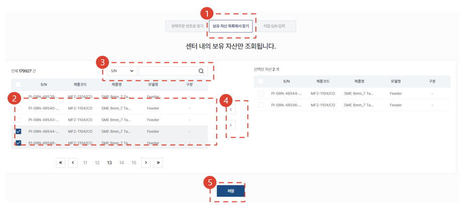
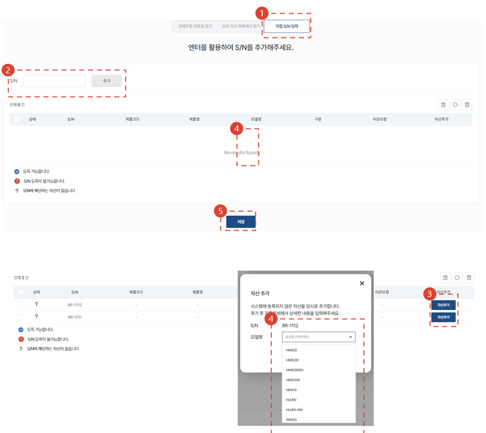
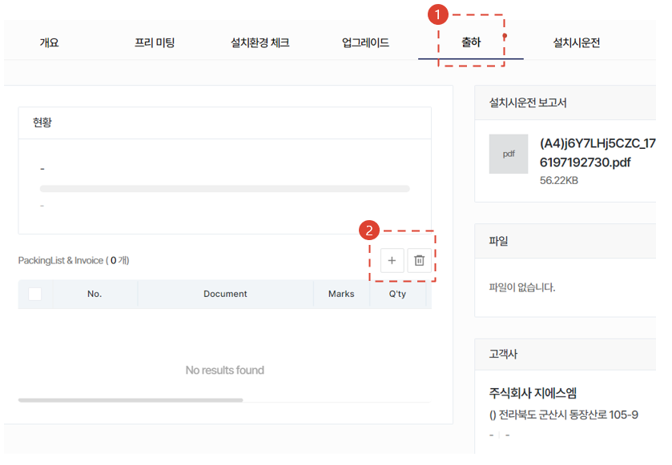
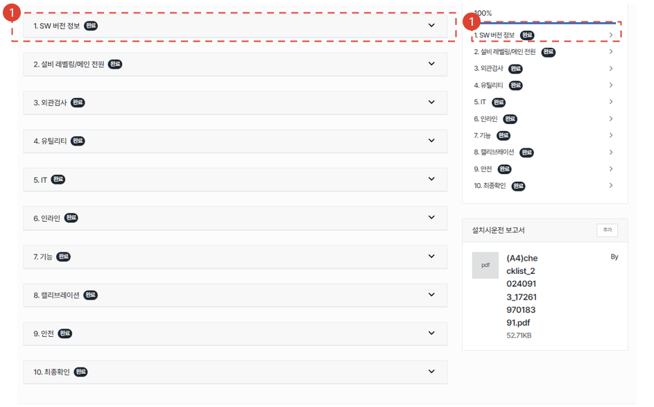

# 설치시운전 프로젝트 생성 (일반)

고객사에 인도된 자산의 설치시운전 작업을 수행하기 위한 절차를 안내합니다.

## 프로젝트 목록

1. **설치시운전** 메뉴를 선택합니다.
1. 설치시운전 프로젝트 목록이 표시됩니다.

## 프로젝트 생성 - 1/3

1. 목록에서 **+** 버튼을 누릅니다.
1. 내용을 입력하세요
1. 설치시운전을 관리하고 진행할 주체가 될 센터를 선택합니다.
1. 선택된 센터의 프로젝트 관리자를 고릅니다.

## 프로젝트 생성 - 2/3

1. 설치시운전 대상이 되는 고객사를 선택합니다.
1. 설치작업을 수행할 위치를 선택합니다.
1. 설치 주소가 없는 경우 **추가** 버튼을 눌러 주소를 등록합니다.
1. 주소 정보를 입력합니다.
1. 입력을 마친 뒤 **조회** 버튼을 누르면 주소가 지도에 표시됩니다.
1. **저장** 버튼을 누릅니다.

## 프로젝트 생성 - 3/3

1. 설치시운전 프로젝트의 **저장** 버튼을 누릅니다.

## 프로젝트 상세 진입

1. 방금 추가된 **설치시운전 프로젝트**를 클릭합니다.

## 프로젝트 상세 - 개요

1. 생성 시 입력된 내용을 수정하기 위해 사용합니다.
1. 추가된 설치대상 자산의 보증기간을 관리합니다.
    :::warning
    ※ 보증기간 관리는 [다음 단계](#프로젝트-상세---개요---자산추가)의 설치 대상 자산을 추가힌 후 활용 가능합니다.
    :::
- 각 메뉴에 대한 설명은 [공통사항](#프로젝트-상세---공통사항)을 참조하시기 바랍니다.

## 프로젝트 상세 - 개요 - 자산추가

1. 설치 대상 자산을 추가하기 위해 **추가**버튼을 누릅니다.
    :::warning
    ※ 보증기간을 관리해야할 자산은 모두 등록이 되어야 합니다.
    :::

## 프로젝트 상세 - 개요 - 자산추가 - 판매주문으로 추가하기

1. 판매주문(세일즈오더)으로 자산을 찾는 경우 **판매주문 번호로 찾기**버튼을 클릭합니다.
1. 필요한 세일즈오더 번호를 선택합니다.
1. 추가하는 경우 **\>** 버튼을 누릅니다. (선택된 곳에서 뺄때는 **\<** 버튼)
1. 추가될 자산을 확인 후 **저장**버튼을 누릅니다.
    - 여기서 추가된 자산은 [판매주문으로 자산이 추가된 경우 납품목록 조회](#프로젝트-상세페이지---개요---납품목록---판매주문으로-자산이-추가된-경우) 와 같이 표시됩니다.

## 프로젝트 상세 - 개요 - 자산추가 - 자산목록에서 추가하기

1. 보유하고 있는 자산 목록에서 자산을 찾는 경우 **보유자산 목록에서 찾기**버튼을 클릭합니다. 
    :::note
    ※ 여기서는 내 센터(본사/법인/대리점) 및 하위센터(법인/대리점)의  자산이 표시됩니다.
    :::
1. 필요한 자산을 선택합니다.
1. 목록이 긴 경우 검색을 통해 자산을 검색할 수 있습니다. 
    
1. 추가하는 경우 **\>** 버튼을 누릅니다. (선택된 곳에서 뺄때는 **\<** 버튼)
1. 추가될 자산을 확인 후 **저장** 버튼을 누릅니다.

## 프로젝트 상세 - 개요 - 자산추가 - 직접 등록하기

1. 보유하고 있는 자산 목록에서 자산을 찾는 경우 **보유자산 목록에서 찾기** 버튼을 클릭합니다. 
    :::note
    ※ 여기서는 내 센터(본사/법인/대리점) 및 하위센터(법인/대리점)의  자산이 표시됩니다.
    :::
1. 자산의 시리얼 번호를 입력한 뒤 엔터키를 입력합니다.
1. 추가된 시리얼번호의 상태를 확인하고 필요에 따라 **자산추가** 버튼을 눌러 자산을 추가하는 작업을 수행합니다. 
    
1. 모델을 선택해준 뒤 확인 버튼을 누릅니다.
1. 더 이상 추가할 자산이 없는 경우 **저장**버튼을 누릅니다.

## 프로젝트 상세 - 개요 - 납품목록

자산을 추가하게 되면 **납품목록** 필드에 자산이 목록에 추가된 것을 확인할 수 있습니다.

## 프로젝트 상세 - 개요 - 납품목록 - 판매주문으로 자산이 추가된 경우

※ **대기열** 이 존재하므로 유의하시기 바랍니다.

1. 관리자-모델 의 모델 데이터에서 **설치시운전 설치대상** 에 체크되어 있는 자산들은 [설치 대상]으로 분류가 됩니다
    :::note
    예시: 설치 및 체크리스트 작성과 고객 검수가 이뤄지는 자산 -> 설비류
    :::
1. 관리자-모델 의 모델 데이터에서 **설치시운전 설치대상** 에 체크되어 있지 않은 자산들은 [설치 비대상]으로 분류가 됩니다
    :::note
    예시: 시리얼번호로 자산화되어 보증기간 관리가 되나 단순 납품처리 되는 자산들 -> 피더류
    :::
1. 시리얼번호가 매핑되지 않거나 기타의 사유로 설치 대상/비대상으로 분류되지 못한 자산은 대기열에 잔류하기 되며, 대기열에 존재하는 자산이 1개라도 잇으면 다음단계 진행이 어렵습니다.
1. 액션버튼 클릭 또는 S/N을 더블클릭하여 S/N을 수정/입력하게되면 바로 설치대상 또는 비대상으로 이동합니다.

## 프로젝트 상세 - 개요 - 납품목록 - 보유자산목록에서 추가 또는 직접 자산을 등록한 경우

1. 이 경우에는 대기열이 존재하지 않습니다. 나머지는 [앞 페이지](#프로젝트-상세페이지---개요---납품목록---판매주문으로-자산이-추가된-경우)와 동일한 프로세스를 따릅니다.

## 프로젝트 상세 - 프리미팅

설치시운전 작업을 수행하기 전 고객사 사전 방문 미팅을 수행하는 경우 사용합니다.

## 프로젝트 상세 - 프리미팅 - 추가

1. 프리미팅을 수행하는 경우 **+** 버튼을 클릭합니다.
1. 프리미팅 수행(또는 예정) 일자를 선택합니다.
1. (STS의 경우) 자사 ERP 번호를 등록합니다.
1. 기타 특이사항을 입력합니다.
1. 프리미팅 진행 엔지니어를 선택하고 **저장** 버튼을 누릅니다.

## 프로젝트 상세 - 프리미팅 - 소요시간 등록

1. 미팅에 소요된 시간을 입력하기 위해(비용정산용) **+** 버튼을 누릅니다.
1. 작업 담당자, 작업구분, 시간대를 입력한 뒤 저장 버튼을 누릅니다.

## 프로젝트 상세 - 프리미팅 - 저장

1. 추가된 일정을 스케줄에 등록하려면 **스케줄 반영** 항목을 체크합니다. 센터내 동료들에게 이 스케줄이 보이게 됩니다.
1. 프리미팅 결과 보고서 파일을 첨부합니다.
1. 프리미팅을 저장하기 위해 **저장** 버튼을 누릅니다.

## 프로젝트 상세 - 설치환경 체크 (for HTAA)

1. 설치환경 체크 여부에 대한 관리가필요한 경우(예: 미주법인) 사용하는 탭입니다.
1. 고객에게 필요한 유틸리티 사양알 제공하고 점검이 끝난 경우 체크합니다.
1. 고객과 주고받은 자료(예 점검시트지 등)가 있다면 첨부합니다.

## 프로젝트 상세 - 업그레이드 (for HTAA)

1. 설치장소 인도 전에 개조(업그레이드)에 대한 관리가 필요한 경우(예: 미주법인) 사용하는 탭입니다.
1. 수행장소를 선택합니다.
    - On site: 현장에서 개조
    - COE: 법인에서 개조후 출하
1. 업그레이드 현황을 업데이트하기 위해 시리얼번호를 클릭합니다.
1. 상태를 업데이트하고 저장 버튼을 누릅니다.

## 프로젝트 상세 - 출하 (for HTAA)

1. 출하관리가 필요한 경우(미국)에 사용합니다
1. 패킹리스트/인보이스 발행을 위해 + 단추를 클릭합니다.

## 프로젝트 상세 - 출하 - 패킹리스트 & 인보이스 생성 (1/3) (for HTAA)

1. 선적정보를 입력합니다.

## 프로젝트 상세 - 출하 - 패킹리스트 & 인보이스 생성 (2/3) (for HTAA)

1. 패킹규격 정보를 입력합니다.
1. **+** 버튼을 클릭합니다.
1. 패킹 아이템을 추가하기 위해 누릅니다.
1. 수량을 편집합니다.
1. **추가** 버튼을 누릅니다.

## 프로젝트 상세 - 출하 - 패킹리스트 & 인보이스 생성 (3/3) (for HTAA)

1. 패킹정보 입력후 임시저장을 위해 누릅니다
1. 정보입력이 모두 끝난 경우 최종 저장버튼을 누릅니다.

## 프로젝트 상세 - 설치시운전

1. 설치시운전 탭을 클릭합니다.
1. 설치시운전 활동에 참여한 엔지니어를 추가합니다.
1. 작업에 할애된 소요시간을 입력합니다. (비용정산목적)
    - 프리미팅의 [소요시간 등록](#프로젝트-상세---프리미팅---소요시간-등록) 참조해주시기 바랍니다.

## 프로젝트 상세 - 설치시운전 - 설치대상 선택

1. 설치 대상 자산을 클릭해서 점검리스트에 결과를 입력합니다.
1. 자산이 많은 경우 S/N검색을 수행할 수 있습니다. (like 검색이 될수 있어야 합니다.)
- 대상을 클릭하시면 체크리스트를 작성할 수 있습니다. [체크리스트 작성](#프로젝트-상세---설치시운전---체크리스트-작성) 으로 이동

## 프로젝트 상세 - 설치시운전 - 사용부품 추가 (@HTAA)

1. 수리가 필요한 부품이 있는 경우, **+** 단추를 눌러 부품을 추가합니다.
1. 내부적으로 출고관리가 필요한 경우(미주법인) **출고 요청**버튼을 누릅니다.

## 프로젝트 상세 - 설치시운전 - 체크리스트 작성

1. 각 스텝을 오픈하여 점검 결과를입력합니다.

## 프로젝트 상세 - 설치시운전 - 고객 검수 (@HTS)

1. 100%가 되면 최종확인을 수행할 수 있습니다. 최종확인 버튼을 누르세요.
1. 첨부파일이 있는경우 첨부합니다.
1. 확인일시, 엔지니어, 고객담당자를 선택합니다.
1. 확인버튼을 누릅니다.
1. 서명을 하고 저장을 누릅니다.
    :::note
    ※ 중국의 경우 전자서명의 법적 효력이 없으므로 자필서명 스캔본을 첨부하여 등록합니다.
    :::

## 프로젝트 상세 - 공통사항

1. 리포트를 클릭하면 다운로드받을 수 있습니다.
1. 담당자들 간에 작업하는 동안 발생한 특이사항에 대해 공유할 수 있습니다.

