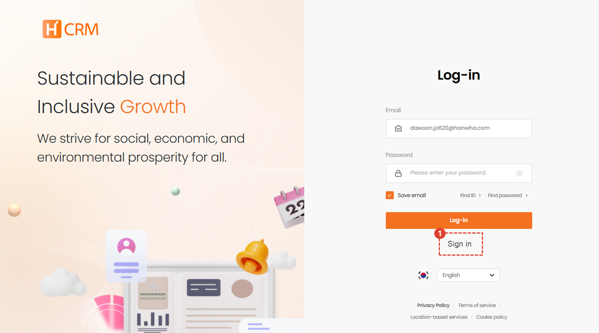
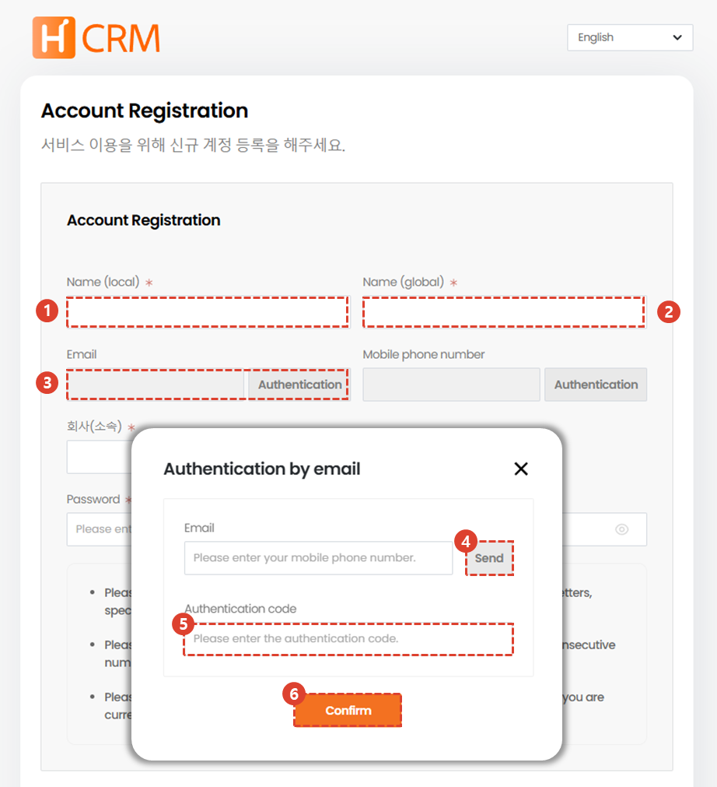
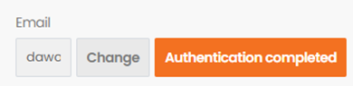
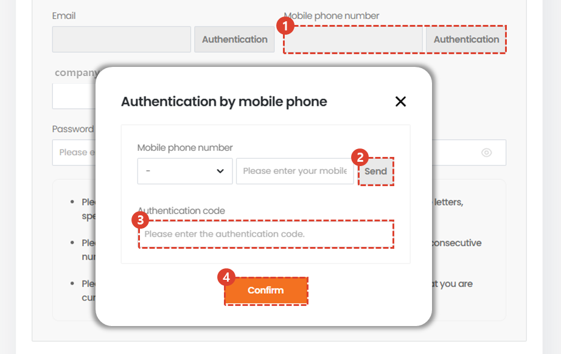
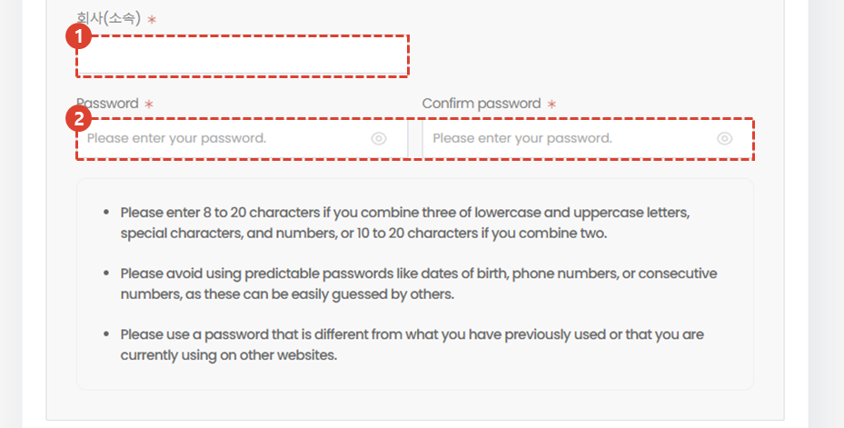
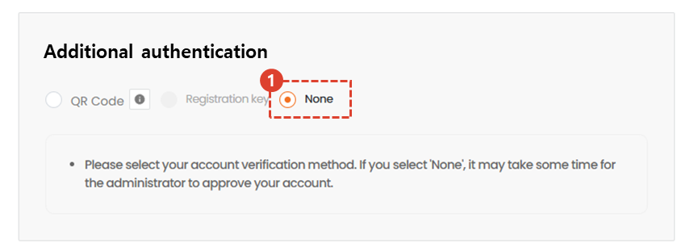
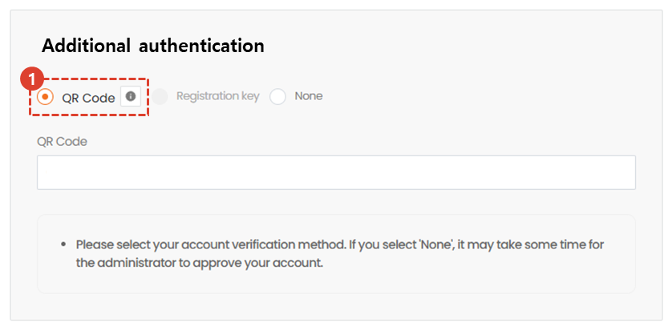
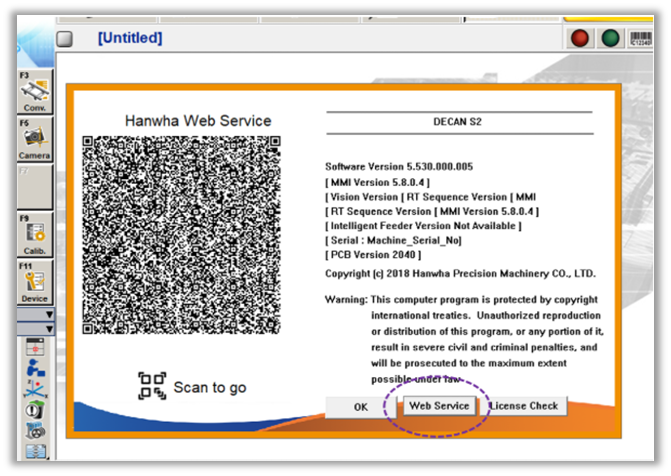
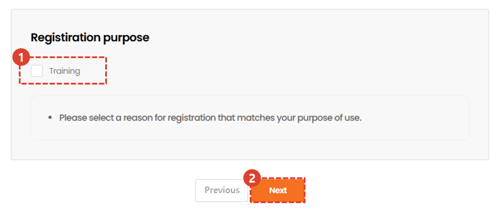
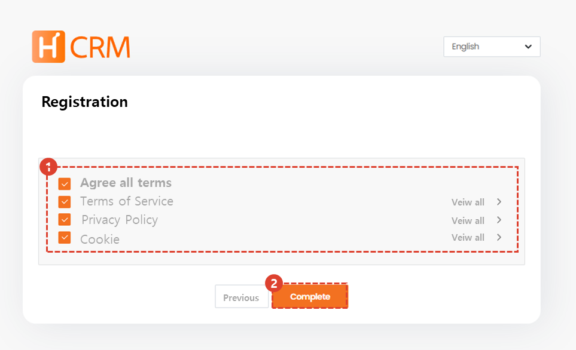

import ValidateTextByToken from "/src/utils/getQueryString.js";
import StrongTextParser from "/src/utils/textParser.js";
import text from "/src/locale/ko/SMT/tutorial-01-auth/create-a-acount-non-circle-user.json";
import MMIMobile from "./img/039.png";

# Create a CRM account (client)

<!-- 메뉴단에서 번역이 안되므로 여기 하드코딩해야 함 #가 달린 헤더와 함께 -->
Process of creating a CRM account for your company.

:::danger
Circle users are requested to follow the account creation procedures for employees.
:::

<ValidateTextByToken dispTargetViewer={true} dispCaution={false} validTokenList={['head', 'branch', 'agent', 'customer']}>

## Outline

The creation scenario for a CRM account for a reseller user is as follows:
:::warning 
   - **Service Agent User**: This structure allows the administrator to create an account on behalf of the user.
   - **Customers**: You can create accounts directly in your CRM.
:::

</ValidateTextByToken>

## Create a customer account

<ValidateTextByToken dispTargetViewer={false} validTokenList={['head', 'branch', 'agent', 'customer']}>

:::info
We will grant separate account creation authority, and only users with authority will be able to perform account creation tasks.
:::

### Membership registration

1. Click **Sign Up**.

### Enter basic information

1. Enter your name.
1. Enter your global name.
1. Click Authenticate.
1. Enter the email address you want to use as your ID and click Send.
1. Enter the verification number sent to your email.
1. Click Confirm to complete email registration.
:::info
  
Once authentication is complete, the Authentication button will change to Authentication Complete.
:::

1. Click Authenticate. 
1. Enter your phone number and click Send.
1. Enter the authentication number sent to your mobile phone. 
1. Click Confirm to complete phone registration.

1. Enter your company (affiliation) information.
1. Enter your password.

### Additional authentication - no authentication method

For semiconductor equipment and machine tool customers, please select No authentication method.
Industrial equipment customers, please select No authentication method or QR code.

### Additional Authentication - QR Code Authentication

1. When selecting a QR code, the device you are using must recognize the QR code and issue an identification number.
:::info
     
   You can check the following QR code on the MMI screen of the device. Recognize the QR code with your mobile phone.

    

   1. Select consent to collect location information.
   1. Select Next.
   1. Check the identification number displayed on the screen and enter it in the additional authentication QR code field.

:::

### Select a reason for registration

1. Select a reason for registration.
1. Select the Next.

### Terms and Conditions Agreement

1. After reviewing the terms and conditions, check the box to agree.
:::warning 
   - You cannot register as a member without agreeing to the essential terms and conditions.
:::
1. Select Complete to complete the membership registration process.
:::info
   After approval from your CRM administrator, an email will be sent and you will be able to use the CRM.
:::

</ValidateTextByToken>
