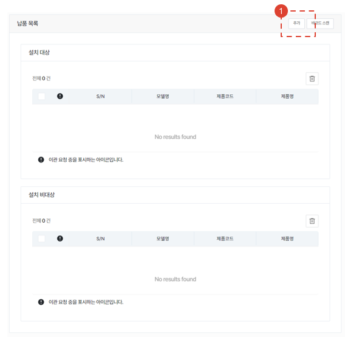
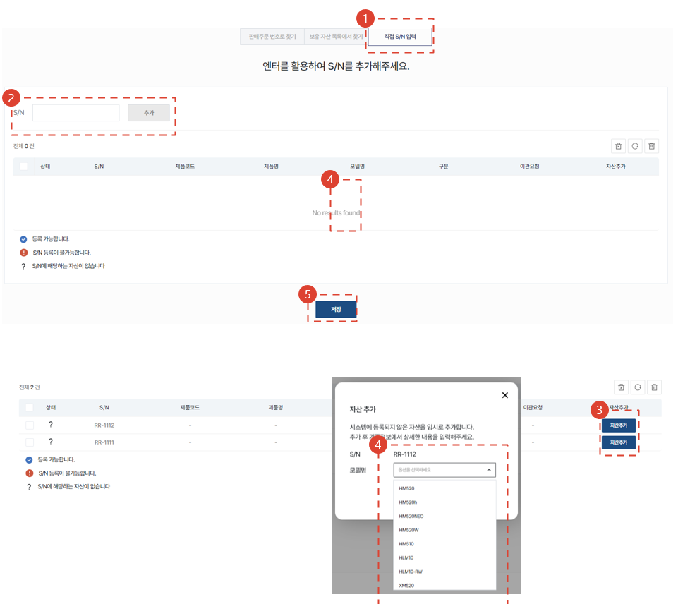

import ValidateTextByToken from "/src/utils/getQueryString.js";
import StrongTextParser from "/src/utils/textParser.js";
import text from "/src/locale/ko/SMT/tutorial-02-installation/02-details-project.json";
import DataAdd from "./img/012_2.png";
import Signature from "./img/039.png";

# Project Details - Overview

This guide will take you to the Overview tab of the Project Details screen.

## Detail tap

<ValidateTextByToken dispTargetViewer={false} dispCaution={true} validTokenList={['head', 'branch', 'agent']}>

1. **Overview** : Enter basic information and summary of the installation and commissioning, as well as the delivery list.
1. **Pre-meeting** : You can enter the details of the pre-meeting with the customer for installation and commissioning. You can manage the details and time required for the pre-meeting.
1. **Check the installation environment** : (For HSA only) If a pre-meeting is difficult, you can save the installation environment information received from the customer via wire.
1. **Upgrade** : (For HSA only) You can enter the location where the optional installation will be performed according to the customer's order.
1. **Shipment** : (For HSA only) You can enter shipping information.
1. **Installation** : You can enter detailed information about the installation test drive and choose whether to perform a final confirmation of the installation test drive.
1. **Traning** : You can enter details of test drives and training conducted before and after installation.
1. **Quality Management** : You can enter work history for quality stabilization after installation and commissioning.

</ValidateTextByToken>
 
 

## Outline - basic information 

<ValidateTextByToken dispTargetViewer={false} dispCaution={true} validTokenList={['head', 'branch', 'agent']}>

1. You can modify the default information entered when creating a project.
1. It is possible to manage the warranty period of the installation target assets added to the installation commissioning project. 
    :::warning 
    Warranty period management can be used after adding assets.
     You can check the management method by clicking [**Warranty Period Management**](#overview---warranty-management).
    :::
 
 

1. Click the Add button to add the asset to be installed.
1. If you want to add using the barcode attached to the asset, click the Scan Barcode button.
    :::info
    All assets requiring warranty management must be registered. Additional methods include:
    :::

</ValidateTextByToken>
## Overview - Add to Delivery List
### Add to sales order

<ValidateTextByToken dispTargetViewer={false} dispCaution={true} validTokenList={['head', 'branch']}>

1. If you are looking for an asset by sales order, click the Find by Sales Order Number button.
1. Select the required sales order number.
1. When adding, press the > button. (When removing from the selection, press the < button.)
1. After checking the assets to be added, click the Save button.
    - Assets added here will be displayed as in the delivery list view if the asset was [**added as a sales order**](#when-assets-are-added-by-sales-order). 
</ValidateTextByToken>
 
 

### Add from asset list

<ValidateTextByToken dispTargetViewer={false} dispCaution={true} validTokenList={['head', 'branch', 'agent']}>

1.  If you are looking for an asset in your list of assets, click the Find in List of Assets button.
    :::note
    Here, the assets of my center (headquarters/corporation/agency) and sub-centers (corporation/agency) are displayed.
    :::
1. Select the assets you need.
1. If the list is long, you can search for assets.
    :::info
    
    :::
    
1. When adding, press the > button. (When removing from the selection, press the < button.)
1. After checking the assets to be added, click the Save button.
 
 

### Direct S/N input

1. If you cannot find the asset in the list of assets held, click the Enter S/N button directly.
    :::danger
    If you falsely register your assets, you may face disadvantages in the future.
    :::
1. Enter the serial number of the asset you want to add.  You can add a large number of assets at once by entering information as shown in the image.
1. You can check the status of the added serial number and add assets by clicking the Add Asset button as needed. 
     

    

1. After selecting the model, click the Confirm button.
1. If you have no more assets to add, click the Save button.

 
 

## Overview - Delivery List
When you add an asset, you can see that the asset has been added to the list in the Delivery List field.

### When assets are added by sales order

1. If the serial number is not mapped or is not classified as target/non-target for installation for any other reason, it will remain in the queue.
    :::warning
    If there are assets in the queue, you cannot proceed to the next step.
     Double-click S/N or click the action button to enter the Serial Number, and it will move to the installation target or non-target.
    :::

4. This is a list of models eligible for installation and test drive.
     If the installation target is checked in the model data, it will be added to the list.
    :::info
   Example: Assets where installation and checklisting are performed and customer inspection is performed -> Equipment
    :::
5. If it is not the installation target, click the model name to deselect the installation target during installation.
   If deselected from the installation target, it will be moved to the non-installation target list.
6. This is a list of deliveries that are not subject to installation.
    :::info
    Example: Assets that are managed under warranty by serial number but are simply delivered -> Feeder type
    :::

</ValidateTextByToken>

### If you add an asset from the list of assets held or register the asset directly

<ValidateTextByToken dispTargetViewer={false} dispCaution={true} validTokenList={['head', 'branch', 'agent']}>

1. If you add assets directly, there is no queue. The rest of the process follows the same as if the assets were [**added via a sales order**](#when-assets-are-added-by-sales-order).
</ValidateTextByToken>
 
 

## Overview - Warranty Management

<ValidateTextByToken dispTargetViewer={false} dispCaution={true} validTokenList={['head', 'branch', 'agent']}>

1. You may attach documentation related to the warranty period. 
1. You can delete uploaded files.
1. You can change the warranty period of all products being installed.
1. You can change the warranty period by double-clicking the warranty period tab of the product you wish to change.
</ValidateTextByToken>
 
 

## Common content
<ValidateTextByToken dispTargetViewer={false} dispCaution={true} validTokenList={['head', 'branch', 'agent']}>

:::info
    This is the common content for each tab in the project details screen. Please refer to the contents below for each item in the common content.
:::
 
 

### Common content - 1/3

1. You can check the code of the installation and commissioning project.
1. After completing the installation and commissioning, the operator must click the Project Complete button. When the button is clicked, the tasks in all tabs will be processed as completed.
    :::warning
     You can change the warranty period start date in the pop-up window that appears when you click the Complete button.
     You must check again to see if the warranty period start date is correct before proceeding with the completion process.
    :::
1. When Project Completion is selected, the button becomes active. The administrator clicks the Approve Project button after checking the project results.
    :::warning
     You can change the warranty period start date in the pop-up window that appears when you click the Complete button.
     You must check again to see if the warranty period start date is correct before proceeding with the completion process.
    :::
1. You can check the installation test drive report by clicking. The report is automatically generated when you complete all the checklists in the Installation tab.
1. You can add attachments for reference to your project.
 
 

### Common content - 2/3

1. Check the customer information and click the Edit button if any changes are needed.
1. If you need to change the customer reviewer, click the Change button.
1. For the responsible center, changes cannot be made after the project is created.
1. You can add project managers by clicking the Add button.
 
 

### Common content - 3/3

1. You can check the project's activity history in a timeline.
1. Comments allow engineers and managers to communicate with each other.
    :::tip
    - [Important] If you check the box and write a comment, an email will be sent to the people registered in the project.
    :::
1. Use this if you need to cancel a project. The button will be disabled once the installation and commissioning tasks are complete.
1. You can select your favorites.
</ValidateTextByToken>

