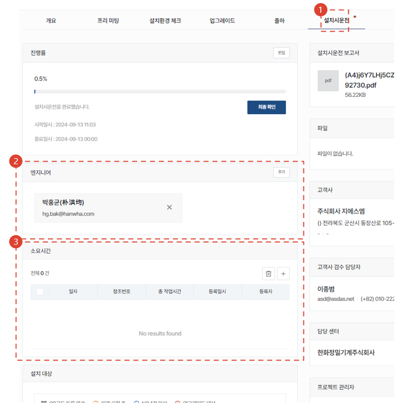
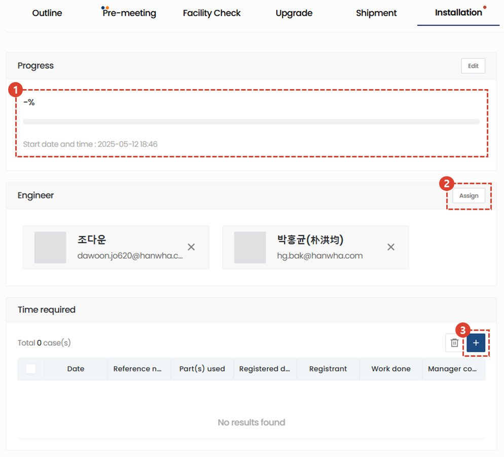
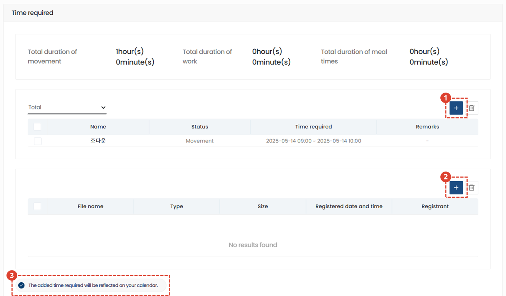
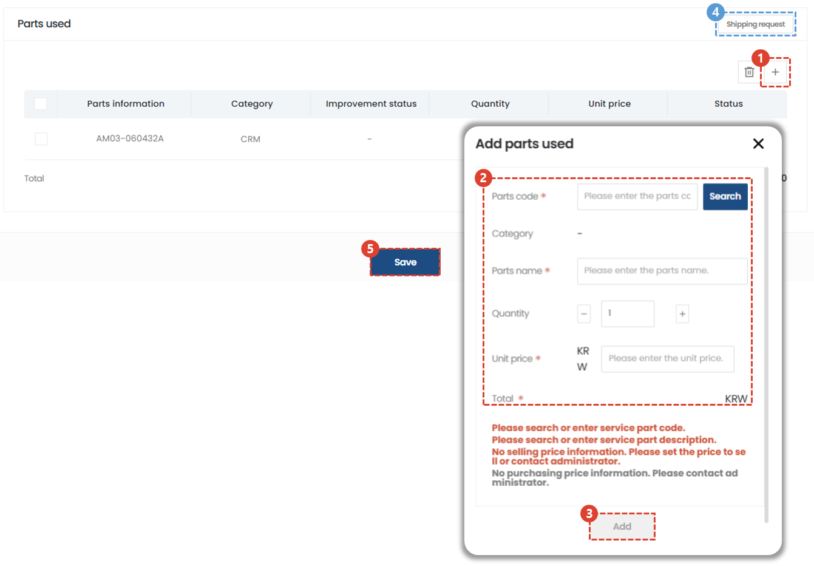
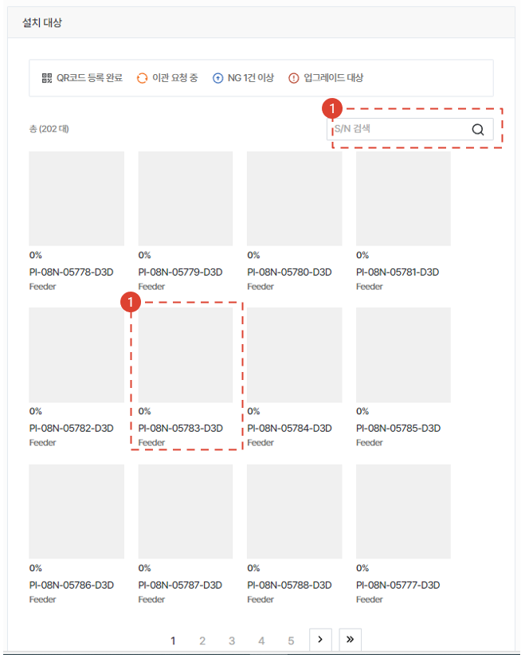
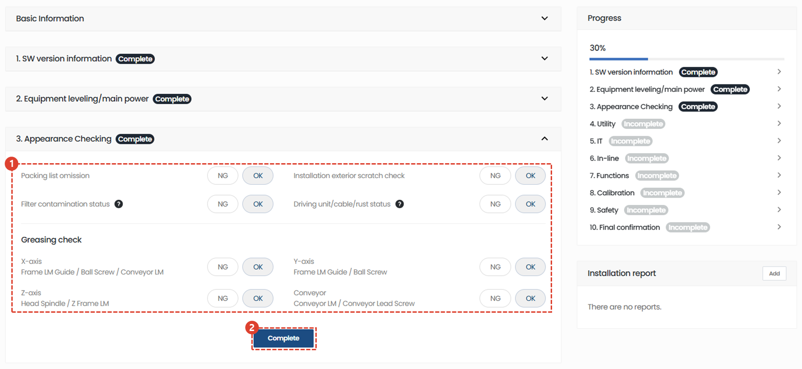
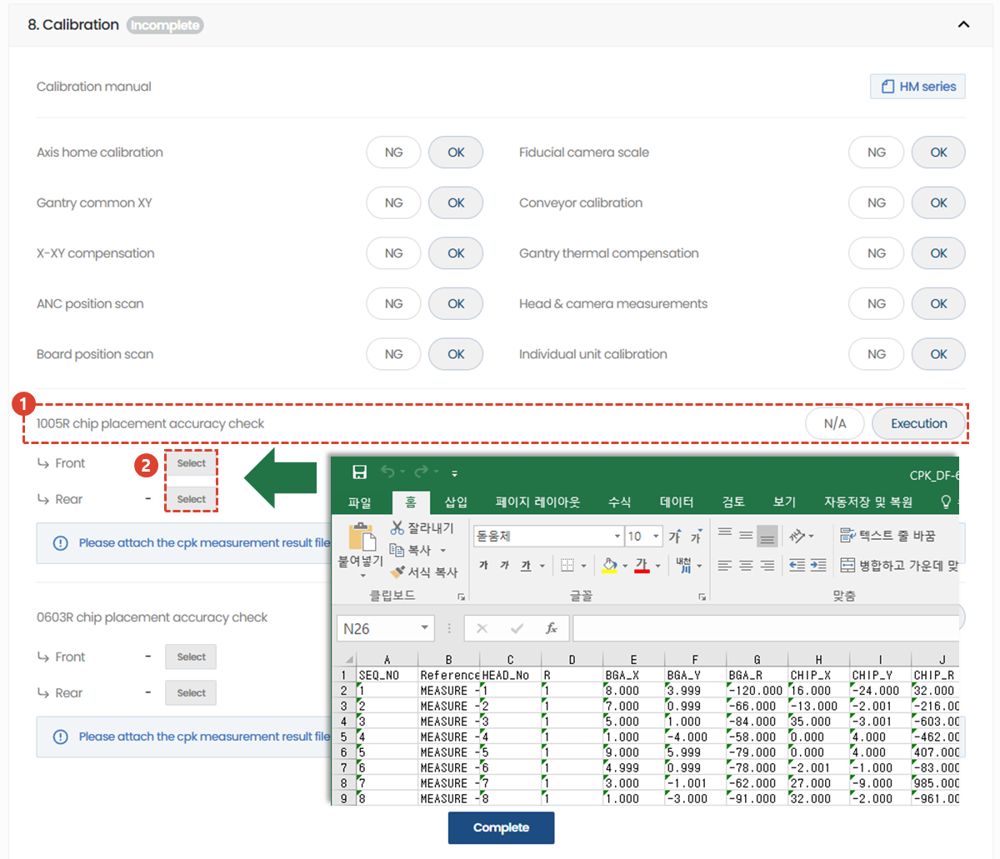
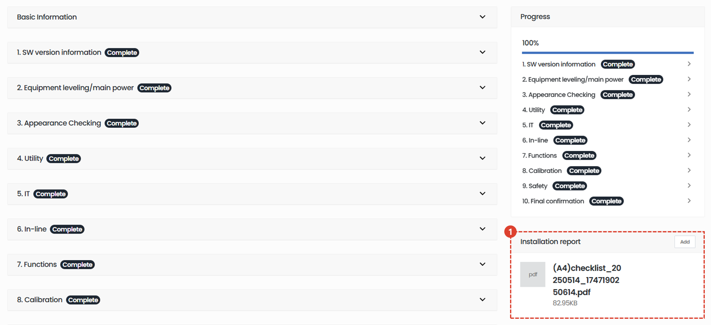
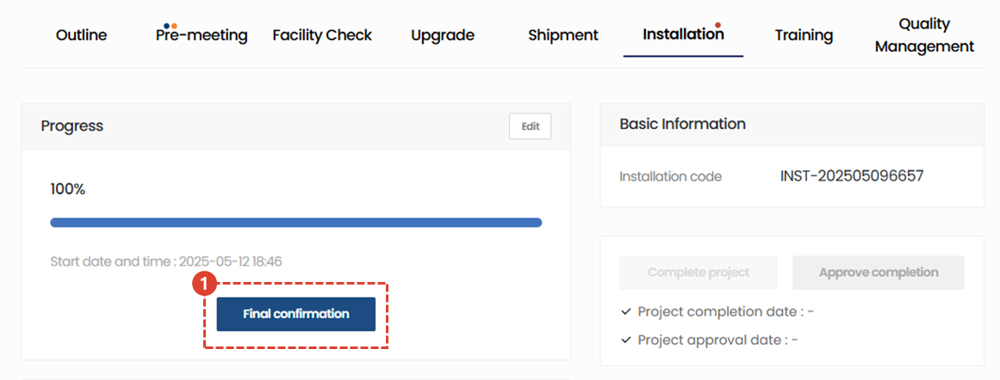

import ValidateTextByToken from "/src/utils/getQueryString.js";
import StrongTextParser from "/src/utils/textParser.js";
import text from "/src/locale/ko/SMT/tutorial-02-installation/02-details-project.json";
import DataAdd from "./img/012_2.png";
import Signature from "./img/039.png";

# Project Details - Installation

Guides you through the Installation tab on the Project Details screen.

## Detail tap

<ValidateTextByToken dispTargetViewer={false} dispCaution={true} validTokenList={['head', 'branch', 'agent']}>

1. **Overview** : Enter basic information and summary of the installation and commissioning, as well as the delivery list.
1. **Pre-meeting** : You can enter the details of the pre-meeting with the customer for installation and commissioning. You can manage the details and time required for the pre-meeting.
1. **Check the installation environment** : (For HSA only) If a pre-meeting is difficult, you can save the installation environment information received from the customer via wire.
1. **Upgrade** : (For HSA only) You can enter the location where the optional installation will be performed according to the customer's order.
1. **Shipment** : (For HSA only) You can enter shipping information.
1. **Installation** : You can enter detailed information about the installation test drive and choose whether to perform a final confirmation of the installation test drive.
1. **Traning** : You can enter details of test drives and training conducted before and after installation.
1. **Quality Management** : You can enter work history for quality stabilization after installation and commissioning.

</ValidateTextByToken>
 
 

## Installation

<ValidateTextByToken dispTargetViewer={false} dispCaution={true} validTokenList={['head', 'branch', 'agent']}>

1. Click the Install tab.

1. Click Start Installation.

1. Once the installation test run begins, you can check the progress.
    :::info
    The progress is for all equipment requiring installation and commissioning.
     **Example**: If only one out of five pieces of equipment to be installed has completed installation and commissioning, the progress rate will be 20%.
    :::
1. Add engineers who participated in the installation and commissioning activities.
1. Enter the time spent on the task (for cost accounting purposes)

1. Enter the time required.
1. Attach documents for reference during test drive and training (e.g. training report)
1. Click the check button if you want the added time to be reflected in the calendar.

1. Add the parts used during test drives and training.
1. Enter the part information.
1. Click the Add button to verify that the part has been successfully added to the list.
:::warning
If you need parts for your work, you must enter the parts you need to use in order to apply for free supplies in the store.
:::
1. You can request material shipment using the Shipment Request button.
1. Click Save to complete the registration of the work time required for installation and commissioning (it is recommended to write this as an item related to cost processing).

### Select installation target

1. Click on the installation target.
     When you click on a target, the installation checklist will begin to be created.
1. If you have a lot of assets, you can perform a S/N search.

### Create a checklist

1. Open each step and enter the inspection results.
1. You can click on the progress list to jump to that step.
 
 

1. We will run a test on each item and enter the results.
1. Once you have completed your input, click the Done button.
     Completed items are displayed in the progress bar.
    :::info
    The installation and commissioning checklist can be modified until final confirmation.
     If any changes are needed, click the Done button again after making the changes to save them.
    ::: 
 
 

1. If you performed a chip fitment test in calibration, click the Perform button.
1. Click Select to upload the mount offset data Excel file extracted from the device.
    :::info
   When you upload mount offset data, a mounting degree graph is created in the installation test drive report.
    :::
 
 

1. Once the checklist is completed, an installation and commissioning report for the equipment is automatically generated.

### Customer Review

1. Once the installation and commissioning are 100% complete, you can perform a final check.
     Move final confirmation.
 
 

1. If there is an attachment, proceed with the attachment.
1. Select the confirmation date and time, and the engineer.
    :::warning
    The warranty period starts from the entered confirmation date.
    :::

1. Select a customer reviewer.
1. Verify that the customer reviewer has been entered correctly.
1. *Click the OK button to end the installation run.

    :::info
    

     The project will be completed only after the client's reviewer signs and clicks Save.
    
    1. If a handwritten signature is available, select it and proceed with the handwritten signature.
    1. In countries where electronic signatures have no legal effect, such as China, attach a credible file that replaces your signature.
    :::
    :::warning
    The attached files on this page are files that will replace the signature. Please upload work-related attachments to the common items for installation and operation.
    :::

</ValidateTextByToken>
 
 
## Common content
<ValidateTextByToken dispTargetViewer={false} dispCaution={true} validTokenList={['head', 'branch', 'agent']}>

:::info
    This is the common content for each tab in the project details screen. Please refer to the contents below for each item in the common content.
:::
 
 

### Common content - 1/3

1. You can check the code of the installation and commissioning project.
1. After completing the installation and commissioning, the operator must click the Project Complete button. When the button is clicked, the tasks in all tabs will be processed as completed.
    :::warning
     You can change the warranty period start date in the pop-up window that appears when you click the Complete button.
     You must check again to see if the warranty period start date is correct before proceeding with the completion process.
    :::
1. When Project Completion is selected, the button becomes active. The administrator clicks the Approve Project button after checking the project results.
    :::warning
     You can change the warranty period start date in the pop-up window that appears when you click the Complete button.
     You must check again to see if the warranty period start date is correct before proceeding with the completion process.
    :::
1. You can check the installation test drive report by clicking. The report is automatically generated when you complete all the checklists in the Installation tab.
1. You can add attachments for reference to your project.
 
 

### Common content - 2/3

1. Check the customer information and click the Edit button if any changes are needed.
1. If you need to change the customer reviewer, click the Change button.
1. For the responsible center, changes cannot be made after the project is created.
1. You can add project managers by clicking the Add button.
 
 

### Common content - 3/3

1. You can check the project's activity history in a timeline.
1. Comments allow engineers and managers to communicate with each other.
    :::tip
    - [Important] If you check the box and write a comment, an email will be sent to the people registered in the project.
    :::
1. Use this if you need to cancel a project. The button will be disabled once the installation and commissioning tasks are complete.
1. You can select your favorites.
</ValidateTextByToken>
