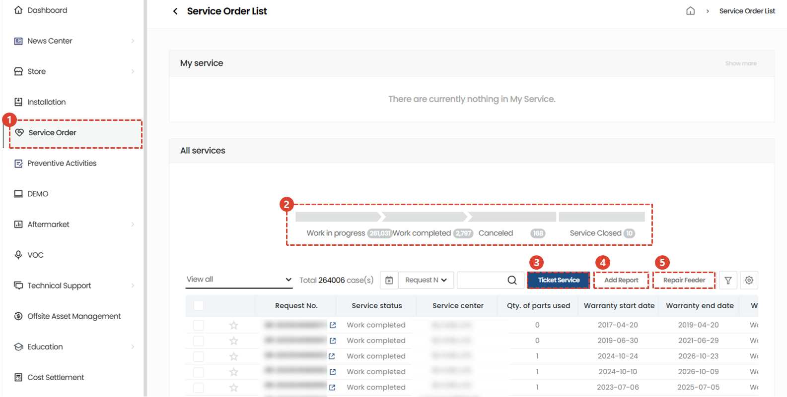
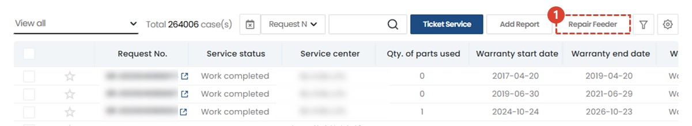
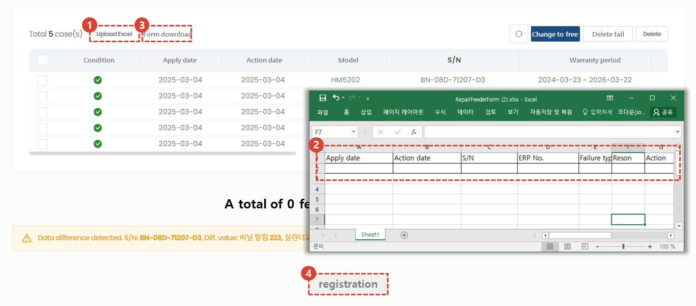

import ValidateTextByToken from "/src/utils/getQueryString.js";
import StrongTextParser from "/src/utils/textParser.js";
import text from "/src/locale/ko/SMT/tutorial-01-auth/create-a-acount-circle-user.json";

# Feeder repair

We guide you through the process of registering and processing your feeder repair request.
<ValidateTextByToken dispTargetViewer={true} dispCaution={false} validTokenList={['head', 'branch', 'agent']}>

## List of services

1. Select Service Order.
1. A list of all services is displayed.
      - Processing : Indicates the number of services being processed. When clicked, only the list being processed is displayed. 
      - complete : Indicates the number of services that have been completed. When clicked, only completed services are displayed in the list.
      - cancellation : Indicates the number of cancelled services. When clicked, only the cancelled services are displayed in the list.
      - closing : This shows the number of services that were terminated without being processed through the normal process after receiving the service. When clicked, only the terminated list is displayed in the list.
1. receipt : You can register for general service reception.
      - This is suitable for use when you only register applications first or when there is a separate administrator who receives and registers applications.
1. Performance registration : You can input everything from service reception to processing details at once.  
      - It is suitable for use when you need to enter the reception and work details at once after the service work is completed.
1. [Feeder repair](./create-a-service-order_feeder.md) : Proceed when you need to enter service history for multiple assets, such as feeders. Unlike reception and performance registration, you register the service by entering only the reception date and action date without adding the time required for movement/work/meals.

## Feeder repair service application

1. Select Feeder Repair.

1. Select Download Form to download the feeder repair form.
1. Fill out the service details in the downloaded form and save it.
    :::note
    The date of receipt and the date of action must be entered in the format of '20250301'. The S/N of the feeder must be entered accurately so that the customer information can be retrieved automatically. The service category and service type must be selected from the items written on the right side of the form.
    :::
1. Select Excel upload to register the entered form.
1. Check the entered data and click the performance registration button to complete the application. 

</ValidateTextByToken>