import ValidateTextByToken from "/src/utils/getQueryString.js";
import StrongTextParser from "/src/utils/textParser.js";
import text from "/src/locale/ko/SMT/tutorial-01-auth/create-a-acount-circle-user.json";
import SWUpdate from "./img/024.png";
import Report from "./img/026.png";
import Estimate from "./img/027.png";

# Service processing

We will guide you through the process of processing your service order.

<ValidateTextByToken dispTargetViewer={true} dispCaution={false} validTokenList={['head', 'branch', 'agent']}>

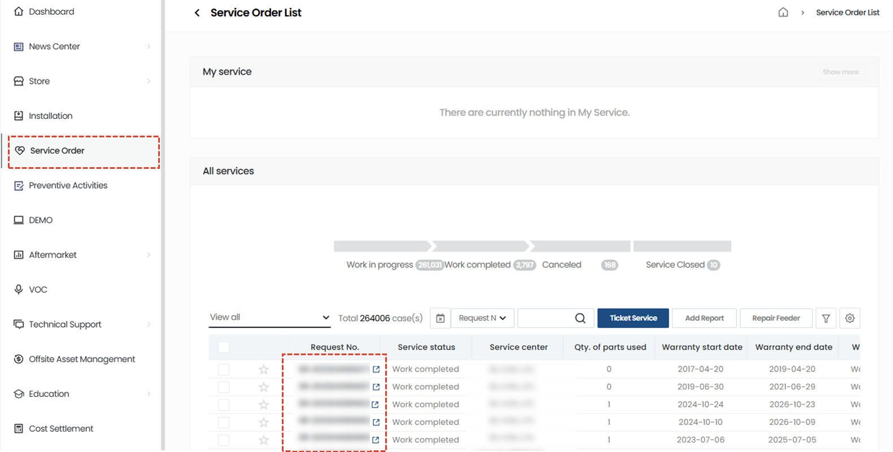

1. Select the [Reception No.] of the service for which you wish to enter service processing details.

## Service processing - 기Basic information
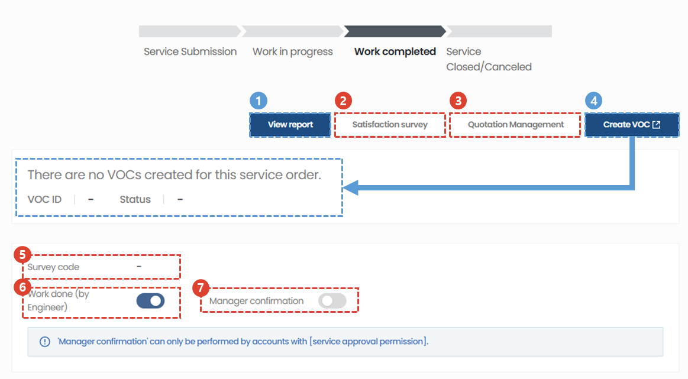

1. **View report** : When the service processing status changes to completed, a View Report button is created, allowing you to download the service report.
    :::info
        A service report in the format shown below is generated. 
        

    :::
1. **Satisfaction Survey** : You can send a service satisfaction survey link via SMS or email to the person who received the service.
1. **Manage quotes** : You can create a service quote or copy and use an existing quote.
    :::info
        You can add a quote by clicking the + button.
        

    :::
1. **VOC** : You can immediately register VOCs that occur during service processing. The progress of registered VOCs can be checked by displaying them at the bottom of the VOC creation button.
1. **Satisfaction Survey Sending Information** : If you select the Satisfaction Survey button, the sending information will appear. 
1. **Work Completed (Payment Request)** : If the service work is completed, click to complete the process and request payment. Once the work is completed, information cannot be modified.
1. **Check the headquarters** : For items that have been completed, you can check with the head office.
    :::warning
        In some regions (e.g. China), free material shipment is only possible after verification by the head office.
    :::

## Service processing - Change facility information
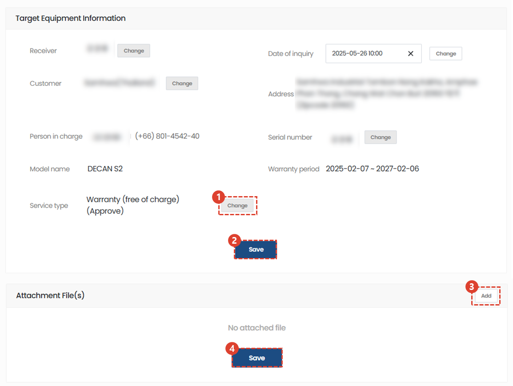
1. If you need to modify the information of the service target facility, click the Change button to modify it.
1. Click the Save button to complete modifying the equipment information.
1. Click the Add button to add reference material for service processing.
1. Click the Save button to complete adding the attachment.

## Service processing - Modify inquiry content and manage dispatch
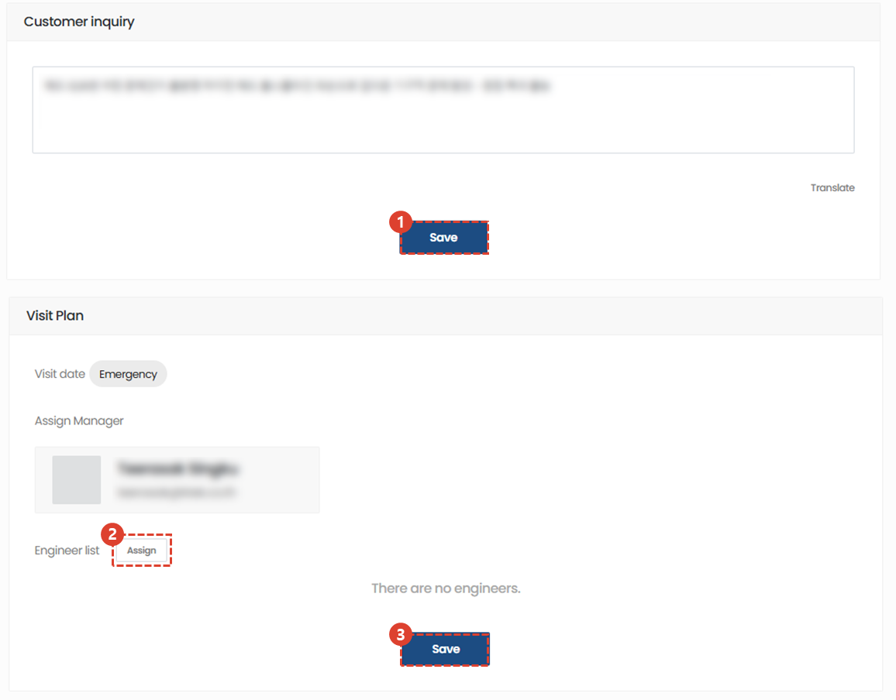
1. If you need to modify the service inquiry details, click the Save button after modifying them.
1. You can modify the list of engineers who will be dispatched.
1. After adding or deleting engineers, click the Save button.

## Service processing - Service History
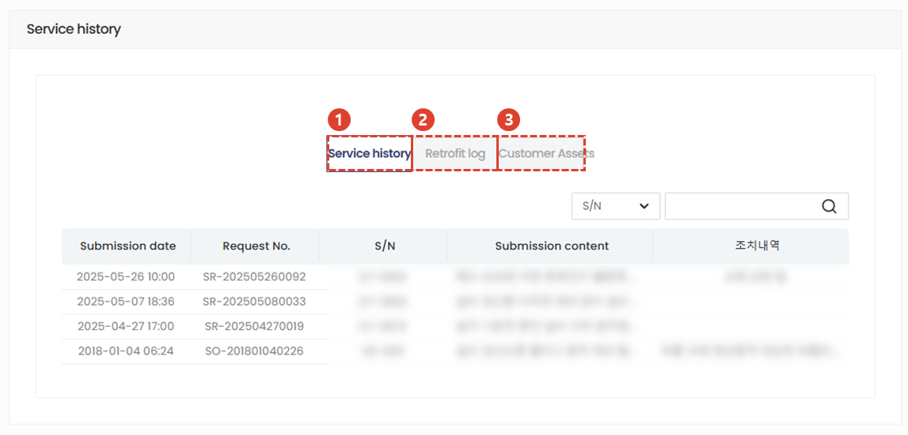
1. Service history is displayed. You can check the date of reception, reception number, S/N, reception contents, action details, service category (details), free service category, assigned engineer, scheduled visit date, action date, customer representative, and customer company name.
1. Preventive activity history is displayed.  You can check S/N, customer, type, center in charge, whether action has been taken, person taking action, and date of action.
1. A list of your holdings will be displayed. You can check S/N, responsible center name, model name, product code, product name, warranty start and end date, and order number.

## Service processing - Add used parts

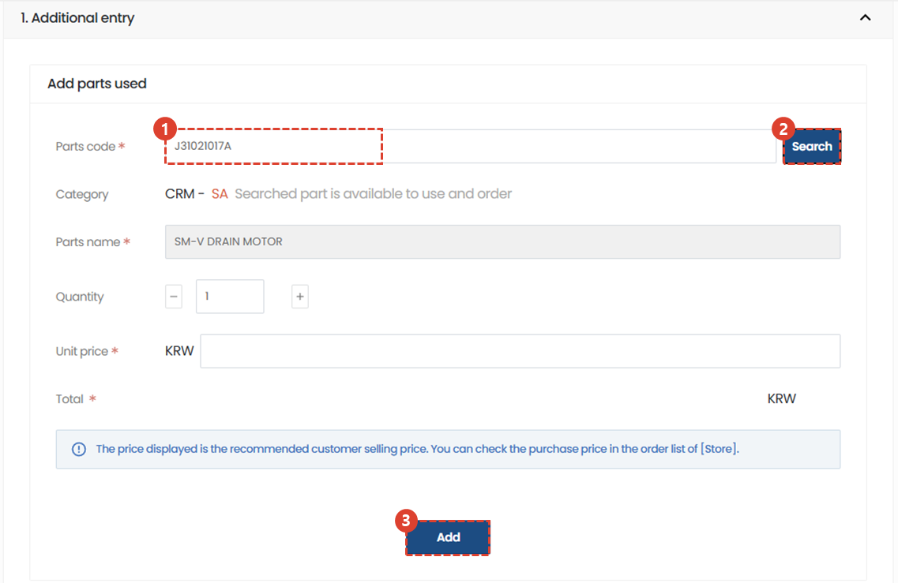

1. Enter the part code you used.
1. Click the Search button.
    :::note
    If the part code is registered in the system, the part name and unit price are automatically entered. If not, the cause is displayed in the classification tab, and you can enter the data directly if necessary.
    :::
    :::info
    **SA** : Service available
     **DNA** : This is a discontinued part that cannot be newly released, but if we have stock, we can use the stock. 
     **SNA** : Parts that are discontinued for service purposes, even if they are in stock
    :::
1. Click Add to register the part.

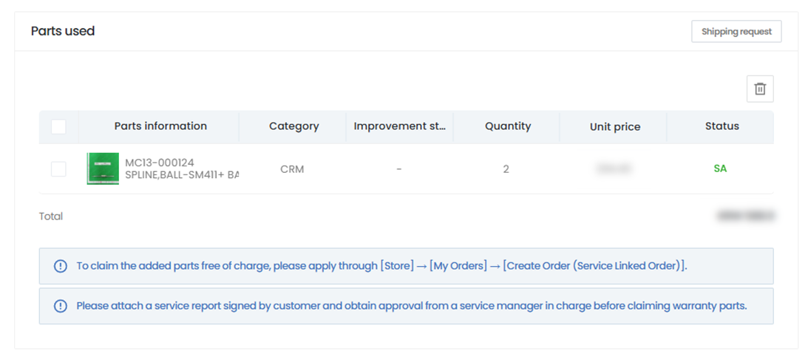
1. Verify that the part is registered properly.

## processing - Action and Verification 1/2

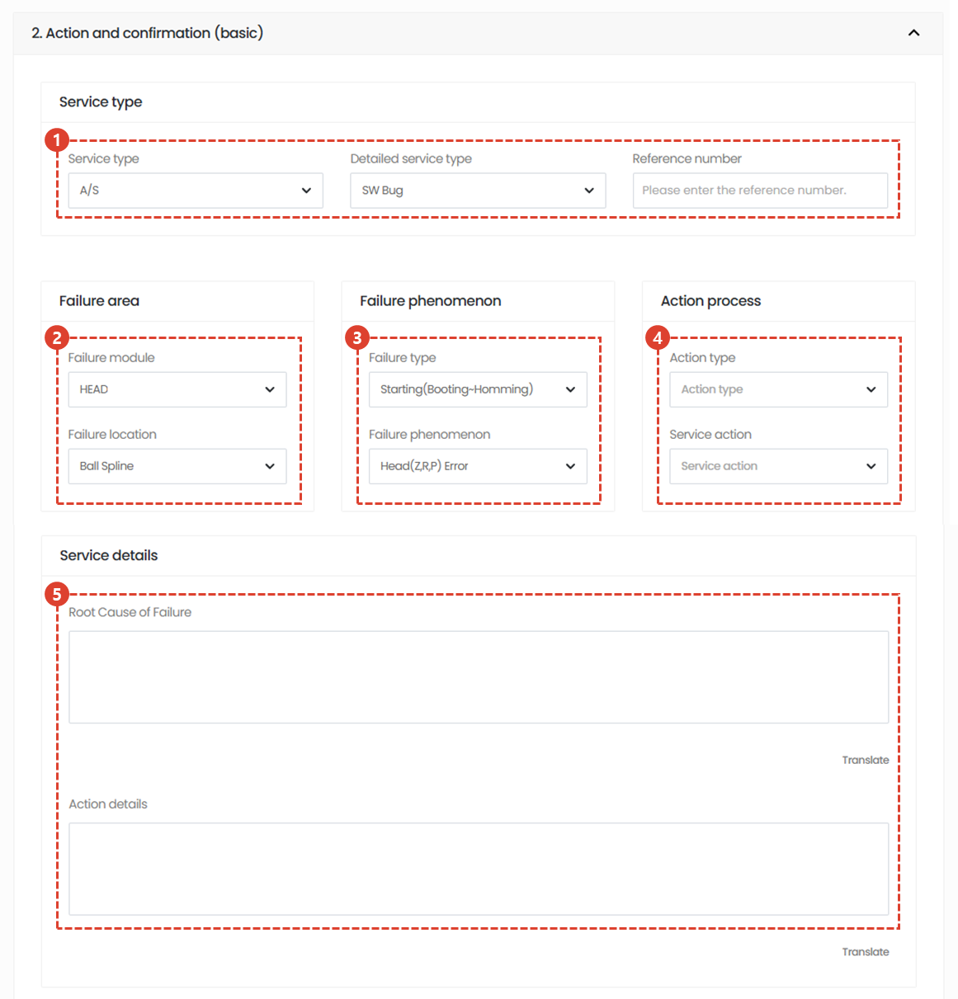
1. Select the appropriate service category. 
1. Select the faulty module and detailed fault location.
1. Select the failure type and phenomenon.
1. Select the action type and task content. 
1. Please write the service details in detail.

## processing - Action and Verification 2/2

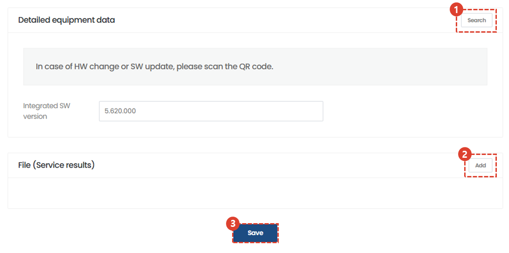
1. If a HW change or SW upgrade occurs while the service is in progress, you can enter version information for version management. Click Search to select the applicable version.
    :::info
    

     When you recognize the QR code of the equipment, you can see a pop-up window on the recognized mobile phone asking whether to reflect the SW information to the recently registered service order, as shown in the image above. When you click the confirmation button, the corresponding data is automatically registered.
    :::
1. Click the Add button to enter attachment files if necessary.
    :::warning
    Please attach files related to the work, such as photos or videos of results or malfunctions that occurred during the service.
     Please refer to Service Processing - 6/6 for inserting a replacement file for the customer reviewer's signature.
    :::
1. Click the Save button to save your actions. 

## processing - Enter working hours

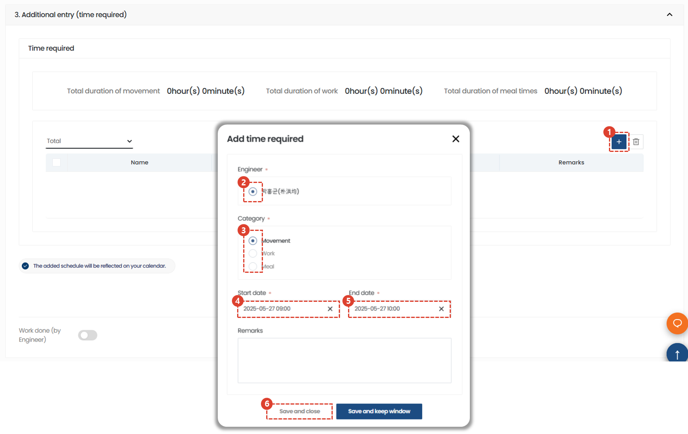
Enter the time required for the service task.
1. Click +.
1. Choose an engineer.
1. Select the time spent category.
1. Enter a start date and an end date. 
1. Click Save to confirm that the time taken has been registered normally.
    :::note
    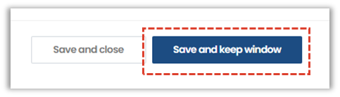
    You can click the button to temporarily save the time input without closing the pop-up window.
    :::
1. Click the Add button to enter attachment files if necessary.
1. Click the Save button to save your actions.

## processing - Specification/Invoice

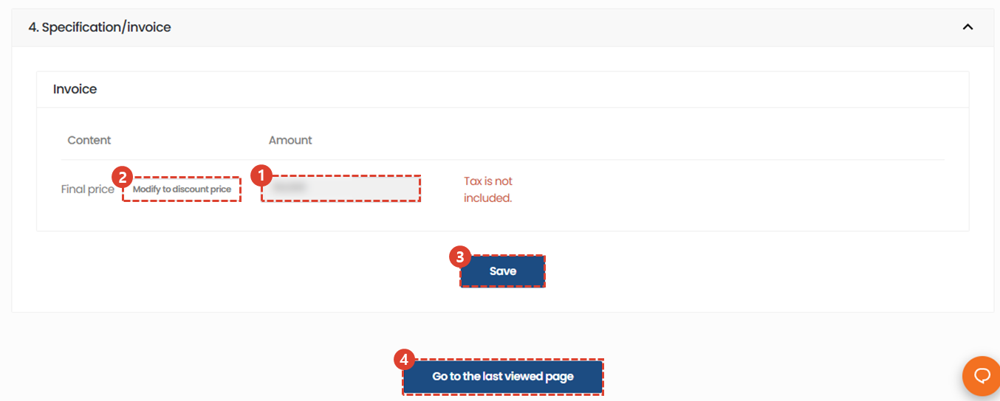

Enter the amount charged for the service work.
1. Check the entered amount. 
1. If you need to modify the final amount, select Modify with Discount to modify the billing amount.
1. Select Save to complete writing the service amount.
    :::note
    A quotation can be issued based on the amount stored in the billing amount.
    :::
1. Select Go to final confirmation page to complete entering information about service processing.

## processing - Final confirmation

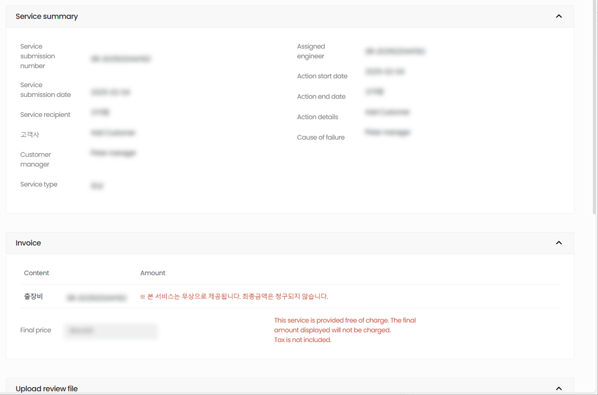

This is the page where you can check the final service details and complete the process by receiving confirmation from the customer reviewer.
1. Check the written content.

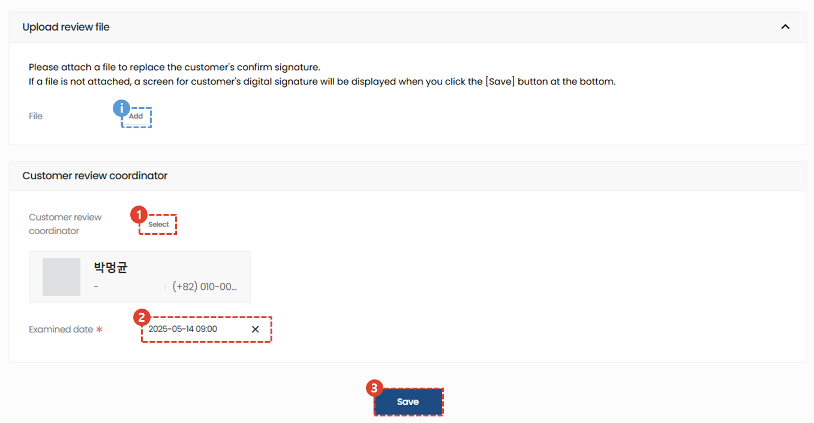

1. Select your client's inspector.
1. Select an inspection date.
    :::warning
    If the digital signature is not effective or the digital signature is not available, you must enter an attachment to replace the signature. Please add the file in the Upload Review File tab.
     :::
1. Click Save.

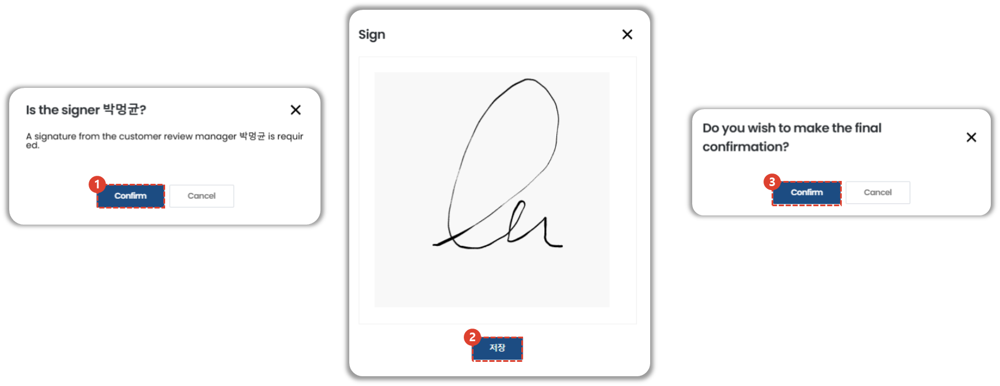
1. Verify the name of the customer reviewer and click Cancel to make any changes if necessary. If the name of the customer reviewer is correct, click OK. 
1. Obtain the signature of the customer's inspector.
1. Click OK to complete the final confirmation.
    :::info
    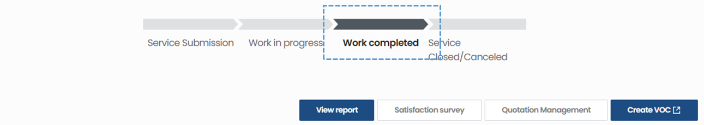
    The status of a service suggestion that has passed final confirmation will change to Completed.
     :::

</ValidateTextByToken>