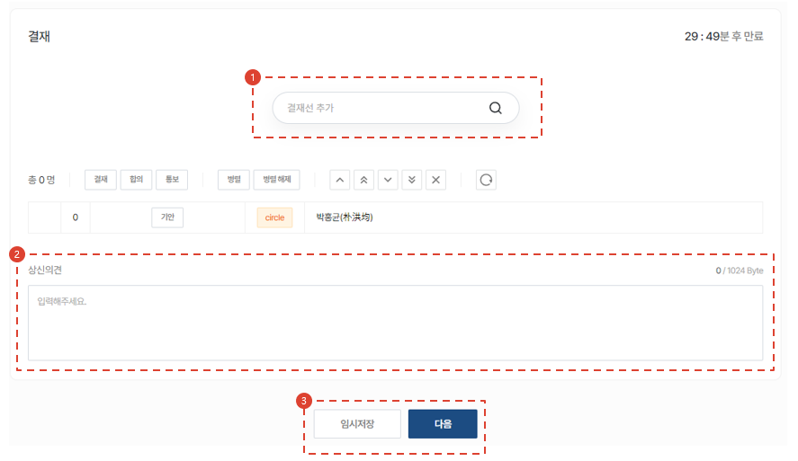

import ValidateTextByToken from "/src/utils/getQueryString.js";
import StrongTextParser from "/src/utils/textParser.js";
import text from "/src/locale/ko/SMT/tutorial-03-store/01-create-order-buyer.json";

# Purchase request

<ValidateTextByToken dispTargetViewer={false} validTokenList={['head', 'branch']}>
This is mainly used when a corporation needs to order parts from its headquarters.  
You can create a paid PO request that was previously issued by a circle in CRM. Check out the simplified paid PO request process in CRM.
<ValidateTextByToken dispTargetViewer={true} dispCaution={false} validTokenList={['head', 'branch', 'agent']} ></ValidateTextByToken>
 
 

## Add order

1. Click Purchase request button
1. Click order button
 
 

## Add Parts

1. You can add PO application parts by searching for part codes.
    :::info
     → Searched normally 
     → Not searching normally (cannot proceed)
    :::
1. Enter the quantity.
1. Enter any special details related to the part you are applying for.
     Example) Related documents, special parts information, delivery address, etc.
1. It will be added when you press the Add button.
1. Bulk upload is possible via Excel.
:::note

1. You can get the excel form. 
1. Add a file by entering data into Excel.  
    - (Required Input)**Parts Code** : Enter the part code.
    - (Required Input)**Quantity** : Enter the number of parts.
    - **Price** : Enter Special Price only when selling at a price other than the regular price. If not entered, the regular price will be automatically applied.
    - **Remarks** : Enter the note details.
:::
 
 

## Check order list and enter information

1. If the value of the Status column is SNA/DNA, the order cannot be processed.
    - If the status is No Information, it means that the material manager has not updated yet, so you can proceed.
1. For SNA/DNA, you can check the improvements. **(TBD)**
1. You can check the order quantity and double-click to modify it.
1. You can check the inventory quantity in the Seller Center.
:::info
    The list list displays parts information/status/improvement status/unit price/order quantity/total/stock as well as responsible center/remarks/MOQ and L/T.
:::

 
 

## Check information on paid PO products

- Check the orderer (drafter) information.
- Enter the reason for issuing the PO and any special details.

1. Attached is the attached file.
1. Enter the text to be entered in the contract information.
    - The information you enter will be used to create the document as follows.
      
        :::note
        The document is output in PDF format.
        :::
1. Click temporary save or order button.
 
 

## Appeal to the Supreme Court (circle approval)

1. Search for payment lines (circle users are searched).
1. Enter your opinion on the product.
1. Click the Complete button to send the payment document to the circle.
</ValidateTextByToken>
