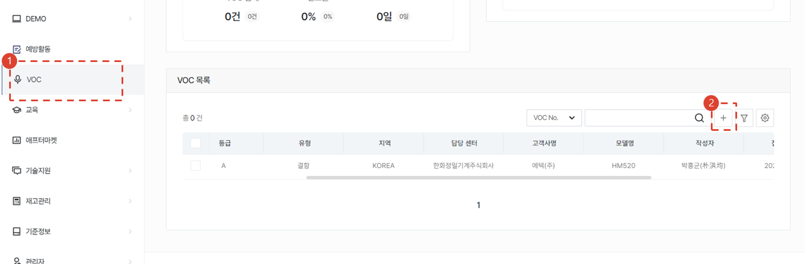
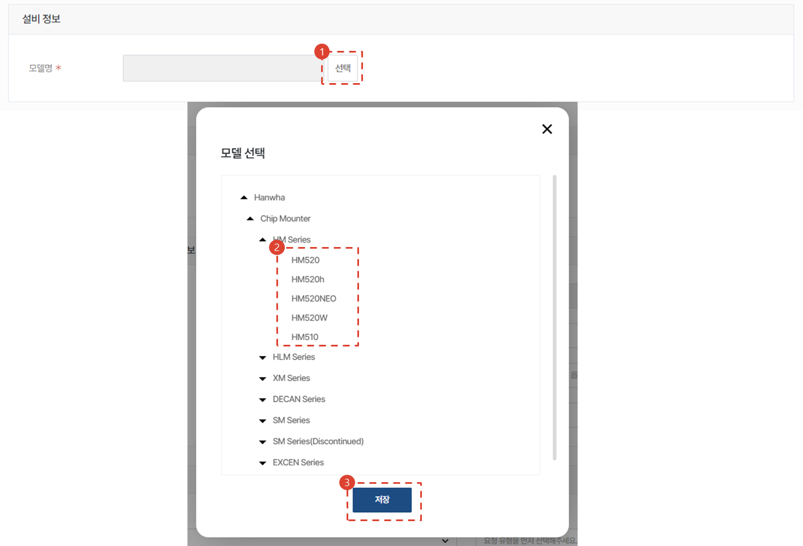
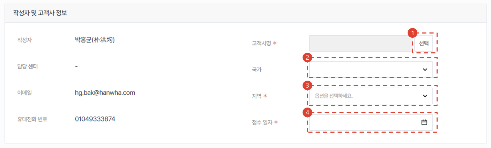
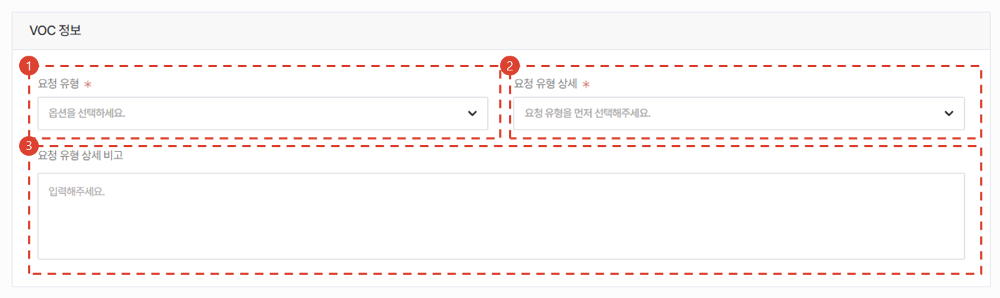
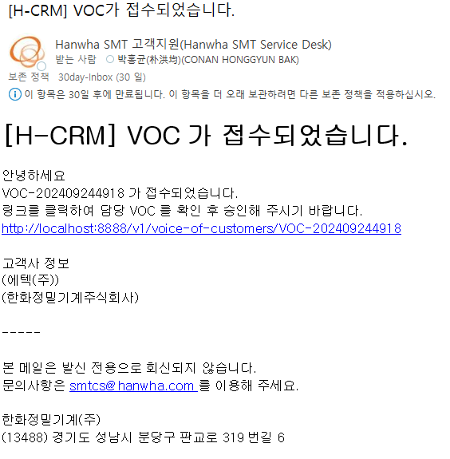
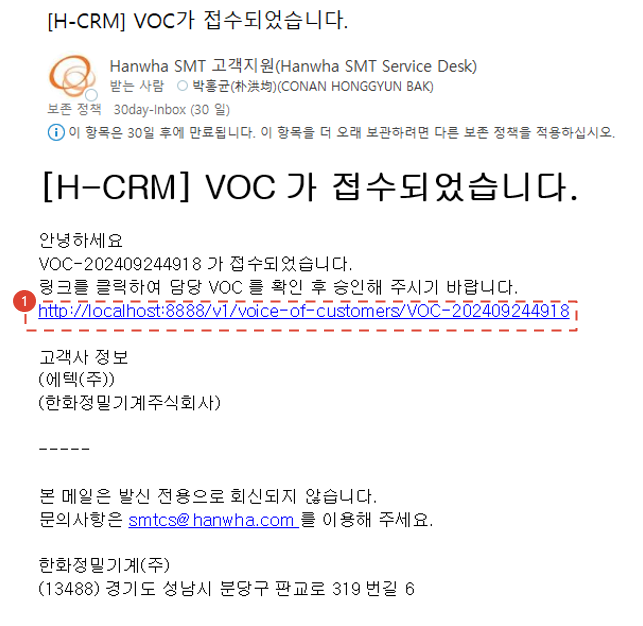

# 주문서 작성

구매하고자 하는 서비스 부품의 주문서 작성 절차에 대해 안내합니다.

## 주문서 목록

1. **스토어** - **내 주문** 메뉴를 선택합니다.
1. 주문 목록을 조회합니다.

## 주문서 목록 - 주문서 상태

- 저장: 주문서가 임시저장된 상태입니다.
- 수정 요청: 판매자가 주문자에게 수정할 것을 요청한 상태의 주문서입니다.
- 주문 접수: 주문자가 주문서를 생성하여 판매자에게 접수된 상태의 주문서입니다.
- 승인: 판매자에 의해 승인된 상태의 주문서입니다.
- 진행중: 승인된 주문서가 주문자에게 납품되는 중에 있는 상태의 주문서입니다.
- 완료: 주문자에게 납품이 완료된 상태의 주문서입니다.
- 취소: 주문자에 의해 취소된 상태의 주문서입니다.

## 주문서 생성

1. **+** 버튼을 눌러 주문서를 생성합니다.
1. 4가지 유형의 주문서 생성 방식 중에서 1가지를 선택합니다.
    - 서비스 연계주문 : 서비스 주문서에 사용된 부품을 주문시 (특히 무상자재 요청시) 활용합니다.
    - 일반주문(1번째): 일반 유상 PO 생성 시 사용합니다.
    - 일반주문(2번쨰): 법인사용자를 위한 메뉴입니다. 법인의 유상 PO 생성시 사용하는 메뉴입니다.
    - 무상출고: (본사전용) 서클에서 작성하는 일반적인 무상출고 품의를 CRM에서 생성하는 것으로 생각해주시면 됩니다.
1. 유형을 선택 후 **주문** 버튼을 클릭합니다.

## 주문서 생성 - 서비스 연계 주문

**서비스주문/설치시운전 프로젝트**에서 사용된 부품에 대한 유/무상 주문서를 생성합니다

:::note
TBD
:::

## 주문서 생성 - 일반 주문

일반적인 유상 서비스 부품 주문서를 생성하는 메뉴입니다.

## 주문서 생성 - 일반 주문 - 주문할 부품 추가

1. 부품코드를 검색해서 PO 신청 부품을 추가할 수 있습니다.
    -  → 정상적으로 검색됨
    -  → 정상적으로 검색지 않음 **(진행 불가)**
1. 수량을 입력합니다
1. 신청할 부품과 관련된 특이사항을 입력합니다. 
1. **추가** 버튼을 누르면 추가됩니다.
1. 엑셀로 일괄 업로드가 가능합니다.
1. 엑셀 양식을 받을 수 있습니다.
1. 업로드 결과를 확인 후 **적용** 버튼을 누릅니다.

## 주문서 생성 - 일반 주문 - 주문 목록 확인

1. 상태 열의 값이 SNA/DNA 인 경우 주문서 진행이 불가합니다. 
    - 상태가 **정보없음** 인 경우 자재 담당자의 업데이트가 아직 안된 것으로 판단하여 진행이 가능하도록 하였습니다.
1. SNA/DNA의 경우 개선품을 확인할 수 있습니다. **(TBD)**
1. 주문수량을 확인하고 **더블 클릭** 하여 수정할 수 있습니다.
1. 비고란을 더블클릭하여 수정할 수 있습니다.
1. **판매자 센터**의 재고 수량을 확인할 수 있습니다.

## 주문서 생성 - 일반 주문 - 추가 정보 입력 및 주문서 생성

1. 주문서의 전체적인 비고사항을 입력합니다.
1. 첨부파일이 있는 경우 파일을 추가합니다.
1. 주문서가 확정적이지 않은경우 임시 저장을 누릅니다. 

:::note
임시저장상태에서 판매자와 소통이 가능합니다. 
예시: 부품확정을 하기 어려운 경우 구매할 부품을 확정하기 위해, 개설된 구매자-판매자 간의 소통창구를 활용할 수 있음 
[대화하기](#주문서-생성---일반-주문---임시저장-시)의 4번 절차를 참고해주세요.
:::

4. 주문서를 생성하려면 **주문** 버튼을 누릅니다.

## 주문서 생성 - 일반 주문 - 임시저장 시

1. 임시저장된 주문서의 경우, 목록에서 **저장** 단계에 머무르게 됩니다.
1. 저장된 주문서를 확인할 수 있습니다.
1. 주문 목록과 비고란은 수정할 수 없습니다. 수정하기 위해서는 하단의 **수정** 버튼을 누릅니다.
1. 판매자와 소통을 위한 메시지를 입력합니다.
1. 주문정보가 표시됩니다.
1. 임시저장된 주문서를 주문처리하기 위해서는 **수정**버튼을 누른 뒤 보이는 수정페이지에서 **주문**버튼을 누릅니다.

## 주문서 생성 - 일반 주문 - 주문완료 시

1. 주문을 완료한 주문서의 경우, 목록에서 **주문접수** 단계에 머무르게 됩니다.
1. 주문서를 확인할 수 있습니다.
1. 판매자와 소통을 위한 메시지를 입력합니다.
1. 판매자의 주문서 승인처리 전까지는 주문서를 수정할 수 있습니다.
1. 판매자의 주문서 승인처리 전까지는 주문서를 취소할 수 있습니다.

:::note
- 판매자의 주문서 승인처리 전까지는 주문서를 수정할 수 있습니다.
- 판매자의 주문서 승인처리 전까지는 주문서를 취소할 수 있습니다.
:::