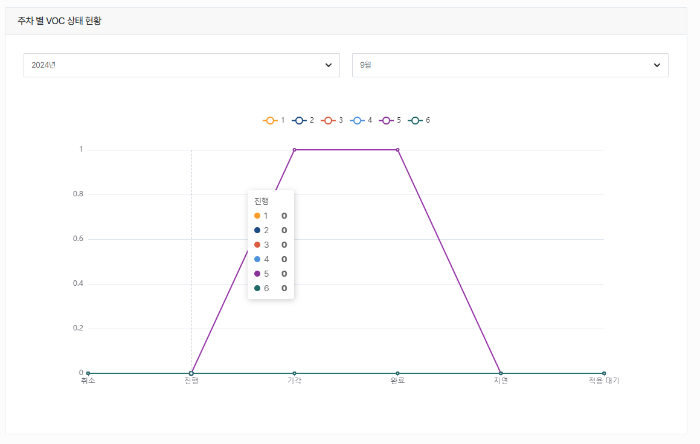
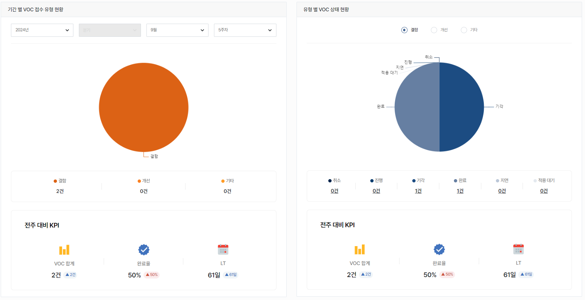

import ValidateTextByToken from "/src/utils/getQueryString.js";

# 개요

<ValidateTextByToken dispTargetViewer={true} dispCaution={false} validTokenList={['head']}>

VOC 현황판에서는 VOC 진척 현황을 살펴볼 수 있습니다.

</ValidateTextByToken>

## 지표 현황

<ValidateTextByToken dispTargetViewer={false} dispCaution={true} validTokenList={['head']}>

### 주차별 현황

 

- 주차별로 VOC 접수 및 처리 현황을 표시합니다.

### 기간 및 유형별 현황

 

- 기간 또는 유형에 따라 VOC 접수 및 처리 현황을 표시합니다.

</ValidateTextByToken>