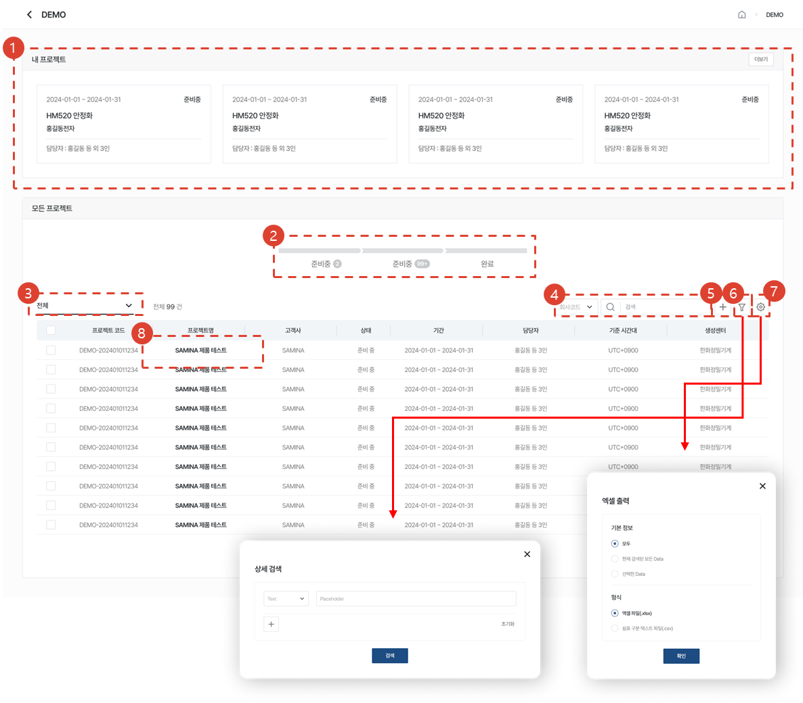

# 프로젝트 목록

데모 평가 프로젝트의 등록 및 관리, 리포팅 절차에 대해 안내합니다.

1. 내 프로젝트 : 내가 담당자로 지정된 프로젝트를 확인할 수 있습니다.
1. 프로그레스 바 : 상태별 프로젝트 수를 확인하고, 클릭해 해당 상태의 프로젝트만 확인할 수 있습니다.
1. 필터 : 내 회사의 프로젝트, 내가 생성한 프로젝트 등 다양한 조건의 결과만 조회합니다.
1. 검색 : 프로젝트 코드, 프로젝트명 등 다양한 유형으로 검색할 수 있습니다.
1. [+] 버튼 : 프로젝트를 생성합니다.
1. 상세검색 : 여러 조건을 한 번에 검색할 수 있습니다.
1. 테이블 설정 : 엑셀 출력, 테이블 관리를 할 수 있습니다. 
1. 프로젝트명 : 프로젝트의 상세로 이동합니다.
