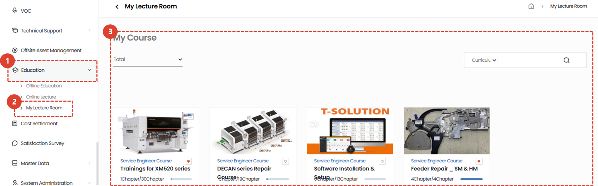
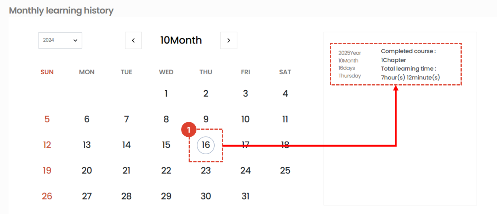
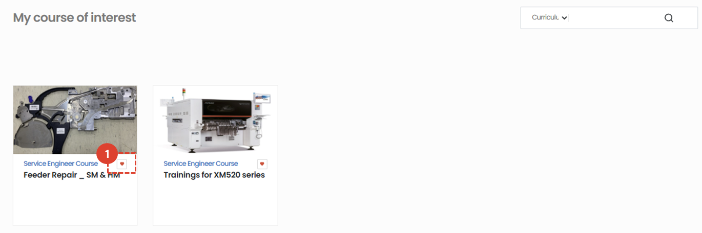

import ValidateTextByToken from "/src/utils/getQueryString.js";

# My Classroom
This page provides information on courses you are currently taking or have completed.

<ValidateTextByToken dispTargetViewer={true} dispCaution={false} validTokenList={['head', 'branch', 'seller', 'agent', 'customer']}>

## My Course

1. Click the **Education** menu.
1. Click **My Classroom**.
1. You can check the list of **online courses** you are currently taking.  Click on a course to watch the video.
 
 

## Monthly Learning History

1. You can check the number of completed lectures and total learning time for your monthly studies.
 
 

## My Interested Courses

1. This is a list of courses with the **♡** button clicked. Clicking it again will remove it from My Interested Courses.
 
 

## Recommended Courses

1. **Recommended Courses** related to the student are provided. Clicking on them will take you to the detailed page and allow you to register for the course.

</ValidateTextByToken>