import ValidateTextByToken from "/src/utils/getQueryString.js";

# 교육 관리

교육 관리

<ValidateTextByToken dispTargetViewer={true} dispCaution={true} validTokenList={['head', 'branch']}>

## 온라인 교육

### 목록

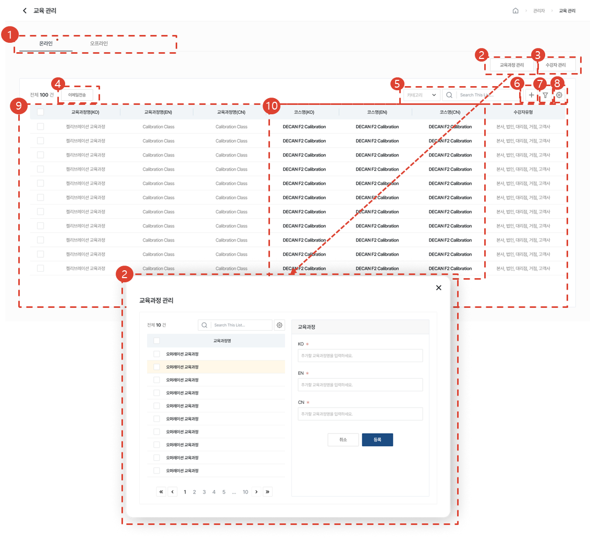

1. 온라인 / 오프라인 탭을 선택해 이동할 수 있습니다.
1. [교육과정 관리] 버튼을 클릭 시, 교육과정 관리 모달이 나타납니다. 교육과정을 등록, 수정, 삭제할 수 있습니다. 
1. [수강자 관리] 버튼을 클릭 시, [온라인 수강자 관리] 페이지로 이동합니다. 
1. 온라인 교육을 1개 선택 후, [이메일 전송] 버튼을 클릭하여 코스 상세 링크를 이메일로 전송할 수 있습니다. 이때 보내지는 링크는 사용자단의 코스 상세 즉, 수강신청을 할 수 있는 페이지입니다. 
1. Selectbox의 유형을 선택 후, 원하는 검색어로 검색할 수 있습니다.
1. [추가] 버튼을 클릭하여 코스를 등록할 수 있습니다.
1. [필터] 버튼을 클릭하여 상세 검색을 할 수 있습니다. 
1. [톱니바퀴] 버튼을 클릭하여 온라인코스 삭제, 테이블 관리, 엑셀다운로드를 할 수 있습니다.
1. 등록된 코스 목록을 볼 수 있습니다.
1. [코스명]을 클릭하여 [코스 상세]페이지로 이동합니다.

### 이메일 전송

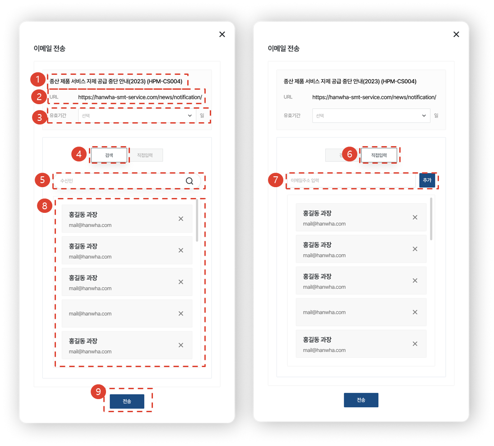

1. 코스 제목이 표시됩니다.
1. 공유할 코스 상세 링크가 표시됩니다. 이때 코스 선택은 [업무메뉴관리 > 온라인 교육관리]에서 하지만, 첨부되는 링크는 사용자단의 코스 상세입니다. 링크를 전송받은 사용자가 코스를 둘러보고, 수강신청을 할 수 있게 하기 위해서 입니다. 
1. 유효기간을 선택 할 수 있습니다. 링크를 전송받은 사용자는 유효기간 내에 링크를 통해 [코스 상세]에 접근할 수 있습니다.
1. [검색] 탭을 선택 시, 한화 그룹웨어 내에 존재하는 이름, 이메일을 검색할 수 있습니다. 
1. 이름 또는 이메일 검색하면 일치하는 항목이 드롭다운에 표시됩니다. 선택 시, 하단 목록에 추가됩니다. 
1. [직접입력] 탭을 선택 시, 링크를 공유하고 싶은 이메일을 자유롭게 입력할 수 있습니다. 
1. 이메일을 입력 후, [추가] 버튼 클릭 시, 하단 목록에 추가됩니다. 
1. 이메일을 전송받을 사용자 목록이 표시됩니다. 그룹웨어에서 검색한 사용자는 이름, 직책, 이메일이 표시되고 직접입력한 경우 이메일만 표시됩니다. X를 클릭하여 사용자를 삭제할 수 있습니다. 
1. [전송] 버튼 클릭 시, 사용자들에게 이메일이 전송됩니다. 

### 코스 등록

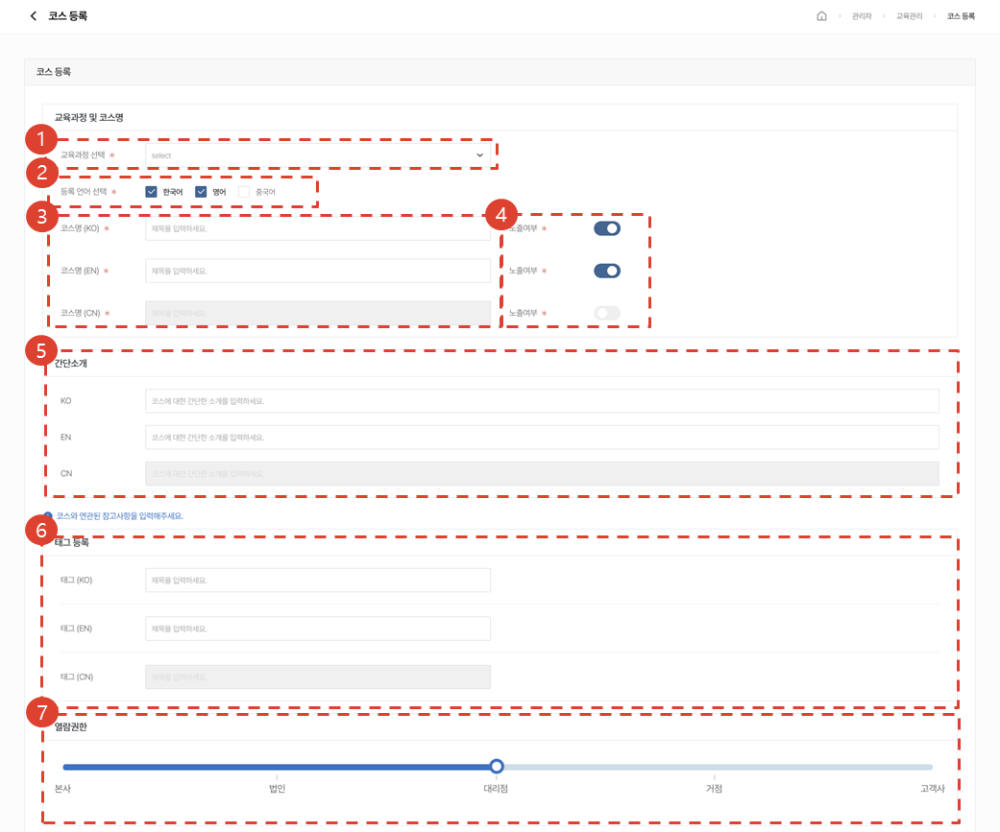

1. 교육과정을 선택할 수 있습니다.
1. 한/중/영 중 등록하고자 하는 언어를 선택할 수 있습니다. 선택하지 않은 언어는 코스명, 간단소개, 노출여부 설정, 태그등록, 썸네일, 비고, 자료실 등록이 Disabled 되어 입력할 수 없습니다. 
1. 코스명을 입력할 수 있습니다. 
1. 사용자단에 코스 노출여부를 선택할 수 있습니다. 임시저장 기능입니다.
1. 코스의 간단소개를 작성할 수 있습니다. 작성된 내용은 사용자단의 [교육 > 온라인 교육 > 온라인 강의]의 코스 카드에서 확인할 수 있습니다. 
1. 코스와 관련되어 참고하면 좋을 내용을 자유롭게 입력할 수 있습니다.  Ex) 인기강의, 필수, HM520 등
1. 코스를 열람할 수 있는 회사유형을 선택할 수 있습니다. 

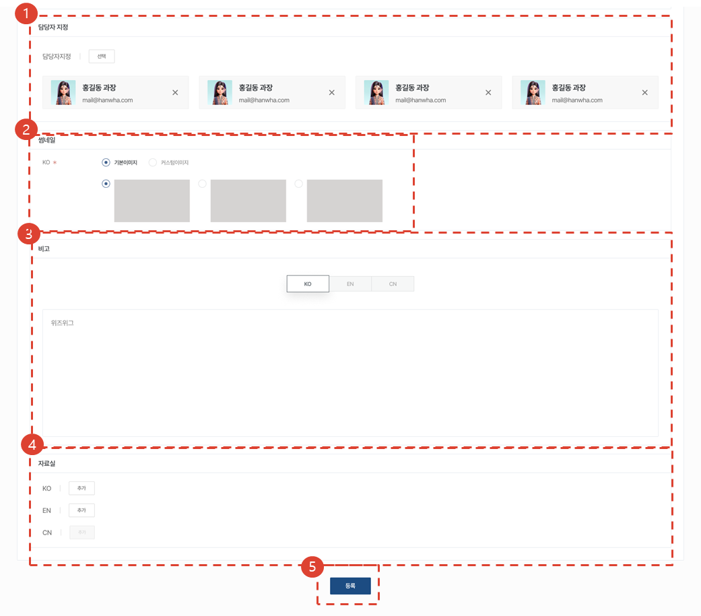

1. 해당 코스에 문의가 작성될 시, 대응할 수 있는 담당자를 지정할 수 있습니다. 지정된 담당자에겐 코스에 문의가 발생할 시, CRM알림과 이메일이 1. 전송됩니다. 
1. 사용자단에 보여질 코스의 썸네일을 기본 이미지와 커스텀 이미지 중 선택하여 등록할 수 있습니다.
1. 코스 소개를 작성할 수 있습니다. 작성된 내용은 사용자단의 [교육 > 온라인 교육 > 온라인 강의 > 코스상세 > 코스소개 탭]에서 확인할 수 있습니다. 
1. 자료를 추가할 수 있습니다. 
1. [등록] 버튼을 클릭하여 코스를 등록할 수 있습니다. 

### 코스 수정

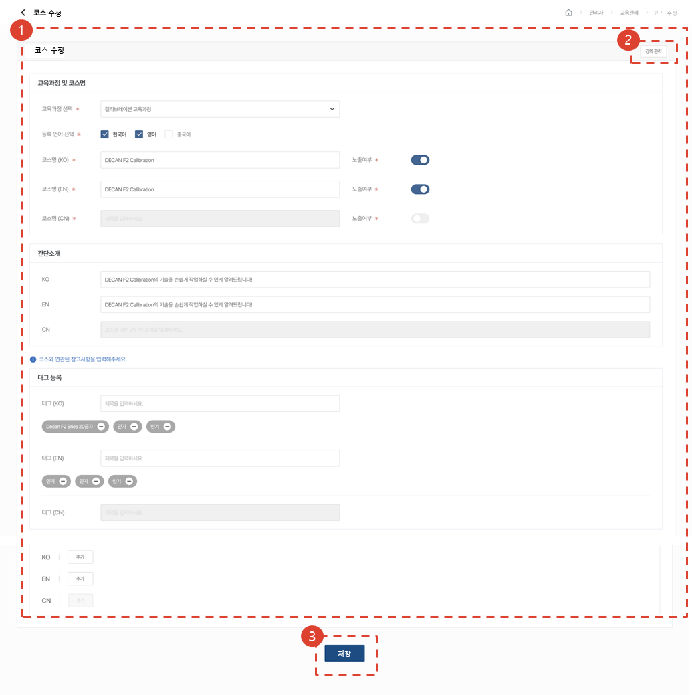

1. 코스를 수정할 수 있습니다. 
1. [강의관리] 버튼을 클릭하여 강의 관리 페이지로 이동할 수 있습니다. 수정사항을 저장하지 않을 시, 저장이 되지 않고 이동됩니다.
1. [저장] 버튼을 클릭하여 수정된 코스를 저장할 수 있습니다. 

### 코스 수정 - 강의관리 - 커리큘럼 등록 / 수정

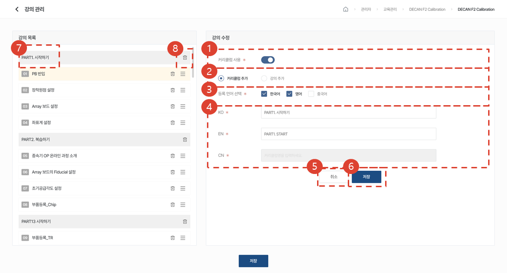

1. 커리큘럼 사용여부를 선택할 수 있습니다. 
1. 커리큘럼을 사용할시, 커리큘럼 추가를 할 수 있습니다. 
1. 코스 등록시 선택한 언어가 강의관리 페이지에도 선택되어 있습니다. 강의관리에서는 별도의 언어선택이 불가하며 해당 언어의 강의가 준비되어있지 않더라도 커리큘럼명은 생성해두어야 합니다. 
1. 커리큘럼명을 입력할 수 있습니다. 
1. [취소] 버튼을 클릭하여 입력값을 초기화할 수 있습니다. 
1. [저장] 버튼을 클릭하여 커리큘럼을 등록할 수 있습니다. 
1. 커리큘럼명을 선택하여 수정화면으로 전환할 수 있습니다.
1. 휴지통 아이콘을 클릭하여 등록된 커리큘럼을 삭제할 수 있습니다. 

### 코스 수정 - 강의관리 - 커리큘럼 사용 강의 등록 / 수정

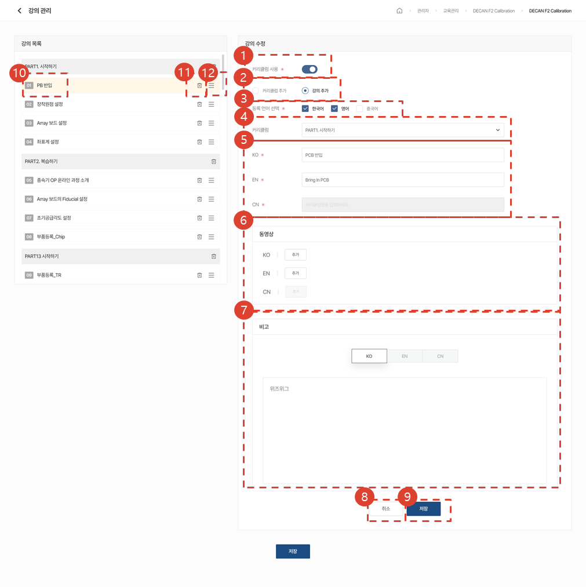

1. 커리큘럼 사용여부를 선택할 수 있습니다. 
1. 강의 추가를 할 수 있습니다. 
1. 등록시 선택한 언어가 강의관리 페이지에도 선택되어 있습니다. 강의관리에서는 별도의 언어선택이 불가하며 해당 언어의 강의가 준비되어있지 않더라도 강의명은 생성해두어야 합니다. 
1. 커리큘럼을 선택할 수 있습니다. 선택한 커리큘럼 밑에 강의가 추가됩니다. 
1. 강의명을 입력할 수 있습니다. 
1. 동영상 파일을 첨부할 수 있습니다. 
1. 비고를 입력할 수 있습니다. 
1. [취소] 버튼을 클릭하여 입력값을 초기화할 수 있습니다. 
1. [저장] 버튼을 클릭하여 강의를 등록할 수 있습니다. 
1. 강의명을 선택하여 수정화면으로 전환할 수 있습니다.
1. 휴지통 아이콘을 클릭하여 등록된 강의를 삭제할 수 있습니다. 
1. 드래그 아이콘을 클릭 후, 드래그하여 커리큘럼내에서 강의순서를 조절할 수 있습니다. 

### 코스 수정 - 강의관리 - 커리큘럼 미사용 강의 등록 / 수정

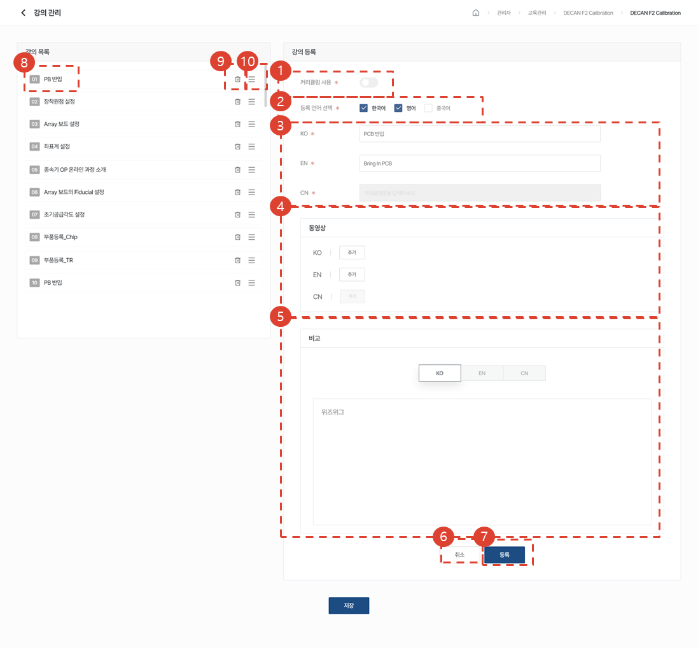

1. 커리큘럼 사용여부를 선택할 수 있습니다. 
1. 등록시 선택한 언어가 강의관리 페이지에도 선택되어 있습니다. 강의관리에서는 별도의 언어선택이 불가하며 해당 언어의 강의가 준비되어있지 않더라도 강의명은 생성해두어야 합니다. 
1. 강의명을 입력할 수 있습니다. 
1. 동영상 파일을 첨부할 수 있습니다. 
1. 비고를 입력할 수 있습니다. 
1. [취소] 버튼을 클릭하여 입력값을 초기화할 수 있습니다. 
1. [저장] 버튼을 클릭하여 강의를 등록할 수 있습니다. 
1. 강의명을 선택하여 수정화면으로 전환할 수 있습니다.
1. 휴지통 아이콘을 클릭하여 등록된 강의를 삭제할 수 있습니다. 
1. 드래그 아이콘을 클릭 후, 드래그하여 강의순서를 조절할 수 있습니다. 

### 수강자 관리

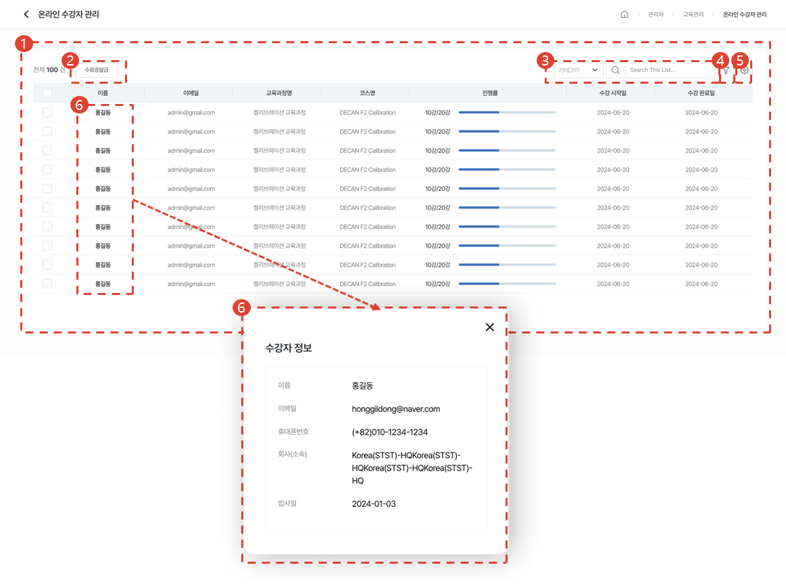

1. 온라인 수강자 목록을 볼 수 있습니다. 
1. 수강자를 선택 후, [수료증발급] 버튼을 클릭하여 수료증을 발급받을 수 있습니다. 
1. Selectbox의 유형을 선택 후, 원하는 검색어로 검색할 수 있습니다.
1. [필터] 버튼을 클릭하여 상세 검색을 할 수 있습니다. 
1. [톱니바퀴] 버튼을 클릭하여 테이블 관리, 엑셀다운로드를 할 수 있습니다.
1. 이름 클릭시, 수강자 정보 모달이 열립니다. 

## 오프라인 교육

### 목록

1. 온라인 / 오프라인 탭을 선택해 이동할 수 있습니다.
1. [교육장 관리] 버튼을 클릭 시, [교육장 관리] 페이지로 이동합니다.
1. [수강자 관리] 버튼을 클릭 시, [오프라인 수강자 관리] 페이지로 이동합니다. 
1. 등록된 오프라인교육 목록을 볼 수 있습니다. 
1. Selectbox의 유형을 선택 후, 원하는 검색어로 검색할 수 있습니다.
1. [추가] 버튼을 클릭하여 오프라인 교육과정을 등록할 수 있습니다.
1. [필터] 버튼을 클릭하여 상세 검색을 할 수 있습니다. 
1. [톱니바퀴] 버튼을 클릭하여 오프라인 교육과정 삭제, 테이블 관리, 엑셀다운로드를 할 수 있습니다.
1. [코스명]을 클릭하여 [오프라인 교육과정 수정]페이지로 이동합니다.

### 목록 - 교육장 관리

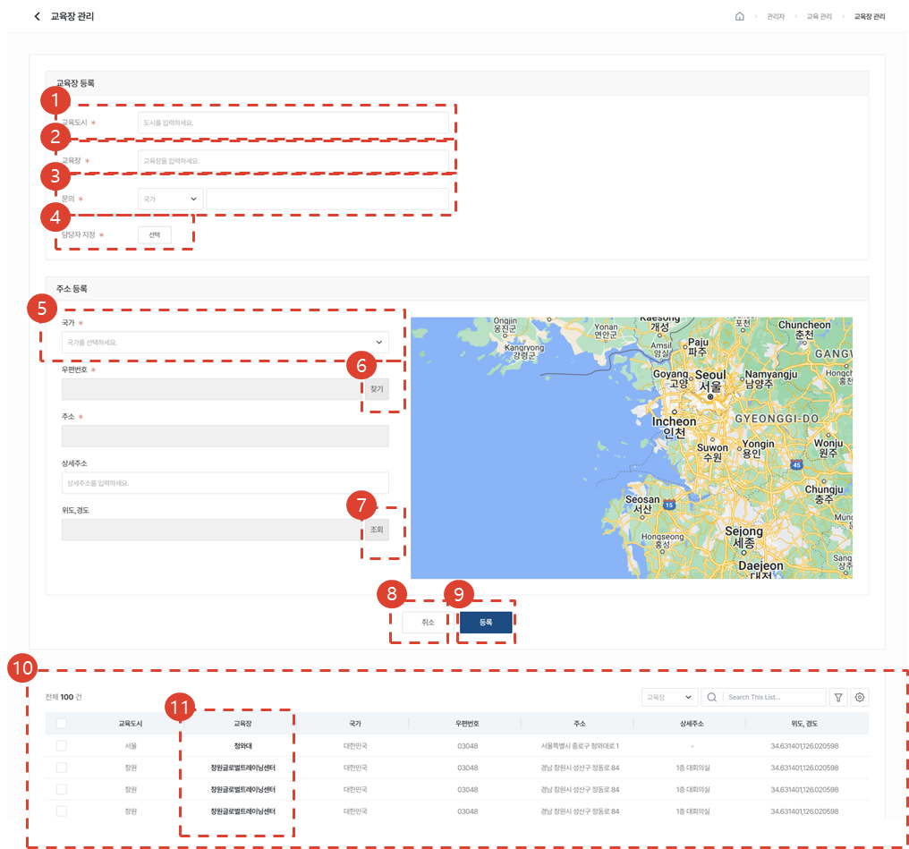

1. 교육이 운영되는 도시명을 입력하세요.
1. 교육이 운영되는 교육장명을 입력하세요.
1. 교육장에 문의할 수 있는 번호를 입력하세요.
1. 해당 오프라인교육과정에 문의가 작성될 시, 대응할 수 있는 담당자를 지정할 수 있습니다. 지정된 담당자에겐 오프라인교육과정에 문의가 발생할 시, CRM알림과 이메일이 전송됩니다. 
1. 교육장이 운영되는 국가를 선택해주세요.
1. 우편번호를 조회할 수 있습니다. 
1. 위도, 경도를 조회할 수 있습니다. 위도, 경도 조회시 정확한 교육장 위치를 지도에 나타낼 수 있습니다. 
1. [취소] 버튼을 클릭 시, 입력값이 초기화됩니다. 
1. [등록] 버튼을 클릭 시, 아래 목록에 등록한 교육장이 추가됩니다. 
1. 등록된 교육장 목록을 볼 수 있습니다. 
1. [교육장명]을 클릭 시, 수정화면으로 전환됩니다. 

### 교육과정 등록

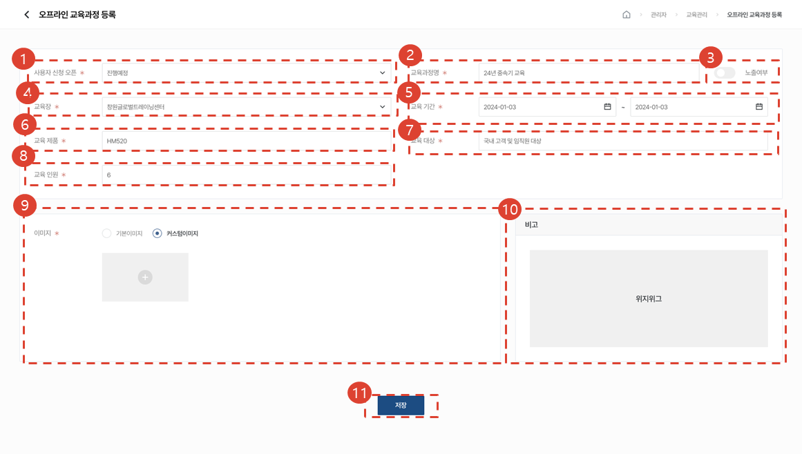

1. 진행예정 / 신청 / 마감 중 선택할 수 있습니다. 진행예정과 마감일 경우, 사용자는 수강신청을 하지 못합니다. 신청일 경우, 사용자는 수강신청을 할 수 있습니다.
1. 교육과정명을 입력할 수 있습니다. 
1. 사용자단에 코스 노출여부를 선택할 수 있습니다. 임시저장 기능입니다.
1. 교육장을 선택할 수 있습니다. 
1. 교육기간을 설정할 수 있습니다. 
1. 교육이 진행될 제품명을 입력할 수 있습니다.
1. 교육이 진행될 대상을 입력할 수 있습니다. 
1. 교육인원을 입력할 수 있습니다. 
1. 사용자단에 보여질 오프라인교육과정 상세페이지의 이미지를 기본 이미지와 커스텀 이미지 중 선택하여 등록할 수 있습니다.
1. 비고를 입력할 수 있습니다. 
1. [저장]버튼을 클릭 시, 오프라인 교육과정이 등록됩니다. 

### 수강자 관리

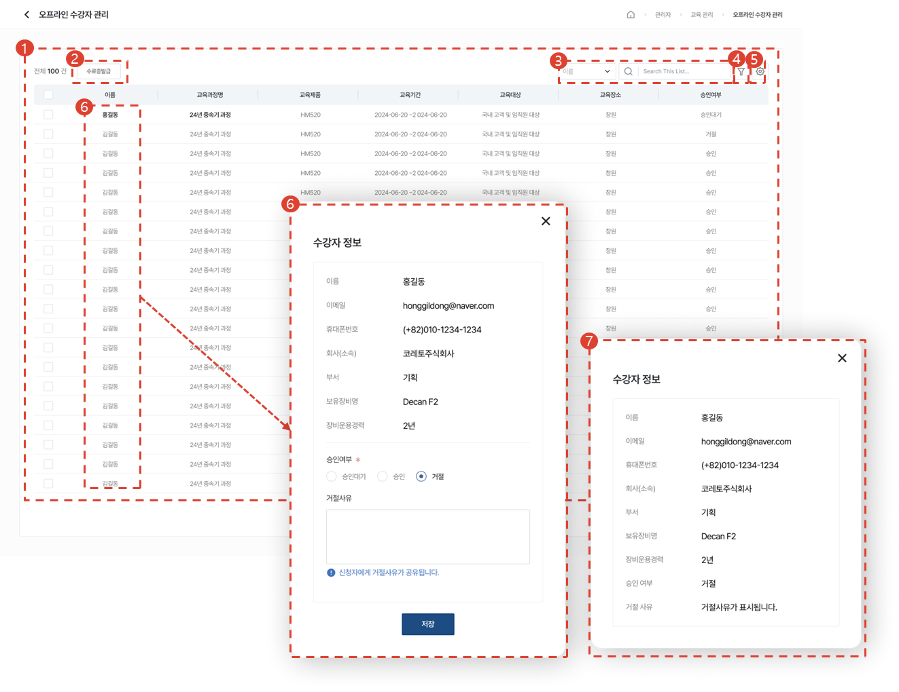

1. 오프라인 수강자 목록을 볼 수 있습니다. 
1. 수강자를 선택 후, [수료증발급] 버튼을 클릭하여 수료증을 발급받을 수 있습니다. 
1. Selectbox의 유형을 선택 후, 원하는 검색어로 검색할 수 있습니다.
1. [필터] 버튼을 클릭하여 상세 검색을 할 수 있습니다. 
1. [톱니바퀴] 버튼을 클릭하여 테이블 관리, 엑셀다운로드를 할 수 있습니다.
1. 이름 클릭시, 수강자 정보 모달이 열립니다. 수강신청에 대한 승인여부를 결정할 수 있습니다. 거절을 선택시, 거절사유를 입력할 수 있습니다.승인 또는 거절을 한 후, 이를 변경할 수 없으며 거절을 당한 수강자는 재신청을 해야 합니다.  
1. 승인 또는 거절을 결정한 수강자명을 다시 클릭 시, 승인여부가 텍스트로 표기된 수강자 정보 모달이 열립니다. 

</ValidateTextByToken>