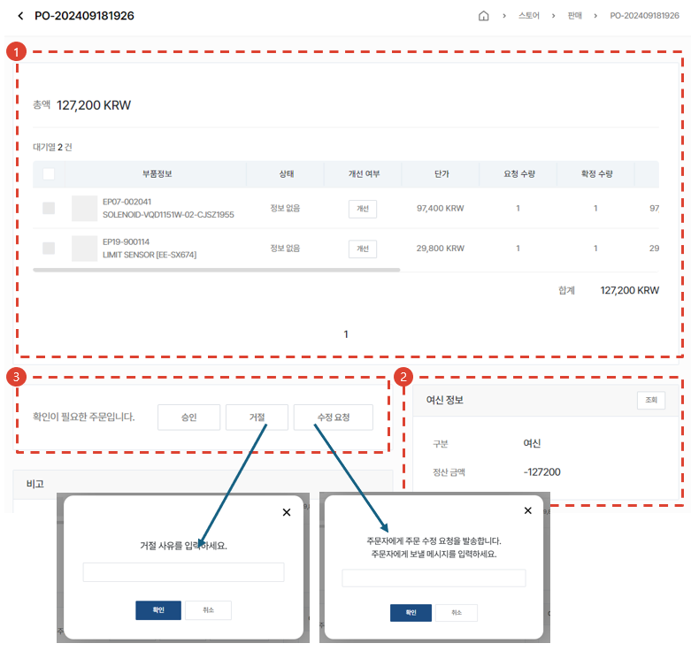

# 주문서 처리

접수된 주문서의 처리 절차에 대해 안내합니다.

## 주문서 목록

1. **스토어** - **판매** 메뉴를 선택합니다.
1. 주문서 목록에서 주문서의 상태를 확인합니다.
1. 주문번호를 눌러 상세페이지로 진입합니다.

## 주문서 목록 - 주문서 상태

- 주문전 문의: 구매자가 주문서를 임시저장해둔 상태입니다.
- 수정 요청: 판매자가 주문자에게 주문서의 수정을 요청한 상태에 있는 주문서입니다.
- 주문 접수: 구매자가 판매자에게 주문을 접수한 주문서입니다.
- 승인: 판매자가 승인한 주문서입니다.
- 진행중: SO가 발행이되면 진행중으로 표시됩니다.
- 완료: 모든 주문 아이템에 DO번호가 부여가 되면 완료로 표시됩니다.
- 취소: 취소된 주문건입니다.

## 주문서 상세

1. 주문 아이템을 확인합니다.
1. 구매자의 여신 정보를 확인할 수 있습니다.
1. 주문서의 상태를 변경할 수 있습니다.
    - 승인: 주문서를 승인합니다.
    - 거절: 주문서가 반려/취소됩니다.
    - 수정요청: 주문서를 수정할 것을 요청합니다.(수량변경, 판가변경, 부품코드 변경등의 사유)
