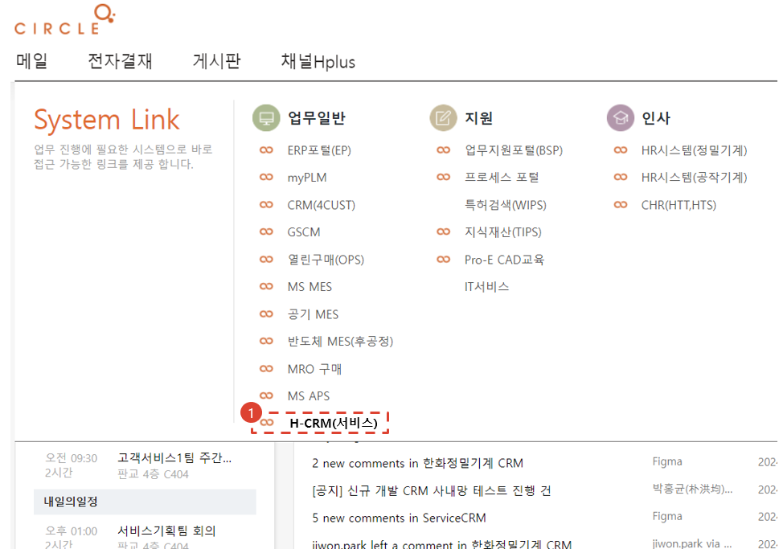
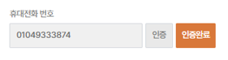

# Creating a CRM Account (for Circle Users)

Here are the steps for creating a CRM account in the intranet.

## System Access Path

1. **H-CRM** link will be added to the work menu on the Circle main screen. **(Scheduled for the second half of `24)**
- **In-house** access
- Click **[Access Link](http://ep.circle.hanwha.com/neo/branch/common/slo/goSloTarget.mvc?authType=1&destination=http://service-qas.hanwha-crm.com:8888/auth/slo)**. - **When accessing from outside**
- Click **[Access link](http://ep.circle.hanwha.com/neo/branch/common/slo/goSloTarget.mvc?authType=1&destination=https://service-qas.hanwha-crm.com/auth/slo)**.

## Account Creation Step 1

1. Enter the Circle User account registration screen. Circle User information is loaded by default, so please check the entered information.
1. Email cannot be modified. Please check your mobile phone number and click the **Authentication** button to proceed with the authentication process. After authentication, the **Authentication Required** status will change to **Authentication Complete** status.   
1. Please check your mobile phone number and click the **Send** button. The authentication number will be sent to the entered mobile phone number via text message.
2. Please enter the authentication number sent via text message and click the **Confirm** button.
1. Please enter the password you will use according to the rules described below. The password you enter here will be used when accessing CRM from outside the company.
    :::note
    - Please enter 8 to 20 characters for a combination of 3 of the following: lowercase, uppercase, special characters, and numbers, and 10 to 20 characters for a combination of 2.
    - Please refrain from using easy passwords such as numbers related to personal information such as date of birth, phone number, and consecutive numbers, as they can be easily figured out by others.
    - Please use a different password from the password you have used or the password you are using on other sites. 
    :::
4. Click the **Next** button.

## Account Creation Step 2

Apply for system usage rights. Please select the appropriate permissions for your work. **(Currently only dummy permissions are displayed - Development to be completed in October 2024)**

1. Select a business unit.
1. If there are many permissions in the permission list, you can search for only the necessary permissions through search.
1. You can reset the search results.
1. You can view in full screen.
1. If there are many permissions to apply for, you can copy other people's permissions.
1. Reset the selected permissions.
1. A description of the selected permissions is displayed.
1. Proceed to the next step.

## Account Creation Step 3

Apply for system usage rights. Please select the appropriate permissions for your work. **(Currently only dummy permissions are displayed - Development to be completed in October 2024)**

1. Recheck the permissions applied in the previous step.
1. To modify permissions, click the **Previous** button.
2. If there are no problems, click the **Next** button.

## Account Creation Step 4

Create a circle approval document for creating an H-CRM account.

1. Search for the approver. (Vice President Kim Se-hyeok)
1. Select **Approval** as the approval type. **(Not set as 'Approval' by default - To be improved)**
1. Enter your submission opinion.
1. Click the **Submit** button.

## Account Creation Complete

1. The message **Payment in progress** will be displayed until payment is completed.
1. The payment document will be sent to the circle.
1. If **rejected**, you will be taken back to the account application screen.