# 프로젝트 상세

데모평가 프로젝트 상세 페이지에 대해 안내합니다.

## 개요

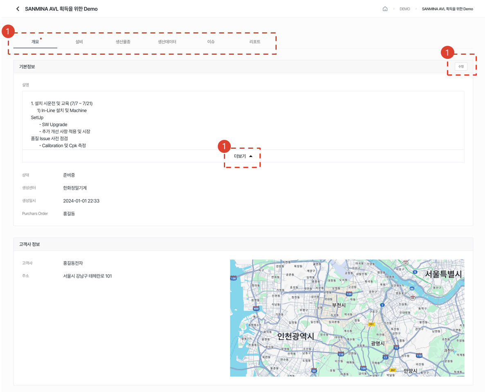

1. 탭 – 각 탭으로 이동합니다.
1. 수정 버튼 – 내용을 수정할 수 있습니다.
1. 더보기 버튼 – 내용이 긴 경우 더보기를 통해 전체 내용을 확인할 수 있습니다.

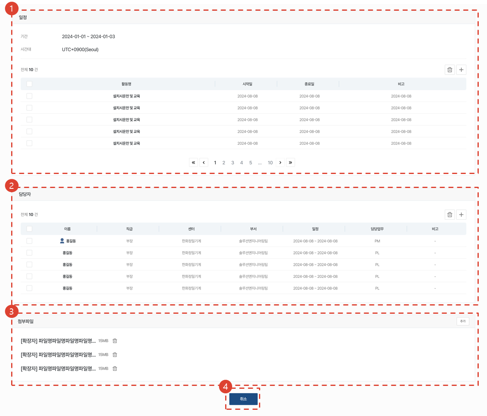

1. 일정 – 일정을 추가/수정/삭제할 수 있습니다.
1. 담당자 – 한화 서클 사용자 중에서 담당자를 선택하거나 선택한 담당자의 정보를 수정, 삭제할 수 있습니다.
1. 첨부파일을 다운로드하거나 추가/삭제할 수 있습니다.
1. 취소 – 프로젝트를 취소합니다.

### 일정

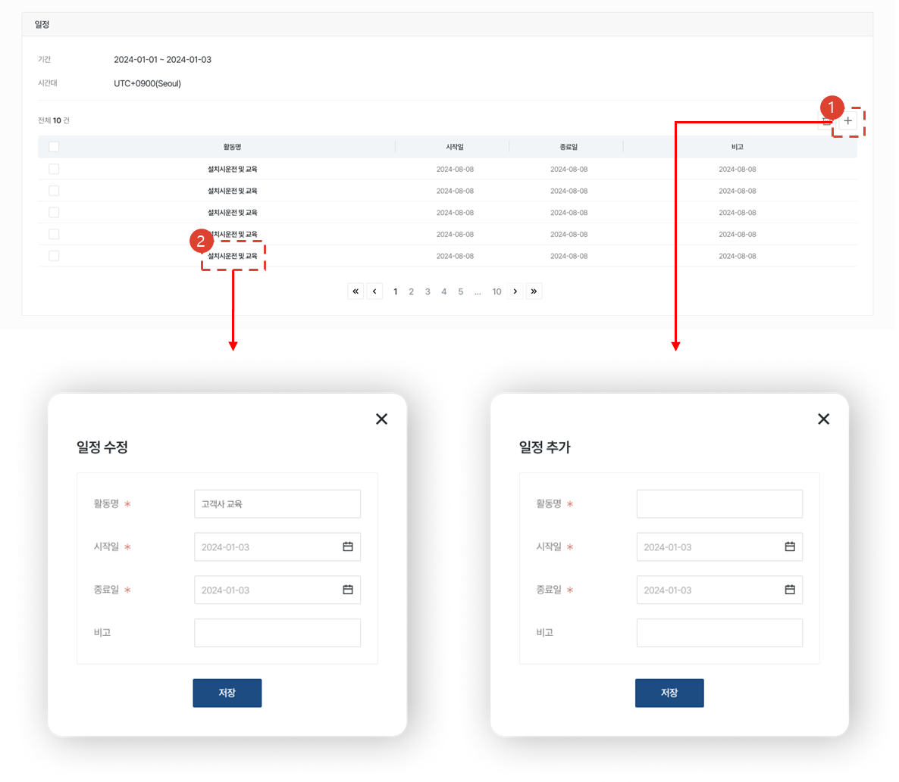

1. 일정 등록 : +버튼을 눌러 프로젝트의 일정을 등록할 수 있습니다.
1. 일정 수정 : 일정명을 눌러 등록한 일정을 수정할 수 있습니다.

## 설비

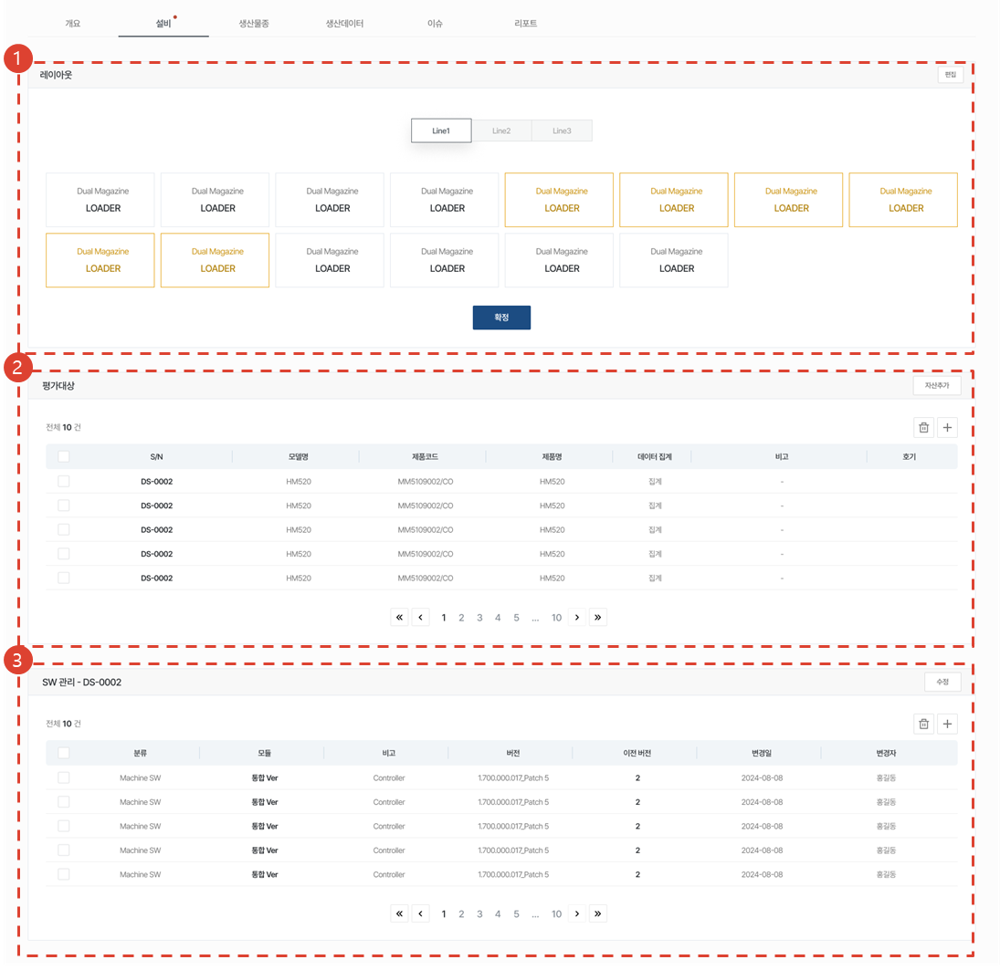

1. 레이아웃 – 현장의 라인 구성 상황을 조회하고 편집할 수 있습니다.
    :::info
    - 노란색은 평가대상입니다.
    - 검정색은 평가비대상입니다.
    :::
1. 평가대상 – 평가대상에 설비 또는 SW를 추가할 수 있습니다.
1. SW관리 – 해당 설비의 탑재된 SW의 정보를 편집하고 버전을 조회, 수정할 수 있습니다.
    :::tip
    - 평가대상에서 S/N를 누르면 표시됩니다.
    :::

### 레이아웃

데모평가 라인의 라인 구성을 설정합니다.

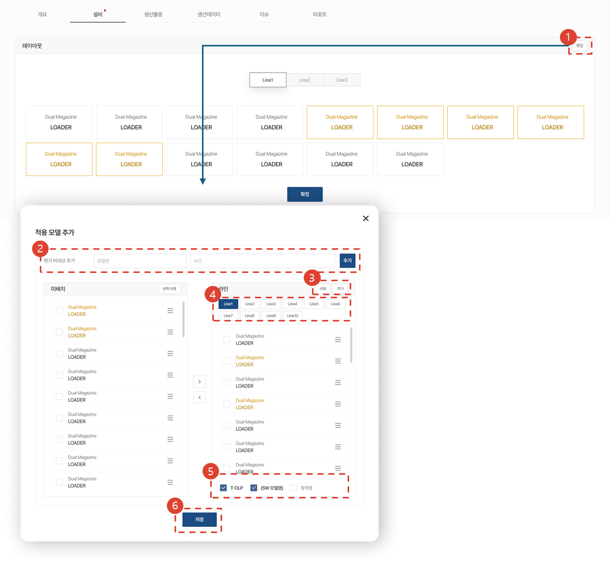

1. **열기** : [편집] 버튼을 누릅니다.
1. **평가비대상 추가** : [모델명] 및 [비고]를 입력하고 [추가] 버튼을 누르면 미배치 목록에 평가비대상이 추가됩니다.
1. 라인 삭제 및 추가
    - **라인 삭제** : 현재 보고 있는 라인을 삭제합니다.
        :::warning 주의사항
        - 라인이 1개인 경우 삭제할 수 없습니다.
        :::
    - **라인 추가** : 새로운 라인을 추가합니다.
1. **라인 선택** : 다른 라인으로 이동합니다.
    :::warning 주의사항
    - 라인이 1개인 경우 표시되지 않습니다.
    :::
1. **라인 SW 정보** : 평가대상으로 등록한 SW가 표시됩니다. 해당 라인에 사용된 SW를 확인할 수 있습니다.
1. **저장** : 편집한 내용을 저장합니다.

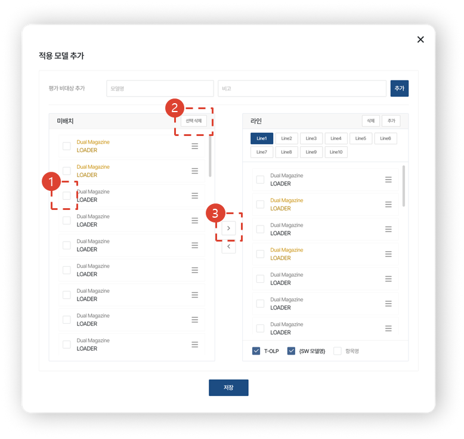

1. 이동시킬 평가대상 또는 평가비대상을 선택합니다.
1. [선택 삭제] 버튼을 누릅니다.
    :::warning 주의사항
    - 평가대상은 해당 화면에서 삭제할 수 없습니다.
    :::
1. [`>`] 버튼을 누릅니다.
    :::warning 주의사항
    - 다른 라인에 등록하려면 라인 선택을 통해 이동해야 합니다.
    :::

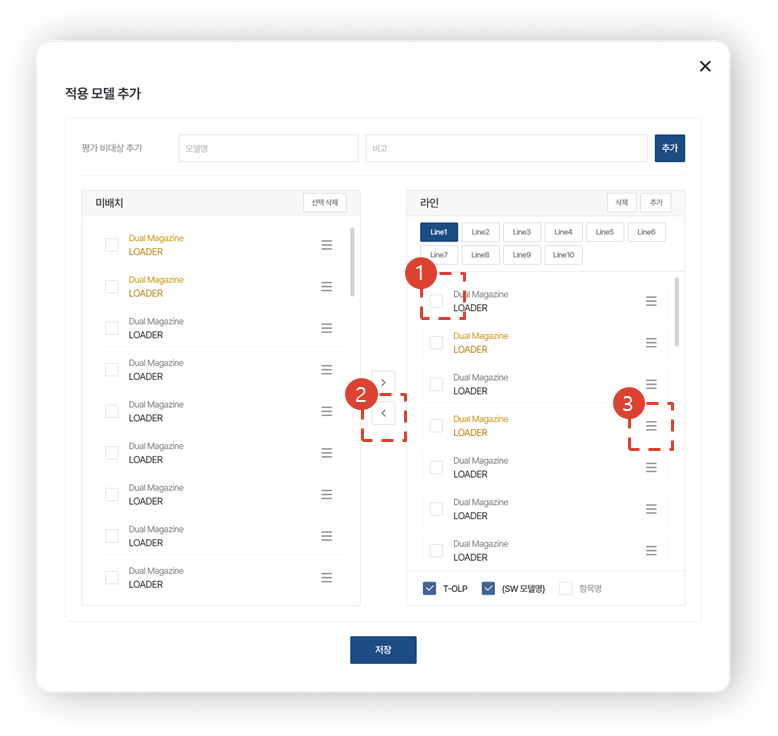

1. 배치된 설비를 선택합니다. 
1. [`<`] 버튼을 누릅니다.
1. 해당 영역을 꾹 누른 상태에서 위 또는 아래로 끌어 순서를 변경합니다.

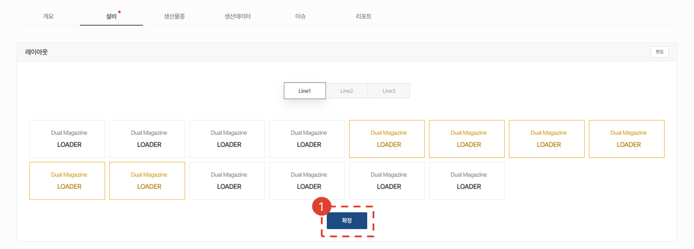

1. [확정] 버튼을 누릅니다.
    :::warning 주의사항
    - 레이아웃 구성이 완료됐다면 반드시 확정해야 합니다.
    - 확정 시 레이아웃 편집이 불가능하며, 등록한 레이아웃대로 ‘호기’ 정보가 평가대상에 부여됩니다.
    - 확정을 취소하면 기존에 등록한 데이터가 삭제됩니다.
    :::

### 평가대상

#### 평가대상 추가

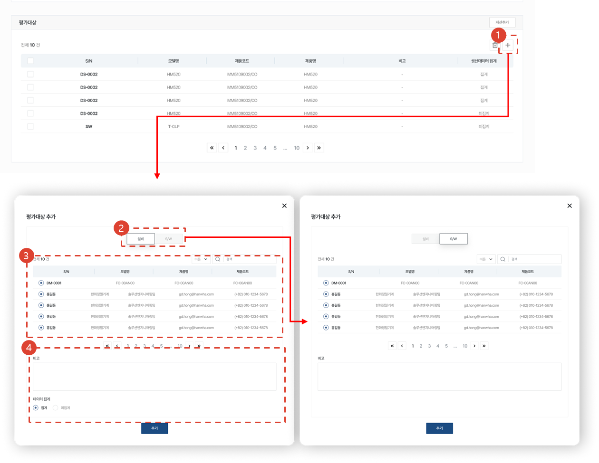

1. [+] 버튼을 눌러 평가대상 추가 화면을 엽니다.
1. 설비와 S/W 중에 추가할 유형을 선택합니다.
1. 목록에서 추가할 설비 또는 S/W를 선택합니다.
    :::tip
    - S/N등으로 검색 할 수 있습니다.
    :::
1. 추가 안내가 필요한 내용을 비고에 입력하고 데이터 집계 여부를 선택합니다.
    :::warning
    - S/W는 데이터 집계를 선택할 수 없습니다.
    :::

#### 평가대상 수정 / 삭제

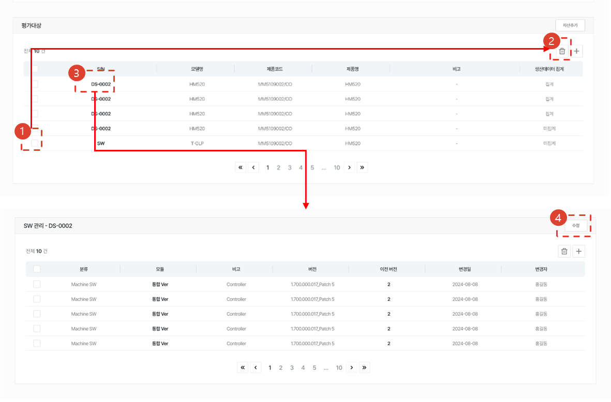

1. 삭제할 평가대상을 선택합니다.
1. [삭제] 버튼을 누릅니다.
1. [S/N]을 클릭하게 되면 SW 관리테이블이 하단에 표시됩니다.
1. [수정] 버튼을 눌러 현재 표시된 평가대상을 수정할 수 있습니다.

### 평가대상 - 자산추가 🚧

### SW 정보

#### SW 정보 추가

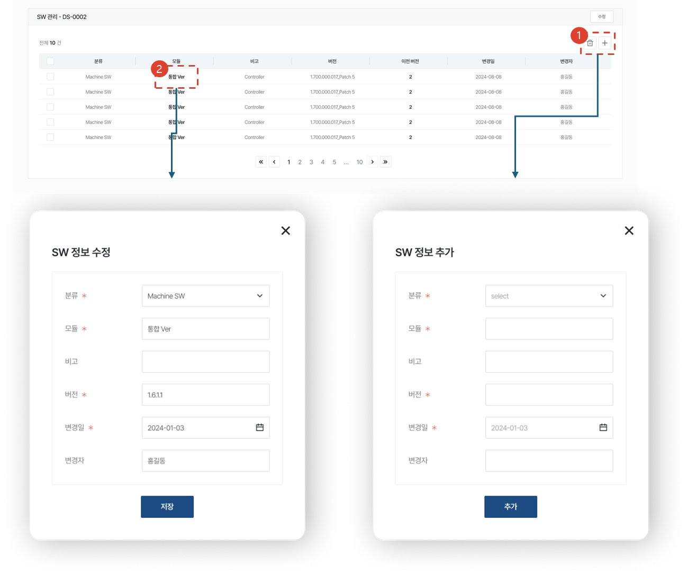

1. SW 추가/삭제
    - 삭제 : 삭제할 항목을 선택하고 [휴지통] 버튼을 눌러 삭제합니다.
    - 추가 : [+]버튼을 눌러 정보 추가 화면을 열어 정보를 입력하고 [추가] 버튼을 누릅니다.
1. 모듈명을 눌러 등록한 SW 정보를 수정합니다.

### SW 버전 관리

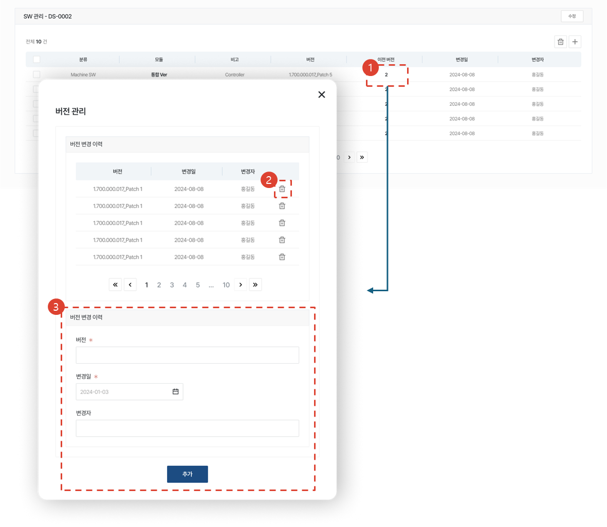

1. 이전 버전을 눌러 버전 관리를 엽니다.
1. 삭제하고자 하는 버전의 ‘휴지통’ 아이콘을 눌러 해당 버전을 삭제합니다.
1. 버전 추가 : 추가하고자 하는 정보를 입력하고 ‘추가‘ 버튼을 눌러 버전을 추가합니다.

## 생산 물종

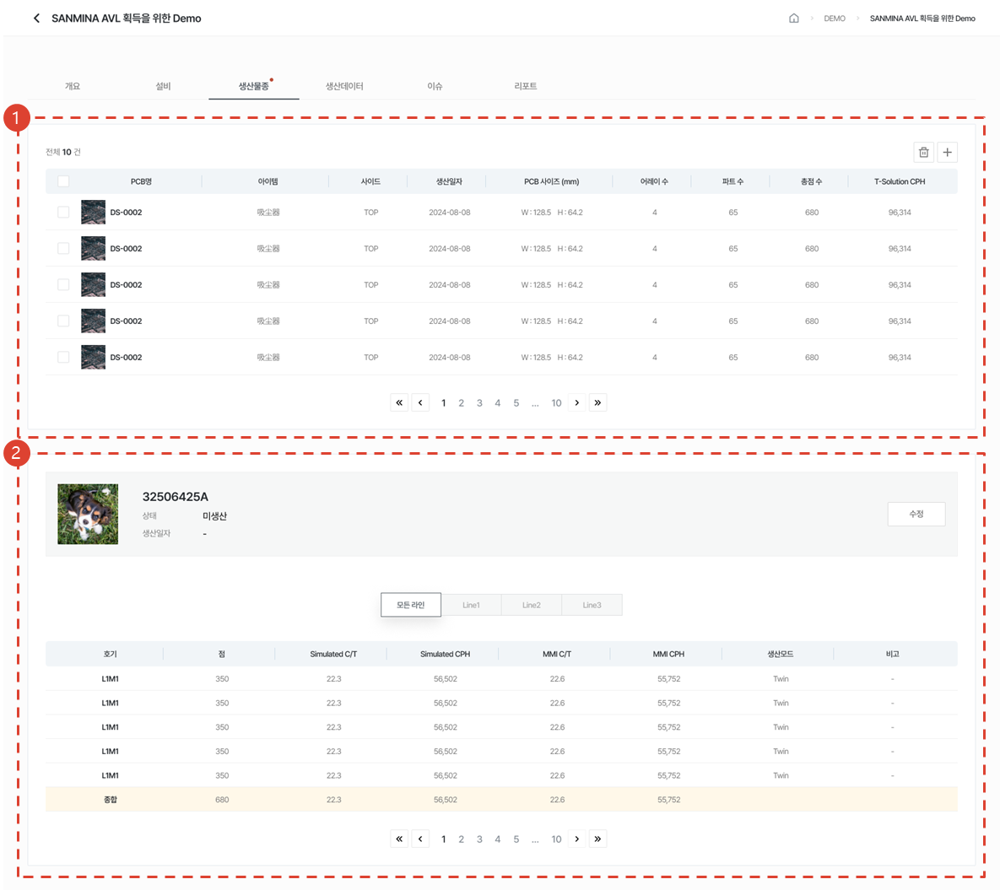

1. **PCB 목록** : 생산할 PCB를 등록하고 관리합니다.
1. **생산 Cycle Time 목록** : 각 라인의 호기별로 점 수, C/T를 관리합니다.

### 생산 물종 추가

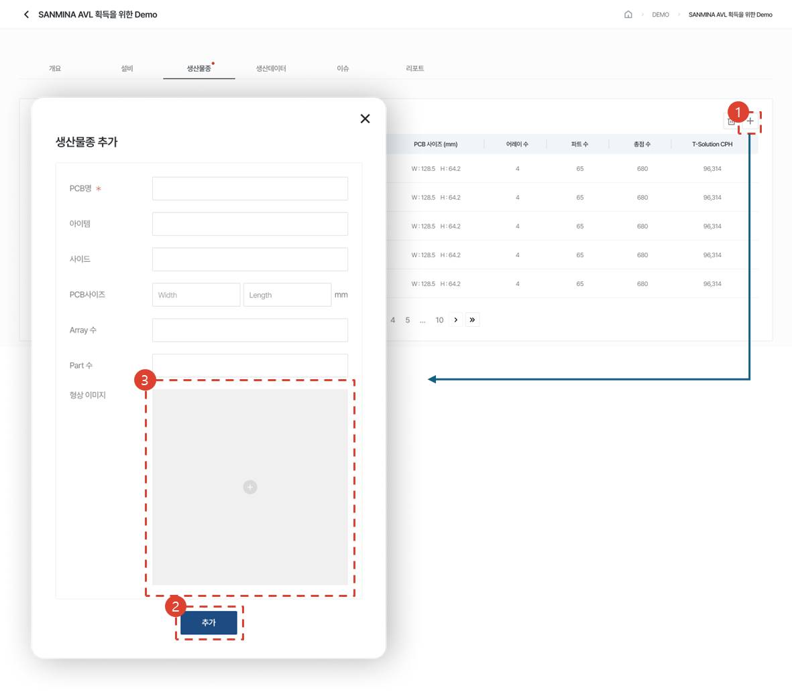

1. 추가 버튼을 눌러 추가 화면을 엽니다.
1. PCB명, 아이템, 사이드, 사이즈 등을 입력하고 추가 버튼을 누릅니다.
1. 사진 추가 영역을 클릭해 형상 이미지를 추가할 수 있습니다.

### 생산 물종 수정 / 삭제

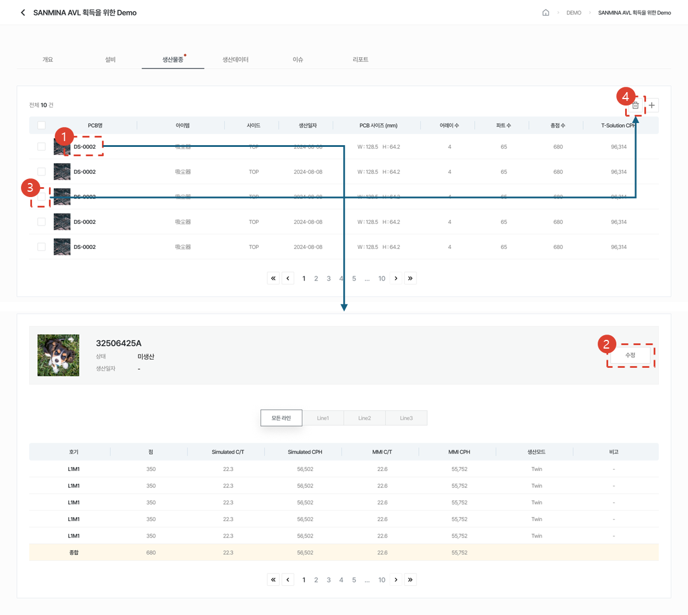

1. PCB명을 눌러 하단 화면에 해당 PCB의 생산 Cycle Time을 엽니다.
1. 수정 버튼을 눌러 수정 화면을 열고, 수정사항을 입력한 후 [저장] 버튼을 누릅니다.
1. 삭제하고자 하는 항목을 선택합니다.
1. [휴지통] 버튼을 누릅니다.

### 생산 Cycle Time 관리

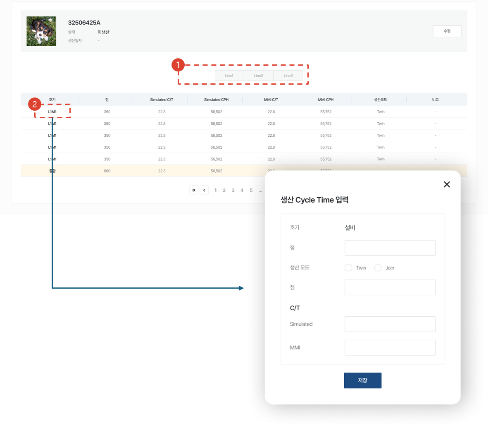

1. **라인 선택** : 라인이 여러 개일 경우 각 라인마다 정보를 입력할 수 있습니다.
1. **Cycle Time 입력** : 호기를 눌러 생산 Cycle Time 입력 화면을 열어 점 수, Simulated C/T, MMI C/T, 생산모드 등의 정보를 입력한 후 [저장]버튼을 누릅니다.

:::info
- 종합은 입력한 값에 따라 자동으로 계산되며 임의로 수정할 수 없습니다.
    - 점 수 : 해당 라인 점 수의 총 합계
    - C/T : 입력한 값의 최대값
- CPH는 입력한 점 수와 C/T에 따라 자동으로 계산됩니다.
- 상태와 생산일자는 생산데이터 입력 상황에 따라 자동으로 변경됩니다.
:::

## 생산 데이터

### 작업조 등록

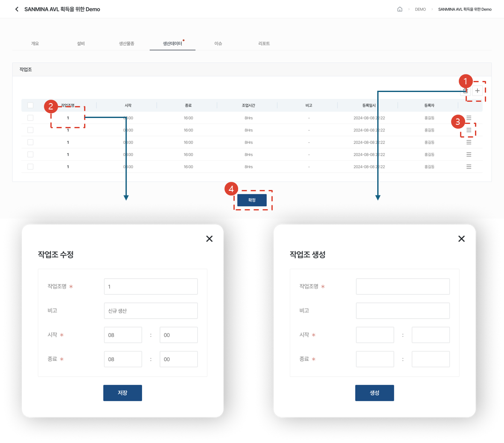

1. **추가** : [+] 버튼을 눌러 작업조 추가 화면을 열어 정보를 입력하고 [생성] 버튼을 누릅니다.
    :::warning
    - 작업조의 시간은 중복될 수 없습니다.
    :::
1. **수정** : 작업조명을 눌러 작업조 수정 화면을 열고, 수정사항을 입력한 후 저장 버튼을 누릅니다.
1. **순서 이동** : 해당 영역을 꾹 누르고 위/아래로 끌어 순서를 변경할 수 있습니다.
    :::warning
    - 시간대가 이어지도록 순서를 설정해 주시기 바랍니다.
    :::
1. **확정** : 작업조를 모두 등록하고 [확정] 버튼을 눌러 작업조를 확정합니다.
    :::warning
    - 반드시 작업조를 확정해야 합니다.
    :::

### 작업조 확정 후

:::info
- 작업조가 확정되면 작업조 편집이 불가능하며, 편집하려면 확정취소를 진행해야 합니다.
:::

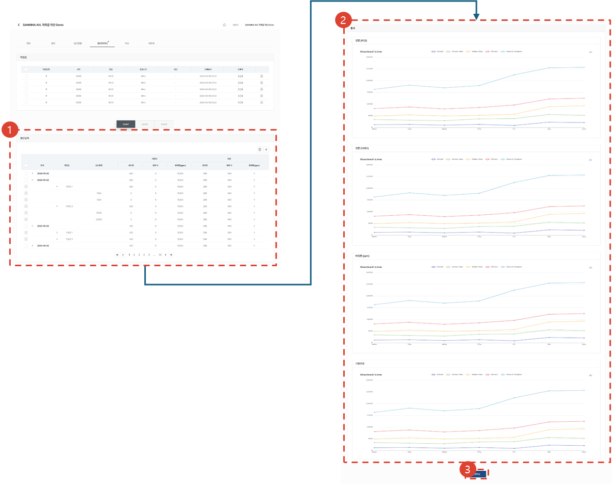

1. 생산실적 테이블 : 각 라인의 일별 생산실적을 관리하고, 일별/작업조별/생산물종별 생산 데이터를 확인할 수 있습니다.
1. 통계 : 각 라인의 양률(PCB, 어레이), 버림률, 기종변경 횟수 등을 그래프로 표시합니다.
1. 확정취소 : 확정을 취소합니다.
    :::warning
    - 확정 취소 시 작업조를 편집할 수 있습니다. 
    - 확정 취소 시 입력한 데이터는 삭제되니 유의해 주시기 바랍니다.
    :::

### 생산 실적

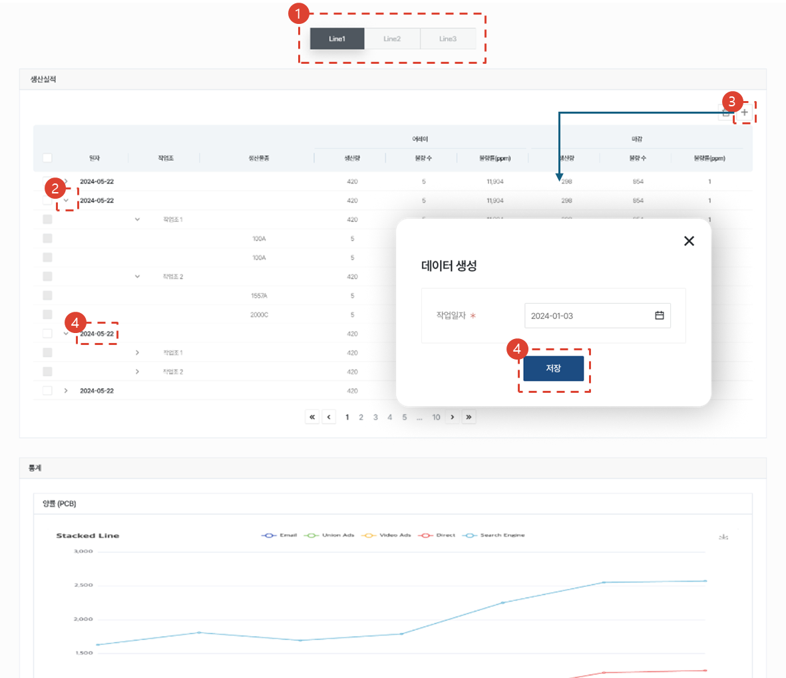

1. **라인** : 라인이 여러 개일 경우 조회 혹은 정보를 입력할 라인을 선택합니다.
1. 각 일자에 등록된 데이터를 작업조별/생산물종별로 세분화해서 표시합니다.
1. **추가** : [+] 버튼을 눌러 데이터 생성 화면을 열고, 일자를 선택하고 버튼을 눌러 해당 일자의 생산 데이터 입력 화면을 추가할 수 있습니다.
1. **수정** : 일자를 누르면 생산데이터 [수정 페이지](#생산데이터-수정)로 이동합니다.

#### 생산데이터 수정

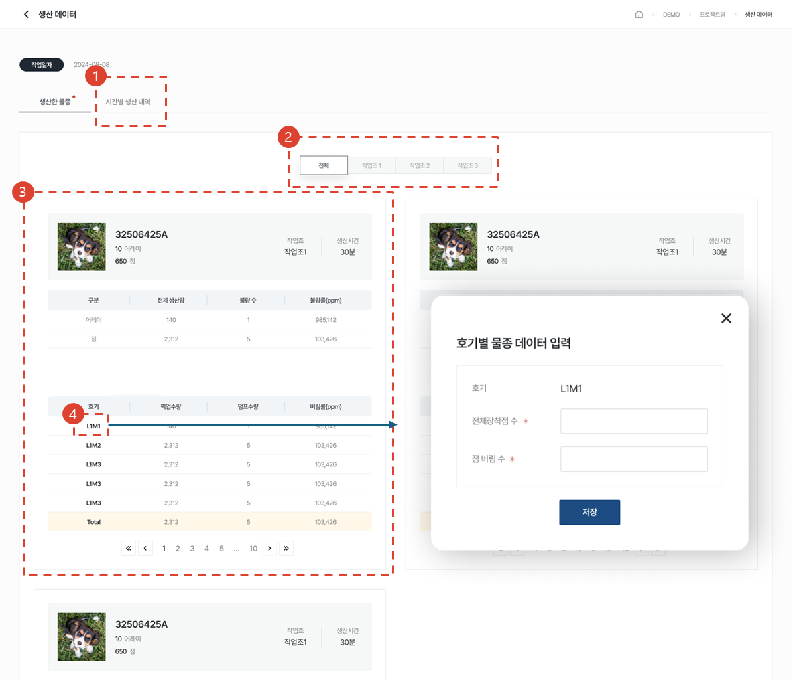

1. 메뉴 
    - **생산한 물종** : 해당 일자에 생산한 물종의 요약을 표시합니다.
    - **시간별 생산 내역** : 해당 일자의 생산 내역을 상세히 입력할 수 있습니다. [입력페이지](#생산데이터-입력)로 이동
1. 해당 일자에 생산한 물종의 정보를 작업조별로 나누어 확인할 수 있습니다.
1. 생산한 물종의 요약 정보를 표시합니다.
    :::info
    - 어레이와 점의 생산량, 불랑 수, 불량률은 시간별 생산 내역에서 입력한 내용에 따라 자동으로 표시됩니다.
    :::
1. 호기를 누르면 호기별 작업/덤프수량을 입력할 수 있습니다.
    :::info
    - 버림률은 자동 계산됩니다.
    :::

#### 생산데이터 입력

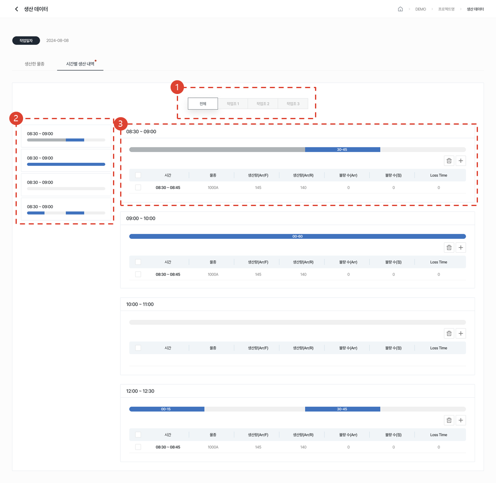

1. 작업조별 보기 : 작업시간을 전체 또는 작업조별로 확인할 수 있습니다.
    :::note
    - 입력한 작업조에 따라 시간대가 생성됩니다.
    :::
1. 요약 : 현재 입력 현황을 확인할 수 있습니다. 영역을 누르면 해당 시간대로 이동합니다.
1. 상세 생산 내역 : 해당 시간대의 생산 내역을 입력하고, 확인할 수 있습니다.
    :::info
    - **진한 회색**은 입력이 불가능한 시간대를 표시합니다.
    - **파란색**은 정보를 등록한 시간대를 표시합니다.
    - **연한 회색**은 아직 정보를 등록하지 않아 입력이 가능한 시간대를 표시합니다.
    :::

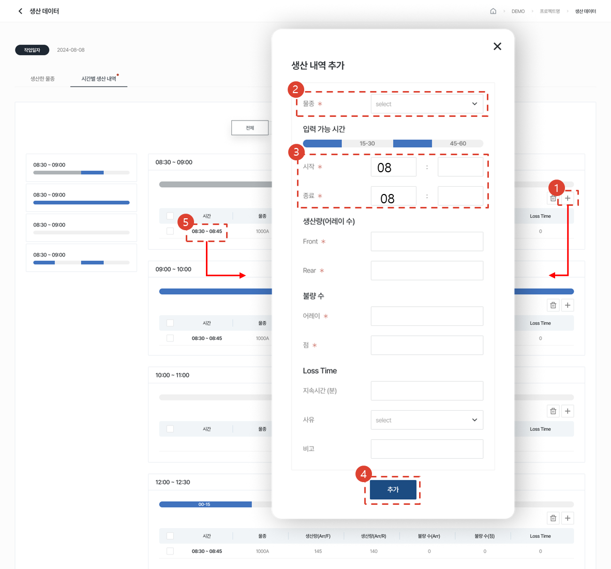

1. [+] 버튼을 누르면 생산 내역 추가 화면을 엽니다.
1. 물종 선택 : 생산물종 탭에서 등록한 PCB 목록이 표시됩니다.
1. 시작/종료시간 : 생산 시작시간과 종료시간을 입력합니다.
    :::info
    - 0부터 60까지 입력할 수 있습니다.
    - 다음 시까지 생산됐다면 60을 입력해야 1. 합니다. (8시 ~ 9시 생산 시 0 ~ 60 입력)
    - 이미 등록된 시간대는 입력할 수 없습니다.
    :::
1. 입력한 정보를 등록합니다.
1. 등록한 시간을 클릭하면 입력한 생산 내역을 수정할 수 있습니다.

## 이슈

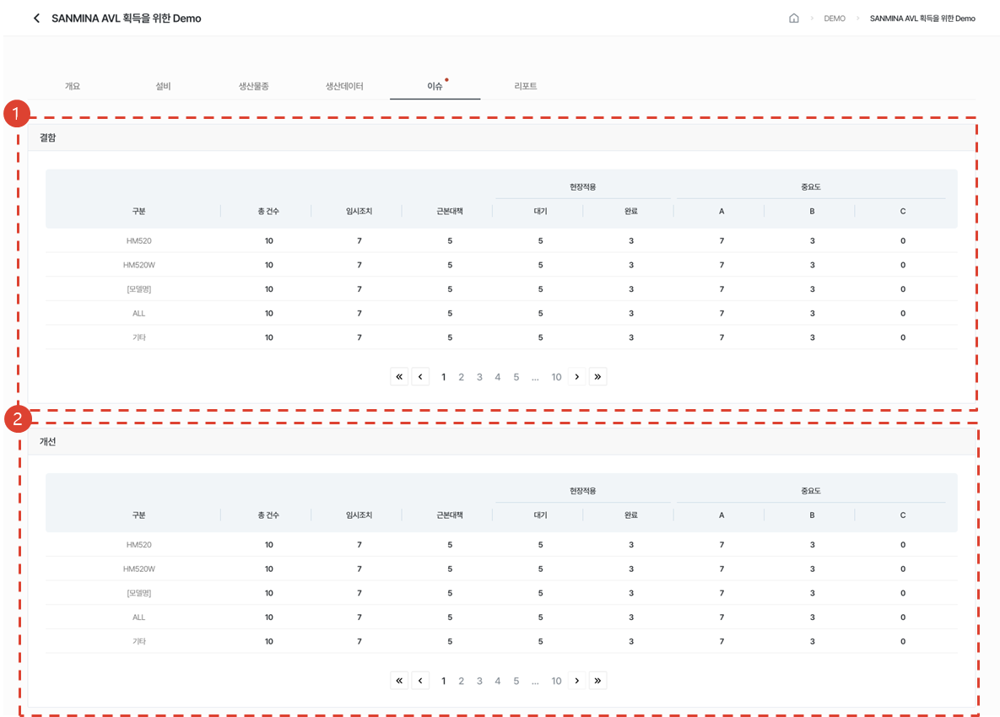

1. **결함 목록** : 해당 프로젝트의 결함 건에 대한 요약을 보여줍니다.
1. **개선 목록** : 해당 프로젝트의 개선 건에 대한 요약을 보여줍니다.

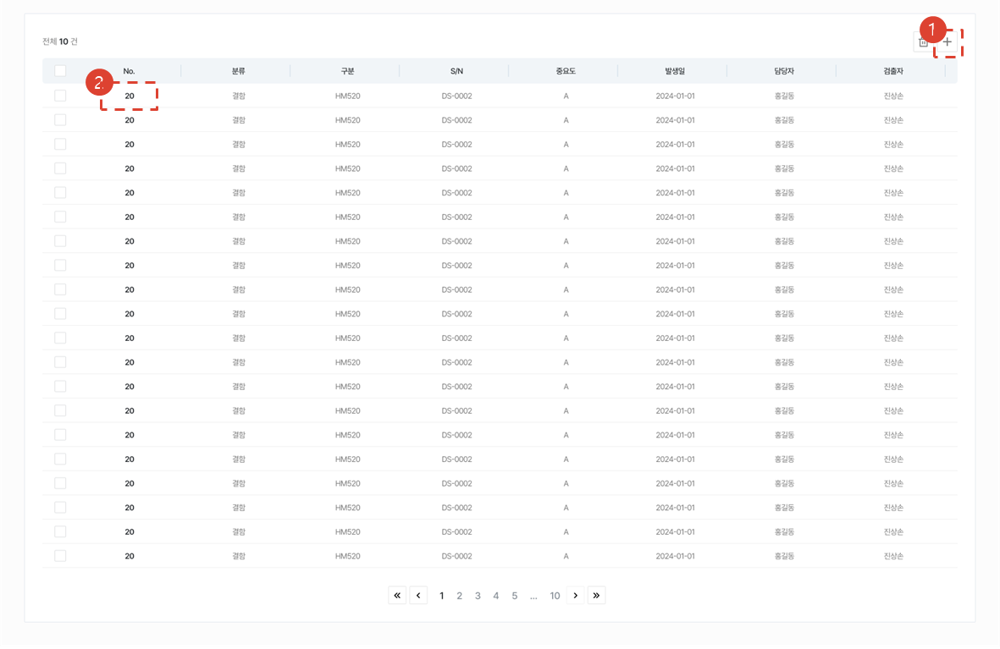

1. [+] 버튼 : [이슈를 추가하는 페이지](#이슈-추가)로 이동합니다.
1. [No.] : 해당 [이슈에 대한 상세 내용을 볼 수 있는 페이지](#이슈-상세)로 이동합니다.

### 이슈 추가

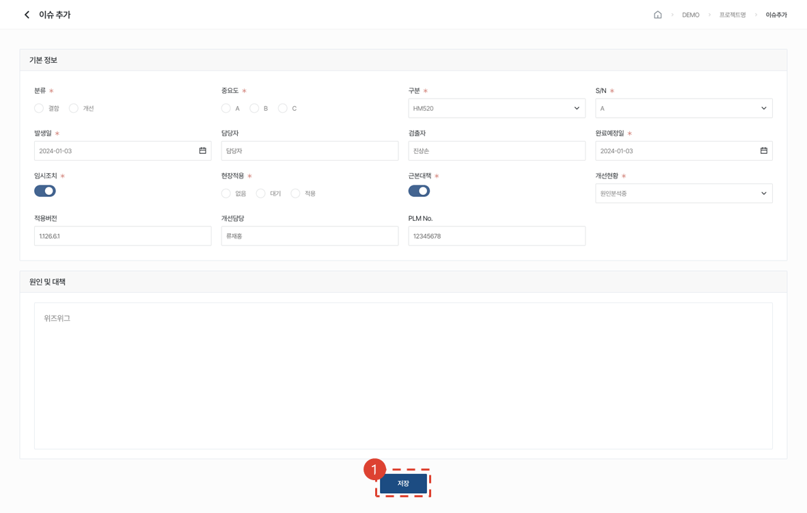

1. **추가** : 입력한 내용을 추가합니다.

### 이슈 상세

:::note
등록한 이슈를 조회할 수 있습니다.
:::

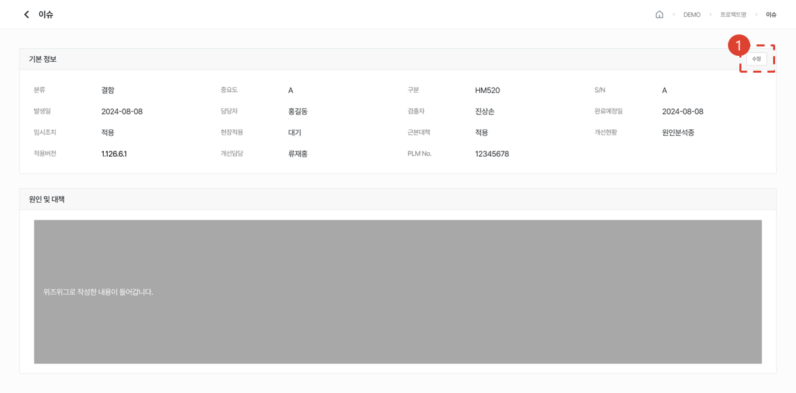

1. 수정 : 등록된 이슈를 수정할 수 있는 페이지로 이동합니다.
    :::info
    - 수정 페이지는 이슈 추가 페이지와 모양이 동일하며, 해당 내용을 수정할 수 있습니다.
    :::
