# 견적 & 실적 관리

서비스 / 애프터마켓 견적서 발행 및 실적 관리 페이지를 안내합니다.

## 실적 목록

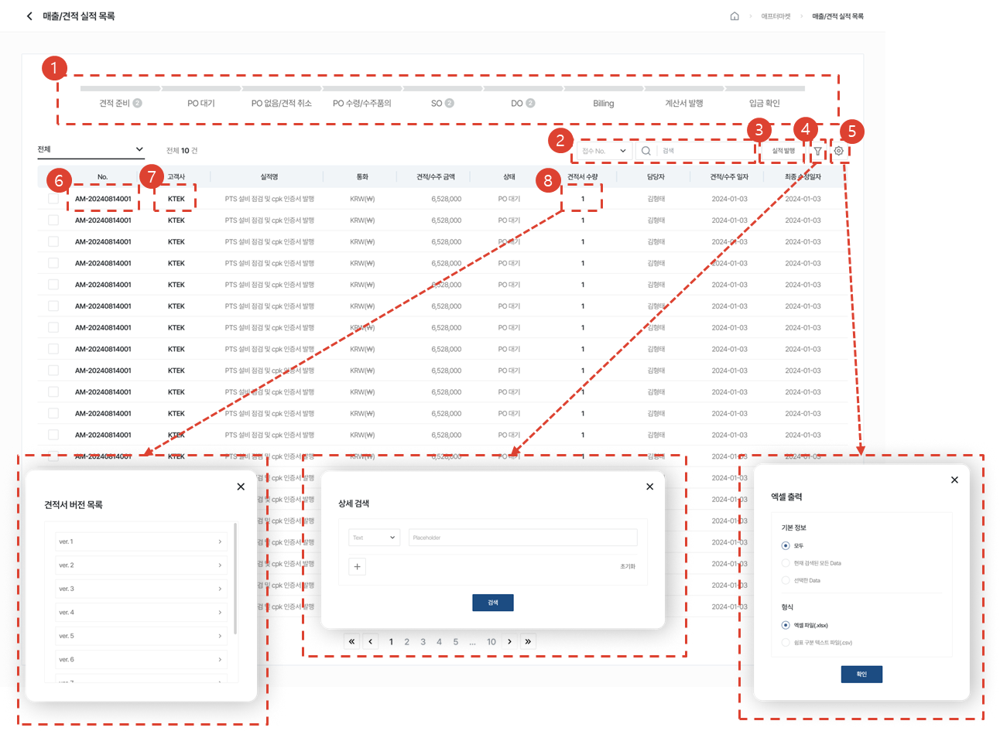

1. 각 상태에 해당하는 건 수를 조회할 수 있고, 클릭 시 해당하는 상태가 필터링 되어 하단 목록에 보여집니다.
1. 원하는 검색어로 검색할 수 있습니다.
1. [실적 발행]버튼을 클릭하여 실적을 만들 수 있습니다.
1. 버튼을 클릭하여 목록 내에서 원하는 검색어에 따라 상세 검색 할 수 있습니다. 
1. 버튼을 클릭하여 엑셀 출력, 실적 삭제, 테이블 관리를 할 수 있습니다.
1. [실적 No.]를 클릭하여 [실적 상세]페이지로 이동합니다.
1. [고객사]를 클릭하여 [기준정보-고객사 상세]페이지를 새 창으로 엽니다.
1. [견적서 수량]을 클릭하여 해당 실적에 발행된 [견적서 관리] 페이지로 이동합니다.
    1. 1개일 경우 [견적서 관리] 페이지로 이동합니다.
    1. 견적서 버전이 여러 개 일 경우, [견적서 버전 목록] 모달에서 선택 가능합니다.

## 실적 발행

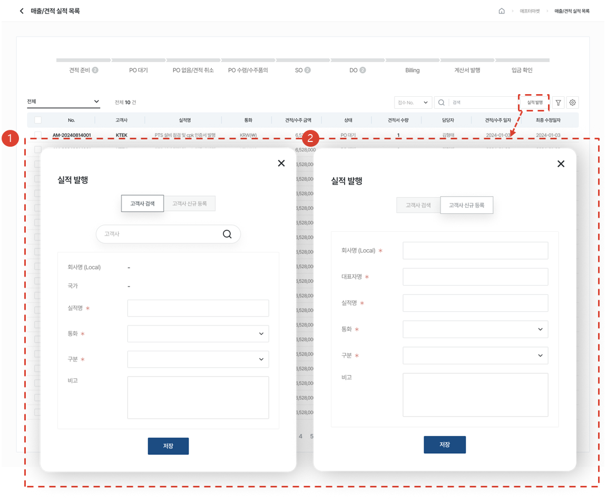

1. [실적 발행]모달에서 고객사를 검색하여 실적을 발행할 수 있습니다
1. [실적 발행]모달에서 고객사 정보를 입력하여 신규로 등록 후 실적을 발행할 수 있습니다.

## 실적 상세

### 견적 준비 상태

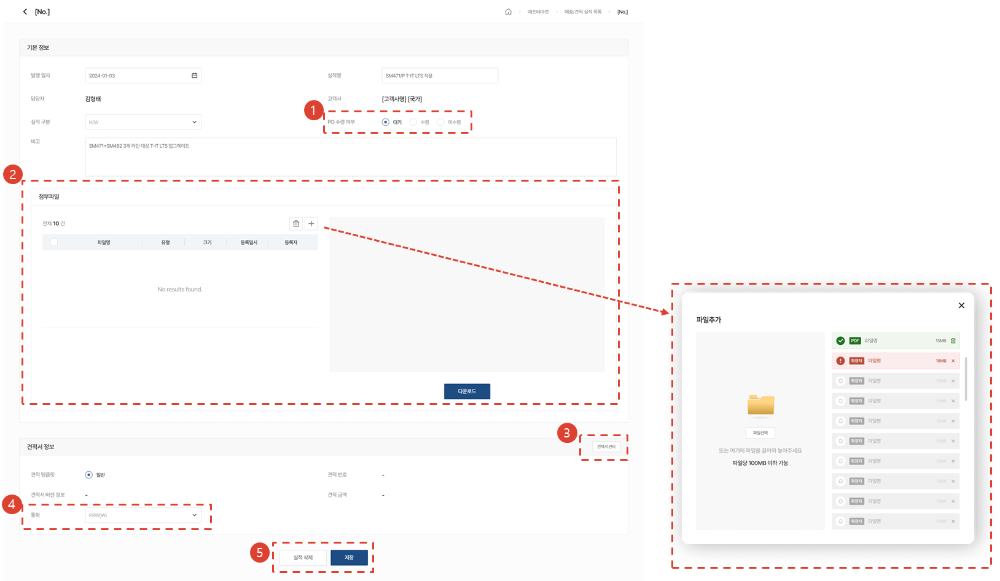

1. PO 수령 여부를 선택할 수 있습니다.
1. PO 수령 시 파일을 첨부하거나 업로드한 파일을 다운로드 할 수 있습니다.
1. [견적서 관리]버튼을 클릭하여 [견적서 관리]페이지로 이동합니다.
    1. 견적서가 없을 경우 등록할 수 있고, 견적서가 있을 경우 상세 페이지를 조회할 수 있습니다.
1. 실적 발행 시 설정한 통화를 수정할 수 있습니다.
1. 실적을 삭제하거나 수정 후 저장할 수 있습니다.

### PO 대기 상태

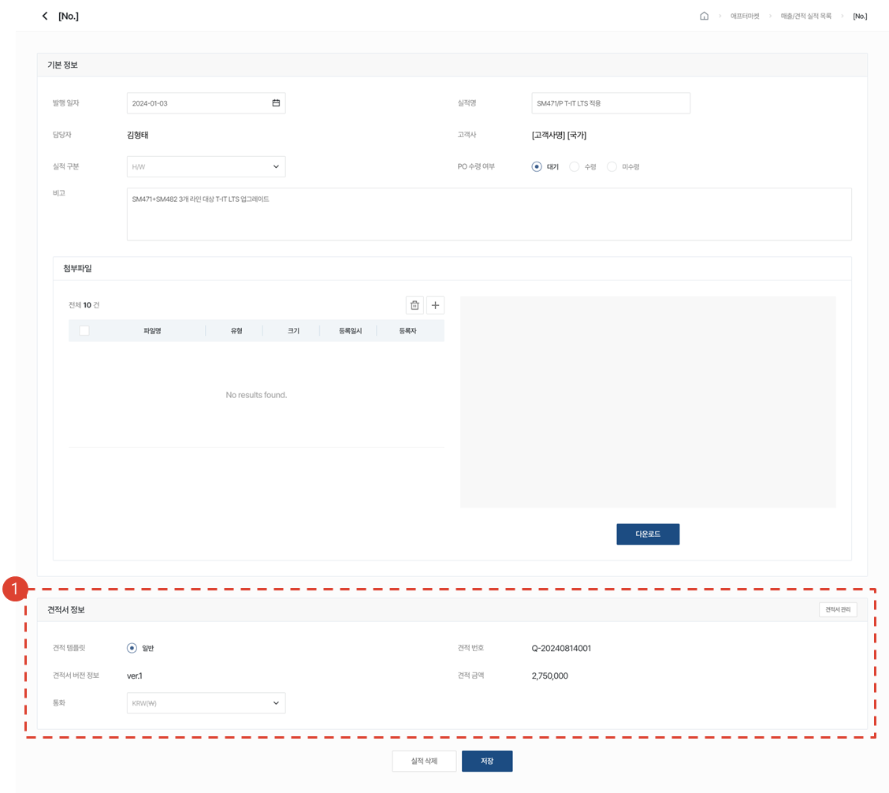

1. PO 수령 여부와 관계 없이 견적서를 관리할 수 있습니다.

### PO 수령 상태

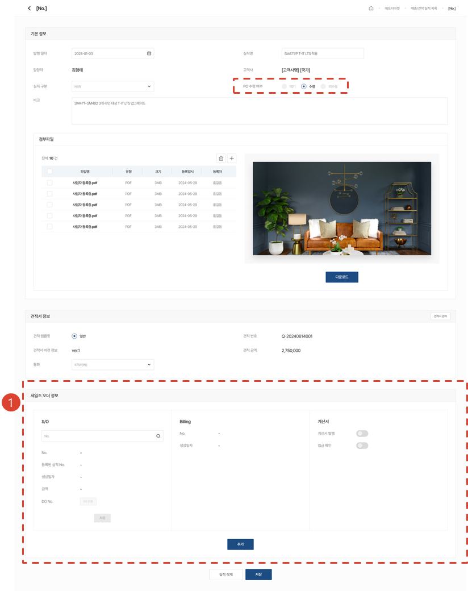

1. PO 수령 이후 세일즈 오더 정보를 입력할 수 있습니다. [추가] 버튼을 클릭하여 하나의 실적에 여러 개의 세일즈 오더를 추가할 수 있습니다. [추가] 버튼 클릭 시 So, Billing, 계산서 영역이 추가 됩니다. 

### SO 상태

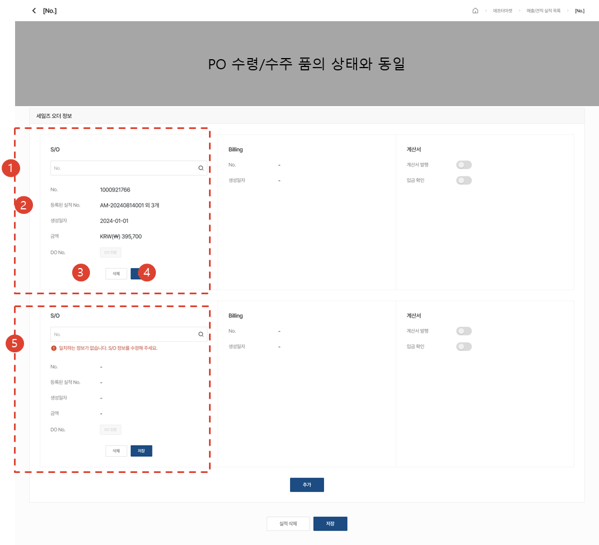

1. Sales Order No.를 검색하여 세일즈 오더를 등록할 수 있습니다.
1. 해당 세일즈 오더가 다른 실적에 등록되었을 경우 조회 가능합니다.
1. [삭제]버튼을 클릭하여 S/O, Billing, 계산서 영역을 일괄 삭제할 수 있습니다. 단, 가장 마지막 남은 세일즈 오더 정보는 삭제할 수 1. 없습니다.
1. [저장]버튼을 클릭하여 Sales Order No.를 변경할 수 있습니다.
1. 검색결과와 시스템 내 정보가 일치하지 않을 경우에도 입력한 Sales Order No.로 등록이 가능하며, 추후 수정이 가능합니다.

:::info
- SO 상태 이후 새로운 세일즈 오더가 추가될 시 PO 수령/수주 품의 상태로 변경됩니다. 
:::

### DO 상태

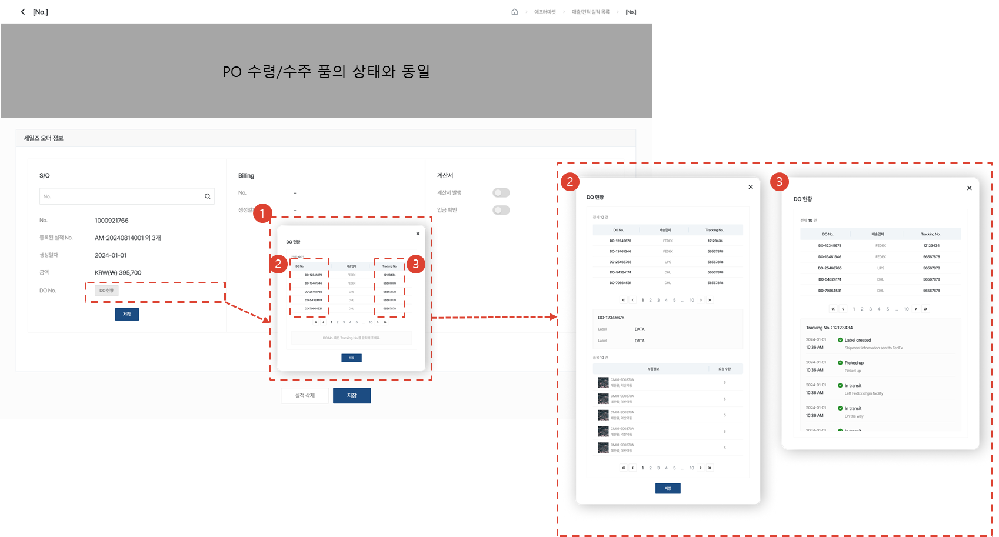

1. [DO 현황]버튼을 클릭하여 트래킹 정보를 조회할 수 있습니다.
1. [DO No.]를 클릭하여 부품 정보 조회가 가능합니다.
1. [Tracking No.]를 클릭하여 트래킹 정보 조회가 가능합니다. 

### Billing 상태

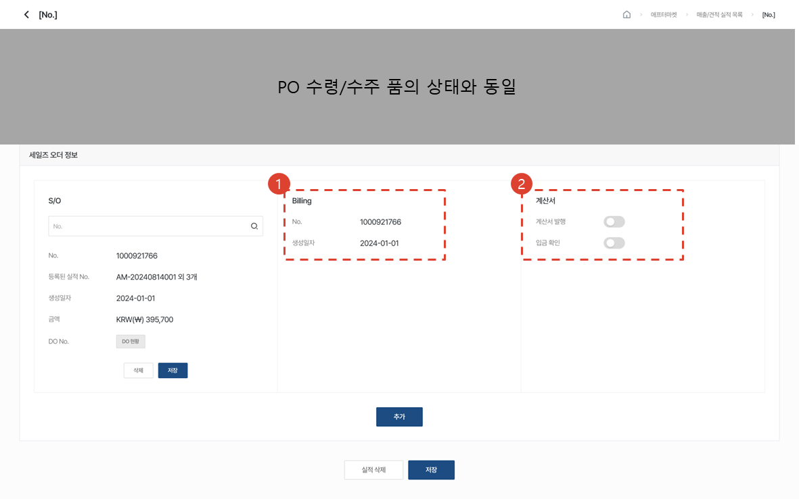

1. Billing No. 와 생성일자 i/f 이후 Billing 상태로 변경됩니다. 
1. Billing 상태부터 계산서 영역의 토글을 통해 상태를 변경할 수 있습니다.

### 계산서 발행 / 입금 확인 상태

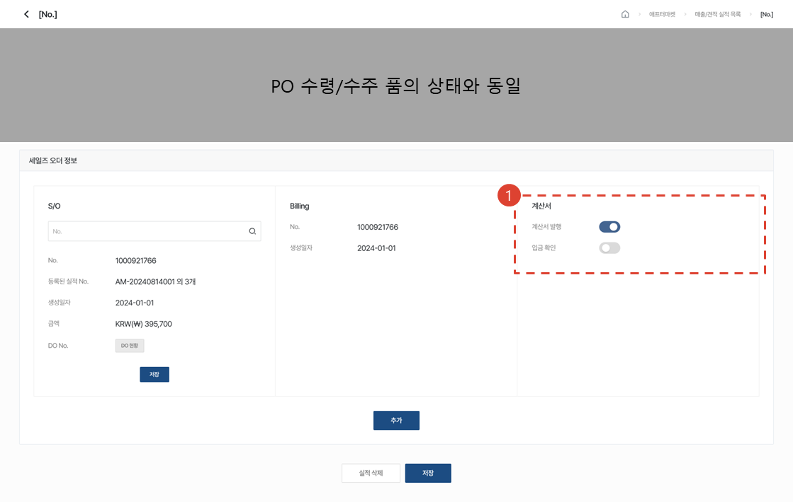

1. [계산서 발행]토글을 통해 계산서 발행 상태로 변경, [입금 확인]토글을 통해 입금 확인 상태로 변경 가능합니다.

### PO 없음 / 견적 취소 상태

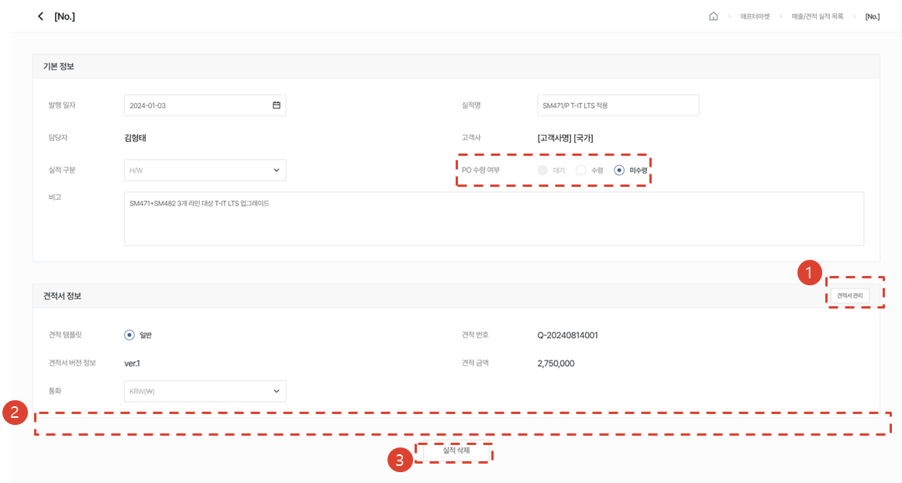

1. [**[견적서 관리]버튼을 클릭**](#견적서-관리)하여 발행된 견적서는 수정이 가능합니다.
1. PO 미수령 이후에는 세일즈 오더 정보가 없습니다.
1. [실적 삭제]버튼을 클릭하여 실적 삭제만 가능합니다. 실적 정보 수정, 파일 업로드는 불가합니다.

## 견적서 관리

### 등록

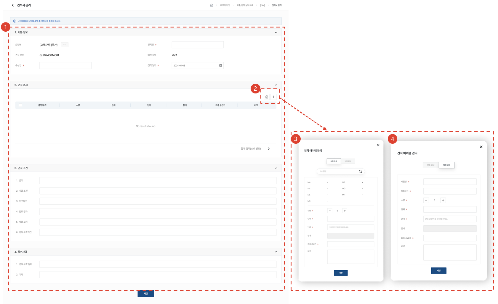

1. 견적서 정보를 입력할 수 있습니다.
1. [+]버튼을 클릭하여 견적 아이템을 추가할 수 있습니다. [삭제]아이콘을 클릭하여 추가한 아이템을 삭제할 수 있습니다.
1. 아이템명으로 검색하여 견적 아이템을 추가할 수 있습니다. 합계는 입력한 수량*입력한 단가이며 수정이 불가합니다. 최종 공급가를 입력하여 견적서 금액을 설정할 수 있습니다.
1. 제품명과 제품코드를 직접 입력하여 견적 아이템을 추가할 수 있습니다.

### 상세

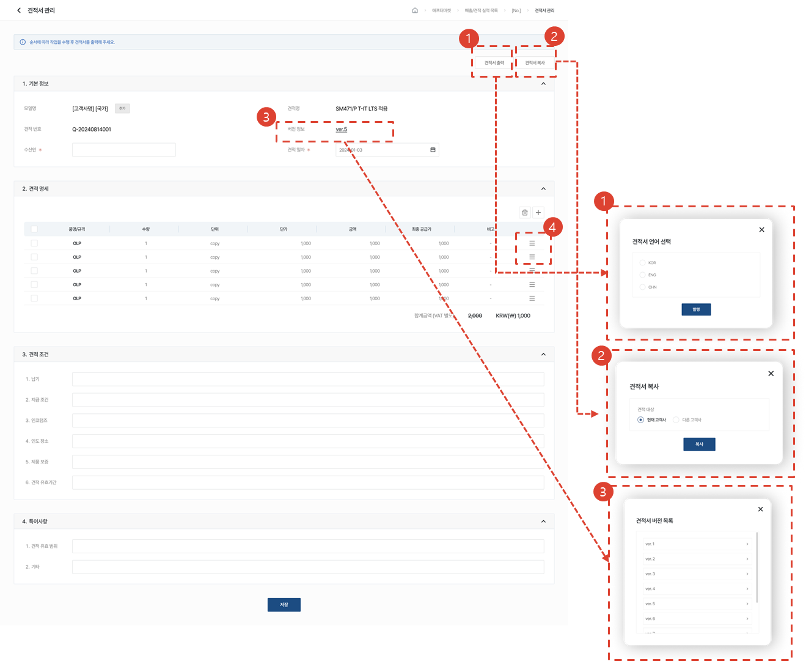

1. [견적서 출력]버튼을 클릭하여 선택한 언어 별로 견적서를 출력할 수 있습니다.
1. [견적서 복사]버튼을 클릭하여 현재 고객사 또는 다른 고객사 대상으로 해당 견적서를 복사하여 생성할 수 있습니다.
1. 가장 최신 버전의 견적서 페이지 입니다. [버전 정보]를 클릭하여 견적서 버전을 선택할 수 있습니다. 버전 클릭 시 해당하는 [견적서 상세]페이지로 이동합니다.
1. 드래그&드랍으로 견적 아이템의 순서를 변경할 수 있습니다.

### 부가 기능

#### 현재 고객사로 복사하여 견적서 등록

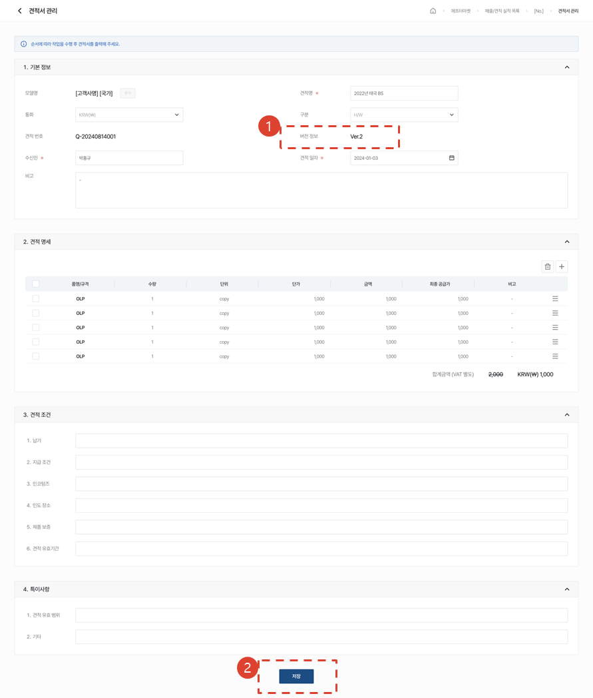

1. 선택한 견적서의 정보가 입력된 상태로, 동일한 실적에 버전업된 견적서가 발행됩니다.
1. 복사된 정보는 수정이 가능하며, [저장]버튼을 클릭하여 저장 후 견적서 상세 페이지로 이동합니다. 

#### 다른 고객사로 복사하여 견적서 등록

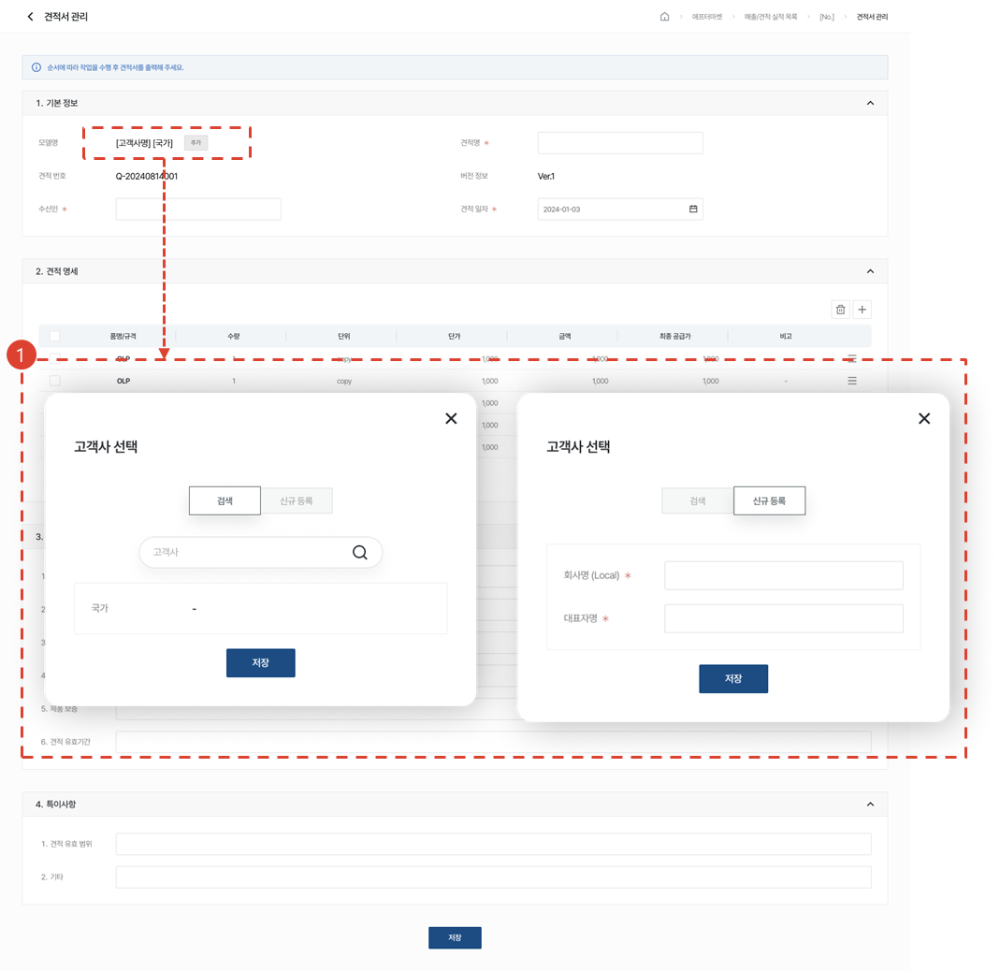

1. [추가]버튼을 클릭하여 복사 대상을 변경할 수 있습니다. 검색하거나, 직접 입력 후 신규 등록하여 고객사를 특정할 수 있습니다.

