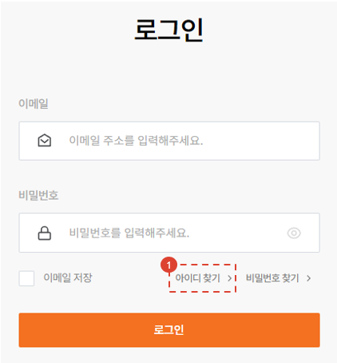
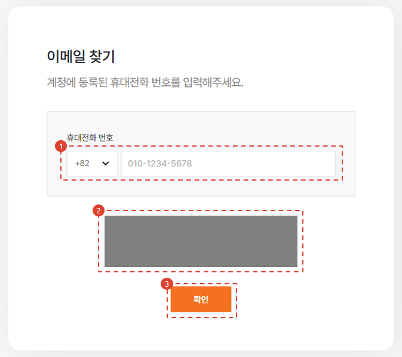
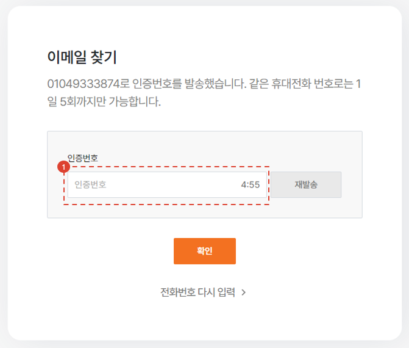
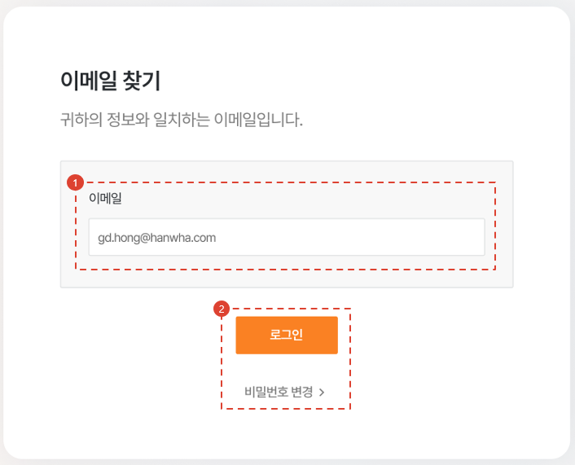

# Find Email

Here’s how to use the menu when you’ve forgotten your account email address.

## Move to Page

1. Click the \[Find ID] button on the login page.

## Find ID (email) by mobile phone number

1. Enter the mobile phone number registered to your account.
1. CAPTCHA will be implemented later.
1. Enter your phone number and click \[Confirm].

1. Enter the authentication code you received on your mobile phone and click the \[Confirm] button.

## Check your ID (email)

1. Check your email inbox.
1. Proceed to login or reset your password.

