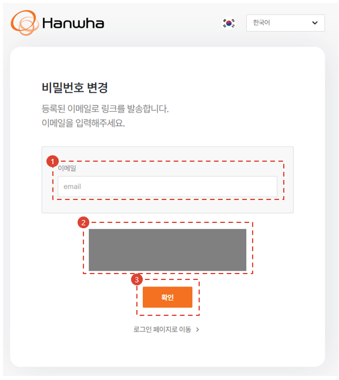
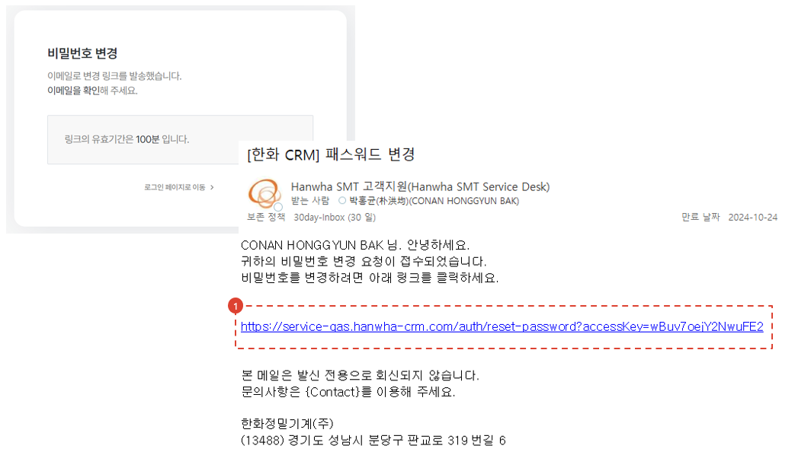
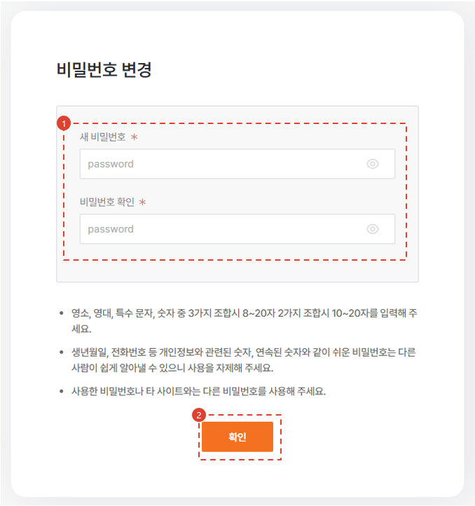

import loginWindow from "./img/019.png";

# Reset Password

Here’s how to reset your password if you forget your password when logging in from **External Network**.

## Move to Page

1. Click the \[Find Password] button on the login page.

## Enter Your Email

1. Enter your account’s email address to reset. :::tip If you’ve forgotten your ID (email), please refer to the [Find ID (Email)](./find-email.md) page. :::
1. CAPTCHA will be implemented later.
1. Enter your email address and click \[Confirm].

1. Click the link in the email you received. :::warning If you utilize the intranet development server (http://service-qas.hanwha-crm.com:8888), please change the link URL in the email 
    from https://service-qas.hanwha-crm.com to http://service-qas.hanwha-crm.com:8888\. :::

## Reset Password

1. Enter a new password.
2. Click the \[Confirm] button.

