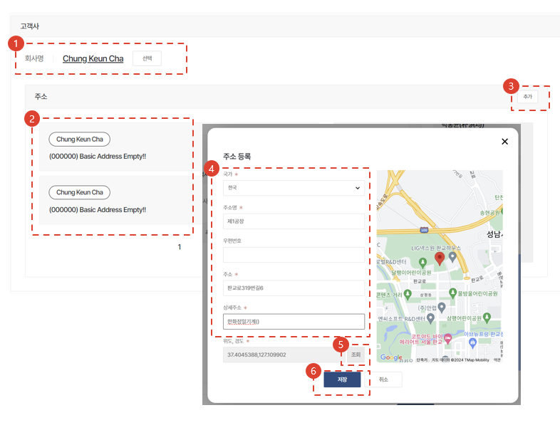
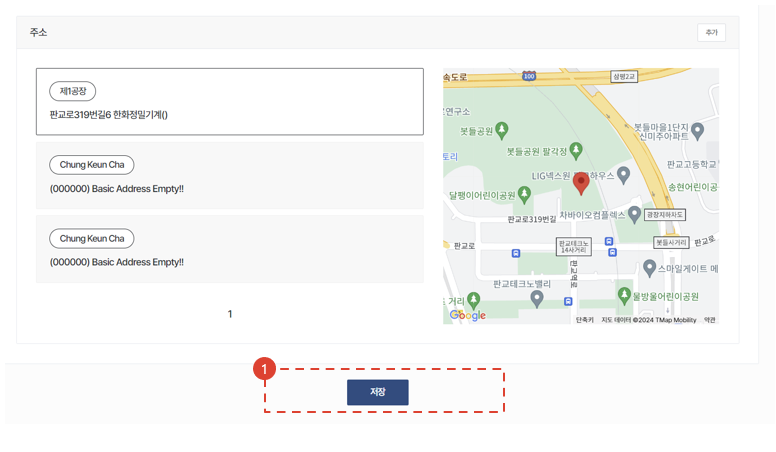

import ValidateTextByToken from "/src/utils/getQueryString.js";
import StrongTextParser from "/src/utils/textParser.js";
import text from "/src/locale/en/SMT/tutorial-02-installation/01-create-project.json";

# Project Creation

This is a guide to commissioning during installation of assets delivered to the client.

<ValidateTextByToken dispTargetViewer={true} validTokenList={['head', 'branch', 'agent']}>

## List of Projects

1. <StrongTextParser text={text.projectList01} />
1. <StrongTextParser text={text.projectList02} />

## Project Creation - 1/3

1. <StrongTextParser text={text.step1CreateProject01} />
1. <StrongTextParser text={text.step1CreateProject02} />
1. <StrongTextParser text={text.step1CreateProject03} />
1. <StrongTextParser text={text.step1CreateProject04} />

## Project Creation - 2/3

1. <StrongTextParser text={text.step2CreateProject01} />
1. <StrongTextParser text={text.step2CreateProject02} />
1. <StrongTextParser text={text.step2CreateProject03} />
1. <StrongTextParser text={text.step2CreateProject04} />
1. <StrongTextParser text={text.step2CreateProject05} />
1. <StrongTextParser text={text.step2CreateProject06} />

## Project Creation - 3/3

1. <StrongTextParser text={text.step3CreateProject01} />

</ValidateTextByToken>