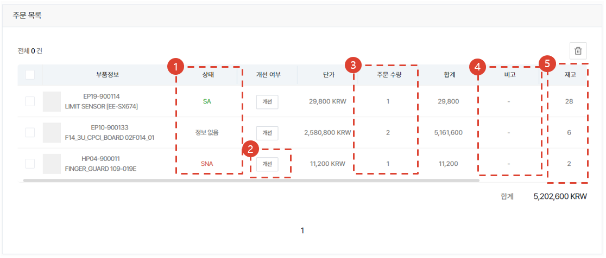
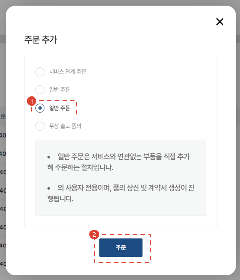
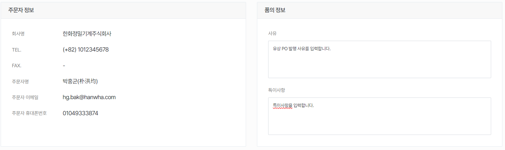
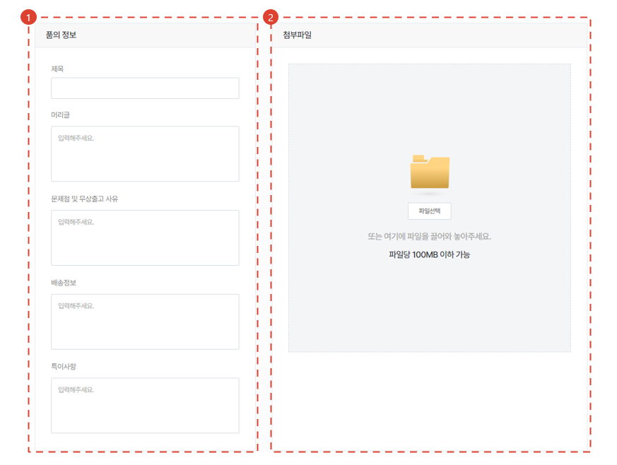

import ValidateTextByToken from "/src/utils/getQueryString.js";

# Create an Order

This is the process for drafting the order form for the service parts you wish to buy.

<ValidateTextByToken dispTargetViewer={true} dispCaution={false} validTokenList={['head', 'branch', 'agent']} ></ValidateTextByToken>

## Order List

<ValidateTextByToken dispTargetViewer={false} validTokenList={['head', 'branch', 'agent']}>

1. Go to the **Store** and select the **My Order** menu.
1. View the order list.

</ValidateTextByToken>

## Order List - Order Status

<ValidateTextByToken dispTargetViewer={false} validTokenList={['head', 'branch', 'agent']}>

- Saved: An order has been temporarily saved.
- Modification requested: The seller has asked the buyer to correct the order.
- Order submitted: The buyer placed an order and submitted to the seller.
- Approved: The order has been approved by the seller.
- In progress: The approved order is being delivered to the buyer.
- Completed: The order has been delivered to the buyer.
- Cancelled: The order has been cancelled by the buyer.

</ValidateTextByToken>

## Place an Order

<ValidateTextByToken dispTargetViewer={false} validTokenList={['head', 'branch', 'agent']}>

1. Press the **+** button to create an order.
1. Select one of the four order creation methods.
    - Service linked order: This option is used to order parts for a service order (especially when requesting free materials).
    - General order (1st): This option is used when creating a general paid PO.
    - General order (2nd): This menu is for corporate users. This menu is used when creating a paid PO for a corporation.
    - Free delivery: (For head offices only) Consider establishing a general free delivery request drafted in a circle in CRM.
1. After selecting the type, click the **Order** button.

</ValidateTextByToken>

## Place an Order - Service Linked Order 🚧

<ValidateTextByToken dispTargetViewer={false} validTokenList={['head', 'branch', 'agent']}>

Create a paid or free order for parts used in the **Service Order / Commissioning Project**.

:::note
TBD
:::

### Load Service Order 🚧
:::note
TBD
:::

</ValidateTextByToken>

## Place an Order - General Order (Paid PO)

<ValidateTextByToken dispTargetViewer={false} validTokenList={['head', 'branch', 'agent']}>

This menu generates a general paid service parts order.

### Add Parts to Order

1. You can add parts to your PO application by searching by parts code.
    -  → Searched successfully
    -  → No search results **(cannot proceed)**
1. Enter the quantity.
1. Enter the parts for application and any special remarks. 
1. Click the **Add** button to add it to the order.
1. You can batch upload it via Excel.
1. You can download the Excel form.
1. After confirming the upload results, click the **Apply** button.

### Confirm Order List

1. If the status column shows SNA/DNA, the order cannot be processed. 
    - If the status is **No information**, it indicates that the material manager has not yet updated. However you can proceed.
1. For SNA/DNA, you can confirm enhanced products. **(TBD)**
1. After confirming the order quantity, you can modify it by **double-clicking** it.
1. You can modify the special remarks section by double-clicking it.
1. You can check the inventory level of the **Seller Center**.

### Enter Additional Information and Create an Order Form

1. Enter general remarks about the order.
1. Upload an attachment file, if any.
1. If your order has not been confirmed, press Save Draft. 

:::note
You may contact the seller with the draft saved. 
Example: If it is difficult to confirm the parts, you may utilize the communication channel between buyer and seller to confirm the parts you wish to purchase. 
Please refer to step 4 of [Chat](#Create-Order---General-Order---Draft-Saved).
:::

4. To place an order, click the **Order** button.

### Save Draft

1. Temporarily saved orders remain at the **Saved** stage in the list.
1. You can view the saved order form.
1. The order list and special remarks section are not editable. To make changes, click the **Edit** button at the bottom.
1. Enter a message to communicate with the seller.
1. The order information is displayed.
1. To process a temporarily saved order, click the **Edit** button and then the **Order** button on the modification page that appears.

### Order Completed

1. Placed orders remain at the **Order submitted** stage in the list.
1. You can view the order form.
1. Enter a message to communicate with the seller.
1. You may edit the order form until the seller accepts it.
1. You may cancel the order form until the seller accepts it.

:::note
- You may edit the order form until the seller accepts it. 
- You may cancel the order form until the seller accepts it.
:::

</ValidateTextByToken>

## Place an Order - General Order (Paid PO / Corporate) ✨

<ValidateTextByToken dispTargetViewer={false} validTokenList={['head', 'branch']}>

:::info
We recommend creating a paid PO request that was previously issued from a circle in CRM.  
This is a guide to the simplified paid PO request process in CRM.
:::

Start on the [Place an Order](#Place order) page.

1. Click the third [General Order] button.
1. Click the [Order] button.
 
### Register Parts for Order ✨

1. You can add parts to your PO application by searching by parts code.
    -  → Searched successfully
    -  → No search results **(cannot proceed)**
1. Enter the quantity.
1. Enter the parts for application and any special remarks. 
    - Remark 1: Enter related documents, special remarks about the parts, etc.
    - Remark 2: Enter information about the delivery address.
1. Click the **Add** button to add it to the order.
1. You can batch upload it via Excel.
1. You can download the Excel form.
1. Attach an Excel file.
1. After confirming the upload results, click the **Apply** button.

### Confirm Order List ✨

1. If the status column shows SNA/DNA, the order cannot be processed. 
    - If the status is **No information**, it indicates that the material manager has not yet updated. However you can proceed.
1. For SNA/DNA, you can confirm enhanced products. **(TBD)**
1. After confirming the order quantity, you can modify it by **double-clicking** it.
1. You can modify the special remarks section by double-clicking it.
1. You can check the inventory level of the **Seller Center**.

### Confirm Basic Information of Paid PO Request ✨

- Check the orderer (drafter) information.
- Enter the purpose of issuing the PO and any special remarks.

1. Upload attachment files.
1. Enter the texts that will appear in the contract information.
    - The entered information will be used to create the document as follows.  
        :::note 
            The document is printed in PDF format. 
        :::
1. Click the [Save Draft] or [Next] button.

### Submit Request (Circle Approval) ✨

1. Search lines of approval. (Circle users are searched.)
1. Enter your opinions on requesting submission.
1. Click the [Next] button to send the approval document to the circle. 
    :::warning 
        The [Save Draft] button does not work. It will be replaced by the [Previous] button. 
    :::

</ValidateTextByToken>

## Place an Order - Free Delivery Request (For Head Office) ✨

<ValidateTextByToken dispTargetViewer={false} validTokenList={['head', 'branch']}>

:::info 
    We recommend creating a free delivery request that was previously issued from a circle in CRM.  
    This is a guide to the simplified free delivery item process in CRM. 
:::

Start on the [Place an Order](#Place order) page.

1. Select the fourth \[Free Delivery Request].
1. Click the \[Order] button. 

### Add Parts to Order ✨

1. You can add parts to your PO application by searching by parts code.
    -  → Searched successfully
    -  → No search results **(cannot proceed)**
1. Enter the quantity.
1. Enter the parts for application and any special remarks. 
1. Click the **Add** button to add it to the order.
1. You can batch upload it via Excel.
1. You can download the Excel form.
1. After confirming the upload results, click the **Apply** button.

### Confirm Parts List for Order ✨

1. You can modify the raw cost by double-clicking it. 
    :::note 🚧 
        The cost will eventually be imported from the raw cost/sales price management CRM module. 
    :::
1. You may also edit the order quantity and the special remarks section by double-clicking it.
1. In conjunction with the intranet system, you can look up the order’s (drafter’s) inventory level at the **Inventory Approval Center**, MOQ, and lead time (L/T).

### Enter Basic Information ✨

- Enter your remarks in the special remarks section and confirm the orderer (drafter) information.

### Enter Additional Information ✨

1. If there is no client information, the toggle button is activated.
2. Load the client information by clicking the \[Select] button. (Required) - [View Client Selection Screen](#Enter additional information---Select client-✨)
3. Load the client contact person information by clicking the \[Select] button. (Optional) - [View Client Contact Person Selection Screen](#Enter additional information---Select client contact person-✨)

### Enter Additional Information - Select Client ✨

1. Search by entering the client name.
1. Click the \[Save] button.

### Enter Additional Information - Select Client Contact Person ✨

1. If there is no contact person information on the list, enter and register the client contact person information.
1. Select the contact person added to the list.

### Draft a Request ✨

1. Enter the request form information.
2. Upload attachment files, if any.

### Submit Request ✨

1. After completing the approval document, click the \[Next] button to submit the request.

</ValidateTextByToken>