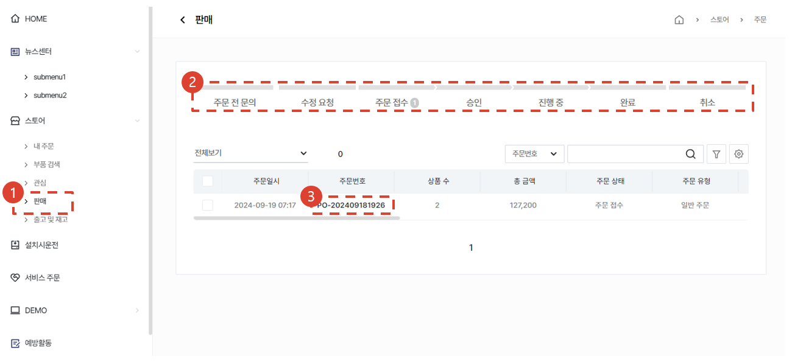

import ValidateTextByToken from "/src/utils/getQueryString.js";

# Order Processing

<ValidateTextByToken dispTargetViewer={true} dispCaution={false} validTokenList={['head', 'branch', 'seller', 'agent']}>

Here is the procedure for processing accepted orders.

</ValidateTextByToken>
 
## Order List

<ValidateTextByToken dispTargetViewer={false} dispCaution={true} validTokenList={['head', 'branch', 'seller', 'agent']}>

1. Go to the **Store** and select the **Sales** menu.
1. Check the status of the order in the order list.
1. Click on the order number to open the details page.

</ValidateTextByToken>

## Order List - Order Status

<ValidateTextByToken dispTargetViewer={false} dispCaution={true} validTokenList={['head', 'branch', 'seller', 'agent']}>

- Inquiry before order: The buyer has temporarily saved the order.
- Modification requested: The seller has asked that the buyer modify the order.
- Order submitted: The buyer has submitted the order to the seller.
- Approved: The order has been approved by the seller.
- In progress: An order is marked as in progress when SO is issued.
- Completed: An order is marked as completed when a DO number is assigned to all order items.
- Cancelled: The order has been cancelled.

</ValidateTextByToken>

## Order Form Details

<ValidateTextByToken dispTargetViewer={false} dispCaution={true} validTokenList={['head', 'branch', 'seller', 'agent']}>

1. Check the order items.
1. You can check the buyer’s credit history.
1. You can change the order status.
    - Approved: Approve the order. [Click here to see the process after the approval.](#Order form details---Approval)
    - Rejected: The order has been rejected/cancelled.
    - Modification request: It has been requested that the order be modified (such as change in quantity, sales price, parts code).

</ValidateTextByToken>

## Order Form Details - Approval

<ValidateTextByToken dispTargetViewer={false} dispCaution={true} validTokenList={['head', 'branch']}>

- An approved order form may proceed to the following procedure.
    - Backorder: An intermediary seller may place a reorder to the head office for parts in the order form.
    - Completion processing: The order is processed as completed. The order will appear as **completed** to the buyer.
    - Create a sales order: You can issue a sales order based on this order.

</ValidateTextByToken>

## Order Form Details - Approval - Backorder

<ValidateTextByToken dispTargetViewer={false} dispCaution={true} validTokenList={['head', 'branch', 'seller']}>

:::note 
    - This menu is useful when you need to place an order with the head office to replenish the matching amount of inventory after processing the buyer’s order request. 
    - You can place an order with the head office based on this order. 
    - Intermediary sellers\*1 may utilize the backorder menu. 
    > \*1 Corporation or material base (Amtest) 
:::

## Order Form details - Approval - Backorder - Create

1. This is a menu for corporation or material base (Amtest). This menu can be used when you need to reorder from the head office after processing an order.
1. Select the parts for which you wish to place a backorder.
1. Press the \[Create Backorder] button.
    - Check the number of parts to be created as a backorder and then click the ‘Create’ button. 
        :::note 
            ※ You may change the quantity by double-clicking it.
        :::
</ValidateTextByToken>