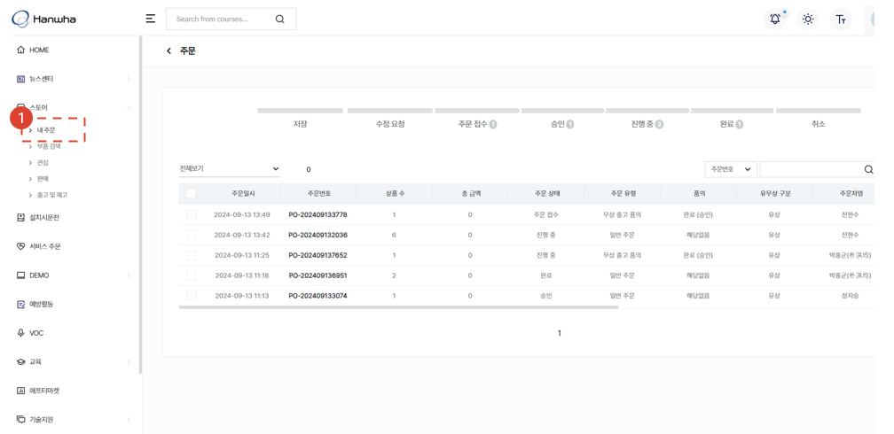

import ValidateTextByToken from "/src/utils/getQueryString.js";

# Order Modification ✨

<ValidateTextByToken dispTargetViewer={true} dispCaution={false} validTokenList={['head', 'branch', 'agent']}>

Here is how to modify the order for the service parts you wish to purchase.

</ValidateTextByToken>

## Order List

<ValidateTextByToken dispTargetViewer={false} dispCaution={true} validTokenList={['head', 'branch', 'agent']}>

1. Go to the **Store** and select the **My Order** menu.
1. View the order list.

</ValidateTextByToken>

## Order List - Order Status

<ValidateTextByToken dispTargetViewer={false} dispCaution={true} validTokenList={['head', 'branch', 'agent']}>

- Saved: An order has been temporarily saved.
- Modification requested: The seller has asked the buyer to correct the order.
- Order submitted: The buyer placed an order and submitted to the seller.
- Approved: The order has been approved by the seller.
- In progress: The approved order is being delivered to the buyer.
- Completed: The order has been delivered to the buyer.
- Cancelled: The order has been cancelled by the buyer.

</ValidateTextByToken>

## Check Order Type

### Service-linked order 🚧

<ValidateTextByToken dispTargetViewer={false} dispCaution={true} validTokenList={['head', 'branch', 'agent']}>

</ValidateTextByToken>

### General order (paid PO) 🚧

<ValidateTextByToken dispTargetViewer={false} dispCaution={true} validTokenList={['head', 'branch', 'agent']}>

</ValidateTextByToken>

### General order (paid PO, for corporation) 🚧

<ValidateTextByToken dispTargetViewer={false} dispCaution={true} validTokenList={['head', 'branch']}>

</ValidateTextByToken>

### Free delivery request (for head office) 🚧

<ValidateTextByToken dispTargetViewer={false} dispCaution={true} validTokenList={['head', 'branch']}>

</ValidateTextByToken>
