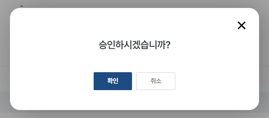
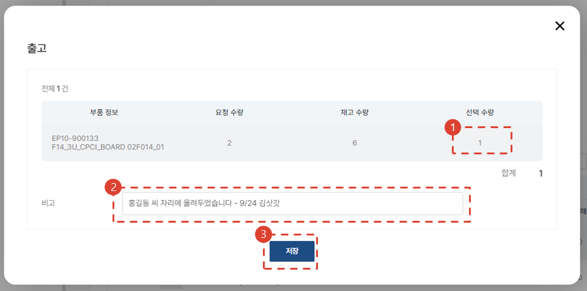

import img043 from "./img/043.png";
import img046 from "./img/046.png";
import ValidateTextByToken from "/src/utils/getQueryString.js";

# Approval and Management of Take-in/out Service Parts ✨

<ValidateTextByToken dispTargetViewer={true} dispCaution={false} validTokenList={['head', 'branch']}>

This is a guide to the process of usage when you need to request and approve receipt and release of service parts.

</ValidateTextByToken>

## Check Shipment Request ✨

<ValidateTextByToken dispTargetViewer={false} dispCaution={true} validTokenList={['head', 'branch']}>

1. Go to the \[Store] and click on the \[Shipping and Stock] menu.
1. Click the \[Request] bar on the \[Shipping] tab to filter out and view only requested items.
1. Click on the **Request Number**.

1. Check the shipping status. Check that it is in the **Request** stage.
1. If there is a linked service order, the service order number, service type, and serial number of the service target asset are displayed.
1. Check the request date and requester information.
1. Check the list of requested parts.
1. If there is a reason for rejection, click on it. Move to the [Rejection Stage](#Reject shipping request).
1. Press the \[Approve] button to proceed with the shipping approval. Move to the [Approval Stage](#Approve shipping request).

## Reject Shipment Request ✨

1. Enter the reason for rejection.
1. Click the \[Confirm] button.

## Approve Shipment Request ✨

In the [Approve Shipping Request](#Check shipping request) stage, click the \[Approve] button. On the resulting modal page, click the \[Confirm] button again.

## Proceed Shipment Request ✨

1. Click the \[Pending Shipment] bar in the \[Shipping] tab.
2. Click on the requested content.

1. Confirm the status as **Pending Shipment**.
1. You may confirm the history of completed processing.
1. You may confirm the shipping history.
1. You may confirm the stock level. 
    :::info 
    The storage location’s available stock in the specific quantity is displayed (\[Standard Information] → \[Center] → \[Basic Information] → \[Storage Location]). 
    ::: 
1. Proceed with the finishing process.
1. Proceed with the shipment process.

## Shipping ✨

1. Edit the shipping quantity by double-clicking it.
1. Enter a comment on the shipping.
1. Click the \[Save] button. 
    :::warning 
        Because the process here only involves system processing, you must proceed with the shipping of the actual parts as indicated. 
    :::
 
### Check Shipping History ✨

1. When a single delivery case is recorded in the shipping history, its status changes to **Shipping in Progress**.
2. You can see the shipping history by clicking the \[Shipping History] button.

- Check the shipping history.
1. If the shipment has not actually been delivered, click \[Delete] to delete the shipping history.

## Completion ✨

### Completion - Sales ✨

1. You may change the quantity you wish to complete.
1. Select **Sales** in the **Processing Type**.
1. Enter the **Client PO** number.
    :::tip 
        Because it is mainly for the purpose of management, enter proper data. 
    :::
1. Search users so you may share the information on the completion of processing. 
    :::info 
        You may only search among the users affiliated to your center. 
    :::
1. Enter additional information required for management.
1. Click on the \[Save] button.

### Completion - Free Supply ✨

1. You may change the quantity you wish to complete.
1. Select **Free** in the **Processing Type**.
1. Search users so you may share the information on the completion of processing. 
    :::info 
        You may only search among the users affiliated to your center. 
    :::
1. Enter additional information required for management.
1. Click the \[Save] button. 
    :::tip 
        As shown below, the [**Store → Order Free Service Parts**](../tutorial-04-store/create-a-store-order-buyer.md) case has also been created.
            

    :::

### Completion - Return ✨

1. You may change the quantity you wish to complete.
1. Select **Return** in the **Processing Type**.
1. Search users so you may share the information on the completion of processing. 
    :::info 
        You may only search among the users affiliated to your center. 
    :::
1. Enter additional information required for management.
1. Click on the \[Save] button.

### Check Completion History ✨

1. You may check the completion type.
2. You may look up the relevant PO number. 
    :::tip 
        You can click on the free parts PO to go to the details page for the order in the \[Store]. 
    :::
3. You can select the history to resend notifications.
4. You can select and delete the history. 
    :::warning 
        Free parts PO cannot be deleted. 
    :::

</ValidateTextByToken>