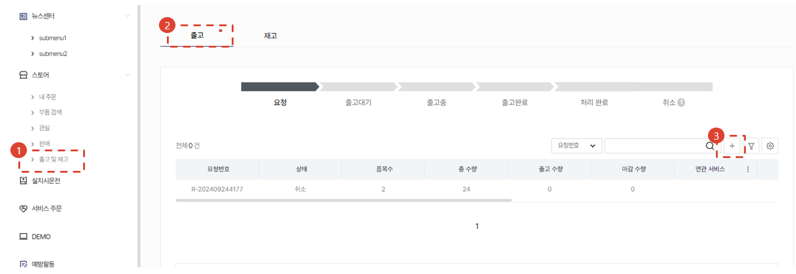

import ValidateTextByToken from "/src/utils/getQueryString.js";

# Shipping Request for Service Parts ✨

<ValidateTextByToken dispTargetViewer={true} dispCaution={false} validTokenList={['head', 'branch']}>

This is a guide to the process of usage when you need to request and approve receipt and release of service parts.

</ValidateTextByToken>

## Shipping Request for Parts ✨

<ValidateTextByToken dispTargetViewer={false} dispCaution={true} validTokenList={['head', 'branch']}>

Here is how you can request the shipping of parts.

## Shipping Request from Another Menu ✨

- You may request shipping of parts required for servicing in another menu related with parts shipping services. 
    :::info ※ Related service menu
        - Service order
        - Commissioning 
    :::

### Request During Service Order & Processing ✨ 🚧

## Shipping Request from this Menu ✨

### Registration of Request ✨

1. Go to the \[Store] and click on the \[Shipping and Stock] menu.
1. Click the \[Shipping] tab.
1. Click the \[+] button. 
    :::info Progress bar status
        - **Request**: The shipping request form has been created and submitted.
        - **Pending Shipping**: The shipping manager/administrator has approved the request.
        - **Shipping**: Some of the parts requested have been shipped out by the shipping manager/administrator.
        - **Shipped**: All of the parts requested have been shipped out by the shipping manager/administrator.
        - **Processing Completed**: The post-processing has been completed for all shipped out parts as follows.
            - **Sold to Client**: Shipped parts have been processed as sold.
            - **Free Supply**: Shipped parts have been processed as free supplies.
            - **Return**: Shipped parts have been returned to the warehouse. 
    :::

### Enter Request ✨

1. In the notes field, enter information about the request.
1. Click the \[+] button to open the parts search window.
1. Search for parts.
1. Select the parts to add.
1. Enter the quantity.
1. Click on the \[Save] button.
1. This menu is used to delete added parts.
1. Click the \[Add] button to create a shipping request.
    - Once the request is created, a notification email will be sent to the **Shipping Approval Manager**.
    
</ValidateTextByToken>