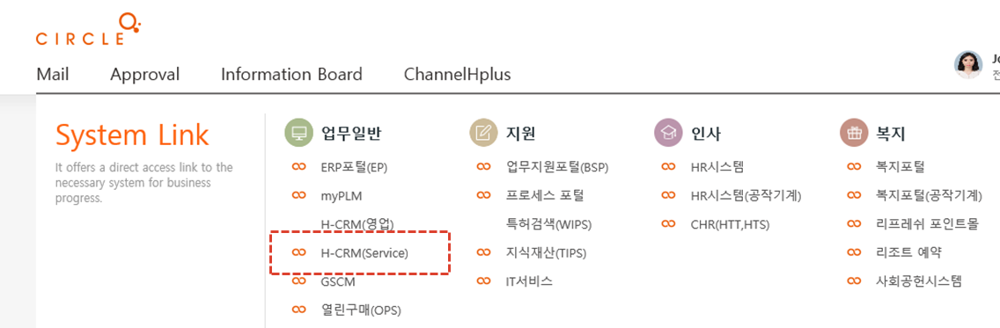
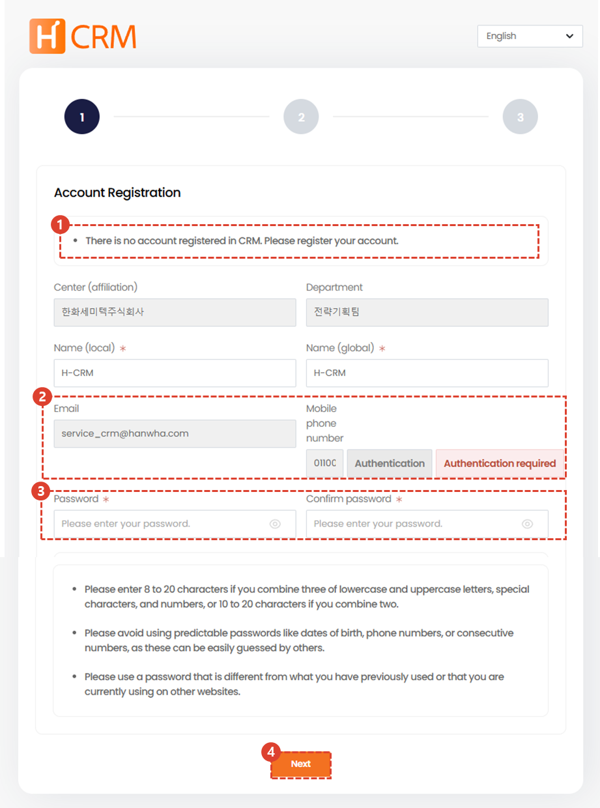
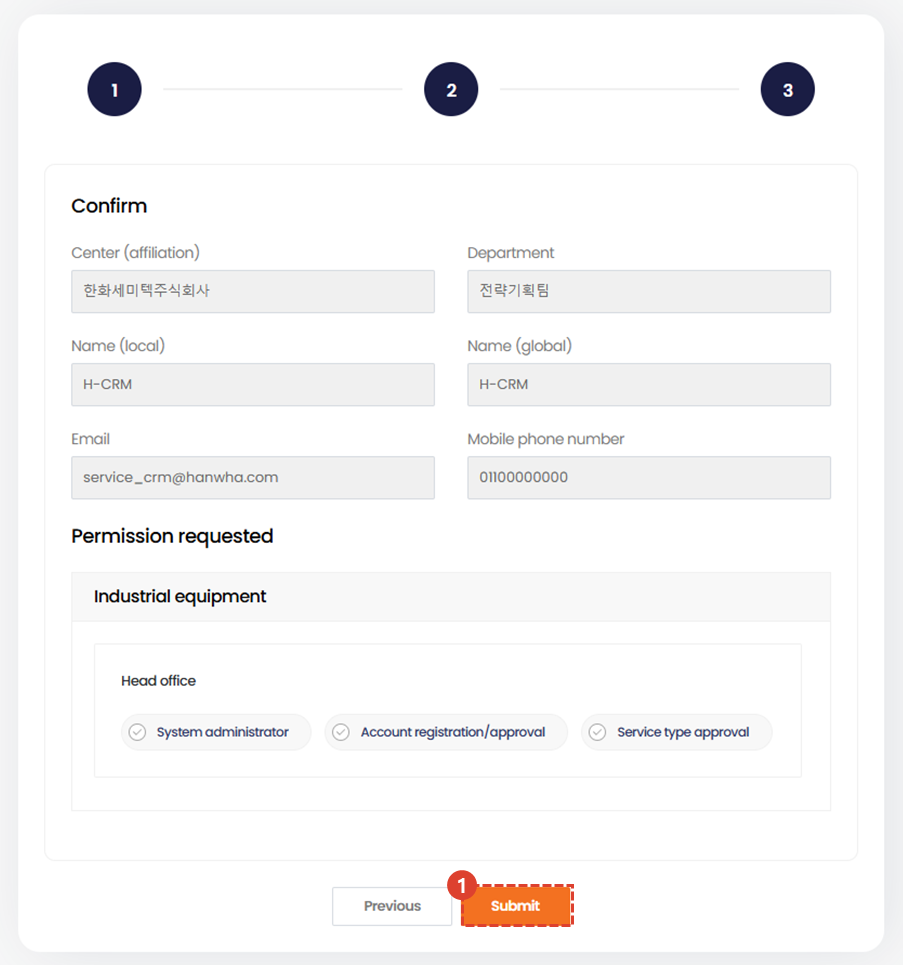
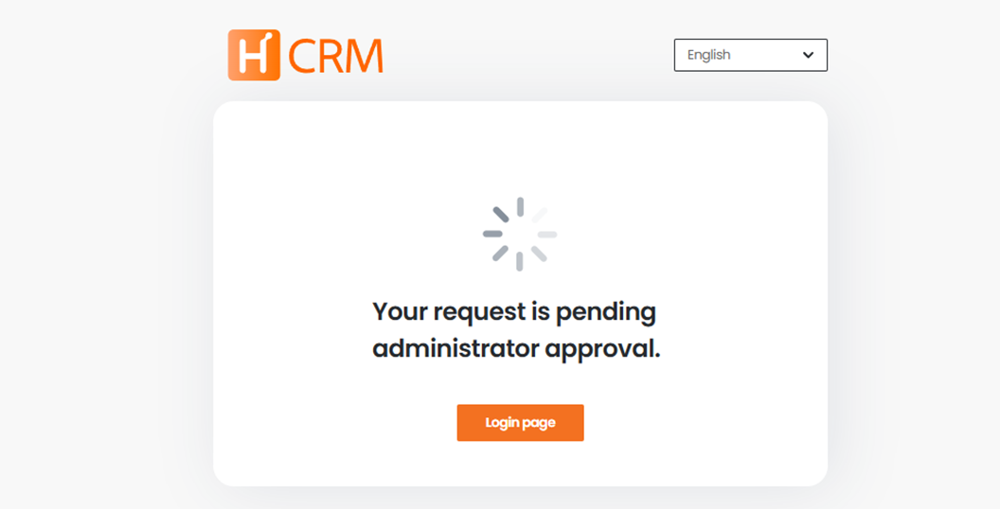

import ValidateTextByToken from "/src/utils/getQueryString.js";
import StrongTextParser from "/src/utils/textParser.js";
import text from "/src/locale/ko/SMT/tutorial-01-auth/create-a-acount-circle-user.json";
import Phon from "./img/004.png";

# Create a CRM account (employees)

<!-- 메뉴단에서 번역이 안되므로 여기 하드코딩해야 함 #가 달린 헤더와 함께 -->
We'll walk you through the steps to create a CRM user account on your corporate network.

<ValidateTextByToken dispTargetViewer={true} validTokenList={['head', 'branch']}>

## System access path

1. Select the H-CRM link in the Work menu on the Circle main screen.
- Accessing from **within the company**
  - Click the **[connection link](http://ep.circle.hanwha.com/api/branch/common/slo/goSloTarget.mvc?authType=1&destination=https://service.hanwha-crm.com/auth/slo )**. You will be automatically logged in by linking to your circle.
- Accessing from **outside the company**
  - Click the access **[link](https://service.hanwha-crm.com)** or scan the QR code below.  

## Create an account - Register basic information

1. You will enter the Circle User account registration screen. Circle User information will be loaded by default, so please check the entered information.
1. Emails cannot be modified. Please check your mobile phone number and click the **verification button** to proceed with the verification process. After verification, the status of **verification required** will change to **verification complete.** 
    :::note
    

      1. Please check your mobile phone number and click the **send button**. A verification code will be sent to the entered mobile phone number.
      2. Please enter the authentication number sent via text message and click the **confirmation button**.
    :::
1. Please enter a password that follows the rules listed below. The password you enter here will be used when accessing CRM from outside the company.
    :::info
    - Please enter 8 to 20 characters using a combination of three of lowercase letters, uppercase letters, special characters, and numbers. If you use a combination of two, please enter 10 to 20 characters.
    - Please refrain from using passwords that are easy to guess, such as numbers related to personal information such as date of birth, phone number, or consecutive numbers, as they can be easily figured out by others.
    - Please use a password that is different from the password you have used before or the password you use on other sites.
    :::
4. Please click the **Next button**.

## Account Creation - Authorization Registration

<StrongTextParser text={text.step2AccountCreation01} />

1. Select the applicable business unit.
1. Select the permissions you need.
1. You can reset the selected permissions.
1. Proceed to the next step.

## 계정생성 - 확인 및 등록

<StrongTextParser text={text.step3AccountCreation01} />

1. Reconfirm the permissions you applied for in the previous step and **click Register**.

## Account creation completed

The administrator's approval pending screen will appear, and when approval is complete, you will **receive an email notification** and be able to log in.

</ValidateTextByToken>